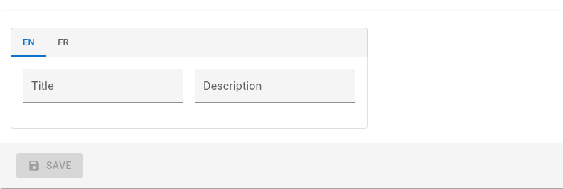

# `<TranslatableInputs>`

You may have inputs which are translated in multiple languages and want users to edit translations for each language separately. To display them, you can use the `<TranslatableInputs>` component.

<video controls autoplay playsinline muted loop>
  <source src="./img/translatable-input.webm" type="video/webm"/>
  <source src="./img/translatable-input.mp4" type="video/mp4"/>
  Your browser does not support the video tag.
</video>


## Usage

`<TranslatableInputs>` allows to edit several fields at a time. The fields must have one value per language, for instance:

```js
{
    id: 1234,
    name: {
        en: 'White trousers',
        fr: 'Pantalon blanc',
    },
    description: {
        en: 'Slim fit trousers for every day use'
        fr: 'Pantalon ajusté pour un usage quotidien',
    }
}
```

`<TranslatableInputs>` does *not* require a `source` prop. But it requires one or more child [`<Input>`](./Inputs.md), each one with a `source` prop. And you must pass the `locales` prop determine the languages to display.

```jsx
<TranslatableInputs locales={['en', 'fr']}>
    <TextInput source="name" />
    <RichTextInput source="description" />
</TranslatableInputs>
```

## Props

| Prop   | Required | Type     | Default | Description   |
| ------ | -------- | -------- | ------- | ------------- |
| `locales` | Required | `Array` | - | An array of locales. |
| `defaultLocale` | Optional | `string` | `en` | The default locale to display |
| `fullWidth` | Optional | `boolean` | `false` | If `true`, the inputs will expand to fill the form width |
| `groupKey` | Optional | `string` | - | A unique key for accessibility purpose |
| `selector`| Optional | `ReactNode` | - | A selector to choose the locale to display |
| `StackProps`| Optional | `object` | - | Props passed to the rendered MUI Stack |
| `sx`| Optional | `SxProps` | - | Material UI shortcut for defining custom styles |

## `defaultLocale`

React-admin uses the user locale as the default locale in this field. You can override this setting using the `defaultLocale` prop.

```jsx
<TranslatableInputs locales={['en', 'fr']} defaultLocale="fr">
    <TextInput source="name" />
    <RichTextInput source="description" />
</TranslatableInputs>
```

By default, `<TranslatableInputs>` will allow users to select the displayed locale using Material UI tabs with the locale code as their labels.

## `fullWidth`

If you want the inputs to expand to fill the form width, set the `fullWidth` prop to `true`:

```jsx
<TranslatableInputs locales={['en', 'fr']} fullWidth>
    <TextInput source="title" />
    <TextInput source="description" />
</TranslatableInputs>
```

## `groupKey`

If you have multiple `TranslatableInputs` on the same page, you should specify a `groupKey` so that react-admin can create unique identifiers for accessibility.

```jsx
<TranslatableInputs locales={['en', 'fr']} groupKey="essential-fields">
    <TextInput source="name" />
    <RichTextInput source="description" />
</TranslatableInputs>
```

## `locales`

Set the `locales` to display with an array of strings - each string becoming a key in the input value - . The order of the locales will be the order of the tabs.

```jsx
<TranslatableInputs locales={['en', 'fr']}>
    <TextInput source="name" />
    <RichTextInput source="description" />
</TranslatableInputs>
```

You may override the tab labels using translation keys following this format: `ra.locales.[locale_code]`. For instance, `ra.locales.en` or `ra.locales.fr`.

## `selector`

You may override the language selector using the `selector` prop, which accepts a React element:

```jsx
const Selector = () => {
    const {
        locales,
        selectLocale,
        selectedLocale,
    } = useTranslatableContext();

    const handleChange = event => {
        selectLocale(event.target.value);
    };

    return (
        <select
            aria-label="Select the locale"
            onChange={handleChange}
            value={selectedLocale}
        >
            {locales.map(locale => (
                <option
                    key={locale}
                    value={locale}
                    // This allows to correctly link the containers for each locale to their labels
                    id={`translatable-header-${locale}`}
                >
                    {locale}
                </option>
            ))}
        </select>
    );
};

<TranslatableInputs
    record={record}
    resource="products"
    locales={['en', 'fr']}
    selector={<Selector />}
>
    <TextInput source="name" />
    <RichTextInput source="description" />
</TranslatableInputs>
```

## `StackProps`

Use the `StackProps` prop to pass props to the rendered MUI [Stack](https://mui.com/material-ui/react-stack/) component.

For instance, you can use `direction: 'row'` to display the inputs side by side instead of stacked:



```jsx
<TranslatableInputs
    locales={['en', 'fr']}
    StackProps={{ direction: 'row' }}
>
    <TextInput source="title" />
    <TextInput source="description" sx={{ marginLeft: 2 }} />
</TranslatableInputs>
```





## `sx`

Use the `sx` prop to pass additional styles to the component:



```jsx
<TranslatableInputs
    locales={['en', 'fr']}
    sx={{ border: 'solid 1px red' }}
>
    <TextInput source="title" />
    <TextInput source="description" />
</TranslatableInputs>
```



## Validation

You can add validators to any of the inputs inside a `TranslatableInputs`. If an input has some validation error, the label of its parent tab will be highlighted as invalid:

```jsx
<TranslatableInputs locales={['en', 'fr']}>
    <TextInput source="name" validate={[required()]} />
    <RichTextInput source="description" validate={[maxLength(100)]} />
</TranslatableInputs>
```