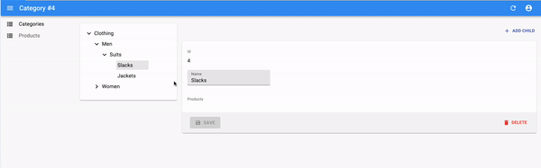

# `<TreeWithDetails>`

This [Enterprise Edition](https://marmelab.com/ra-enterprise) component offers a replacement for the `<List>` component when the records form **tree structures** like directories, categories, etc. `<TreeWithDetails>` renders a tree structure and the show view/edition form in the same page.



This component allows users to browse, edit, and rearrange trees.

## Usage

```jsx
// in src/category.js
import * as React from 'react';
import { Admin, Resource, TextInput } from 'react-admin';
import { CreateNode, EditNode, SimpleForm, TreeWithDetails } from '@react-admin/ra-tree';

// a Create view for a tree uses <CreateNode> instead of the standard <Create>
const CategoriesCreate = props => (
    <CreateNode {...props}>
        <SimpleForm>
            <TextInput source="name" />
        </SimpleForm>
    </CreateNode>
);

// an Edit view for a tree uses <EditNode> instead of the standard <Edit>
const CategoriesEdit = props => (
    <EditNode {...props}>
        <SimpleForm>
            <TextInput source="title" />
        </SimpleForm>
    </EditNode>
)

// a List view for a tree uses <TreeWithDetails>
export const CategoriesList = props => (
    <TreeWithDetails 
        create={CategoriesCreate}
        edit={CategoriesEdit}
        {...props}
    />
);

// in src/App.js
import { CategoriesList } from './category';

const App = () => (
    <Admin
        dataProvider={dataProvider}
        i18nProvider={i18nProvider}
        locale="en"
    >
        <Resource list={CategoriesList} />
    </Admin>
)
```

Check [the `ra-tree` documentation](https://marmelab.com/ra-enterprise/modules/ra-tree) for more details.
