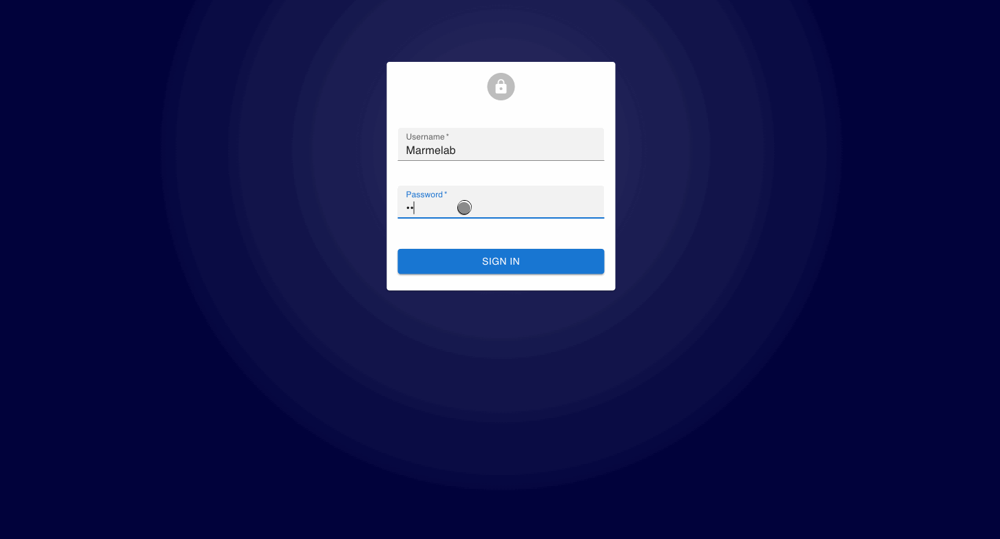
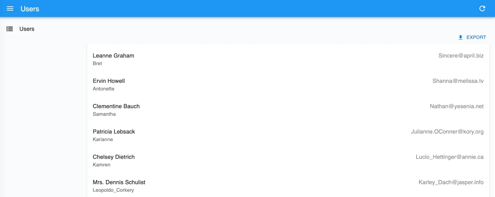
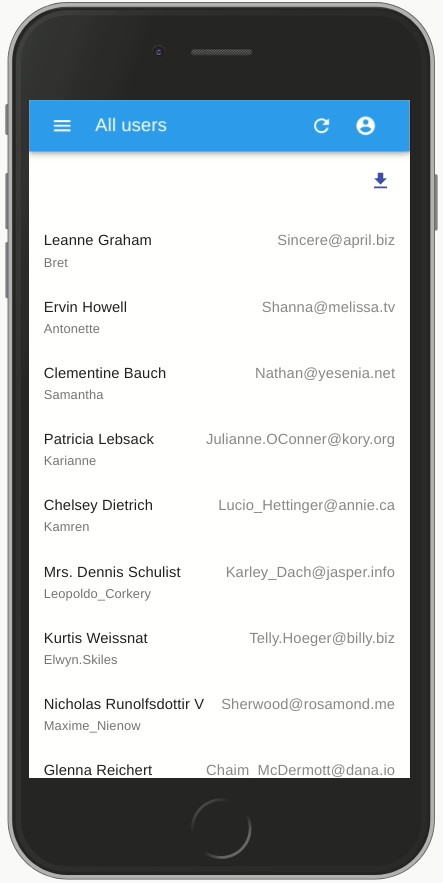
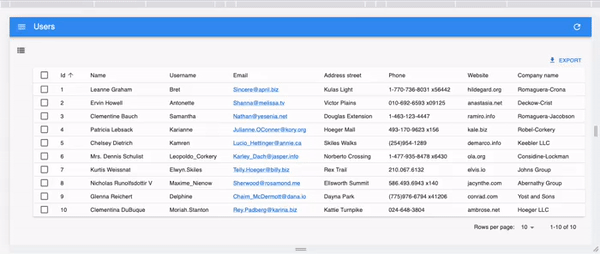

# React-Admin Tutorial

This 30 minutes tutorial will expose how to create a new admin app based on an existing REST API.

Here is an overview of the result:

[](./img/tutorial_overview.gif)

## Setting Up

React-admin uses React. We'll use [vite.js](https://vitejs.dev/) to create an empty React app, and install the `react-admin` package:

```sh
yarn create vite test-admin --template react-ts
cd test-admin/
yarn add react-admin ra-data-json-server
yarn dev
```

You should be up and running with an empty React application on port 5173.

**Tip**: Although this tutorial uses a TypeScript template, you can use react-admin with JavaScript if you prefer. Also, you can use [create-react-app](./CreateReactApp.md), [Next.js](./NextJs.md), [Remix](./Remix.md), or any other React framework to create your admin app. React-admin is framework-agnostic.

## Using an API As Data Source

React-admin runs in the browser, and fetches data from an API.

We'll be using [JSONPlaceholder](https://jsonplaceholder.typicode.com/), a fake REST API designed for testing and prototyping, as the data source for the application. Here is what it looks like:

```
curl https://jsonplaceholder.typicode.com/users/2
```

```json
{
  "id": 2,
  "name": "Ervin Howell",
  "username": "Antonette",
  "email": "Shanna@melissa.tv",
  "address": {
    "street": "Victor Plains",
    "suite": "Suite 879",
    "city": "Wisokyburgh",
    "zipcode": "90566-7771",
    "geo": {
      "lat": "-43.9509",
      "lng": "-34.4618"
    }
  },
  "phone": "010-692-6593 x09125",
  "website": "anastasia.net",
  "company": {
    "name": "Deckow-Crist",
    "catchPhrase": "Proactive didactic contingency",
    "bs": "synergize scalable supply-chains"
  }
}
```

JSONPlaceholder provides endpoints for users, posts, and comments. The admin we'll build should allow to Create, Retrieve, Update, and Delete (CRUD) these resources.

## Making Contact With The API Using a Data Provider

Bootstrap the admin app by replacing the `src/App.tsx` by the following code:

```jsx
// in src/App.tsx
import { Admin } from "react-admin";
import jsonServerProvider from "ra-data-json-server";

const dataProvider = jsonServerProvider('https://jsonplaceholder.typicode.com');

const App = () => <Admin dataProvider={dataProvider} />;

export default App;
```

Also, change the default Vite CSS file to look like this:

```diff
// in src/index.css
body {
    margin: 0;
}
```

Lastly, add the `Roboto` font to the `index.html` file:

```diff
// in ./index.html
<!DOCTYPE html>
<html lang="en">
  <head>
    <meta charset="UTF-8" />
    <meta name="viewport" content="width=device-width, initial-scale=1.0" />
    <title>React Admin</title>
+   <link
+     rel="stylesheet"
+     href="https://fonts.googleapis.com/css?family=Roboto:300,400,500,700&display=swap"
+   />
  </head>
  <body>
    <div id="root"></div>
    <script type="module" src="/src/index.tsx"></script>
  </body>
</html>
```

That's enough for react-admin to render an empty app and confirm that the setup is done: 

[](./img/tutorial_empty.png)

The `<App>` component renders an `<Admin>` component, which is the root component of a react-admin application. This component expects a `dataProvider` prop - a function capable of fetching data from an API. Since there is no standard for data exchanges between computers, you will probably have to write a custom provider to connect react-admin to your own APIs - but we'll dive into Data Providers later. For now, let's take advantage of the `ra-data-json-server` data provider, which speaks the same REST dialect as JSONPlaceholder.

Now it's time to add features!

## Mapping API Endpoints With Resources

We'll start by adding a list of users. 

The `<Admin>` component expects one or more `<Resource>` child components. Each resource maps a name to an endpoint in the API. Edit the `App.tsx` file to add a resource named `users`:

```diff
// in src/App.tsx
-import { Admin } from "react-admin";
+import { Admin, Resource, ListGuesser } from "react-admin";
import jsonServerProvider from "ra-data-json-server";

const dataProvider = jsonServerProvider('https://jsonplaceholder.typicode.com');

-const App = () => <Admin dataProvider={dataProvider} />;
+const App = () => (
+ <Admin dataProvider={dataProvider}>
+   <Resource name="users" list={ListGuesser} />
+ </Admin>
+);

export default App;
```

The line `<Resource name="users" />` informs react-admin to fetch the "users" records from the [https://jsonplaceholder.typicode.com/users](https://jsonplaceholder.typicode.com/users) URL. `<Resource>` also defines the React components to use for each CRUD operation (`list`, `create`, `edit`, and `show`).

The `list={ListGuesser}` tells react-admin to use the `<ListGuesser>` component to display the list of users. This component *guesses* the configuration to use for the list (column names and types) based on the data fetched from the API.

The app can now display a list of users:

[](./img/tutorial_users_list.png)

The list is already functional: you can reorder it by clicking on column headers, or change pages by using the bottom pagination controls. If you look at the network tab in the browser developer tools, you'll notice that each action on the list triggers a new call to `https://jsonplaceholder.typicode.com/users` with a modified query string. That's what the data provider does: it translates user actions to HTTP requests that the backend API understands.

## Writing A Page Component

The `<ListGuesser>` component is not meant to be used in production - it's just a way to quickly bootstrap an admin. That means you'll have to replace the `ListGuesser` component in the `users` resource by a custom React component. Fortunately, `ListGuesser` dumps the code of the list it has guessed to the console:

[](./img/tutorial_guessed_list.png)

Let's copy this code, and create a new `UserList` component, in a new file named `users.tsx`:

```jsx
// in src/users.tsx
import { List, Datagrid, TextField, EmailField } from "react-admin";

export const UserList = () => (
  <List>
    <Datagrid rowClick="edit">
      <TextField source="id" />
      <TextField source="name" />
      <TextField source="username" />
      <EmailField source="email" />
      <TextField source="address.street" />
      <TextField source="phone" />
      <TextField source="website" />
      <TextField source="company.name" />
    </Datagrid>
  </List>
);
```

Then, edit the `App.tsx` file to use this new component instead of `ListGuesser`:

```diff
// in src/App.tsx
-import { Admin, Resource, ListGuesser } from "react-admin";
+import { Admin, Resource } from "react-admin";
import jsonServerProvider from "ra-data-json-server";
+import { UserList } from "./users";

const dataProvider = jsonServerProvider("https://jsonplaceholder.typicode.com");

const App = () => (
  <Admin dataProvider={dataProvider}>
-   <Resource name="users" list={ListGuesser} />
+   <Resource name="users" list={UserList} />
  </Admin>
);
```

[](./img/tutorial_users_list.png)

There is no visible change in the browser - except now, the app uses a component that you can customize. 

## Composing Components

Let's take a moment to analyze the code of the `<UserList>` component:

```jsx
export const UserList = () => (
  <List>
    <Datagrid rowClick="edit">
      <TextField source="id" />
      <TextField source="name" />
      <TextField source="username" />
      <EmailField source="email" />
      <TextField source="address.street" />
      <TextField source="phone" />
      <TextField source="website" />
      <TextField source="company.name" />
    </Datagrid>
  </List>
);
```

The root component, `<List>`, reads the query parameters from the URL, crafts an API call based on these parameters, and puts the result in a React context. It also builds a set of callbacks allowing child components to modify the list filters, pagination, and sorting. `<List>` does a lot of things, yet its syntax couldn't be simpler:

```jsx
<List>
```

This is a good illustration of the react-admin target: helping developers build sophisticated apps in a simple way.

But in most frameworks, "simple" means "limited", and it's hard to go beyond basic features. React-admin solves this by using *composition*. `<List>` only does the data fetching part. It delegates the rendering of the actual list to its child - in this case, `<Datagrid>`. To put it otherwise, the above code composes the `<List>` and `<Datagrid>` functionalities. 

This means we can compose `<List>` with another component - for instance `<SimpleList>`:

```jsx
// in src/users.tsx
import { List, SimpleList } from "react-admin";

export const UserList = () => (
  <List>
    <SimpleList
      primaryText={(record) => record.name}
      secondaryText={(record) => record.username}
      tertiaryText={(record) => record.email}
    />
  </List>
);
```

`<SimpleList>` uses [MUI's `<List>` and `<ListItem>` components](https://mui.com/components/lists), and expects functions as `primaryText`, `secondaryText`, and `tertiaryText` props.

Refresh the page, and now the list displays in a different way:

[](./img/tutorial_simple_list.webp)

React-admin offers a large library of components you can pick from to build the UI that you want using composition. And if this is not enough, it lets you build your own components to get exactly the UI you want. 

## Writing A Custom List Component

The react-admin layout is already responsive. Try to resize your browser to see how the sidebar switches to a drawer on smaller screens. Besides, the `<SimpleList>` component is a really good fit for mobile devices. 

[](./img/tutorial_mobile_user_list.gif)

But on desktop, `<SimpleList>` takes too much space for a low information density. So let's modify the `<UserList>` component to use the `<Datagrid>` component on desktop, and the `<SimpleList>` component on mobile. 

To do so, we'll use [the `useMediaQuery` hook](https://mui.com/material-ui/react-use-media-query/#main-content) from MUI:

```jsx
// in src/users.tsx
import { useMediaQuery } from "@mui/material";
import { List, SimpleList, Datagrid, TextField, EmailField } from "react-admin";

export const UserList = () => {
  const isSmall = useMediaQuery((theme) => theme.breakpoints.down("sm"));
  return (
    <List>
      {isSmall ? (
        <SimpleList
          primaryText={(record) => record.name}
          secondaryText={(record) => record.username}
          tertiaryText={(record) => record.email}
        />
      ) : (
        <Datagrid rowClick="edit">
          <TextField source="id" />
          <TextField source="name" />
          <TextField source="username" />
          <EmailField source="email" />
          <TextField source="address.street" />
          <TextField source="phone" />
          <TextField source="website" />
          <TextField source="company.name" />
        </Datagrid>
      )}
    </List>
  );
};
```

This works exactly the way you expect.

[](./img/tutorial_user_list_responsive.gif)

This shows that the `<List>` child can be anything you want - even a custom React component with its own logic. It also shows that react-admin is a good fit for responsive applications - but it's your job to use `useMediaQuery()` in pages.

## Selecting Columns

Let's get back to `<Datagrid>`. It reads the data fetched by `<List>`, then renders a table with one row for each record. `<Datagrid>` uses its child components (here, a list of `<TextField>` and `<EmailField>`) to determine the columns to render. Each Field component maps a different field in the API response, specified by the `source` prop.

`<ListGuesser>` created one column for every field in the response. That's a bit too much for a usable grid, so let's remove a couple `<TextField>` from the Datagrid and see the effect:

```diff
// in src/users.tsx
  <Datagrid rowClick="edit">
    <TextField source="id" />
    <TextField source="name" />
-   <TextField source="username" />
    <EmailField source="email" />
-   <TextField source="address.street" />
    <TextField source="phone" />
    <TextField source="website" />
    <TextField source="company.name" />
  </Datagrid>
```

[](./img/tutorial_users_list_selected_columns.png)

In react-admin, most configuration is achieved via components. `<Datagrid>` could have taken a `columns` prop expecting a configuration object. But by using the `children` prop instead, it opens the door to a much powerful customization - for instance, changing the column type, or using your own component for a given column.

## Using Field Types

You've just met the `<TextField>` and the `<EmailField>` components. React-admin provides [many more Field components](./Fields.md), mapping various data types: number, date, image, HTML, array, relationship, etc.

For instance, the `website` field looks like a URL. Instead of displaying it as text, why not display it using a clickable link? That's exactly what the `<UrlField>` does:

```diff
// in src/users.tsx
-import { List, SimpleList, Datagrid, TextField, EmailField } from "react-admin";
+import { List, SimpleList, Datagrid, TextField, EmailField, UrlField } from "react-admin";
// ...
  <Datagrid rowClick="edit">
    <TextField source="id" />
    <TextField source="name" />
    <EmailField source="email" />
    <TextField source="phone" />
-   <TextField source="website" />
+   <UrlField source="website" />
    <TextField source="company.name" />
  </Datagrid>
```

[](./img/tutorial_url_field.png)

This reflects the early stages of development with react-admin: let the guesser component bootstrap a basic page, then tweak the generated code to better match your business logic.

## Writing A Custom Field 

In react-admin, fields are just React components. When rendered, they grab the `record` fetched from the API (e.g. `{ "id": 2, "name": "Ervin Howell", "website": "anastasia.net", ... }`) using a custom hook, and use the `source` field (e.g. `website`) to get the value they should display (e.g. "anastasia.net").

That means that you can do the same to write a custom Field. For instance, here is a simplified version of the `<UrlField>`:

```jsx
// in src/MyUrlField.tsx
import { useRecordContext } from "react-admin";

const MyUrlField = ({ source }) => {
  const record = useRecordContext();
  if (!record) return null;
  return <a href={record[source]}>{record[source]}</a>;
};

export default MyUrlField;
```

For each row, `<Datagrid>` creates a `RecordContext` and stores the current record in it. `useRecordContext` allows to read that record. It's one of the 50+ headless hooks that react-admin exposes to let you build your own components, without forcing a particular UI.

You can use the `<MyUrlField>` component in `<UserList>`, instead of react-admin's `<UrlField>` component, and it will work just the same.

```diff
// in src/users.tsx
-import { List, SimpleList, Datagrid, TextField, EmailField, UrlField } from "react-admin";
+import { List, SimpleList, Datagrid, TextField, EmailField } from "react-admin";
+import MyUrlField from './MyUrlField';
// ...
  <Datagrid rowClick="edit">
    <TextField source="id" />
    <TextField source="name" />
    <EmailField source="email" />
    <TextField source="phone" />
-   <UrlField source="website" />
+   <MyUrlField source="website" />
    <TextField source="company.name" />
  </Datagrid>
```

That means react-admin never blocks you: if one react-admin component doesn't perfectly suit your needs, you can just swap it with your own version.

## Customizing Styles

The `<MyUrlField>` component is a perfect opportunity to illustrate how to customize styles.

React-admin relies on [MUI](https://mui.com/), a set of React components modeled after Google's [Material Design UI Guidelines](https://material.io/). All MUI components (and most react-admin components) support a prop called `sx`, which allows custom inline styles. Let's take advantage of the `sx` prop to remove the underline from the link and add an icon:


```jsx
// in src/MyUrlField.tsx
import { useRecordContext } from "react-admin";
import { Link } from "@mui/material";
import LaunchIcon from "@mui/icons-material/Launch";

const MyUrlField = ({ source }) => {
  const record = useRecordContext();
  return record ? (
    <Link href={record[source]} sx={{ textDecoration: "none" }}>
      {record[source]}
      <LaunchIcon sx={{ fontSize: 15, ml: 1 }} />
    </Link>
  ) : null;
};

export default MyUrlField;
```


[](./img/tutorial_custom_styles.png)

The `sx` prop is like React's `style` prop, except it supports theming, media queries, shorthand properties, and much more. It's a CSS-in-JS solution, so you'll have to use the JS variants of the CSS property names (e.g. `textDecoration` instead of `text-decoration`). 

**Tip**: There is much more to MUI styles than what this tutorial covers. Read the [MUI documentation](https://mui.com/system/basics/) to learn more about theming, vendor prefixes, responsive utilities, etc.

**Tip**: MUI supports other CSS-in-JS solutions, including [Styled components](https://mui.com/system/styled/).

## Handling Relationships

In JSONPlaceholder, each `post` record includes a `userId` field, which points to a `user`:

```json
{
    "id": 1,
    "title": "sunt aut facere repellat provident occaecati excepturi optio reprehenderit",
    "body": "quia et suscipit\nsuscipit recusandae consequuntur expedita et cum\nreprehenderit molestiae ut ut quas totam\nnostrum rerum est autem sunt rem eveniet architecto",
    "userId": 1
}
```

React-admin knows how to take advantage of these foreign keys to fetch references. Let's see how the `ListGuesser` manages them by creating a new `<Resource>` for the `/posts` API endpoint:

```diff
// in src/App.tsx
-import { Admin, Resource } from "react-admin";
+import { Admin, Resource, ListGuesser } from "react-admin";
import jsonServerProvider from "ra-data-json-server";
import { UserList } from "./users";

const App = () => (
  <Admin dataProvider={dataProvider}>
+   <Resource name="users" list={UserList} />
    <Resource name="posts" list={ListGuesser} />
  </Admin>
);

export default App;
```

[](./img/tutorial_guessed_post_list.png)

The `ListGuesser` suggests using a `<ReferenceField>` for the `userId` field. Let's play with this new field by creating the `PostList` component based on the code dumped by the guesser:

```jsx
// in src/posts.tsx
import { List, Datagrid, TextField, ReferenceField } from "react-admin";

export const PostList = () => (
  <List>
    <Datagrid rowClick="edit">
      <ReferenceField source="userId" reference="users" />
      <TextField source="id" />
      <TextField source="title" />
      <TextField source="body" />
    </Datagrid>
  </List>
);
```

```diff
// in src/App.tsx
-import { Admin, Resource, ListGuesser } from "react-admin";
+import { Admin, Resource } from "react-admin";
+import { PostList } from "./posts";
import { UserList } from "./users";

const App = () => (
    <Admin dataProvider={dataProvider}>
-       <Resource name="posts" list={ListGuesser} />
+       <Resource name="posts" list={PostList} />
        <Resource name="users" list={UserList} />
    </Admin>
);
```

When displaying the posts list, the app displays the `id` of the post author. This doesn't mean much - we should use the user `name` instead. For that purpose, set the `recordRepresentation` prop of the "users" Resource:

```diff
// in src/App.tsx
const App = () => (
    <Admin dataProvider={dataProvider}>
        <Resource name="posts" list={PostList} />
-       <Resource name="users" list={UserList} />
+       <Resource name="users" list={UserList} recordRepresentation="name" />
    </Admin>
);
```

The post list now displays the user names on each line.

[](./img/tutorial_list_user_name.png)

The `<ReferenceField>` component fetches the reference data, creates a `RecordContext` with the result, and renders the record representation (or its children).

**Tip**: Look at the network tab of your browser again: react-admin deduplicates requests for users, and aggregates them in order to make only *one* HTTP request to the `/users` endpoint for the whole Datagrid. That's one of many optimizations that keep the UI fast and responsive.

To finish the post list, place the post `id` field as first column, and remove the `body` field. From a UX point of view, fields containing large chunks of text should not appear in a Datagrid, only in detail views. Also, to make the Edit action stand out, let's replace the `rowClick` action by an explicit action button:

```diff
// in src/posts.tsx
-import { List, Datagrid, TextField, ReferenceField } from "react-admin";
+import { List, Datagrid, TextField, ReferenceField, EditButton } from "react-admin";

export const PostList = () => (
  <List>
-   <Datagrid rowClick="edit">
+   <Datagrid>
+     <TextField source="id" />
      <ReferenceField source="userId" reference="users" />
-     <TextField source="id" />
      <TextField source="title" />
-     <TextField source="body" />
+     <EditButton />
    </Datagrid>
  </List>
);
```

[](./img/tutorial_post_list_less_columns.png)

## Adding Editing Capabilities

An admin interface isn't just about displaying remote data, it should also allow editing records. React-admin provides an `<Edit>` component for that purpose ; let's use the `<EditGuesser>` to help bootstrap it.

```diff
// in src/App.tsx
-import { Admin, Resource } from "react-admin";
+import { Admin, Resource, EditGuesser } from "react-admin";
import { PostList } from "./posts";
import { UserList } from "./users";

const App = () => (
    <Admin dataProvider={dataProvider}>
-       <Resource name="posts" list={PostList} />
+       <Resource name="posts" list={PostList} edit={EditGuesser} />
        <Resource name="users" list={UserList} recordRepresentation="name" />
    </Admin>
);
```

[](./img/tutorial_edit_guesser.gif)

Users can display the edit page just by clicking on the Edit button. The form is already functional; it issues `PUT` requests to the REST API upon submission. And thanks to the `recordRepresentation` of the "users" Resource, the user name is displayed for the post author.

Copy the `<PostEdit>` code dumped by the guesser in the console to the `posts.tsx` file so that you can customize the view:

```jsx
// in src/posts.tsx
import {
  List,
  Datagrid,
  TextField,
  ReferenceField,
  EditButton,
  Edit,
  SimpleForm,
  ReferenceInput,
  TextInput,
} from "react-admin";

export const PostList = () => (
  { /* ... */ }
);

export const PostEdit = () => (
  <Edit>
    <SimpleForm>
      <ReferenceInput source="userId" reference="users" />
      <TextInput source="id" />
      <TextInput source="title" />
      <TextInput source="body" />
    </SimpleForm>
  </Edit>
);
```

Use that component as the `edit` prop of the "posts" Resource instead of the guesser:

```diff
// in src/App.tsx
-import { Admin, Resource, EditGuesser } from "react-admin";
+import { Admin, Resource } from "react-admin";
import jsonServerProvider from "ra-data-json-server";
-import { PostList } from "./posts";
+import { PostList, PostEdit } from "./posts";
import { UserList } from "./users";

const dataProvider = jsonServerProvider("https://jsonplaceholder.typicode.com");

const App = () => (
  <Admin dataProvider={dataProvider}>
-   <Resource name="posts" list={PostList} edit={EditGuesser} />
+   <Resource name="posts" list={PostList} edit={PostEdit} />
    <Resource name="users" list={UserList} recordRepresentation="name" />
  </Admin>
);
```

You can now adjust the `<PostEdit>` component to disable the edition of the primary key (`id`), place it first, and use a textarea for the `body` field, as follows:

```diff
// in src/posts.tsx
export const PostEdit = () => (
  <Edit>
    <SimpleForm>
+     <TextInput source="id" disabled />
      <ReferenceInput source="userId" reference="users" />
-     <TextInput source="id" />
      <TextInput source="title" />
-     <TextInput source="body" />
+     <TextInput source="body" multiline rows={5} />
    </SimpleForm>
  </Edit>
);
```

If you've understood the `<List>` component, the `<Edit>` component will be no surprise. It's responsible for fetching the record, and displaying the page title. It passes the record down to the `<SimpleForm>` component, which is responsible for the form layout, default values, and validation. Just like `<Datagrid>`, `<SimpleForm>` uses its children to determine the form inputs to display. It expects *input components* as children. `<TextInput>` and `<ReferenceInput>` are such inputs.

The `<ReferenceInput>` takes the same props as the `<ReferenceField>` (used earlier in the `<PostList>` page). `<ReferenceInput>` uses these props to fetch the API for possible references related to the current record (in this case, possible `users` for the current `post`). It then creates a context with the possible choices and renders an `<AutocompleteInput>`, which is responsible for displaying the choices, and letting the user select one.

## Adding Creation Capabilities

Let's allow users to create posts, too. Copy the `<PostEdit>` component into a `<PostCreate>`, and replace `<Edit>` by `<Create>`:

```diff
// in src/posts.tsx
import {
    List,
    Datagrid,
    TextField,
    ReferenceField,
    EditButton,
    Edit,
+   Create,
    SimpleForm,
    ReferenceInput,
    TextInput,
} from "react-admin";

export const PostList = () => (
  { /* ... */ }
);

export const PostEdit = () => (
  { /* ... */ }
);

+export const PostCreate = () => (
+  <Create>
+    <SimpleForm>
+      <ReferenceInput source="userId" reference="users" />
+      <TextInput source="title" />
+      <TextInput source="body" multiline rows={5} />
+    </SimpleForm>
+  </Create>
+);
```

**Tip**: The `<PostEdit>` and the `<PostCreate>` components use almost the same child form, except for the additional `id` input in `<PostEdit>`. In most cases, the forms for creating and editing a record are a bit different, because most APIs create primary keys server-side. But if the forms are the same, you can share a common form component in `<PostEdit>` and `<PostCreate>`.

To use the new `<PostCreate>` components in the posts resource, just add it as `create` attribute in the `<Resource name="posts">` component:

```diff
// in src/App.tsx
import { Admin, Resource } from "react-admin";
-import { PostList, PostEdit } from "./posts";
+import { PostList, PostEdit, PostCreate } from "./posts";
import { UserList } from "./users";

const App = () => (
  <Admin dataProvider={dataProvider}>
-   <Resource name="posts" list={PostList} edit={PostEdit} />
+   <Resource name="posts" list={PostList} edit={PostEdit} create={PostCreate} />
    <Resource name="users" list={UserList} recordRepresentation="name" />
  </Admin>
);
```

[](./img/tutorial_post_create.gif)

React-admin automatically adds a "create" button on top of the posts list to give access to the `create` component. And the creation form works ; it issues a `POST` request to the REST API upon submission.

## Optimistic Rendering And Undo

Unfortunately, JSONPlaceholder is a read-only API; although it seems to accept `POST` and `PUT` requests, it doesn't take into account the creations and edits - that's why, in this particular case, you will see errors after creation, and you won't see your edits after you save them. It's just an artifact of JSONPlaceholder.

But then, how come the newly created post appears in the list just after creation in the screencast above?

That's because react-admin uses *optimistic updates*. When a user edits a record and hits the "Save" button, the UI shows a confirmation and displays the updated data *before sending the update query to server*. The main benefit is that UI changes are immediate - no need to wait for the server response. It's a great comfort for users.

But there is an additional benefit: it also allows the "Undo" feature. Undo is already functional in the admin at that point. Try editing a record, then hit the "Undo" link in the black confirmation box before it slides out. You'll see that the app does not send the `UPDATE` query to the API, and displays the non-modified data.

[](./img/tutorial_post_edit_undo.gif)

Even though updates appear immediately due to Optimistic Rendering, React-admin only sends them to the server after a short delay (about 5 seconds). During this delay, the user can undo the action, and react-admin will never send the update. 

Optimistic updates and undo require no specific code on the API side - react-admin handles them purely on the client-side. That means that you'll get them for free with your own API!

**Note**: When you add the ability to edit an item, you also add the ability to delete it. The "Delete" button in the edit view is fully working out of the box - and it is also "Undo"-able .

## Customizing The Page Title

The post editing page has a slight problem: it uses the post id as main title (the text displayed in the top bar). We could set a custom `recordRepresentation` in the `<Resource name="posts">` component, but it's limited to rendering a string.

Let's customize the view title with a custom title component:

```diff
// in src/posts.tsx
+import { useRecordContext} from "react-admin";

// ...

+const PostTitle = () => {
+  const record = useRecordContext();
+  return <span>Post {record ? `"${record.title}"` : ''}</span>;
+};

export const PostEdit = () => (
-   <Edit>
+   <Edit title={<PostTitle />}>
        // ...
    </Edit>
);
```

[](./img/tutorial_post_title.png)

This component uses the same `useRecordContext` hook as the custom `<UrlField>` commponent described earlier.

As users can access the post editing page directly by its url, the `<PostTitle>` component may render *without a record* while the `<Edit>` component is fetching it. That's why you must always check that the `record` returned by `useRecordContext` is defined before using it - as in `PostTitle` above.

## Adding Search And Filters To The List

Let's get back to the post list for a minute. It offers sorting and pagination, but one feature is missing: the ability to search content.

React-admin can use Input components to create a multi-criteria search engine in the list view. Pass an array of such Input components to the List `filters` prop to enable filtering:

```jsx
// in src/posts.tsx
const postFilters = [
    <TextInput source="q" label="Search" alwaysOn />,
    <ReferenceInput source="userId" label="User" reference="users" />,
];

export const PostList = () => (
    <List filters={postFilters}>
        // ...
    </List>
);
```

The first filter, 'q', takes advantage of a full-text functionality offered by JSONPlaceholder. It is `alwaysOn`, so it always appears on the screen. Users can add the second filter, `userId`, thanks to the "add filter" button, located on the top of the list. As it's a `<ReferenceInput>`, it's already populated with possible users. 

[](./img/filters.gif)

Filters are "search-as-you-type", meaning that when the user enters new values in the filter form, the list refreshes (via an API request) immediately.

**Tip**: Note that the `label` property can be used on any input to customize its label.

## Customizing the Menu Icons

The sidebar menu shows the same icon for both posts and users. Customizing the menu icon is just a matter of passing an `icon` attribute to each `<Resource>`:

```jsx
// in src/App.tsx
import PostIcon from "@mui/icons-material/Book";
import UserIcon from "@mui/icons-material/Group";

const App = () => (
  <Admin dataProvider={dataProvider}>
    <Resource name="posts" list={PostList} edit={PostEdit} create={PostCreate} icon={PostIcon} />
    <Resource name="users" list={UserList} icon={UserIcon} recordRepresentation="name" />
  </Admin>
);
```

[](./img/custom-menu.gif)

## Using a Custom Home Page

By default, react-admin displays the list page of the first `Resource` element as home page. If you want to display a custom component instead, pass it in the `dashboard` prop of the `<Admin>` component.

```jsx
// in src/Dashboard.tsx
import { Card, CardContent, CardHeader } from "@mui/material";

export const Dashboard = () => (
  <Card>
    <CardHeader title="Welcome to the administration" />
    <CardContent>Lorem ipsum sic dolor amet...</CardContent>
  </Card>
);
```

```jsx
// in src/App.tsx
import { Dashboard } from './Dashboard';

const App = () => (
  <Admin dataProvider={dataProvider} dashboard={Dashboard} >
      // ...
  </Admin>
);
```

[](./img/dashboard.png)

## Adding a Login Page

Most admin apps require authentication. React-admin can check user credentials before displaying a page, and redirect to a login form when the REST API returns a 403 error code.

*What* those credentials are, and *how* to get them, are questions that you, as a developer, must answer. React-admin makes no assumption about your authentication strategy (basic auth, OAuth, custom route, etc.), but gives you the ability to add the auth logic at the right place - using the `authProvider` object.

For this tutorial, since there is no public authentication API, we can use a fake authentication provider that accepts every login request, and stores the `username` in `localStorage`. Each page change will require that `localStorage` contains a `username` item.

The `authProvider` must expose 5 methods, each returning a `Promise`:

```jsx
// in src/authProvider.ts
export const authProvider = {
  // called when the user attempts to log in
  login: ({ username }) => {
    localStorage.setItem("username", username);
    // accept all username/password combinations
    return Promise.resolve();
  },
  // called when the user clicks on the logout button
  logout: () => {
    localStorage.removeItem("username");
    return Promise.resolve();
  },
  // called when the API returns an error
  checkError: ({ status }) => {
    if (status === 401 || status === 403) {
      localStorage.removeItem("username");
      return Promise.reject();
    }
    return Promise.resolve();
  },
  // called when the user navigates to a new location, to check for authentication
  checkAuth: () => {
    return localStorage.getItem("username")
      ? Promise.resolve()
      : Promise.reject();
  },
  // called when the user navigates to a new location, to check for permissions / roles
  getPermissions: () => Promise.resolve(),
};
```

**Tip**: As the `authProvider` calls are asynchronous, you can easily fetch an authentication server in there.

To enable this authentication strategy, pass the `authProvider` to the `<Admin>` component:

```jsx
// in src/App.tsx
import { Dashboard } from './Dashboard';
import { authProvider } from './authProvider';

const App = () => (
    <Admin authProvider={authProvider} dataProvider={dataProvider} dashboard={Dashboard} >
        // ...
    </Admin>
);
```

Once the app reloads, it's now behind a login form that accepts everyone:

[](./img/login.gif)

## Connecting To A Real API

Here is the elephant in the room of this tutorial. In real world projects, the dialect of your API (REST? GraphQL? Something else?) won't match the JSONPlaceholder dialect. Writing a Data Provider is probably the first thing you'll have to do to make react-admin work. Depending on your API, this can require a few hours of additional work.

React-admin delegates every data query to a Data Provider object, which acts as an adapter to your API. This makes react-admin capable of mapping any API dialect, using endpoints from several domains, etc.

For instance, let's imagine you have to use the `my.api.url` REST API, which expects the following parameters:

| Action              | Expected API request                                                                    |
| ------------------- | --------------------------------------------------------------------------------------- |
| Get list            | `GET http://my.api.url/posts?sort=["title","ASC"]&range=[0, 24]&filter={"title":"bar"}` |
| Get one record      | `GET http://my.api.url/posts/123`                                                       |
| Get several records | `GET http://my.api.url/posts?filter={"id":[123,456,789]}`                               |
| Get related records | `GET http://my.api.url/posts?filter={"author_id":345}`                                  |
| Create a record     | `POST http://my.api.url/posts`                                                          |
| Update a record     | `PUT http://my.api.url/posts/123`                                                       |
| Update records      | `PUT http://my.api.url/posts?filter={"id":[123,124,125]}`                               |
| Delete a record     | `DELETE http://my.api.url/posts/123`                                                    |
| Delete records      | `DELETE http://my.api.url/posts?filter={"id":[123,124,125]}`                            |


React-admin calls the Data Provider with one method for each of the actions of this list, and expects a Promise in return. These methods are called `getList`, `getOne`, `getMany`, `getManyReference`, `create`, `update`, `updateMany`, `delete`, and `deleteMany`. It's the Data Provider's job to emit HTTP requests and transform the response into the format expected by react-admin.

The code for a Data Provider for the `my.api.url` API is as follows:

```js
import { fetchUtils } from "react-admin";
import { stringify } from "query-string";

const apiUrl = 'https://my.api.com/';
const httpClient = fetchUtils.fetchJson;

export const dataProvider= {
    getList: (resource, params) => {
        const { page, perPage } = params.pagination;
        const { field, order } = params.sort;
        const query = {
            sort: JSON.stringify([field, order]),
            range: JSON.stringify([(page - 1) * perPage, page * perPage - 1]),
            filter: JSON.stringify(params.filter),
        };
        const url = `${apiUrl}/${resource}?${stringify(query)}`;

        return httpClient(url).then(({ headers, json }) => ({
            data: json,
            total: parseInt(headers.get('content-range').split('/').pop(), 10),
        }));
    },

    getOne: (resource, params) =>
        httpClient(`${apiUrl}/${resource}/${params.id}`).then(({ json }) => ({
            data: json,
        })),

    getMany: (resource, params) => {
        const query = {
            filter: JSON.stringify({ id: params.ids }),
        };
        const url = `${apiUrl}/${resource}?${stringify(query)}`;
        return httpClient(url).then(({ json }) => ({ data: json }));
    },

    getManyReference: (resource, params) => {
        const { page, perPage } = params.pagination;
        const { field, order } = params.sort;
        const query = {
            sort: JSON.stringify([field, order]),
            range: JSON.stringify([(page - 1) * perPage, page * perPage - 1]),
            filter: JSON.stringify({
                ...params.filter,
                [params.target]: params.id,
            }),
        };
        const url = `${apiUrl}/${resource}?${stringify(query)}`;

        return httpClient(url).then(({ headers, json }) => ({
            data: json,
            total: parseInt(headers.get('content-range').split('/').pop(), 10),
        }));
    },

    update: (resource, params) =>
        httpClient(`${apiUrl}/${resource}/${params.id}`, {
            method: 'PUT',
            body: JSON.stringify(params.data),
        }).then(({ json }) => ({ data: json })),

    updateMany: (resource, params) => {
        const query = {
            filter: JSON.stringify({ id: params.ids}),
        };
        return httpClient(`${apiUrl}/${resource}?${stringify(query)}`, {
            method: 'PUT',
            body: JSON.stringify(params.data),
        }).then(({ json }) => ({ data: json }));
    },

    create: (resource, params) =>
        httpClient(`${apiUrl}/${resource}`, {
            method: 'POST',
            body: JSON.stringify(params.data),
        }).then(({ json }) => ({
            data: { ...params.data, id: json.id },
        })),

    delete: (resource, params) =>
        httpClient(`${apiUrl}/${resource}/${params.id}`, {
            method: 'DELETE',
        }).then(({ json }) => ({ data: json })),

    deleteMany: (resource, params) => {
        const query = {
            filter: JSON.stringify({ id: params.ids}),
        };
        return httpClient(`${apiUrl}/${resource}?${stringify(query)}`, {
            method: 'DELETE',
        }).then(({ json }) => ({ data: json }));
    }
};
```

**Tip**: `fetchUtils.fetchJson()` is just a shortcut for `fetch().then(r => r.json())`, plus a control of the HTTP response code to throw an `HTTPError` in case of 4xx or 5xx response. Feel free to use `fetch()` directly if it doesn't suit your needs.

Using this provider instead of the previous `jsonServerProvider` is just a matter of switching a function:

```jsx
// in src/app.tsx
import { dataProvider } from './dataProvider';

const App = () => (
  <Admin dataProvider={dataProvider}>
    // ...
  </Admin>
);
```

## Conclusion

React-admin was built with customization in mind. You can replace any react-admin component with a component of your own, for instance to display a custom list layout, or a different edit form for a given resource.

Now that you've completed the tutorial, the best way to learn react-admin is by reading the introduction chapters to each of its major parts:

- [Data Provider and API Calls](./DataProviderIntroduction.md)
- [Auth Provider and Security](./Authentication.md)
- [List Page](./ListTutorial.md)
- [Creation & Edition Pages](./EditTutorial.md)
- [Show Pages](./ShowTutorial.md)
- [Fields](./Fields.md)
- [Inputs](./Inputs.md)
- [The Store](./Store.md)

To help you close the gap between theoritical knowledge and practical experience, take advantage of the react-admin [Demos](./Demos.md). They are great examples of how to use react-admin in a real world application. They also show the best practices for going beyond simple CRUD apps.
