# React-Admin Tutorial

This 60 minutes tutorial will expose how to create a new admin app based on an existing REST API.

## Setting Up

React-admin uses React. We'll use Facebook's [create-react-app](https://github.com/facebookincubator/create-react-app) to create an empty React app, and install the `react-admin` package:

```sh
npm install -g create-react-app
create-react-app test-admin
cd test-admin/
yarn add react-admin ra-data-json-server prop-types
yarn start
```

You should be up and running with an empty React application on port 3000.

## Using an API As Data Source

React-admin runs in the browser, and uses APIs for fetching and storing data.

We'll be using [JSONPlaceholder](http://jsonplaceholder.typicode.com/), a fake REST API designed for testing and prototyping, as the datasource for the admin. Here is what it looks like:

```
curl http://jsonplaceholder.typicode.com/users/2
```

```json
{
  "id": 2,
  "name": "Ervin Howell",
  "username": "Antonette",
  "email": "Shanna@melissa.tv",
  "address": {
    "street": "Victor Plains",
    "suite": "Suite 879",
    "city": "Wisokyburgh",
    "zipcode": "90566-7771",
    "geo": {
      "lat": "-43.9509",
      "lng": "-34.4618"
    }
  },
  "phone": "010-692-6593 x09125",
  "website": "anastasia.net",
  "company": {
    "name": "Deckow-Crist",
    "catchPhrase": "Proactive didactic contingency",
    "bs": "synergize scalable supply-chains"
  }
}
```

JSONPlaceholder provides endpoints for users, posts, and comments. The admin we'll build should allow to Create, Retrieve, Update, and Delete (CRUD) these resources.

## Making Contact With The API Using a Data Provider

Bootstrap the admin app by replacing the `src/App.js` by the following code:

```jsx
// in src/App.js
import React from 'react';
import { Admin, Resource } from 'react-admin';
import jsonServerProvider from 'ra-data-json-server';

const dataProvider = jsonServerProvider('http://jsonplaceholder.typicode.com');
const App = () => <Admin dataProvider={dataProvider} />;

export default App;
```

That's enough for react-admin to render an empty app and confirm that the setup is done: 


The `App` component renders an `<Admin>` component, which is the root component of a react-admin application. This component expects a `dataProvider` prop - a function capable of fetching data from an API. Since there is no standard for data exchanges between computers, you will probably have to write a custom provider to connect react-admin to your own APIs - but we'll dive into Data Providers later. For now, let's take advantage of the `ra-data-json-server` data provider, which speaks the same REST dialect as JSONPlaceholder.

Now it's time to add features!

## Mapping API Endpoints With Resources

The `<Admin>` component expects one or more `<Resource>` child components. Each resource maps a name to an endpoint in the API. Edit the `App.js` file to add a resource named `users`:

```diff
// in src/App.js
import React from 'react';
-import { Admin, Resource } from 'react-admin';
+import { Admin, Resource, ListGuesser } from 'react-admin';
import jsonServerProvider from 'ra-data-json-server';

const dataProvider = jsonServerProvider('http://jsonplaceholder.typicode.com');
-const App = () => <Admin dataProvider={dataProvider} />;
+const App = () => (
+    <Admin dataProvider={dataProvider}>
+        <Resource name="users" list={ListGuesser} />
+    </Admin>
+);

export default App;
```

The line `<Resource name="users" />` informs react-admin to fetch the "users" records from the [http://jsonplaceholder.typicode.com/users](http://jsonplaceholder.typicode.com/users) URL. `<Resource>` also defines the React components to use for each CRUD operation (`list`, `create`, `edit`, and `show`).

The `list={ListGuesser}` prop means that react-admin should use the `<ListGuesser>` component to display the list of posts. This component *guesses* the format to use for the columns of the list based on the data fetched from the API:

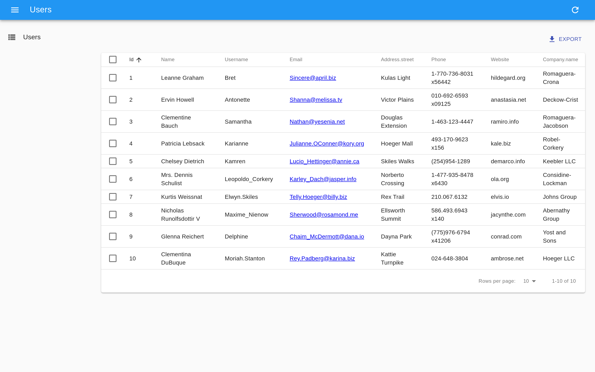

If you look at the network tab in the browser developer tools, you'll notice that the application fetched the `http://jsonplaceholder.typicode.com/users` URL, then used the results to build the datagrid. That's basically how react-admin works.

The list is already functional: you can reorder it by clicking on column headers, or change pages by using the bottom pagination controls. The `ra-data-json-server` data provider translates these actions to a query string that JSONPlaceholder understands.

## Selecting Columns

The `<ListGuesser>` component is not meant to be used in production - it's just a way to quicky bootstrap an admin. That means you'll have to replace the `ListGuesser` component in the `users` resource by a custom React component. Fortunately, `ListGuesser` dumps the code of the list it has guessed to the console:

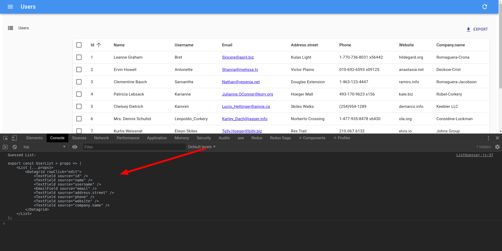

Let's copy this code, and create a new `UserList` component, in a new file named `users.js`:

```jsx
// in src/users.js
import React from 'react';
import { List, Datagrid, TextField, EmailField } from 'react-admin';

export const UserList = props => (
    <List {...props}>
        <Datagrid rowClick="edit">
            <TextField source="id" />
            <TextField source="name" />
            <TextField source="username" />
            <EmailField source="email" />
            <TextField source="address.street" />
            <TextField source="phone" />
            <TextField source="website" />
            <TextField source="company.name" />
        </Datagrid>
    </List>
);
```

Then, edit the `App.js` file to use this new component instead of `ListGuesser`:

```diff
// in src/App.js
-import { Admin, Resource, ListGuesser } from 'react-admin';
+import { Admin, Resource } from 'react-admin';
+import { UserList } from './users';

const App = () => (
    <Admin dataProvider={dataProvider}>
-       <Resource name="users" list={ListGuesser} />
+       <Resource name="users" list={UserList} />
    </Admin>
);
```


There is no visible change in the browser - except now, the app uses a component that you can customize. 

The main component of the users list is a `<List>` component, responsible for grabbing the information from the API, displaying the page title, and handling pagination. This list then delegates the display of the actual list of users to its child. In this case, that's a `<Datagrid>` component, which renders a table with one row for each record. The datagrid uses its child components (here, a list of `<TextField>` and `<EmailField>`) to determine the columns to render. Each Field component maps a different field in the API response, specified by the `source` prop.

The `ListGuesser` created one column for every field in the response. That's a bit too much of a usable grid, so let's remove a couple `<TextField>` from the datagrid and see the effect:

```diff
// in src/users.js
import React from 'react';
import { List, Datagrid, TextField, EmailField } from 'react-admin';

export const UserList = props => (
    <List {...props}>
        <Datagrid rowClick="edit">
            <TextField source="id" />
            <TextField source="name" />
-           <TextField source="username" />
            <EmailField source="email" />
-           <TextField source="address.street" />
            <TextField source="phone" />
            <TextField source="website" />
            <TextField source="company.name" />
        </Datagrid>
    </List>
);
```

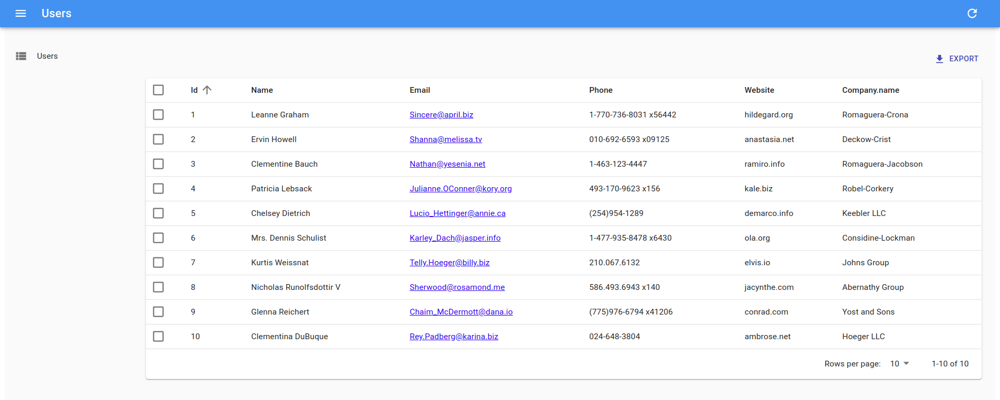

What you've just done reflects the early stages of development with react-admin: let the guesser do the job, select only the fields you want, and start customizing types.

## Using Field Types

You've just met the `<TextField>` and the `<EmailField>` components. React-admin provides more Field components, mapping various data types: number, date, image, HTML, array, reference, etc.

For instance, the `website` field looks like an URL. Instead of displaying it as text, why not display it using a clickable link? That's exactly what the `<UrlField>` does:

```diff
// in src/users.js
import React from 'react';
-import { List, Datagrid, TextField, EmailField } from 'react-admin';
+import { List, Datagrid, TextField, EmailField, UrlField } from 'react-admin';

export const UserList = props => (
    <List {...props}>
        <Datagrid rowClick="edit">
            <TextField source="id" />
            <TextField source="name" />
            <EmailField source="email" />
            <TextField source="phone" />
-           <TextField source="website" />
+           <UrlField source="website" />
            <TextField source="company.name" />
        </Datagrid>
    </List>
);
```

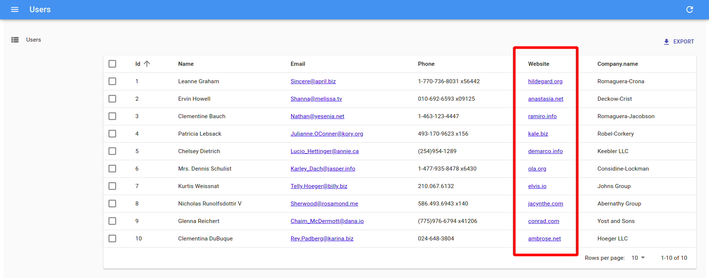

In react-admin, fields are simple React components. At runtime, they receive the `record` fetched from the API (e.g. `{ "id": 2, "name": "Ervin Howell", "website": "anastasia.net", ... }`), and the `source` field they should display (e.g. `website`).

That means that writing a custom Field component is really straightforward. For instance, here is a simplified version of the `UrlField`:

```jsx
// in src/MyUrlField.js
import React from 'react';

const MyUrlField = ({ record = {}, source }) =>
    <a href={record[source]}>
        {record[source]}
    </a>;

export default MyUrlField;
```

You can use this component in `<UserList>`, instead of react-admin's `<UrlField>` component, and it will work just the same.

```diff
// in src/users.js
import React from 'react';
-import { List, Datagrid, TextField, EmailField, UrlField } from 'react-admin';
+import { List, Datagrid, TextField, EmailField } from 'react-admin';
+import MyUrlField from './MyUrlField';

export const UserList = props => (
    <List {...props}>
        <Datagrid rowClick="edit">
            <TextField source="id" />
            <TextField source="name" />
            <EmailField source="email" />
            <TextField source="phone" />
-           <UrlField source="website" />
+           <MyUrlField source="website" />
            <TextField source="company.name" />
        </Datagrid>
    </List>
);
```

Yes, you can replace any of react-admin's components with your own! That means react-admin never blocks you: if one react-admin component doesn't perfectly suit your needs, you can easily swap it with your own version.

## Customizing Styles

The `MyUrlField` component is a perfect opportunity to illustrate how to customize styles. React-admin relies on [material-ui](https://material-ui.com/), a set of React components modeled after Google's [Material Design UI Guidelines](https://material.io/). Material-ui uses [JSS](https://github.com/cssinjs/jss), a CSS-in-JS solution, for styling components. Let's take advantage of the capabilities of JSS to remove the underline from the link and add an icon:

```jsx
// in src/MyUrlField.js
import React from 'react';
import { withStyles } from '@material-ui/core/styles';
import LaunchIcon from '@material-ui/icons/Launch';

const styles = {
    link: {
        textDecoration: 'none',
    },
    icon: {
        width: '0.5em',
        paddingLeft: 2,
    },
};

const MyUrlField = ({ record = {}, source, classes }) =>
    <a href={record[source]} className={classes.link}>
        {record[source]}
        <LaunchIcon className={classes.icon} />
    </a>;

export default withStyles(styles)(MyUrlField);
```

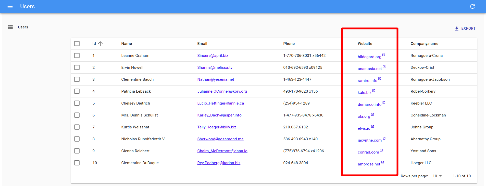

In JSS, you define styles as a JavaScript object, using the JS variants of the CSS property names (e.g. `textDecoration` instead of `text-decoration`). To pass these styles to the component, wrap it inside a call to `withStyles(styles)`. JSS will create new class names for these styles, insert them (once) in the HTML document, and pass the new class names as a new `classes` property. Then, use these names in a `className` prop, as you would with a regular CSS class.

**Tip**: There is much more to JSS than what this tutorial covers. Read the [material-ui documentation](https://material-ui.com/) to learn more about theming, vendor prefixes, responsive utilities, etc.


## Handling Relationships

In JSONPlaceholder, each `post` record includes a `userId` field, which points to a `user`:

```json
{
    "id": 1,
    "title": "sunt aut facere repellat provident occaecati excepturi optio reprehenderit",
    "body": "quia et suscipit\nsuscipit recusandae consequuntur expedita et cum\nreprehenderit molestiae ut ut quas totam\nnostrum rerum est autem sunt rem eveniet architecto",
    "userId": 1
}
```

React-admin knows how to take advantage of these foreign keys to fetch references. Let's see how the `ListGuesser` manages them by creating a new `<Resource>` for the `/posts` API endpoint:

```diff
// in src/App.js
import React from 'react';
-import { Admin, Resource } from 'react-admin';
+import { Admin, Resource, ListGuesser } from 'react-admin';
import jsonServerProvider from 'ra-data-json-server';
import { UserList } from './users';

const App = () => (
    <Admin dataProvider={dataProvider}>
+       <Resource name="posts" list={ListGuesser} />
        <Resource name="users" list={UserList} />
    </Admin>
);

export default App;
```

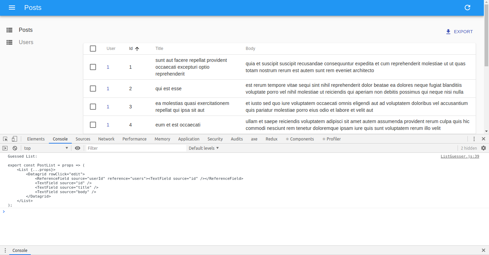

The `ListGuesser` suggests using a `<ReferenceField>` for the `userId` field. Let's play with this new field by creating the `PostList` component based on the code dumped by the guesser:

```jsx
// in src/posts.js
import React from 'react';
import { List, Datagrid, TextField, ReferenceField } from 'react-admin';

export const PostList = props => (
    <List {...props}>
        <Datagrid rowClick="edit">
            <ReferenceField source="userId" reference="users">
                <TextField source="id" />
            </ReferenceField>
            <TextField source="id" />
            <TextField source="title" />
            <TextField source="body" />
        </Datagrid>
    </List>
);
```

```diff
// in src/App.js
-import { Admin, Resource, ListGuesser } from 'react-admin';
+import { Admin, Resource } from 'react-admin';
+import { PostList } from './posts';
import { UserList } from './users';

const App = () => (
    <Admin dataProvider={dataProvider}>
-       <Resource name="posts" list={ListGuesser} />
+       <Resource name="posts" list={PostList} />
        <Resource name="users" list={UserList} />
    </Admin>
);
```

When displaying the posts list, the app displays the `id` of the post author as a `<TextField>`. This `id` field doesn't mean much, let's use the user `name` instead:

```diff
// in src/posts.js
export const PostList = props => (
    <List {...props}>
        <Datagrid rowClick="edit">
            <ReferenceField source="userId" reference="users">
-               <TextField source="id" />
+               <TextField source="name" />
            </ReferenceField>
            <TextField source="id" />
            <TextField source="title" />
            <TextField source="body" />
        </Datagrid>
    </List>
);
```

The post list now displays the user names on each line.

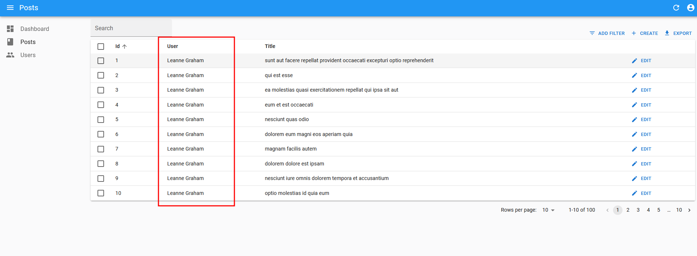

**Tip**: The `<ReferenceField>` component alone doesn't display anything. It just fetches the reference data, and passes it as a `record` to its child component (a `<TextField>` in our case). Just like the `<List>` component, all `<Reference>` components are only responsible for fetching and preparing data, and delegate rendering to their children.

**Tip**: Look at the network tab of your browser again: react-admin deduplicates requests for users, and aggregates them in order to make only *one* HTTP request to the `/users` endpoint for the whole datagrid. That's one of many optimizations that keep the UI fast and responsive.

To finish the post list, place the post `id` field as first column, and remove the `body` field. From a UX point of view, fields containing large chunks of text should not appear in a datagrid, only in detail views. Also, to make the Edit action stand out, let's replace the `rowClick` action by an explicit action button:

```diff
// in src/posts.js
import React from 'react';
-import { List, Datagrid, TextField, ReferenceField } from 'react-admin';
+import { List, Datagrid, TextField, ReferenceField, EditButton } from 'react-admin';

export const PostList = props => (
    <List {...props}>
-       <Datagrid rowClick="edit">
+       <Datagrid>
+           <TextField source="id" />
            <ReferenceField source="userId" reference="users">
                <TextField source="name" />
            </ReferenceField>
-           <TextField source="id" />
            <TextField source="title" />
-           <TextField source="body" />
+           <EditButton />
        </Datagrid>
    </List>
);
```

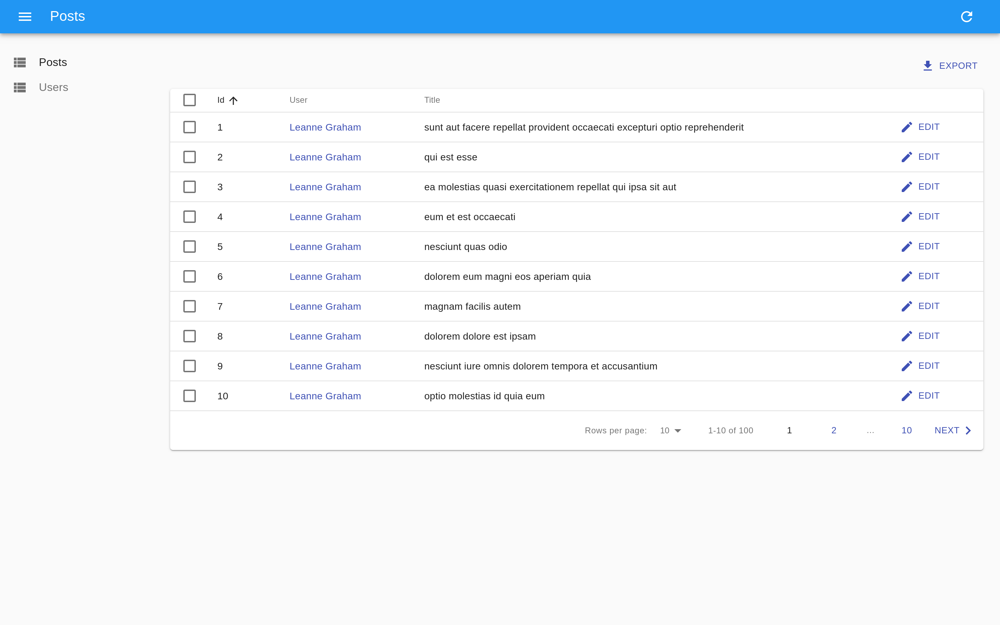

## Adding Creation and Editing Capabilities

An admin interface isn't just about displaying remote data, it should also allow editing records. React-admin provides an `<Edit>` components for that purpose ; let's use the `<EditGuesser>` to help bootstrap it.

```diff
// in src/App.js
-import { Admin, Resource } from 'react-admin';
+import { Admin, Resource, EditGuesser } from 'react-admin';
import { PostList } from './posts';
import { UserList } from './users';

const App = () => (
    <Admin dataProvider={dataProvider}>
-       <Resource name="posts" list={PostList} />
+       <Resource name="posts" list={PostList} edit={EditGuesser} />
        <Resource name="users" list={UserList} />
    </Admin>
);
```

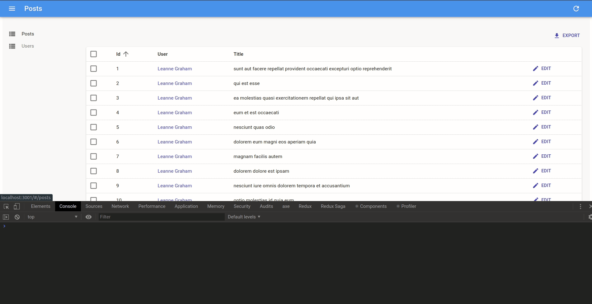

Users can display the edit page just by clicking on the Edit button. The form rendered is already functional; it issues `PUT` requests to the REST API upon submission.

Copy the `PostEdit` code dumped by the guesser in the console to the `posts.js` file so that you can customize the view. Don't forget to `import` the new components from react-admin.

You can now adjust the `PostEdit` component to disable the edition of the primary key (`id`), place it first, use the user `name` instead of the user `id` in the reference, and use a longer text input for the `body` field, as follows:

```diff
// in src/posts.js
export const PostEdit = props => (
    <Edit {...props}>
        <SimpleForm>
+           <DisabledInput source="id" />
            <ReferenceInput source="userId" reference="users">
-               <SelectInput optionText="id" />
+               <SelectInput optionText="name" />
            </ReferenceInput>
-           <TextInput source="id" />
            <TextInput source="title" />
-           <TextInput source="body" />
+           <LongTextInput source="body" />
        </SimpleForm>
    </Edit>
);
```

If you've understood the `<List>` component, the `<Edit>` component will be no surprise. It's responsible for fetching the record, and displaying the page title. It passes the record down to the `<SimpleForm>` component, which is responsible for the form layout, default values, and validation. Just like `<Datagrid>`, `<SimpleForm>` uses its children to determine the form inputs to display. It expects *input components* as children. `<DisabledInput>`, `<TextInput>`, `<ReferenceInput>`, and `<SelectInput>` are such inputs.

The `<ReferenceInput>` takes the same props as the `<ReferenceField>` (used earlier in the `PostList` page). `<ReferenceInput>` uses these props to fetch the API for possible references related to the current record (in this case, possible `users` for the current `post`). It then passes these possible references to the child component (`<SelectInput>`), which is responsible for displaying them (via their `name` in that case), and letting the user select one. `<SelectInput>` renders as a `<select>` tag in HTML.

Before you can use that custom component in the `App.js`, copy the `PostEdit` component into a `PostCreate`, and replace `Edit` by `Create`:

```jsx
// in src/posts.js
export const PostCreate = props => (
    <Create {...props}>
        <SimpleForm>
            <ReferenceInput source="userId" reference="users">
                <SelectInput optionText="name" />
            </ReferenceInput>
            <TextInput source="title" />
            <LongTextInput source="body" />
        </SimpleForm>
    </Create>
);
```

**Tip**: The `<PostEdit>` and the `<PostCreate>` components use almost the same child form, except for the additional `id` input in `<PostEdit>`. In most cases, the forms for creating and editing a record are a bit different, because most APIs create primary keys server-side. But if the forms are the same, you can share a common form component in `<PostEdit>` and `<PostCreate>`.

To use the new `<PostEdit>` and `<PostCreate>` components in the posts resource, just add them as `edit` and `create` attributes in the `<Resource name="posts">` component:

```diff
// in src/App.js
-import { Admin, Resource, EditGuesser } from 'react-admin';
+import { Admin, Resource } from 'react-admin';
-import { PostList } from './posts';
+import { PostList, PostEdit, PostCreate } from './posts';
import { UserList } from './users';

const App = () => (
    <Admin dataProvider={dataProvider}>
-       <Resource name="posts" list={PostList} edit={EditGuesser} />
+       <Resource name="posts" list={PostList} edit={PostEdit} create={PostCreate} />
        <Resource name="users" list={UserList} />
    </Admin>
);
```

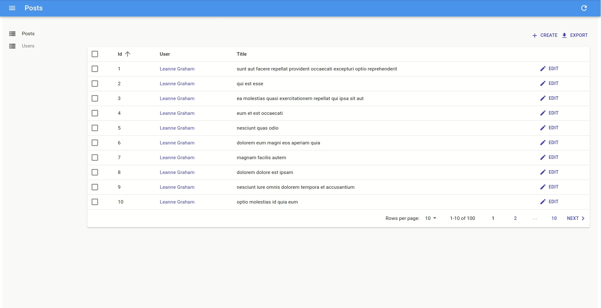

React-admin automatically adds a "create" button on top of the posts list to give access to the `<PostCreate>` component. And the creation form works ; it issues a `POST` request to the REST API upon submission.

## Optimistic Rendering And Undo

Unfortunately, JSONPlaceholder is a read-only API; although it seems to accept `POST` and `PUT` requests, it doesn't take into account the creations and edits - that's why, in this particular case, you will see errors after creation, and you won't see your edits after you save them. It's just an artifact of JSONPlaceholder.

But then, how come the newly created post appears in the list just after creation in the screencast above?

That's because react-admin uses *optimistic rendering*. When a user edits a record and hits the "Save" button, the UI shows a confirmation and displays the updated data *before sending the update query to server*. The main benefit is that UI changes are immediate - no need to wait for the server response. It's a great comfort for users.

But there is an additional benefit: it also allows the "Undo" feature. Undo is already functional in the admin at that point. Try editing a record, then hit the "Undo" link in the black confirmation box before it slides out. You'll see that the app does not send the `UPDATE` query to the API, and displays the non-modified data.

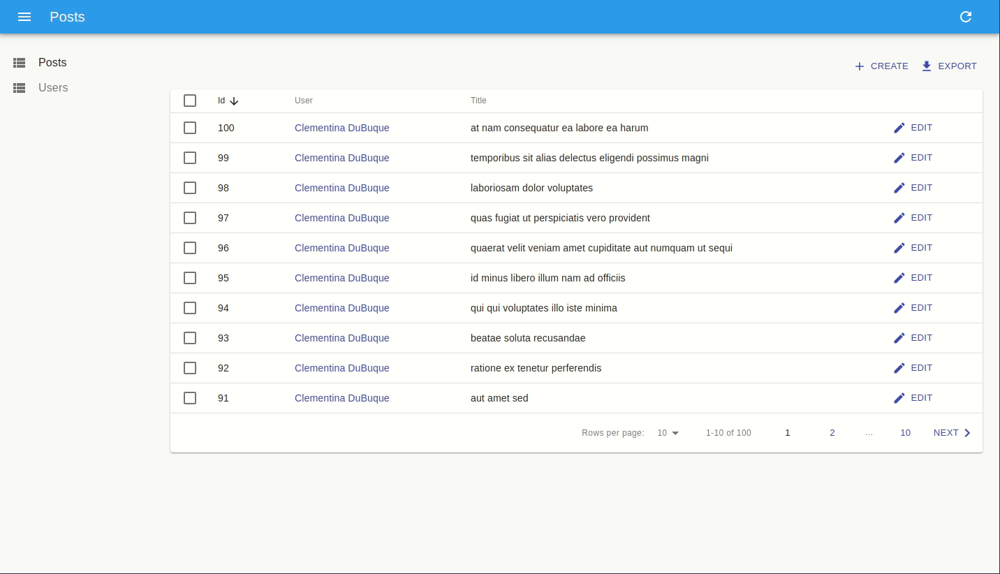

Even though updates appear immediately due to Optimistic Rendering, React-admin only sends them to the server after a short delay (about 5 seconds). During this delay, the user can undo the action, and react-admin will never send the update. 

Optimistic Rendering and Undo require no specific code on the API side - react-admin handles them purely on the client-side. That means that you'll get them for free with your own API!

**Note**: When you add the ability to edit an item, you also add the ability to delete it. The "Delete" button in the edit view is fully working out of the box - and it is also "Undo"-able .

The post editing page has a slight problem: it uses the post id as main title (the text displayed in the top bar). Let's customize the view title with a title component:

```diff
// in src/posts.js
+const PostTitle = ({ record }) => {
+    return <span>Post {record ? `"${record.title}"` : ''}</span>;
+};

export const PostEdit = props => (
-   <Edit {...props}>
+   <Edit title={<PostTitle />} {...props}>
        // ...
    </Edit>
);
```

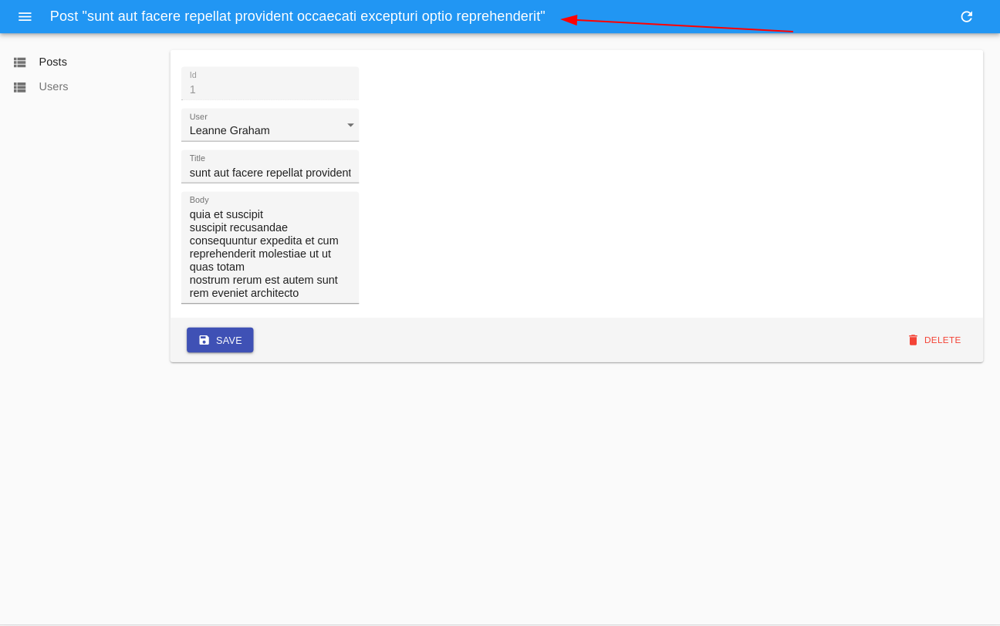

## Adding Search And Filters To The List

Let's get back to the post list for a minute. It offers sorting and pagination, but one feature is missing: the ability to search content.

React-admin can use Input components to create a multi-criteria search engine in the list view. First, create a `<Filter>` component just like you would write a `<SimpleForm>` component, using input components as children. Then, add it to the list using the `filters` prop:

```jsx
// in src/posts.js
import { Filter, ReferenceInput, SelectInput, TextInput, List } from 'react-admin';

const PostFilter = (props) => (
    <Filter {...props}>
        <TextInput label="Search" source="q" alwaysOn />
        <ReferenceInput label="User" source="userId" reference="users" allowEmpty>
            <SelectInput optionText="name" />
        </ReferenceInput>
    </Filter>
);

export const PostList = (props) => (
    <List filters={<PostFilter />} {...props}>
        // ...
    </List>
);
```

The first filter, 'q', takes advantage of a full-text functionality offered by JSONPlaceholder. It is `alwaysOn`, so it always appears on the screen. Users can add the second filter, `userId`, thanks to the "add filter" button, located on the top of the list. As it's a `<ReferenceInput>`, it's already populated with possible users. 

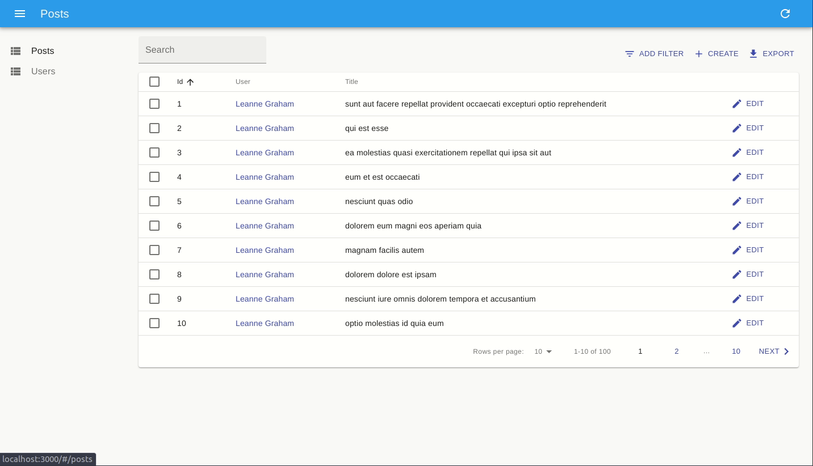

Filters are "search-as-you-type", meaning that when the user enters new values in the filter form, the list refreshes (via an API request) immediately.

**Tip**: Note that the `label` property can be used on any any field to customize the field label.

## Customizing the Menu Icons

The sidebar menu shows the same icon for both posts and users. Customizing the menu icon is just a matter of passing an `icon` attribute to each `<Resource>`:

```jsx
// in src/App.js
import PostIcon from '@material-ui/icons/Book';
import UserIcon from '@material-ui/icons/Group';

const App = () => (
    <Admin dataProvider={dataProvider}>
        <Resource name="posts" list={PostList} edit={PostEdit} create={PostCreate} icon={PostIcon} />
        <Resource name="users" list={UserList} icon={UserIcon} />
    </Admin>
);
```

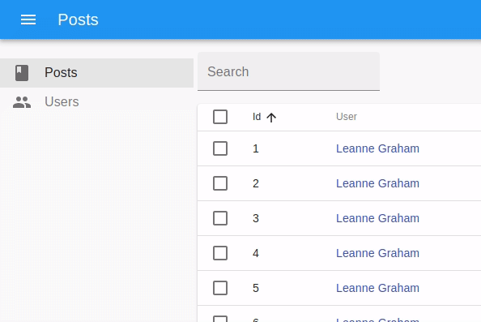

## Using a Custom Home Page

By default, react-admin displays the list page of the first `Resource` element as home page. If you want to display a custom component instead, pass it in the `dashboard` prop of the `<Admin>` component.

```jsx
// in src/Dashboard.js
import React from 'react';
import Card from '@material-ui/core/Card';
import CardContent from '@material-ui/core/CardContent';
import CardHeader from '@material-ui/core/CardHeader';

export default () => (
    <Card>
        <CardHeader title="Welcome to the administration" />
        <CardContent>Lorem ipsum sic dolor amet...</CardContent>
    </Card>
);
```

```jsx
// in src/App.js
import Dashboard from './Dashboard';

const App = () => (
    <Admin dashboard={Dashboard} dataProvider={dataProvider}>
        // ...
    </Admin>
);
```


## Adding a Login Page

Most admin apps require authentication. React-admin can check user credentials before displaying a page, and redirect to a login form when the REST API returns a 403 error code.

*What* those credentials are, and *how* to get them, are questions that you, as a developer, must answer. React-admin makes no assumption about your authentication strategy (basic auth, OAuth, custom route, etc), but gives you the hooks to plug your logic at the right place - by calling an `authProvider` function.

For this tutorial, since there is no public authentication API we can use a fake authentication provider that accepts every login request, and stores the `username` in `localStorage`. Each page change will require that `localStorage` contains a `username` item.

The `authProvider` is a simple function, which must return a `Promise`:

```jsx
// in src/authProvider.js
import { AUTH_LOGIN, AUTH_LOGOUT, AUTH_ERROR, AUTH_CHECK } from 'react-admin';

export default (type, params) => {
    // called when the user attempts to log in
    if (type === AUTH_LOGIN) {
        const { username } = params;
        localStorage.setItem('username', username);
        // accept all username/password combinations
        return Promise.resolve();
    }
    // called when the user clicks on the logout button
    if (type === AUTH_LOGOUT) {
        localStorage.removeItem('username');
        return Promise.resolve();
    }
    // called when the API returns an error
    if (type === AUTH_ERROR) {
        const { status } = params;
        if (status === 401 || status === 403) {
            localStorage.removeItem('username');
            return Promise.reject();
        }
        return Promise.resolve();
    }
    // called when the user navigates to a new location
    if (type === AUTH_CHECK) {
        return localStorage.getItem('username')
            ? Promise.resolve()
            : Promise.reject();
    }
    return Promise.reject('Unknown method');
};
```

**Tip**: As the `dataProvider` response is asynchronous, you can easily fetch an authentication server in there.

To enable this authentication strategy, pass the client as the `authProvider` prop in the `<Admin>` component:

```jsx
// in src/App.js
import Dashboard from './Dashboard';
import authProvider from './authProvider';

const App = () => (
    <Admin dashboard={Dashboard} authProvider={authProvider} dataProvider={dataProvider}>
        // ...
    </Admin>
);
```

Once the app reloads, it's now behind a login form that accepts everyone:


## Supporting Mobile Devices

The react-admin layout is already responsive. Try to resize your browser to see how the sidebar switches to a drawer on smaller screens.

But a responsive layout is not enough to make a responsive app. Datagrid components work well on desktop, but are absolutely not adapted to mobile devices. If your admin must be used on mobile devices, you'll have to provide an alternative component for small screens.

First, you should know that you don't have to use the `<Datagrid>` component as `<List>` child. You can use any other component you like. For instance, the `<SimpleList>` component:

```jsx
// in src/posts.js
import React from 'react';
import { List, SimpleList } from 'react-admin';

export const PostList = (props) => (
    <List {...props}>
        <SimpleList
            primaryText={record => record.title}
            secondaryText={record => `${record.views} views`}
            tertiaryText={record => new Date(record.published_at).toLocaleDateString()}
        />
    </List>
);
```

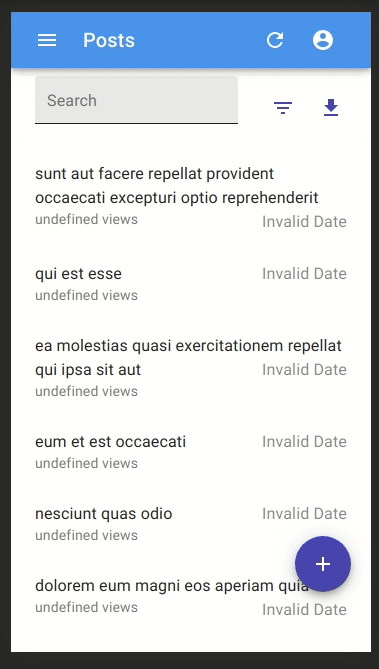

The `<SimpleList>` component uses [material-ui's `<List>` and `<ListItem>` components](http://www.material-ui.com/#/components/list), and expects functions as `primaryText`, `secondaryText`, and `tertiaryText` props.

**Note:** Since JSONRestServer doesn't provide `views` or `published_at` values for posts, we switched to a custom API for those screenshots in order to demonstrate how to use some of the `SimpleList` component props.

That works fine on mobile, but now the desktop user experience is worse. The best compromise would be to use `<SimpleList>` on small screens, and `<Datagrid>` on other screens. That's where the `<Responsive>` component comes in:

```jsx
// in src/posts.js
import React from 'react';
import { List, Responsive, SimpleList, Datagrid, TextField, ReferenceField, EditButton } from 'react-admin';

export const PostList = (props) => (
    <List {...props}>
        <Responsive
            small={
                <SimpleList
                    primaryText={record => record.title}
                    secondaryText={record => `${record.views} views`}
                    tertiaryText={record => new Date(record.published_at).toLocaleDateString()}
                />
            }
            medium={
                <Datagrid>
                    <TextField source="id" />
                    <ReferenceField label="User" source="userId" reference="users">
                        <TextField source="name" />
                    </ReferenceField>
                    <TextField source="title" />
                    <TextField source="body" />
                    <EditButton />
                </Datagrid>
            }
        />
    </List>
);
```

This works exactly the way you expect. The lesson here is that react-admin takes care of responsive web design for the layout, but it's your job to use `<Responsive>` in pages.

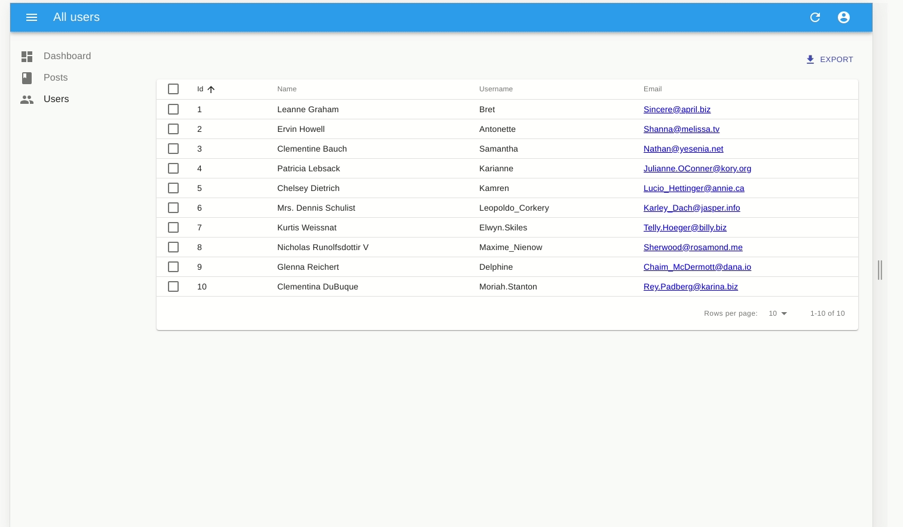

## Connecting To A Real API

Here is the elephant in the room of this tutorial. In real world projects, the dialect of your API (REST? GraphQL? Something else?) won't match the JSONPlaceholder dialect. Writing a Data Provider is probably the first thing you'll have to do to make react-admin work. Depending on your API, this can require a few hours of additional work.

React-admin delegates every data query to a Data Provider function. This function must simply return a promise for the result. This gives extreme freedom to map any API dialect, add authentication headers, use endpoints from several domains, etc.

For instance, let's imagine you have to use the `my.api.url` REST API, which expects the following parameters:

| Action              | Expected API request |
|---------------------|---------------------- |
| Get list            | `GET http://my.api.url/posts?sort=['title','ASC']&range=[0, 24]&filter={title:'bar'}` |
| Get one record      | `GET http://my.api.url/posts/123` |
| Get several records | `GET http://my.api.url/posts?filter={ids:[123,456,789]}` |
| Update a record     | `PUT http://my.api.url/posts/123` |
| Create a record     | `POST http://my.api.url/posts/123` |
| Delete a record     | `DELETE http://my.api.url/posts/123` |

React-admin defines custom verbs for each of the actions of this list. Just like HTTP verbs (`GET`, `POST`, etc.), react-admin verbs qualify a request to a data provider. React-admin verbs are called `GET_LIST`, `GET_ONE`, `GET_MANY`, `CREATE`, `UPDATE`, and `DELETE`. The Data Provider will have to map each of these verbs to one (or many) HTTP request(s).

The code for a Data Provider for the `my.api.url` API is as follows:

```jsx
// in src/dataProvider
import {
    GET_LIST,
    GET_ONE,
    GET_MANY,
    GET_MANY_REFERENCE,
    CREATE,
    UPDATE,
    DELETE,
    fetchUtils,
} from 'react-admin';
import { stringify } from 'query-string';

const API_URL = 'my.api.url';

/**
 * @param {String} type One of the constants appearing at the top of this file, e.g. 'UPDATE'
 * @param {String} resource Name of the resource to fetch, e.g. 'posts'
 * @param {Object} params The Data Provider request params, depending on the type
 * @returns {Object} { url, options } The HTTP request parameters
 */
const convertDataProviderRequestToHTTP = (type, resource, params) => {
    switch (type) {
    case GET_LIST: {
        const { page, perPage } = params.pagination;
        const { field, order } = params.sort;
        const query = {
            sort: JSON.stringify([field, order]),
            range: JSON.stringify([(page - 1) * perPage, page * perPage - 1]),
            filter: JSON.stringify(params.filter),
        };
        return { url: `${API_URL}/${resource}?${stringify(query)}` };
    }
    case GET_ONE:
        return { url: `${API_URL}/${resource}/${params.id}` };
    case GET_MANY: {
        const query = {
            filter: JSON.stringify({ id: params.ids }),
        };
        return { url: `${API_URL}/${resource}?${stringify(query)}` };
    }
    case GET_MANY_REFERENCE: {
        const { page, perPage } = params.pagination;
        const { field, order } = params.sort;
        const query = {
            sort: JSON.stringify([field, order]),
            range: JSON.stringify([(page - 1) * perPage, (page * perPage) - 1]),
            filter: JSON.stringify({ ...params.filter, [params.target]: params.id }),
        };
        return { url: `${API_URL}/${resource}?${stringify(query)}` };
    }
    case UPDATE:
        return {
            url: `${API_URL}/${resource}/${params.id}`,
            options: { method: 'PUT', body: JSON.stringify(params.data) },
        };
    case CREATE:
        return {
            url: `${API_URL}/${resource}`,
            options: { method: 'POST', body: JSON.stringify(params.data) },
        };
    case DELETE:
        return {
            url: `${API_URL}/${resource}/${params.id}`,
            options: { method: 'DELETE' },
        };
    default:
        throw new Error(`Unsupported fetch action type ${type}`);
    }
};

/**
 * @param {Object} response HTTP response from fetch()
 * @param {String} type One of the constants appearing at the top of this file, e.g. 'UPDATE'
 * @param {String} resource Name of the resource to fetch, e.g. 'posts'
 * @param {Object} params The Data Provider request params, depending on the type
 * @returns {Object} Data Provider response
 */
const convertHTTPResponseToDataProvider = (response, type, resource, params) => {
    const { headers, json } = response;
    switch (type) {
    case GET_LIST:
        return {
            data: json.map(x => x),
            total: parseInt(headers.get('content-range').split('/').pop(), 10),
        };
    case CREATE:
        return { data: { ...params.data, id: json.id } };
    default:
        return { data: json };
    }
};

/**
 * @param {string} type Request type, e.g GET_LIST
 * @param {string} resource Resource name, e.g. "posts"
 * @param {Object} payload Request parameters. Depends on the request type
 * @returns {Promise} the Promise for response
 */
export default (type, resource, params) => {
    const { fetchJson } = fetchUtils;
    const { url, options } = convertDataProviderRequestToHTTP(type, resource, params);
    return fetchJson(url, options)
        .then(response => convertHTTPResponseToDataProvider(response, type, resource, params));
};
```

**Tip**: `fetchJson()` is just a shortcut for `fetch().then(r => r.json())`, plus a control of the HTTP response code to throw an `HTTPError` in case of 4xx or 5xx response. Feel free to use `fetch()` directly if it doesn't suit your needs.

Using this provider instead of the previous `jsonServerProvider` is just a matter of switching a function:

```jsx
// in src/app.js
import dataProvider from './dataProvider';

const App = () => (
    <Admin dataProvider={dataProvider}>
        // ...
    </Admin>
);
```

## Conclusion

React-admin was built with customization in mind. You can replace any react-admin component with a component of your own, for instance to display a custom list layout, or a different edit form for a given resource.

Now that you've completed the tutorial, continue reading the [react-admin documentation](http://marmelab.com/react-admin/), and read the [Material UI components documentation](http://www.material-ui.com/#/).
