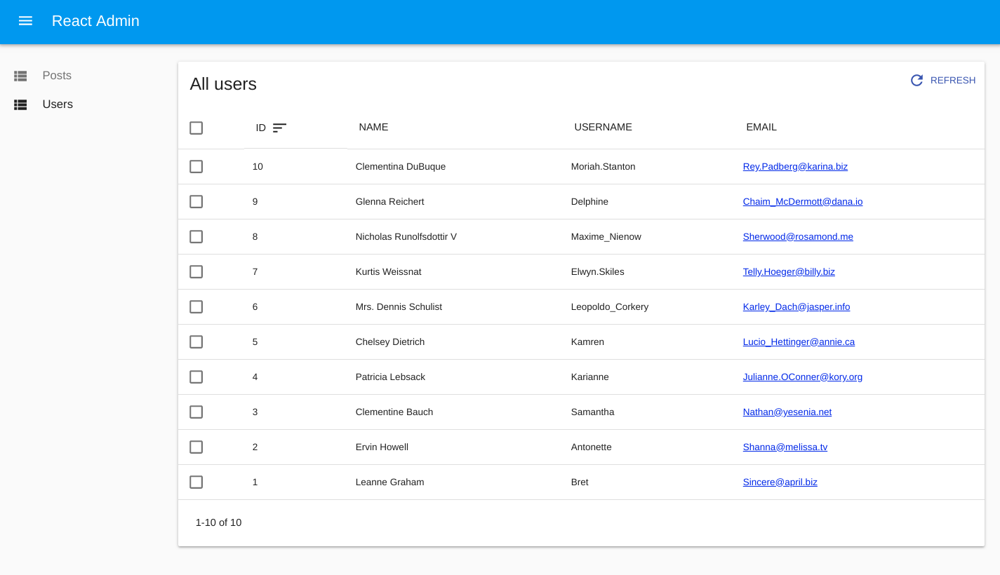
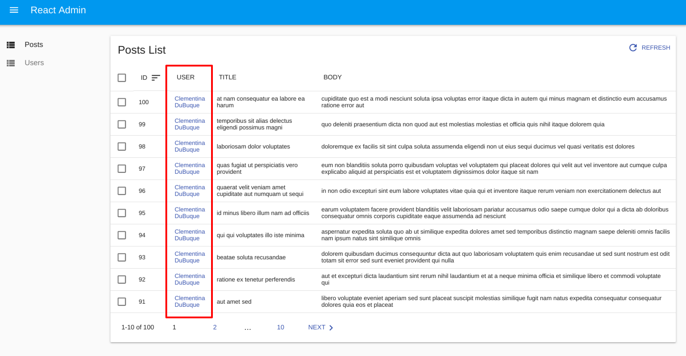
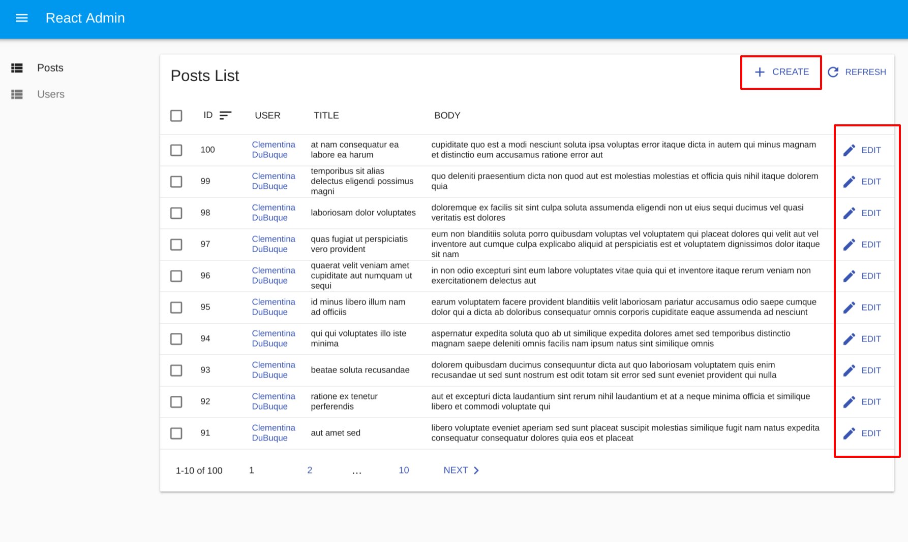
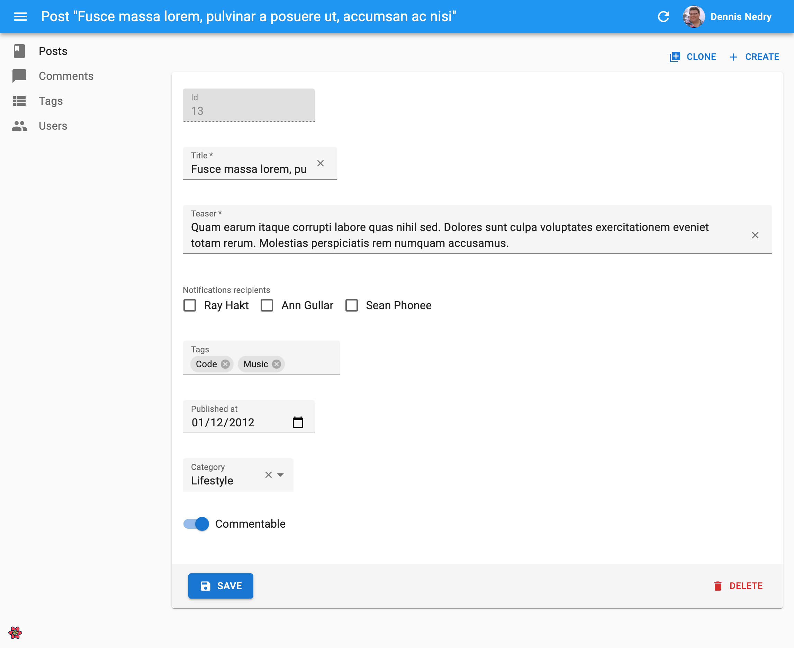
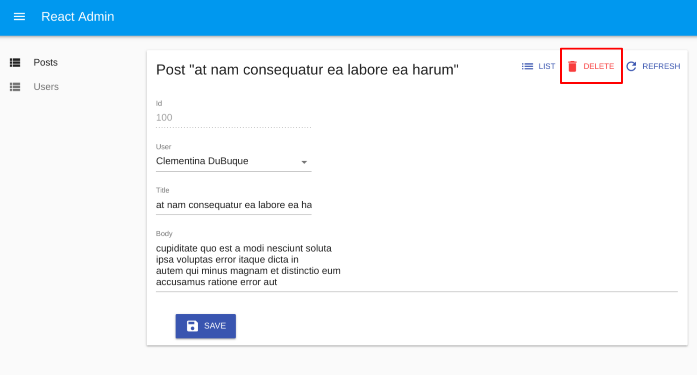
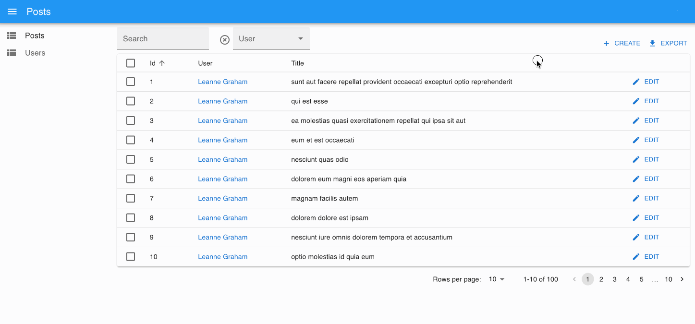
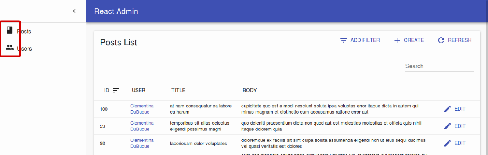

# Admin-on-REST Tutorial

This 15 minutes tutorial will expose how to create a new admin app based on an existing REST API.


## Installation

Admin-on-REST uses React. We'll use Facebook's [react-create-app](https://github.com/facebookincubator/create-react-app) to create an empty React app, and install the `admin-on-rest` package:

```sh
npm install -g create-react-app
create-react-app test-admin
cd test-admin/
yarnpkg add admin-on-rest
yarnpkg start
```

You should be up and running with an empty React application on port 3000.

The API is not stable yet, so make sure you read the correct version of this tutorial,
which you should be able to find locally as `node_modules/admin-on-rest/docs/Tutorial.md`.

## Making Contact With The API

We'll be using [JSONPlaceholder](http://jsonplaceholder.typicode.com/), which is a fake online REST API for testing and prototyping, as the datasource for the admin.

JSONPlaceholder provides endpoints for fake posts, fake comments, and fake users. The admin we'll build will allow to Create, Retrieve, Update, and Delete (CRUD) these resources.

Replace the `src/App.js` by the following code:

```js
// in src/App.js
import React from 'react';

import { jsonServerRestClient, Admin, Resource } from 'admin-on-rest';

import { PostList } from './posts';

const App = () => (
    <Admin restClient={jsonServerRestClient('http://jsonplaceholder.typicode.com')}>
        <Resource name="posts" list={PostList} />
    </Admin>
);

export default App;
```

The App component now renders an `<Admin>` component, which is the main component of admin-on-rest. This component expects a REST client as a parameter - a function capable of translating REST commands into HTTP requests. Since REST isn't a standard, you will probably have to provide a custom client to connect to your own APIs. But we'll dive into REST clients later. For now, let's take advantage of the `jsonServerRestClient`, which speaks the same REST dialect as JSONPlaceholder.

The `<Admin>` component contains `<Resource>` components, each resource being mapped to an endpoint in the API. To begin with, we'll display the list of posts. Here is what the `<PostList>` component looks like:

```js
// in src/posts.js
import React from 'react';
import { List, Datagrid, TextField } from 'admin-on-rest';

export const PostList = (props) => (
    <List {...props}>
        <Datagrid>
            <TextField source="id" />
            <TextField source="title" />
            <TextField source="body" />
        </Datagrid>
    </List>
);
```

The main component of the post list is a `<List>` component, responsible for grabbing the information from the url, displaying the page title, and handling pagination. This list then delegates the display of the actual list of posts to a `<Datagrid>`, responsible for displaying a table with one row for each post. As for which columns should be displayed in this table, that's what the bunch of `<TextField>` components are for, each mapping a different source field in the API response.

That should be enough to display the post list:


The list is already functional: you can change the ordering by clicking on column headers, or change pages by using the bottom pagination controls.

## Field Types

So far, you've only seen `<TextField>`, but if the API sends resources with other types of content, admin-on-rest can provide more features. For instance, [the `/users` endpoint in JSONPlaceholder](http://jsonplaceholder.typicode.com/users) contains emails. Let's see how the list displays them:

```js
// in src/users.js
import React from 'react';
import { List, Datagrid, EmailField, TextField } from 'admin-on-rest';

export const UserList = (props) => (
    <List title="All users" {...props}>
        <Datagrid>
            <TextField source="id" />
            <TextField source="name" />
            <TextField source="username" />
            <EmailField source="email" />
        </Datagrid>
    </List>
);
```

You'll notice that we override the default `title` of this list. To include the new `users` resource in the admin app, add it in `src/App.js`:

```js
// in src/App.js
import { PostList } from './posts';
import { UserList } from './users';

const App = () => (
    <Admin restClient={jsonServerRestClient('http://jsonplaceholder.typicode.com')}>
        <Resource name="posts" list={PostList} />
        <Resource name="users" list={UserList} />
    </Admin>
);
```



The sidebar now gives access to the second resource, Users. The users list shows the email as a `<a href="mailto:">` tag.

In admin-on-rest, fields are simple React components. At runtime, they receive the `record` they operate on (coming from the API, e.g. `{ "id": 1, "name": "Leanne Graham", "username": "Bret", "email": "Sincere@april.biz" }`), and the `source` field they should display (e.g. 'email'). That means that the code for field components is really simple:

```js
// in admin-on-rest/src/mui/field/EmailField.js
import React, { PropTypes } from 'react';

const EmailField = ({ record = {}, source }) => <a href={`mailto:${record[source]}`}>{record[source]}</a>;

EmailField.propTypes = {
    source: PropTypes.string.isRequired,
    record: PropTypes.object,
};

export default EmailField;
```

Creating your own custom fields shouldn't be too difficult.

## Relationships

In JSONPlaceholder, each `post` record includes a `userId` field, which points to a `user`:

```json
{
    "id": 1,
    "userId": 1,
    "title": "sunt aut facere repellat provident occaecati excepturi optio reprehenderit",
    "body": "quia et suscipit\nsuscipit recusandae consequuntur expedita et cum\nreprehenderit molestiae ut ut quas totam\nnostrum rerum est autem sunt rem eveniet architecto"
}
```

Admin-on-REST knows how to take advantage of these foreign keys to fetch references to a given record. For instance, to include the user name in the posts list, use the `<ReferenceField>`:

```js
// in src/posts.js
import React from 'react';
import { List, Datagrid, TextField, EmailField, ReferenceField } from 'admin-on-rest';

export const PostList = (props) => (
    <List {...props}>
        <Datagrid>
            <TextField source="id" />
            <ReferenceField label="User" source="userId" reference="users">
                <TextField source="name" />
            </ReferenceField>
            <TextField source="title" />
            <TextField source="body" />
        </Datagrid>
    </List>
);
```

When displaying the posts list, the browser now fetches related user records, and displays their `name` as a `<TextField>`. Notice the `label` property: you can use it on any field component to customize the list header.



**Tip**: Reference components always pass the data they fetch to a child component, which is responsible for displaying the data.

## Creation and Edition

An admin interface is usually for more than seeing remote data - it's for editing and creating, too. Admin-on-REST provides `<Create>` and `<Edit>` components for that purpose. We'll add them to the `posts` resource:

```js
// in src/posts.js
import React from 'react';
import { List, Edit, Create, Datagrid, ReferenceField, TextField, EditButton, DisabledInput, LongTextInput, ReferenceInput, SelectInput, SimpleForm, TextInput } from 'admin-on-rest';

export const PostList = (props) => (
    <List {...props}>
        <Datagrid>
            <TextField source="id" />
            <ReferenceField label="User" source="userId" reference="users">
                <TextField source="name" />
            </ReferenceField>
            <TextField source="title" />
            <TextField source="body" />
            <EditButton />
        </Datagrid>
    </List>
);

const PostTitle = ({ record }) => {
    return <span>Post {record ? `"${record.title}"` : ''}</span>;
};

export const PostEdit = (props) => (
    <Edit title={<PostTitle />} {...props}>
        <SimpleForm>
            <DisabledInput source="id" />
            <ReferenceInput label="User" source="userId" reference="users">
                <SelectInput optionText="name" />
            </ReferenceInput>
            <TextInput source="title" />
            <LongTextInput source="body" />
        </SimpleForm>
    </Edit>
);

export const PostCreate = (props) => (
    <Create {...props}>
        <SimpleForm>
            <ReferenceInput label="User" source="userId" reference="users" allowEmpty>
                <SelectInput optionText="name" />
            </ReferenceInput>
            <TextInput source="title" />
            <LongTextInput source="body" />
        </SimpleForm>
    </Create>
);
```

Notice the additional `<EditButton>` field in the `<PostList>` component children: that's what gives access to the post edition view. Also, the `<Edit>` component uses a custom `<PostTitle>` component as title, which shows the way to customize the title of a given view.

If you've understood the `<List>` component, the `<Edit>` and `<Create>` components will be no surprise. They are responsible for displaying the page title and preparing the data (fetching and setting default values). They pass the data to the `<SimpleForm>` component, which is responsible for the form layout and validation. Just like `<Datagrid>`, `<SimpleForm>` uses its children to display the form inputs. It expects *input components* as children. `<DisabledInput>`, `<TextInput>`, `<LongTextInput>`, and `<ReferenceInput>` are such inputs.

As for the `<ReferenceInput>`, it takes the same attributes as the `<ReferenceField>` (used earlier in the list view). `<ReferenceInput>` uses these attributes to fetch the API for possible references for the current record (in this case, possible `users` for the current `post`). Once it gets these possible records, it passes them to the child component (`<SelectInput>`), which is responsible for displaying them (via their `name` in that case) and letting the user select one. `<SelectInput>` renders as a `<select>` tag in HTML.

**Tip**: The `<Edit>` and the `<Create>` components use the same `<ReferenceInput>` configuration, except for the `allowEmpty` attribute, which is required in `<Create>`.

To use the new `<PostEdit>` and `<PostCreate>` components in the posts resource, just add them as `edit` and `create` attributes to the `<Resource>` component:

```js
// in src/App.js
import { PostList, PostEdit, PostCreate } from './posts';
import { UserList } from './users';

const App = () => (
    <Admin restClient={jsonServerRestClient('http://jsonplaceholder.typicode.com')}>
        <Resource name="posts" list={PostList} edit={PostEdit} create={PostCreate} />
        // ...
    </Admin>
);
```

Admin-on-rest automatically adds a "create" button on top of the posts list to give access to the `<PostCreate>` component. And the `<EditButton>` renders in each line of the list to give access to the `<PostEdit>` component.



The create and edit views render as a form. It's already functional, and automatically issues `POST` and `PUT` requests to the REST API.



**Note**: JSONPlaceholder is a read-only API: although it seems to accept `POST` and `PUT` requests, it doesn't take into account the creations and editions - that's why, in this particular case, you will see errors after creation, and you won't see your editions after you save them.

## Deletion

There is not much to configure in a deletion view. To add removal abilities to a `Resource`, simply use the bundled `<Delete>` component from admin-on-rest using the `remove` attribute ('delete' is a reserved word in JavaScript):

```js
// in src/App.js
import { Delete } from 'admin-on-rest';

const App = () => (
    <Admin restClient={jsonServerRestClient('http://jsonplaceholder.typicode.com')}>
        <Resource name="posts" list={PostList} edit={PostEdit} create={PostCreate} remove={Delete} />
        // ...
    </Admin>
);
```

In the edition view, a new "delete" button appears. And you can also use the `<DeleteButton>` as a field in the list.



## Filters

Let's get back to the post list for a minute. It offers sorting and pagination, but one feature is missing: the ability to search content.

Admin-on-rest can use input components to create a multi-criteria search engine in the list view. First, create a `<Filter>` component just like you would with a `<Create>` component, using input components. Then, tell the list to use a filter element using the `filters` prop:

```js
// in src/posts.js
import { Filter, ReferenceInput, SelectInput, TextInput } from 'admin-on-rest';

const PostFilter = (props) => (
    <Filter {...props}>
        <TextInput label="Search" source="q" alwaysOn />
        <ReferenceInput label="User" source="userId" reference="users" allowEmpty>
            <SelectInput optionText="name" />
        </ReferenceInput>
    </Filter>
);

export const PostList = (props) => (
    <List {...props} filters={<PostFilter />}>
        // ...
    </List>
);
```

The first filter, 'q', takes advantage of a full-text functionality offered by JSONPlaceholder. It is `alwaysOn`, so it always appears on the screen. The second filter, 'userId', can be added by the "add filter" button on the top of the list. As it's a `<ReferenceInput>`, it's already populated with possible users. It can be turned off by the end user.

Filters are "search-as-you-type", meaning that when the user enters new values in the filter form, the list refreshes (via an API request) immediately.



## Customizing the Menu Icons

The sidebar menu shows the same icon for both posts and users. Fortunately, customizing the menu icon is just a matter of passing an `icon` attribute to each `<Resource>`:

```js
// in src/App.js
import PostIcon from 'material-ui/svg-icons/action/book';
import UserIcon from 'material-ui/svg-icons/social/group';

const App = () => (
    <Admin restClient={jsonServerRestClient('http://jsonplaceholder.typicode.com')}>
        <Resource name="posts" list={PostList} edit={PostEdit} create={PostCreate} remove={Delete} icon={PostIcon} />
        <Resource name="users" list={UserList} icon={UserIcon} />
    </Admin>
);
```



## Using a Custom Home Page

By default, admin-on-rest displays the list view of the first resource as home page. If you want to display a custom component instead, pass it in the `dashboard` attribute of the `<Admin>` component.


```js
// in src/Dashboard.js
import React from 'react';
import { Card, CardHeader, CardText } from 'material-ui/Card';

export default () => (
    <Card style={{ margin: '2em' }}>
        <CardHeader title="Welcome to the administration" />
        <CardText>Lorem ipsum sic dolor amet...</CardText>
    </Card>
);
```


```js
// in src/App.js
import Dashboard from './Dashboard';

const App = () => (
    <Admin dashboard={Dashboard} restClient={jsonServerRestClient('http://jsonplaceholder.typicode.com')}>
        // ...
    </Admin>
);
```


## Adding a Login Page

Most admin apps require authentication, so admin-on-rest can check user credentials before displaying a page, and redirect to a login form when the REST API returns a 403 error code.

*What* those credentials are, and *how* to get them, are questions that you must answer. Admin-on-rest makes no assumption about your authentication strategy (basic auth, OAuth, custom route, etc), but gives you the hooks to plug your logic at the right place - by calling an `authClient` function.

For this tutorial, since there is no public authentication API we can use, we'll use a fake authentication provider that accepts every login request, and stores the `username` in `localStorage`. We'll implement a credentials checker that validates only if `localStorage` contains a `username` item.

The `authClient` is a simple function, which must return a `Promise`:

```js
// in src/authClient.js
import { AUTH_LOGIN, AUTH_LOGOUT, AUTH_CHECK } from 'admin-on-rest';

export default (type, params) => {
    if (type === AUTH_LOGIN) {
        const { username } = params;
        localStorage.setItem('username', username);
        // accept all username/password combinations
        return Promise.resolve();
    }
    if (type === AUTH_LOGOUT) {
        localStorage.removeItem('username');
        return Promise.resolve();
    }
    if (type === AUTH_CHECK) {
        return localStorage.getItem('username') ? Promise.resolve() : Promise.reject();
    }
    return Promise.reject('Unkown method');
};
```

As it's asynchronous, you can easily fetch an authentication server in there.

To enable this authentication strategy, pass the client as the `authClient` prop in the `<Admin>` component:

```js
// in src/App.js
import Dashboard from './Dashboard';
import authClient from './authClient';

const App = () => (
    <Admin authClient={authClient} restClient={jsonServerRestClient('http://jsonplaceholder.typicode.com')}>
        // ...
    </Admin>
);
```

Once the app reloads, it's now behind a login form that accepts everyone:


## Responsive List

The admin-on-rest layout is already responsive. Try to resize your browser to see how the sidebar switches to a drawer on smaller screens.

But the layout is not enough. Datagrid components work well on desktop, but are absolutely not adapted to mobile devices. If your admin can be used on mobile devices, you'll have to provide an alternative components for small screens

First, you should know that you don't have to use a `<Datagrid>` as `<List>` child. You can use any other component. For instance, the `<SimpleList>` component:

```js
// in src/posts.js
import React from 'react';
import { List, SimpleList } from 'admin-on-rest';

export const PostList = (props) => (
    <List {...props}>
        <SimpleList
            primaryText={record => record.title}
            secondaryText={record => `${record.views} views`}
            tertiaryText={record => new Date(record.published_at).toLocaleDateString()}
        />
    </List>
);
```

The `<SimpleList>` component uses [material-ui's `<List>` and `<ListItem>` components](http://www.material-ui.com/#/components/list), and expects functions as `primaryText`, `secondaryText`, and `tertiaryText` props.

That works fine on mobile, but now the desktop user experience is worse. The best compromise would be to use `<SimpleList>` on small screens, and `<Datagrid>` on other screens. That's where the `<Responsive>` component comes in:

```js
// in src/posts.js
import React from 'react';
import { List, Responsive, SimpleList, Datagrid, TextField, ReferenceField, EditButton } from 'admin-on-rest';

export const PostList = (props) => (
    <List {...props}>
        <Responsive
            small={
                <SimpleList
                    primaryText={record => record.title}
                    secondaryText={record => `${record.views} views`}
                    tertiaryText={record => new Date(record.published_at).toLocaleDateString()}
                />
            }
            medium={
                <Datagrid>
                    <TextField source="id" />
                    <ReferenceField label="User" source="userId" reference="users">
                        <TextField source="name" />
                    </ReferenceField>
                    <TextField source="title" />
                    <TextField source="body" />
                    <EditButton />
                </Datagrid>
            }
        />
    </List>
);
```

This works exactly how you expect. The lesson here is that admin-on-rest takes care of responsive web design for the layout, but it's your job to use `<Responsive>` in pages.

## Using Another REST Dialect

Here is the elephant in the room of this tutorial. In real world projects, the REST dialect of your API won't match the JSONPLaceholder dialect. Writing a REST client is probably the first thing you'll have to do to make admin-on-rest work. Depending on your API, this can require a few hours of additional work.

Admin-on-rest delegates every REST calls to a REST client function. This function must simply return a promise for the result. This gives extreme freedom to map any API dialect, add authentication, use endpoints from several domains, etc.

For instance, let's imagine you have to use the my.api.url API, which expects the following parameters:

| Action              | Expected REST request |
|---------------------|---------------------- |
| Get list            | `GET http://my.api.url/posts?sort=['title','ASC']&range=[0, 24]&filter={title:'bar'}` |
| Get one record      | `GET http://my.api.url/posts/123` |
| Get several records | `GET http://my.api.url/posts?filter={ids:[123,456,789]}` |
| Update a record     | `PUT http://my.api.url/posts/123` |
| Create a record     | `POST http://my.api.url/posts/123` |
| Delete a record     | `DELETE http://my.api.url/posts/123` |

Admin-on-rest defines custom verbs for each of the actions of this list. Just like HTTP verbs (`GET`, `POST`, etc.), REST verbs qualify a request to a REST server. Admin-on-rest verbs are called `GET_LIST`, `GET_ONE`, `GET_MANY`, `CREATE`, `UPDATE`, and `DELETE`. The REST client will have to map each of these verbs to one (or many) HTTP request(s).

The code for an API client for my.api.url is as follows:

```js
// in src/restClient
import {
    GET_LIST,
    GET_ONE,
    GET_MANY,
    GET_MANY_REFERENCE,
    CREATE,
    UPDATE,
    DELETE,
    fetchUtils,
} from 'admin-on-rest';

const API_URL = 'my.api.url';

/**
 * @param {String} type One of the constants appearing at the top if this file, e.g. 'UPDATE'
 * @param {String} resource Name of the resource to fetch, e.g. 'posts'
 * @param {Object} params The REST request params, depending on the type
 * @returns {Object} { url, options } The HTTP request parameters
 */
const convertRESTRequestToHTTP = (type, resource, params) => {
    let url = '';
    const { queryParameters } = fetchUtils;
    const options = {};
    switch (type) {
    case GET_LIST: {
        const { page, perPage } = params.pagination;
        const { field, order } = params.sort;
        const query = {
            sort: JSON.stringify([field, order]),
            range: JSON.stringify([(page - 1) * perPage, page * perPage - 1]),
            filter: JSON.stringify(params.filter),
        };
        url = `${API_URL}/${resource}?${queryParameters(query)}`;
        break;
    }
    case GET_ONE:
        url = `${API_URL}/${resource}/${params.id}`;
        break;
    case GET_MANY: {
        const query = {
            filter: JSON.stringify({ id: params.ids }),
        };
        url = `${API_URL}/${resource}?${queryParameters(query)}`;
        break;
    }
    case GET_MANY_REFERENCE: {
        const { page, perPage } = params.pagination;
        const { field, order } = params.sort;
        const query = {
            sort: JSON.stringify([field, order]),
            range: JSON.stringify([(page - 1) * perPage, (page * perPage) - 1]),
            filter: JSON.stringify({ ...params.filter, [params.target]: params.id }),
        };
        url = `${API_URL}/${resource}?${queryParameters(query)}`;
        break;
    }
    case UPDATE:
        url = `${API_URL}/${resource}/${params.id}`;
        options.method = 'PUT';
        options.body = JSON.stringify(params.data);
        break;
    case CREATE:
        url = `${API_URL}/${resource}`;
        options.method = 'POST';
        options.body = JSON.stringify(params.data);
        break;
    case DELETE:
        url = `${API_URL}/${resource}/${params.id}`;
        options.method = 'DELETE';
        break;
    default:
        throw new Error(`Unsupported fetch action type ${type}`);
    }
    return { url, options };
};

/**
 * @param {Object} response HTTP response from fetch()
 * @param {String} type One of the constants appearing at the top if this file, e.g. 'UPDATE'
 * @param {String} resource Name of the resource to fetch, e.g. 'posts'
 * @param {Object} params The REST request params, depending on the type
 * @returns {Object} REST response
 */
const convertHTTPResponseToREST = (response, type, resource, params) => {
    const { headers, json } = response;
    switch (type) {
    case GET_LIST:
        return {
            data: json.map(x => x),
            total: parseInt(headers.get('content-range').split('/').pop(), 10),
        };
    case CREATE:
        return { ...params.data, id: json.id };
    default:
        return json;
    }
};

/**
 * @param {string} type Request type, e.g GET_LIST
 * @param {string} resource Resource name, e.g. "posts"
 * @param {Object} payload Request parameters. Depends on the request type
 * @returns {Promise} the Promise for a REST response
 */
export default (type, resource, params) => {
    const { fetchJson } = fetchUtils;
    const { url, options } = convertRESTRequestToHTTP(type, resource, params);
    return fetchJson(url, options)
        .then(response => convertHTTPResponseToREST(response, type, resource, params));
};
```

Using this client instead of the previous `jsonServerRestClient` is just a matter of switching a function:

```js
// in src/app.js
import myApiRestClient from './restClient';

const App = () => (
    <Admin restClient={myApiRestClient} dashboard={Dashboard}>
        // ...
    </Admin>
);
```

## Conclusion

Admin-on-rest was build with customization in mind. You can use your custom React components everywhere to display a custom list, or a different edition form for a given resource. If you want to go deeper, continue reading the [admin-on-rest documentation](http://marmelab.com/admin-on-rest/), and read the [Material UI components documentation](http://www.material-ui.com/#/).
