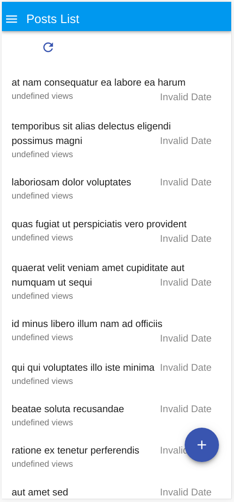
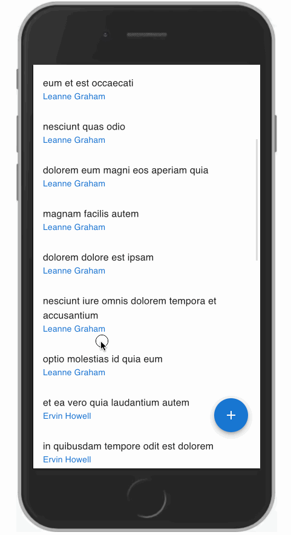

# React-Admin Tutorial

This 15 minutes tutorial will expose how to create a new admin app based on an existing REST API.

<video width="800" height="600" controls>
  <source src="http://static.marmelab.com/react-admin/react-admin.mp4" type="video/mp4">
Your browser does not support the video tag.
</video>

## Setting Up

React-admin uses React. We'll use Facebook's [create-react-app](https://github.com/facebookincubator/create-react-app) to create an empty React app, and install the `react-admin` package:

```sh
npm install -g create-react-app
create-react-app test-admin
cd test-admin/
yarn add react-admin
yarn start
```

You should be up and running with an empty React application on port 3000.

## Using an API As Data Source

React-admin runs in the browser, and uses APIs for fetching and storing data.

We'll be using [JSONPlaceholder](http://jsonplaceholder.typicode.com/), a fake REST API designed for testing and prototyping, as the datasource for the admin. Here is what it looks like:

```
curl http://jsonplaceholder.typicode.com/posts/12
```

```json
{
  "id": 12,
  "title": "in quibusdam tempore odit est dolorem",
  "body": "itaque id aut magnam\npraesentium quia et ea odit et ea voluptas et\nsapiente quia nihil amet occaecati quia id voluptatem\nincidunt ea est distinctio odio",
  "userId": 2
}
```

JSONPlaceholder provides endpoints for posts, comments, and users. The admin we'll build should allow to Create, Retrieve, Update, and Delete (CRUD) these resources.

## Making Contact With The API Using a Data Provider

Bootstrap the admin app by replacing the `src/App.js` by the following code:

```jsx
// in src/App.js
import React from 'react';
import { Admin, Resource } from 'react-admin';
import jsonServerProvider from 'ra-data-json-server';

const dataProvider = jsonServerProvider('http://jsonplaceholder.typicode.com');
const App = () => <Admin dataProvider={dataProvider} />;

export default App;
```

The `App` component now renders an `<Admin>` component, which is the root component of a react-admin application. This component expects a `dataProvider` prop - a function capable of fetching data from an API. Since there is no standard for data exchanges between computers, you will probably have to write a custom provider to connect react-admin to your own APIs - but we'll dive into Data Providers later. For now, let's take advantage of the `ra-data-json-server` data provider, which speaks the same REST dialect as JSONPlaceholder.

```sh
yarn add ra-data-json-server
```

That's enough for react-admin to run an empty app. Now it's time to add features!

## Mapping API Endpoints With Resources

The `<Admin>` component expects one or more `<Resource>` child components. Each resource maps a name to an endpoint in the API. Edit the `App.js` file to add a `posts` resource:

```jsx
// in src/App.js
import { PostList } from './posts';

const App = () => (
    <Admin dataProvider={dataProvider}>
        <Resource name="posts" list={PostList} />
    </Admin>
);
```

**Tip**: We'll define the `<PostList>` component in the next section.

The line `<Resource name="posts" />` informs react-admin to fetch the "posts" records from the [http://jsonplaceholder.typicode.com/posts](http://jsonplaceholder.typicode.com/posts) URL.


## Displaying A List Of Records

`<Resource>` also defines the React components to use for each CRUD operation (`list`, `create`, `edit`, and `show`). The `list={PostList}` prop means that react-admin should use the `<PostList>` component to display the list of posts. Create that component as follows:

```jsx
// in src/posts.js
import React from 'react';
import { List, Datagrid, TextField } from 'react-admin';

export const PostList = (props) => (
    <List {...props}>
        <Datagrid>
            <TextField source="id" />
            <TextField source="title" />
            <TextField source="body" />
        </Datagrid>
    </List>
);
```

The main component of the post list is a `<List>` component, responsible for grabbing the information from the API, displaying the page title, and handling pagination. This list then delegates the display of the actual list of posts to its child. In this case, that's a `<Datagrid>` component, which renders a table with one row for each record. The datagrid uses its child components (here, a list of `<TextField>`) to determine the columns to render. Each Field component maps a different field in the API response, specified by the `source` prop.

That's enough to display the post list:


If you look at your browser network tab in the developer tools, you'll notice that the application fetched the `http://jsonplaceholder.typicode.com/posts` URL, then used the results to build the datagrid. That's basically how react-admin works.

The list is already functional: you can reorder it by clicking on column headers, or change pages by using the bottom pagination controls. The `ra-data-json-server` data provider translates these actions to a query string that JSONPlaceholder understands.

## Using Field Types

You've just met the `<TextField>` component. React-admin provides more Field components, mapping various data types: number, date, image, HTML, array, reference, etc.

For instance, [the `/users` endpoint in JSONPlaceholder](http://jsonplaceholder.typicode.com/users) contains emails.

```
curl http://jsonplaceholder.typicode.com/users/2
```

```json
{
  "id": 2,
  "name": "Ervin Howell",
  "username": "Antonette",
  "email": "Shanna@melissa.tv",
}
```

Let's create a new `users` resource to fetch that endpoint. Add it in `src/App.js`:

```jsx
// in src/App.js
import { PostList } from './posts';
import { UserList } from './users';

const App = () => (
    <Admin dataProvider={dataProvider}>
        <Resource name="posts" list={PostList} />
        <Resource name="users" list={UserList} />
    </Admin>
);
```

Now, create a `users.js` file exporting a `UserList`, using `<EmailField>` to map the `email` field:

```jsx
// in src/users.js
import React from 'react';
import { List, Datagrid, EmailField, TextField } from 'react-admin';

export const UserList = (props) => (
    <List title="All users" {...props}>
        <Datagrid>
            <TextField source="id" />
            <TextField source="name" />
            <TextField source="username" />
            <EmailField source="email" />
        </Datagrid>
    </List>
);
```


The sidebar now gives access to the second resource, "users". You can click on it, it's working! The users list shows email addresses as a `<a href="mailto:">` tags.

In react-admin, fields are simple React components. At runtime, they receive the `record` fetched from the API (e.g. `{ "id": 2, "name": "Ervin Howell", "username": "Antonette", "email": "Shanna@melissa.tv" }`), and the `source` field they should display (e.g. `email`).

That means that writing a custom Field component is really simple. For instance, to create an `UrlField`:

```jsx
// in src/MyUrlField.js
import React from 'react';
import PropTypes from 'prop-types';

const UrlField = ({ record = {}, source }) =>
    <a href={record[source]}>
        {record[source]}
    </a>;

UrlField.propTypes = {
    record: PropTypes.object,
    source: PropTypes.string.isRequired,
};

export default UrlField;
```

## Handling Relationships

In JSONPlaceholder, each `post` record includes a `userId` field, which points to a `user`:

```json
{
    "id": 1,
    "title": "sunt aut facere repellat provident occaecati excepturi optio reprehenderit",
    "body": "quia et suscipit\nsuscipit recusandae consequuntur expedita et cum\nreprehenderit molestiae ut ut quas totam\nnostrum rerum est autem sunt rem eveniet architecto",
    "userId": 1
}
```

React-admin knows how to take advantage of these foreign keys to fetch references. For instance, to include the user name in the posts list, use the `<ReferenceField>`:

```jsx
// in src/posts.js
import React from 'react';
import { List, Datagrid, TextField, EmailField, ReferenceField } from 'react-admin';

export const PostList = (props) => (
    <List {...props}>
        <Datagrid>
            <TextField source="id" />
            <ReferenceField label="User" source="userId" reference="users">
                <TextField source="name" />
            </ReferenceField>
            <TextField source="title" />
            <TextField source="body" />
        </Datagrid>
    </List>
);
```

When displaying the posts list, the app now fetches related user records, and displays their `name` as a `<TextField>`. Notice the `label` property: you can use it on any field component to customize the field label.


**Tip**: The `<ReferenceField>` component alone doesn't display anything. It just fetches the reference data, and passes it as a `record` to its child component. Just like the `<List>` component, all `<Reference>` components are only responsible for fetching and preparing data, and delegate rendering to their children.

**Tip**: Look at the network tab of your browser again: admin-on-rest deduplicates requests for users, and aggregates them in order to make only *one* HTTP request to the `/users` endpoint for the whole datagrid. That's one of many optimizations that keep the UI fast and responsive.

## Adding Creation and Editing Capabilities

An admin interface isn't just about displaying remote data, it should also allow creating and editing records. React-admin provides `<Create>` and `<Edit>` components for that purpose. Add them to the `posts.js` script:

```jsx
// in src/posts.js
import React from 'react';
import { List, Edit, Create, Datagrid, ReferenceField, TextField, EditButton, DisabledInput, LongTextInput, ReferenceInput, SelectInput, SimpleForm, TextInput } from 'react-admin';

export const PostList = (props) => (
    <List {...props}>
        <Datagrid>
            <TextField source="id" />
            <ReferenceField label="User" source="userId" reference="users">
                <TextField source="name" />
            </ReferenceField>
            <TextField source="title" />
            <TextField source="body" />
            <EditButton />
        </Datagrid>
    </List>
);

const PostTitle = ({ record }) => {
    return <span>Post {record ? `"${record.title}"` : ''}</span>;
};

export const PostEdit = (props) => (
    <Edit title={<PostTitle />} {...props}>
        <SimpleForm>
            <DisabledInput source="id" />
            <ReferenceInput label="User" source="userId" reference="users">
                <SelectInput optionText="name" />
            </ReferenceInput>
            <TextInput source="title" />
            <LongTextInput source="body" />
        </SimpleForm>
    </Edit>
);

export const PostCreate = (props) => (
    <Create {...props}>
        <SimpleForm>
            <ReferenceInput label="User" source="userId" reference="users">
                <SelectInput optionText="name" />
            </ReferenceInput>
            <TextInput source="title" />
            <LongTextInput source="body" />
        </SimpleForm>
    </Create>
);
```

If you've understood the `<List>` component, the `<Edit>` and `<Create>` components will be no surprise. They are responsible for fetching the record (or initializing an empty record in the case of `<Create>`), and displaying the page title. They pass the record down to the `<SimpleForm>` component, which is responsible for the form layout, default values, and validation. Just like `<Datagrid>`, `<SimpleForm>` uses its children to determine the form inputs to display. It expects *input components* as children. `<DisabledInput>`, `<TextInput>`, `<LongTextInput>`, and `<ReferenceInput>` are such inputs.

As for the `<ReferenceInput>`, it takes the same props as the `<ReferenceField>` (used earlier in the list page). `<ReferenceInput>` uses these props to fetch the API for possible references related to the current record (in this case, possible `users` for the current `post`). It then passes these possible references to the child component (`<SelectInput>`), which is responsible for displaying them (via their `name` in that case), and letting the user select one. `<SelectInput>` renders as a `<select>` tag in HTML.

**Tip**: The `<Edit>` and the `<Create>` components use almost the same child form, except for the additional `id` input in `<Edit>`. In most cases, the forms for creating and editing a record are a bit different. But if they are the same, you can share a common form component between the two.

Notice the additional `<EditButton>` field in the `<PostList>` children: that's what gives access to the post editing page. Also, the `<Edit>` component uses a custom `<PostTitle>` component as title, which shows the way to customize the title for a given page.

To use the new `<PostEdit>` and `<PostCreate>` components in the posts resource, just add them as `edit` and `create` attributes in the `<Resource>` component:

```jsx
// in src/App.js
import { PostList, PostEdit, PostCreate } from './posts';
import { UserList } from './users';

const App = () => (
    <Admin dataProvider={dataProvider}>
        <Resource name="posts" list={PostList} edit={PostEdit} create={PostCreate} />
        // ...
    </Admin>
);
```

React-admin automatically adds a "create" button on top of the posts list to give access to the `<PostCreate>` component. And the `<EditButton>` renders in each line of the list to give access to the `<PostEdit>` component.


The form rendered in the create and edit pages is already functional. It issues `POST` and `PUT` requests to the REST API upon submission.


**Note**: JSONPlaceholder is a read-only API; although it seems to accept `POST` and `PUT` requests, it doesn't take into account the creations and edits - that's why, in this particular case, you will see errors after creation, and you won't see your edits after you save them. It's just an artifact of JSONPlaceholder.

React-admin uses *optimistic rendering*. That means that, when you edit a record and hit the "Save" button, the UI displays a confirmation and displays the updated data *before sending the update query to server*. Not only does this make the interface ultra fast, it also allows the "Undo" feature. It's already functional in the admin at that point. Try editing a record, then hit the "Undo" link in the black confirmation bar before it slides out. You'll see that the app does not send the `UPDATE` query to the API, and displays the non-modified data.

**Note**: When you add the ability to edit an item, you also add the ability to delete it. The "Delete" button in the edit view is fully working out of the box.

## Adding Search And Filters To The List

Let's get back to the post list for a minute. It offers sorting and pagination, but one feature is missing: the ability to search content.

React-admin can use Input components to create a multi-criteria search engine in the list view. First, create a `<Filter>` component just like you would write a `<SimpleForm>` component, using input components as children. Then, add it to the list using the `filters` prop:

```jsx
// in src/posts.js
import { Filter, ReferenceInput, SelectInput, TextInput } from 'react-admin';

const PostFilter = (props) => (
    <Filter {...props}>
        <TextInput label="Search" source="q" alwaysOn />
        <ReferenceInput label="User" source="userId" reference="users" allowEmpty>
            <SelectInput optionText="name" />
        </ReferenceInput>
    </Filter>
);

export const PostList = (props) => (
    <List {...props} filters={<PostFilter />}>
        // ...
    </List>
);
```

The first filter, 'q', takes advantage of a full-text functionality offered by JSONPlaceholder. It is `alwaysOn`, so it always appears on the screen. The second filter, 'userId', can be added by way of the "add filter" button, located on the top of the list. As it's a `<ReferenceInput>`, it's already populated with possible users. It can be turned off by the end user.


Filters are "search-as-you-type", meaning that when the user enters new values in the filter form, the list refreshes (via an API request) immediately.

## Customizing the Menu Icons

The sidebar menu shows the same icon for both posts and users. Customizing the menu icon is just a matter of passing an `icon` attribute to each `<Resource>`:

```jsx
// in src/App.js
import PostIcon from '@material-ui/icons/Book';
import UserIcon from '@material-ui/icons/Group';

const App = () => (
    <Admin dataProvider={dataProvider}>
        <Resource name="posts" list={PostList} edit={PostEdit} create={PostCreate} icon={PostIcon} />
        <Resource name="users" list={UserList} icon={UserIcon} />
    </Admin>
);
```


## Using a Custom Home Page

By default, react-admin displays the list page of the first resource as home page. If you want to display a custom component instead, pass it in the `dashboard` prop of the `<Admin>` component.

```jsx
// in src/Dashboard.js
import React from 'react';
import Card, { CardHeader, CardContent } from 'material-ui/Card';

export default () => (
    <Card>
        <CardHeader title="Welcome to the administration" />
        <CardContent>Lorem ipsum sic dolor amet...</CardContent>
    </Card>
);
```

```jsx
// in src/App.js
import Dashboard from './Dashboard';

const App = () => (
    <Admin dashboard={Dashboard} dataProvider={dataProvider}>
        // ...
    </Admin>
);
```


## Adding a Login Page

Most admin apps require authentication. React-admin can check user credentials before displaying a page, and redirect to a login form when the REST API returns a 403 error code.

*What* those credentials are, and *how* to get them, are questions that you, as a developer, must answer. React-admin makes no assumption about your authentication strategy (basic auth, OAuth, custom route, etc), but gives you the hooks to plug your logic at the right place - by calling an `authProvider` function.

For this tutorial, since there is no public authentication API we can use, let's use a fake authentication provider that accepts every login request, and stores the `username` in `localStorage`. Each page change will require that `localStorage` contains a `username` item.

The `authProvider` is a simple function, which must return a `Promise`:

```jsx
// in src/authProvider.js
import { AUTH_LOGIN, AUTH_LOGOUT, AUTH_ERROR, AUTH_CHECK } from 'react-admin';

export default (type, params) => {
    // called when the user attempts to log in
    if (type === AUTH_LOGIN) {
        const { username } = params;
        localStorage.setItem('username', username);
        // accept all username/password combinations
        return Promise.resolve();
    }
    // called when the user clicks on the logout button
    if (type === AUTH_LOGOUT) {
        localStorage.removeItem('username');
        return Promise.resolve();
    }
    // called when the API returns an error
    if (type === AUTH_ERROR) {
        const { status } = params;
        if (status === 401 || status === 403) {
            localStorage.removeItem('username');
            return Promise.reject();
        }
        return Promise.resolve();
    }
    // called when the user navigates to a new location
    if (type === AUTH_CHECK) {
        return localStorage.getItem('username')
            ? Promise.resolve()
            : Promise.reject();
    }
    return Promise.reject('Unknown method');
};
```

**Tip**: As the `dataProvider` response is asynchronous, you can easily fetch an authentication server in there.

To enable this authentication strategy, pass the client as the `authProvider` prop in the `<Admin>` component:

```jsx
// in src/App.js
import Dashboard from './Dashboard';
import authProvider from './authProvider';

const App = () => (
    <Admin dashboard={Dashboard} authProvider={authProvider} dataProvider={dataProvider}>
        // ...
    </Admin>
);
```

Once the app reloads, it's now behind a login form that accepts everyone:


## Supporting Mobile Devices

The react-admin layout is already responsive. Try to resize your browser to see how the sidebar switches to a drawer on smaller screens.

But a responsive layout is not enough to make a responsive app. Datagrid components work well on desktop, but are absolutely not adapted to mobile devices. If your admin must be used on mobile devices, you'll have to provide an alternative component for small screens.

First, you should know that you don't have to use the `<Datagrid>` component as `<List>` child. You can use any other component you like. For instance, the `<SimpleList>` component:

```jsx
// in src/posts.js
import React from 'react';
import { List, SimpleList } from 'react-admin';

export const PostList = (props) => (
    <List {...props}>
        <SimpleList
            primaryText={record => record.title}
            secondaryText={record => `${record.views} views`}
            tertiaryText={record => new Date(record.published_at).toLocaleDateString()}
        />
    </List>
);
```

The `<SimpleList>` component uses [material-ui's `<List>` and `<ListItem>` components](http://www.material-ui.com/#/components/list), and expects functions as `primaryText`, `secondaryText`, and `tertiaryText` props.



**Note:** We switched to a custom API for those screenshots in order to demonstrate how to use some of the `SimpleList` component props.

That works fine on mobile, but now the desktop user experience is worse. The best compromise would be to use `<SimpleList>` on small screens, and `<Datagrid>` on other screens. That's where the `<Responsive>` component comes in:

```jsx
// in src/posts.js
import React from 'react';
import { List, Responsive, SimpleList, Datagrid, TextField, ReferenceField, EditButton } from 'react-admin';

export const PostList = (props) => (
    <List {...props}>
        <Responsive
            small={
                <SimpleList
                    primaryText={record => record.title}
                    secondaryText={record => `${record.views} views`}
                    tertiaryText={record => new Date(record.published_at).toLocaleDateString()}
                />
            }
            medium={
                <Datagrid>
                    <TextField source="id" />
                    <ReferenceField label="User" source="userId" reference="users">
                        <TextField source="name" />
                    </ReferenceField>
                    <TextField source="title" />
                    <TextField source="body" />
                    <EditButton />
                </Datagrid>
            }
        />
    </List>
);
```

This works exactly the way you expect. The lesson here is that react-admin takes care of responsive web design for the layout, but it's your job to use `<Responsive>` in pages.



## Connecting To A Real API

Here is the elephant in the room of this tutorial. In real world projects, the dialect of your API (REST? GraphQL? Something else?) won't match the JSONPLaceholder dialect. Writing a Data Provider is probably the first thing you'll have to do to make react-admin work. Depending on your API, this can require a few hours of additional work.

React-admin delegates every data query to a Data Provider function. This function must simply return a promise for the result. This gives extreme freedom to map any API dialect, add authentication headers, use endpoints from several domains, etc.

For instance, let's imagine you have to use the `my.api.url` REST API, which expects the following parameters:

| Action              | Expected API request |
|---------------------|---------------------- |
| Get list            | `GET http://my.api.url/posts?sort=['title','ASC']&range=[0, 24]&filter={title:'bar'}` |
| Get one record      | `GET http://my.api.url/posts/123` |
| Get several records | `GET http://my.api.url/posts?filter={ids:[123,456,789]}` |
| Update a record     | `PUT http://my.api.url/posts/123` |
| Create a record     | `POST http://my.api.url/posts/123` |
| Delete a record     | `DELETE http://my.api.url/posts/123` |

React-admin defines custom verbs for each of the actions of this list. Just like HTTP verbs (`GET`, `POST`, etc.), react-admin verbs qualify a request to a data provider. React-admin verbs are called `GET_LIST`, `GET_ONE`, `GET_MANY`, `CREATE`, `UPDATE`, and `DELETE`. The Data Provider will have to map each of these verbs to one (or many) HTTP request(s).

The code for a Data Provider for the `my.api.url` API is as follows:

```jsx
// in src/dataProvider
import {
    GET_LIST,
    GET_ONE,
    GET_MANY,
    GET_MANY_REFERENCE,
    CREATE,
    UPDATE,
    DELETE,
    fetchUtils,
} from 'react-admin';
import { stringify } from 'query-string';

const API_URL = 'my.api.url';

/**
 * @param {String} type One of the constants appearing at the top if this file, e.g. 'UPDATE'
 * @param {String} resource Name of the resource to fetch, e.g. 'posts'
 * @param {Object} params The Data Provider request params, depending on the type
 * @returns {Object} { url, options } The HTTP request parameters
 */
const convertDataProviderRequestToHTTP = (type, resource, params) => {
    switch (type) {
    case GET_LIST: {
        const { page, perPage } = params.pagination;
        const { field, order } = params.sort;
        const query = {
            sort: JSON.stringify([field, order]),
            range: JSON.stringify([(page - 1) * perPage, page * perPage - 1]),
            filter: JSON.stringify(params.filter),
        };
        return { url: `${API_URL}/${resource}?${stringify(query)}` };
    }
    case GET_ONE:
        return { url: `${API_URL}/${resource}/${params.id}` };
    case GET_MANY: {
        const query = {
            filter: JSON.stringify({ id: params.ids }),
        };
        return { url: `${API_URL}/${resource}?${stringify(query)}` };
    }
    case GET_MANY_REFERENCE: {
        const { page, perPage } = params.pagination;
        const { field, order } = params.sort;
        const query = {
            sort: JSON.stringify([field, order]),
            range: JSON.stringify([(page - 1) * perPage, (page * perPage) - 1]),
            filter: JSON.stringify({ ...params.filter, [params.target]: params.id }),
        };
        return { url: `${API_URL}/${resource}?${stringify(query)}` };
    }
    case UPDATE:
        return {
            url: `${API_URL}/${resource}/${params.id}`,
            options: { method: 'PUT', body: JSON.stringify(params.data) },
        };
    case CREATE:
        return {
            url: `${API_URL}/${resource}`,
            options: { method: 'POST', body: JSON.stringify(params.data) },
        };
    case DELETE:
        return {
            url: `${API_URL}/${resource}/${params.id}`,
            options: { method: 'DELETE' },
        };
    default:
        throw new Error(`Unsupported fetch action type ${type}`);
    }
};

/**
 * @param {Object} response HTTP response from fetch()
 * @param {String} type One of the constants appearing at the top if this file, e.g. 'UPDATE'
 * @param {String} resource Name of the resource to fetch, e.g. 'posts'
 * @param {Object} params The Data Provider request params, depending on the type
 * @returns {Object} Data Provider response
 */
const convertHTTPResponseToDataProvider = (response, type, resource, params) => {
    const { headers, json } = response;
    switch (type) {
    case GET_LIST:
        return {
            data: json.map(x => x),
            total: parseInt(headers.get('content-range').split('/').pop(), 10),
        };
    case CREATE:
        return { data: { ...params.data, id: json.id } };
    default:
        return { data: json };
    }
};

/**
 * @param {string} type Request type, e.g GET_LIST
 * @param {string} resource Resource name, e.g. "posts"
 * @param {Object} payload Request parameters. Depends on the request type
 * @returns {Promise} the Promise for response
 */
export default (type, resource, params) => {
    const { fetchJson } = fetchUtils;
    const { url, options } = convertDataProviderRequestToHTTP(type, resource, params);
    return fetchJson(url, options)
        .then(response => convertHTTPResponseToDataProvider(response, type, resource, params));
};
```

**Tip**: `fetchJson()` is just a shortcut for `fetch().then(r => r.json())`, plus a control of the HTTP response code to throw an `HTTPError` in case of 4xx or 5xx response. Feel free to use `fetch()` directly if it doesn't suit your needs.

Using this provider instead of the previous `jsonServerProvider` is just a matter of switching a function:

```jsx
// in src/app.js
import dataProvider from './dataProvider';

const App = () => (
    <Admin dataProvider={dataProvider}>
        // ...
    </Admin>
);
```

## Conclusion

React-admin was built with customization in mind. You can replace any react-admin component with a component of your own, for instance to display a custom list layout, or a different edit form for a given resource.

Now that you've completed the tutorial, continue reading the [react-admin documentation](http://marmelab.com/react-admin/), and read the [Material UI components documentation](http://www.material-ui.com/#/).
