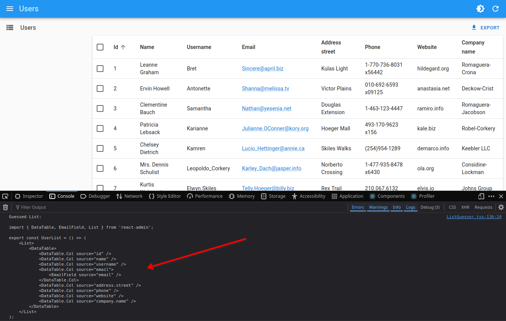
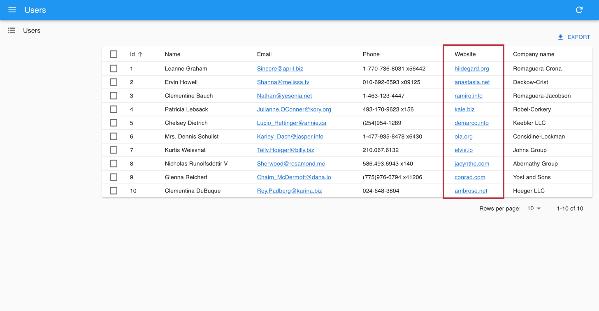
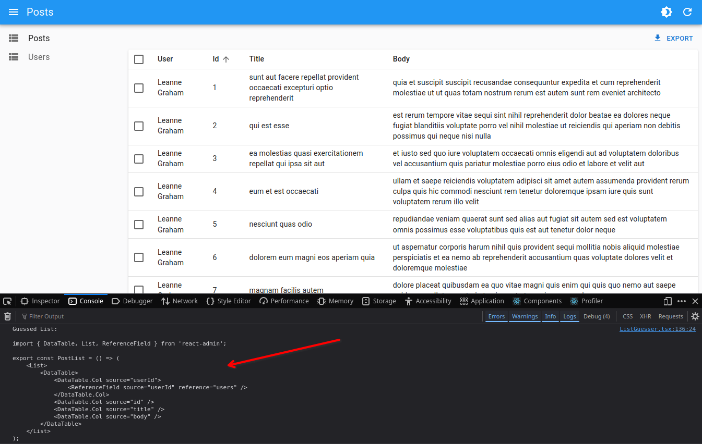

# React-Admin Tutorial

In this 30-minute tutorial, you will learn how to create a new admin app based on an existing REST API.

Here is a preview of the final result:

<video controls autoplay playsinline muted loop poster="./img/tutorial_overview.png">
  <source src="./img/tutorial_overview.mp4" type="video/mp4"/>
  Your browser does not support the video tag.
</video>

## Setting Up

React-admin is built on React. To start, we'll use [create-react-admin](./CreateReactAdmin.md) to bootstrap a new web application:

```sh
npm init react-admin test-admin
# or
yarn create react-admin test-admin
```

When prompted, choose **JSON Server** as the data provider, then **None** as the auth provider. Do not add any resources for now and press **Enter**. Next, choose either `npm` or `yarn` and press **Enter**. Once everything is installed, run the following commands:

```sh
cd test-admin
npm run dev
# or
yarn dev
```

You should now see an empty React-admin application running on port 5173:

[](./img/tutorial_empty.png)

**Tip**: The `create-react-admin` script creates a single-page application powered by [Vite](https://vitejs.dev/) and [TypeScript](https://www.typescriptlang.org/). You can also use JavaScript if you prefer. Additionally, react-admin works with [Next.js](./NextJs.md), [Remix](./Remix.md), or any other React framework. React-admin is framework-agnostic.

Let’s explore the generated code. The main entry point is `index.tsx`, which renders the `App` component into the DOM:

```tsx
// in src/index.tsx
import React from 'react';
import ReactDOM from 'react-dom/client';
import { App } from './App';

ReactDOM.createRoot(document.getElementById('root')!).render(
    <React.StrictMode>
        <App />
    </React.StrictMode>
);
```

The `<App>` component renders the [`<Admin>`](./Admin.md) component, which serves as the root of a react-admin application:

```tsx
// in src/App.tsx
import { Admin, Resource, ListGuesser, EditGuesser, ShowGuesser } from 'react-admin';
import { dataProvider } from './dataProvider';

export const App = () => (
    <Admin dataProvider={dataProvider}>

    </Admin>
);
```

Right now, this component only defines a `dataProvider` prop. But what exactly is a data provider?

## Using an API as the Data Source

React-admin apps are single-page applications (SPAs) that run in the browser and fetch data from an API. Since there is no single standard for data exchanges between systems, react-admin uses an adapter to communicate with your API—this adapter is called a [*Data Provider*](./DataProviders.md).

For this tutorial, we’ll use [JSONPlaceholder](https://jsonplaceholder.typicode.com/), a fake REST API designed for prototyping and testing. Here is a sample response:

```sh
curl https://jsonplaceholder.typicode.com/users/2
```

```json
{
  "id": 2,
  "name": "Ervin Howell",
  "username": "Antonette",
  "email": "Shanna@melissa.tv",
  "address": {
    "street": "Victor Plains",
    "suite": "Suite 879",
    "city": "Wisokyburgh",
    "zipcode": "90566-7771",
    "geo": {
      "lat": "-43.9509",
      "lng": "-34.4618"
    }
  },
  "phone": "010-692-6593 x09125",
  "website": "anastasia.net",
  "company": {
    "name": "Deckow-Crist",
    "catchPhrase": "Proactive didactic contingency",
    "bs": "synergize scalable supply-chains"
  }
}
```

JSONPlaceholder provides endpoints for users, posts, and comments. The admin app we’ll build will allow you to Create, Retrieve, Update, and Delete (CRUD) these resources.

The `test-admin` project you created already contains a pre-configured data provider for JSONPlaceholder:

```tsx
// in src/dataProvider.ts
import jsonServerProvider from 'ra-data-json-server';

export const dataProvider = jsonServerProvider(
    import.meta.env.VITE_JSON_SERVER_URL
);
```

This uses a third-party package, `ra-data-json-server`, which maps the JSONPlaceholder API to the react-admin CRUD API. There are [dozens of data provider packages](./DataProviderList.md) for various APIs and databases. You can also create your own if necessary. For now, let’s make sure the app connects to JSONPlaceholder.

**Tip**: The `import.meta.env.VITE_JSON_SERVER_URL` expression is a [Vite environment variable](https://vitejs.dev/guide/env-and-mode.html), which is set to `https://jsonplaceholder.typicode.com` in the `.env` file located at the project root.

## Mapping API Endpoints with Resources

Next, let’s add a list of users.

The `<Admin>` component expects one or more [`<Resource>`](./Resource.md) child components. Each resource maps a name to an API endpoint. To add a resource named `users`, edit the `App.tsx` file as follows:

```diff
// in src/App.tsx
import { Admin, Resource, ListGuesser, EditGuesser, ShowGuesser } from 'react-admin';
import { dataProvider } from './dataProvider';

export const App = () => (
  <Admin dataProvider={dataProvider}>
+   <Resource name="users" list={ListGuesser} />
  </Admin>
);
```

The `<Resource name="users" />` line instructs react-admin to fetch "users" from the [https://jsonplaceholder.typicode.com/users](https://jsonplaceholder.typicode.com/users) URL. The `<Resource>` component also defines which React components to use for each CRUD operation (`list`, `create`, `edit`, and `show`).

`list={ListGuesser}` tells react-admin to use the [`<ListGuesser>`](./ListGuesser.md) component to display the list of users. This component *guesses* the configuration for the list, including column names and types, based on the data fetched from the API.

Now, your app can display a list of users:

[](./img/tutorial_users_list.png)

The list is already functional: you can sort it by clicking on the column headers or navigate through pages using the pagination controls. If you open the network tab in your browser’s developer tools, you’ll see that every user action on the list triggers a corresponding HTTP request to `https://jsonplaceholder.typicode.com/users` with updated parameters. The data provider handles these requests, translating user actions into API calls that the backend understands.

## Writing a Page Component

The `<ListGuesser>` component isn't meant for production use—it's just there to help you quickly set up an admin interface. Eventually, you'll need to replace the `ListGuesser` in the `users` resource with a custom React component. Fortunately, `ListGuesser` provides the guessed list code right in the console:

[](./img/tutorial_guessed_list.png)

Copy this code and create a new `UserList` component in a new file called `users.tsx`:

```tsx
// in src/users.tsx
import { List, Datagrid, TextField, EmailField } from "react-admin";

export const UserList = () => (
    <List>
        <Datagrid>
            <TextField source="id" />
            <TextField source="name" />
            <TextField source="username" />
            <EmailField source="email" />
            <TextField source="address.street" />
            <TextField source="phone" />
            <TextField source="website" />
            <TextField source="company.name" />
        </Datagrid>
    </List>
);
```

Next, update `App.tsx` to use this new component instead of `ListGuesser`:

```diff
// in src/App.tsx
-import { Admin, Resource, ListGuesser, EditGuesser, ShowGuesser } from 'react-admin';
+import { Admin, Resource } from "react-admin";
import { dataProvider } from './dataProvider';
+import { UserList } from "./users";

export const App = () => (
  <Admin dataProvider={dataProvider}>
-   <Resource name="users" list={ListGuesser} />
+   <Resource name="users" list={UserList} />
  </Admin>
);
```

[](./img/tutorial_users_list.png)

Visually, nothing changes in the browser, but now the app uses a component that you can fully customize.

## Composing Components

Let's take a closer look at the `<UserList>` component:

```tsx
export const UserList = () => (
    <List>
        <Datagrid>
            <TextField source="id" />
            <TextField source="name" />
            <TextField source="username" />
            <EmailField source="email" />
            <TextField source="address.street" />
            <TextField source="phone" />
            <TextField source="website" />
            <TextField source="company.name" />
        </Datagrid>
    </List>
);
```

The root component, [`<List>`](./List.md), reads the query parameters, fetches data from the API, and places the data in a React context. It also provides callbacks for filtering, pagination, and sorting, allowing child components to access and modify the list parameters. `<List>` performs many tasks, but its syntax remains straightforward:

```tsx
<List>
   {/* children */}
</List>
```

This demonstrates the goal of react-admin: helping developers build sophisticated applications with simple syntax.

In most frameworks, "simple" often implies limited capabilities, making it challenging to extend beyond basic features. React-admin addresses this through *composition*. `<List>` handles data fetching, while rendering is delegated to its child—in this case, [`<Datagrid>`](./Datagrid.md).  Essentially, the code composes the functionalities of `<List>` and `<Datagrid>` functionalities.

This means we can compose `<List>` with another component - for instance [`<SimpleList>`](./SimpleList.md):

```tsx
// in src/users.tsx
import { List, SimpleList } from "react-admin";

export const UserList = () => (
    <List>
        <SimpleList
          primaryText={(record) => record.name}
          secondaryText={(record) => record.username}
          tertiaryText={(record) => record.email}
        />
    </List>
);
```

`<SimpleList>` uses [Material UI's `<List>` and `<ListItem>` components](https://mui.com/material-ui/react-list/) and expects functions for `primaryText`, `secondaryText`, and `tertiaryText` props.

Refresh the page, and you'll see the list rendered differently:

[](./img/tutorial_simple_list.webp)

React-admin offers a wide range of components to help you build your UI. You can also create your own components if needed.

## Writing a Custom List Component

React-admin's layout is responsive by default. Try resizing your browser, and you'll notice the sidebar turns into a drawer on smaller screens. The `<SimpleList>` component works well for mobile devices.

<video controls autoplay playsinline muted loop>
  <source src="./img/tutorial_mobile_user_list.webm" type="video/webm"/>
  <source src="./img/tutorial_mobile_user_list.mp4" type="video/mp4"/>
  Your browser does not support the video tag.
</video>

However, `<SimpleList>` has low information density on desktop. Let's modify `<UserList>` to use `<Datagrid>` on larger screens and `<SimpleList>` on smaller screens. We can achieve this using [Material UI's `useMediaQuery` hook](https://mui.com/material-ui/react-use-media-query/):

```tsx
// in src/users.tsx
import { useMediaQuery, Theme } from "@mui/material";
import { List, SimpleList, Datagrid, TextField, EmailField } from "react-admin";

export const UserList = () => {
    const isSmall = useMediaQuery<Theme>((theme) => theme.breakpoints.down("sm"));
    return (
        <List>
            {isSmall ? (
                <SimpleList
                    primaryText={(record) => record.name}
                    secondaryText={(record) => record.username}
                    tertiaryText={(record) => record.email}
                />
            ) : (
                <Datagrid>
                    <TextField source="id" />
                    <TextField source="name" />
                    <TextField source="username" />
                    <EmailField source="email" />
                    <TextField source="address.street" />
                    <TextField source="phone" />
                    <TextField source="website" />
                    <TextField source="company.name" />
                </Datagrid>
            )}
        </List>
    );
};
```

This works exactly as you'd expect.

<video controls autoplay playsinline muted loop>
  <source src="./img/tutorial_user_list_responsive.webm" type="video/webm"/>
  <source src="./img/tutorial_user_list_responsive.mp4" type="video/mp4"/>
  Your browser does not support the video tag.
</video>

The `<List>` component's child can be anything—even a custom component with its own logic. This flexibility makes react-admin ideal for building responsive apps.

## Selecting Columns

Let's get back to `<Datagrid>`. It reads the data fetched by `<List>`, then renders a table with one row for each record. `<Datagrid>` uses its child components (here, a list of [Field component](./Fields.md)) to render the columns. Each Field component renders one field of the current record, specified by the `source` prop.

`<ListGuesser>` created one column for every field in the API response. That's a bit too much for a usable grid, so let's remove a couple of `<TextField>` components from the Datagrid and see the effect:

```diff
// in src/users.tsx
  <Datagrid>
    <TextField source="id" />
    <TextField source="name" />
-   <TextField source="username" />
    <EmailField source="email" />
-   <TextField source="address.street" />
    <TextField source="phone" />
    <TextField source="website" />
    <TextField source="company.name" />
  </Datagrid>
```

[](./img/tutorial_users_list_selected_columns.png)

In react-admin, most configuration is done through components. Instead of using a `columns` prop for configuration, react-admin leverages the `children` prop for flexibility, enabling you to add custom logic or change column types as needed.

## Using Field Types

So far, you've used [`<TextField>`](./TextField.md) and [`<EmailField>`](./EmailField.md). React-admin provides [many more Field components](./Fields.md) to handle different data types—numbers, dates, images, arrays, and more.

For instance, instead of displaying the `website` field as plain text, you could make it a clickable link using [`<UrlField>`](./UrlField.md):

```diff
// in src/users.tsx
-import { List, SimpleList, Datagrid, TextField, EmailField } from "react-admin";
+import { List, SimpleList, Datagrid, TextField, EmailField, UrlField } from "react-admin";
// ...
  <Datagrid>
    <TextField source="id" />
    <TextField source="name" />
    <EmailField source="email" />
    <TextField source="phone" />
-   <TextField source="website" />
+   <UrlField source="website" />
    <TextField source="company.name" />
  </Datagrid>
```

[](./img/tutorial_url_field.png)

This is typical of the early stages of development with react-admin: use a guesser component to bootstrap the basic page, then adjust the code to better fit your business needs.

## Writing A Custom Field

In react-admin, fields are just React components. When rendered, they grab the `record` fetched from the API (e.g. `{ "id": 2, "name": "Ervin Howell", "website": "anastasia.net", ... }`) using a custom hook, and use the `source` prop (e.g. `website`) to get the value they should display (e.g. "anastasia.net").

That means you can do the same to [write a custom field](./Fields.md#writing-your-own-field-component). For instance, here is a simplified version of the `<UrlField>`:

```tsx
// in src/MyUrlField.tsx
import { useRecordContext } from "react-admin";

const MyUrlField = ({ source }: { source: string }) => {
    const record = useRecordContext();
    if (!record) return null;
    return <a href={`http://${record[source]}`}>{record[source]}</a>;
};

export default MyUrlField;
```

For each row, `<Datagrid>` creates a `RecordContext` and stores the current record in it. [`useRecordContext`](./useRecordContext.md) allows you to read that record. It's one of the 50+ headless hooks that react-admin exposes to let you build your own components without forcing a particular UI.

You can use the `<MyUrlField>` component in `<UserList>` instead of react-admin's `<UrlField>` component, and it will work just the same.

```diff
// in src/users.tsx
-import { List, SimpleList, Datagrid, TextField, EmailField, UrlField } from "react-admin";
+import { List, SimpleList, Datagrid, TextField, EmailField } from "react-admin";
+import MyUrlField from './MyUrlField';
// ...
  <Datagrid>
    <TextField source="id" />
    <TextField source="name" />
    <EmailField source="email" />
    <TextField source="phone" />
-   <UrlField source="website" />
+   <MyUrlField source="website" />
    <TextField source="company.name" />
  </Datagrid>
```

This means react-admin never blocks you: if one react-admin component doesn't perfectly suit your needs, you can just swap it with your own version.

## Customizing Styles

The `<MyUrlField>` component is a perfect opportunity to illustrate how to customize styles.

React-admin relies on [Material UI](https://mui.com/material-ui/getting-started/), a set of React components modeled after Google's [Material Design Guidelines](https://material.io/). All Material UI components (and most react-admin components) support a prop called [`sx`](./SX.md), which allows custom inline styles. Let's take advantage of the `sx` prop to remove the underline from the link and add an icon:


```tsx
// in src/MyUrlField.tsx
import { useRecordContext } from "react-admin";
import { Link } from "@mui/material";
import LaunchIcon from "@mui/icons-material/Launch";

const MyUrlField = ({ source }: { source: string }) => {
    const record = useRecordContext();
    return record ? (
        <Link href={record[source]} sx={{ textDecoration: "none" }}>
            {record[source]}
            <LaunchIcon sx={{ fontSize: 15, ml: 1 }} />
        </Link>
    ) : null;
};

export default MyUrlField;
```


[](./img/tutorial_custom_styles.png)

The `sx` prop is like React's `style` prop, except it supports theming, media queries, shorthand properties, and much more. It's a CSS-in-JS solution, so you'll have to use the JS variants of the CSS property names (e.g. `textDecoration` instead of `text-decoration`).

**Tip**: There is much more to Material UI styles than what this tutorial covers. Read the [Theming documentation](./Theming.md) to learn more about theming, vendor prefixes, responsive utilities, etc.

**Tip**: Material UI supports other CSS-in-JS solutions, including [Styled components](https://mui.com/system/styled/).

## Handling Relationships

In JSONPlaceholder, each `post` record includes a `userId` field, which points to a `user`:

```json
{
    "id": 1,
    "title": "sunt aut facere repellat provident occaecati excepturi optio reprehenderit",
    "body": "quia et suscipit\nsuscipit recusandae consequuntur expedita et cum\nreprehenderit molestiae ut ut quas totam\nnostrum rerum est autem sunt rem eveniet architecto",
    "userId": 1
}
```

React-admin knows how to take advantage of these foreign keys to fetch references. Let's see how the `ListGuesser` manages them by creating a new `<Resource>` for the `/posts` API endpoint:

```diff
// in src/App.tsx
-import { Admin, Resource } from "react-admin";
+import { Admin, Resource, ListGuesser } from "react-admin";
import { dataProvider } from './dataProvider';
import { UserList } from "./users";

export const App = () => (
  <Admin dataProvider={dataProvider}>
+   <Resource name="posts" list={ListGuesser} />
    <Resource name="users" list={UserList} />
  </Admin>
);
```

[](./img/tutorial_guessed_post_list.png)

The `ListGuesser` suggests using a [`<ReferenceField>`](./ReferenceField.md) for the `userId` field. Let's play with this new field by creating the `PostList` component based on the code dumped by the guesser:

```tsx
// in src/posts.tsx
import { List, Datagrid, TextField, ReferenceField } from "react-admin";

export const PostList = () => (
    <List>
        <Datagrid>
            <ReferenceField source="userId" reference="users" />
            <TextField source="id" />
            <TextField source="title" />
            <TextField source="body" />
        </Datagrid>
    </List>
);
```

```diff
// in src/App.tsx
-import { Admin, Resource, ListGuesser } from "react-admin";
+import { Admin, Resource } from "react-admin";
import { dataProvider } from './dataProvider';
+import { PostList } from "./posts";
import { UserList } from "./users";

export const App = () => (
    <Admin dataProvider={dataProvider}>
-       <Resource name="posts" list={ListGuesser} />
+       <Resource name="posts" list={PostList} />
        <Resource name="users" list={UserList} />
    </Admin>
);
```

When displaying the posts list, react-admin is smart enough to display the `name` of the post author:

[](./img/tutorial_list_user_name.png)

**Tip**: To customize how to represent a record, set [the `recordRepresentation` prop of the `<Resource>`](/Resource.md#recordrepresentation).

The `<ReferenceField>` component fetches the reference data, creates a `RecordContext` with the result, and renders the record representation (or its children).

**Tip**: Look at the network tab of your browser again: react-admin deduplicates requests for users and aggregates them in order to make only *one* HTTP request to the `/users` endpoint for the whole Datagrid. That's one of many optimizations that keep the UI fast and responsive.

To finish the post list, place the post `id` field as the first column, and remove the `body` field. From a UX point of view, fields containing large chunks of text should not appear in a Datagrid, only in detail views. Also, to make the Edit action stand out, let's replace the default `rowClick` action with an explicit action button:

```diff
// in src/posts.tsx
-import { List, Datagrid, TextField, ReferenceField } from "react-admin";
+import { List, Datagrid, TextField, ReferenceField, EditButton } from "react-admin";

export const PostList = () => (
  <List>
-   <Datagrid>
+   <Datagrid rowClick={false}>
+     <TextField source="id" />
      <ReferenceField source="userId" reference="users" />
-     <TextField source="id" />
      <TextField source="title" />
-     <TextField source="body" />
+     <EditButton />
    </Datagrid>
  </List>
);
```

[](./img/tutorial_post_list_less_columns.png)

## Adding A Detail View

So far, the admin only has list pages. Additionally, the user list doesn't render all columns, so you need to add a detail view to see all the user fields. The `<Resource>` component accepts a `show` component prop to define a detail view. Let's use the [`<ShowGuesser>`](./ShowGuesser.md) to help bootstrap it:

```diff
// in src/App.tsx
-import { Admin, Resource } from "react-admin";
+import { Admin, Resource, ShowGuesser } from "react-admin";
import { dataProvider } from './dataProvider';
import { PostList } from "./posts";
import { UserList } from "./users";

export const App = () => (
    <Admin dataProvider={dataProvider}>
        <Resource name="posts" list={PostList} />
-       <Resource name="users" list={UserList}  />
+       <Resource name="users" list={UserList} show={ShowGuesser}  />
    </Admin>
);
```

Now you can click on a user in the list to see their details:

<video controls autoplay playsinline muted loop>
  <source src="./img/tutorial_show_user.mp4" type="video/mp4"/>
  Your browser does not support the video tag.
</video>

Just like for other guessed components, you can customize the show view by copying the code dumped by the `<ShowGuesser>` and modifying it to suit your needs. This is out of scope for this tutorial, so we'll leave it as is.

Now that the `users` resource has a `show` view, you can also link to it from the post list view. To do this, edit the `<ReferenceField>` component to add `link="show"`, as follows:

```diff
// in src/posts.tsx
export const PostList = () => (
    <List>
        <Datagrid>
-           <ReferenceField source="userId" reference="users" />
+           <ReferenceField source="userId" reference="users" link="show" />
            <TextField source="id" />
            <TextField source="title" />
            <TextField source="body" />
        </Datagrid>
    </List>
);
```

[](./img/tutorial_list_user_name_link.png)

Reference components let users navigate from one resource to another naturally. They are a key feature of react-admin.

## Adding Editing Capabilities

An admin interface isn't just about displaying remote data; it should also allow editing records. React-admin provides an [`<Edit>`](./Edit.md) component for this purpose. Let's use the [`<EditGuesser>`](./EditGuesser.md) to help bootstrap it.

```diff
// in src/App.tsx
-import { Admin, Resource, ShowGuesser } from "react-admin";
+import { Admin, Resource, ShowGuesser, EditGuesser } from "react-admin";
import { dataProvider } from './dataProvider';
import { PostList } from "./posts";
import { UserList } from "./users";

export const App = () => (
    <Admin dataProvider={dataProvider}>
-       <Resource name="posts" list={PostList} />
+       <Resource name="posts" list={PostList} edit={EditGuesser} />
        <Resource name="users" list={UserList} show={ShowGuesser}  />
    </Admin>
);
```

<video controls autoplay playsinline muted loop>
  <source src="./img/tutorial_edit_guesser.webm" type="video/webm"/>
  <source src="./img/tutorial_edit_guesser.mp4" type="video/mp4"/>
  Your browser does not support the video tag.
</video>

Users can display the edit page just by clicking on the Edit button. The form is already functional; it issues `PUT` requests to the REST API upon submission. Thanks to the `recordRepresentation` of the "users" resource, the user name is displayed for the post author.

Copy the `<PostEdit>` code dumped by the guesser in the console to the `posts.tsx` file so that you can customize the view:

```tsx
// in src/posts.tsx
import {
    List,
    Datagrid,
    TextField,
    ReferenceField,
    EditButton,
    Edit,
    SimpleForm,
    ReferenceInput,
    TextInput,
} from "react-admin";

export const PostList = () => {
    /* ... */
};

export const PostEdit = () => (
    <Edit>
        <SimpleForm>
            <ReferenceInput source="userId" reference="users" />
            <TextInput source="id" />
            <TextInput source="title" />
            <TextInput source="body" />
        </SimpleForm>
    </Edit>
);
```

Use that component as the `edit` prop of the "posts" resource instead of the guesser:

```diff
// in src/App.tsx
-import { Admin, Resource, ShowGuesser, EditGuesser } from "react-admin";
+import { Admin, Resource, ShowGuesser } from "react-admin";
import { dataProvider } from './dataProvider';
-import { PostList } from "./posts";
+import { PostList, PostEdit } from "./posts";
import { UserList } from "./users";

export const App = () => (
  <Admin dataProvider={dataProvider}>
-   <Resource name="posts" list={PostList} edit={EditGuesser} />
+   <Resource name="posts" list={PostList} edit={PostEdit} />
    <Resource name="users" list={UserList} show={ShowGuesser}  />
  </Admin>
);
```

You can now adjust the `<PostEdit>` component to disable editing of the primary key (`id`), place it first, and use a textarea for the `body` field, as follows:


```diff
// in src/posts.tsx
export const PostEdit = () => (
  <Edit>
    <SimpleForm>
+     <TextInput source="id" InputProps={{ disabled: true }} />
      <ReferenceInput source="userId" reference="users" link="show" />
-     <TextInput source="id" />
      <TextInput source="title" />
-     <TextInput source="body" />
+     <TextInput source="body" multiline rows={5} />
    </SimpleForm>
  </Edit>
);
```


If you've understood the `<List>` component, the `<Edit>` component will be no surprise. It's responsible for fetching the record and displaying the page title. It passes the record down to the [`<SimpleForm>`](./SimpleForm.md) component, which is responsible for the form layout, default values, and validation. Just like `<Datagrid>`, `<SimpleForm>` uses its children to determine the form inputs to display. It expects [*input components*](./Inputs.md) as children. [`<TextInput>`](./TextInput.md) and [`<ReferenceInput>`](./ReferenceInput.md) are such inputs.

The `<ReferenceInput>` takes the same props as the `<ReferenceField>` (used earlier in the `<PostList>` page). `<ReferenceInput>` uses these props to fetch the API for possible references related to the current record (in this case, possible `users` for the current `post`). It then creates a context with the possible choices and renders an [`<AutocompleteInput>`](./AutocompleteInput.md), which is responsible for displaying the choices and letting the user select one.

## Adding Creation Capabilities

Let's allow users to create posts, too. Copy the `<PostEdit>` component into a `<PostCreate>`, and replace `<Edit>` with [`<Create>`](./Create.md):

```diff
// in src/posts.tsx
import {
    List,
    Datagrid,
    TextField,
    ReferenceField,
    EditButton,
    Edit,
+   Create,
    SimpleForm,
    ReferenceInput,
    TextInput,
} from "react-admin";

export const PostList = () => (
  { /* ... */ }
);

export const PostEdit = () => (
  { /* ... */ }
);

+export const PostCreate = () => (
+  <Create>
+    <SimpleForm>
+      <ReferenceInput source="userId" reference="users" />
+      <TextInput source="title" />
+      <TextInput source="body" multiline rows={5} />
+    </SimpleForm>
+  </Create>
+);
```

**Tip**: The `<PostEdit>` and the `<PostCreate>` components use almost the same child form, except for the additional `id` input in `<PostEdit>`. In most cases, the forms for creating and editing a record are a bit different, because most APIs create primary keys server-side. But if the forms are the same, you can share a common form component in `<PostEdit>` and `<PostCreate>`.

To use the new `<PostCreate>` component in the posts resource, just add it as the `create` attribute in the `<Resource name="posts">` component:

```diff
// in src/App.tsx
import { Admin, Resource, ShowGuesser } from "react-admin";
import { dataProvider } from './dataProvider';
-import { PostList, PostEdit } from "./posts";
+import { PostList, PostEdit, PostCreate } from "./posts";
import { UserList } from "./users";

export const App = () => (
  <Admin dataProvider={dataProvider}>
-   <Resource name="posts" list={PostList} edit={PostEdit} />
+   <Resource name="posts" list={PostList} edit={PostEdit} create={PostCreate} />
    <Resource name="users" list={UserList} show={ShowGuesser}  />
  </Admin>
);
```

<video controls autoplay playsinline muted loop>
  <source src="./img/tutorial_post_create.webm" type="video/webm"/>
  <source src="./img/tutorial_post_create.mp4" type="video/mp4"/>
  Your browser does not support the video tag.
</video>

React-admin automatically adds a "create" button on top of the posts list to give access to the `create` component. And the creation form works; it issues a `POST` request to the REST API upon submission.

## Optimistic Rendering And Undo

Unfortunately, JSONPlaceholder is a read-only API; although it seems to accept `POST` and `PUT` requests, it doesn't take into account the creations and edits - that's why, in this particular case, you will see errors after creation, and you won't see your edits after you save them. It's just an artifact of JSONPlaceholder.

But then, how come the newly created post appears in the list just after creation in the screencast above?

That's because react-admin uses *optimistic updates*. When a user edits a record and hits the "Save" button, the UI shows a confirmation and displays the updated data *before sending the update query to the server*. The main benefit is that UI changes are immediate—no need to wait for the server response. It's a great comfort for users.

But there is an additional benefit: it also allows the "Undo" feature. Undo is already functional in the admin at this point. Try editing a record, then hit the "Undo" link in the black confirmation box before it slides out. You'll see that the app does not send the `UPDATE` query to the API and displays the non-modified data.

<video controls autoplay playsinline muted loop>
  <source src="./img/tutorial_post_edit_undo.webm" type="video/webm"/>
  <source src="./img/tutorial_post_edit_undo.mp4" type="video/mp4"/>
  Your browser does not support the video tag.
</video>

Even though updates appear immediately due to optimistic rendering, react-admin only sends them to the server after a short delay (about 5 seconds). During this delay, the user can undo the action, and react-admin will never send the update.

Optimistic updates and undo require no specific code on the API side—react-admin handles them purely on the client side. That means you'll get them for free with your own API!

**Note**: When you add the ability to edit an item, you also add the ability to delete it. The "Delete" button in the edit view is fully functional out of the box-and it is also "undoable".

## Adding Search And Filters To The List

Let's get back to the post list for a minute. It offers sorting and pagination, but one feature is missing: the ability to search content.

React-admin can use input components to create a multi-criteria search engine in the list view. Pass an array of such input components to the List `filters` prop to enable filtering:

```tsx
// in src/posts.tsx
const postFilters = [
    <TextInput source="q" label="Search" alwaysOn />,
    <ReferenceInput source="userId" label="User" reference="users" />,
];

export const PostList = () => (
    <List filters={postFilters}>
        // ...
    </List>
);
```

The first filter, 'q', takes advantage of a full-text functionality offered by JSONPlaceholder. It is `alwaysOn`, so it always appears on the screen. Users can add the second filter, `userId`, using the "add filter" button located on the top of the list. Since it's a `<ReferenceInput>`, it's already populated with possible users.

<video controls autoplay playsinline muted loop>
  <source src="./img/filters.webm" type="video/webm"/>
  <source src="./img/filters.mp4" type="video/mp4"/>
  Your browser does not support the video tag.
</video>

Filters are "search-as-you-type", meaning that when the user enters new values in the filter form, the list refreshes (via an API request) immediately.

**Tip**: The `label` property can be used on any input to customize its label.

## Customizing the Menu Icons

The sidebar menu shows the same icon for both posts and users. Customizing the menu icon is just a matter of passing an `icon` attribute to each `<Resource>`:

```tsx
// in src/App.tsx
import PostIcon from "@mui/icons-material/Book";
import UserIcon from "@mui/icons-material/Group";

export const App = () => (
    <Admin dataProvider={dataProvider}>
        <Resource
            name="posts"
            list={PostList}
            edit={PostEdit}
            create={PostCreate}
            icon={PostIcon}
        />
        <Resource
            name="users"
            list={UserList}
            show={ShowGuesser}
            icon={UserIcon}
        />
    </Admin>
);
```

<video controls autoplay playsinline muted loop>
  <source src="./img/custom-menu.webm" type="video/webm"/>
  <source src="./img/custom-menu.mp4" type="video/mp4"/>
  Your browser does not support the video tag.
</video>

## Using a Custom Home Page

By default, react-admin displays the list page of the first `Resource` element as the home page. If you want to display a custom component instead, pass it in the `dashboard` prop of the `<Admin>` component.

```tsx
// in src/Dashboard.tsx
import { Card, CardContent, CardHeader } from "@mui/material";

export const Dashboard = () => (
    <Card>
        <CardHeader title="Welcome to the administration" />
        <CardContent>Lorem ipsum sic dolor amet...</CardContent>
    </Card>
);
```

```tsx
// in src/App.tsx
import { Dashboard } from './Dashboard';

export const App = () => (
    <Admin dataProvider={dataProvider} dashboard={Dashboard} >
          // ...
    </Admin>
);
```

[](./img/dashboard.png)

## Adding a Login Page

Most admin apps require authentication. React-admin can check user credentials before displaying a page and redirect to a login form when the REST API returns a 403 error code.

*What* those credentials are, and *how* to get them, are questions that you, as a developer, must answer. React-admin makes no assumption about your authentication strategy (basic auth, OAuth, custom route, etc.), but gives you the ability to add the auth logic at the right place - using [the `authProvider` object](./Authentication.md).

For this tutorial, since there is no public authentication API, we can use a fake authentication provider that accepts every login request and stores the `username` in `localStorage`. Each page change will require that `localStorage` contains a `username` item.

The `authProvider` must expose 5 methods, each returning a `Promise`:

```tsx
// in src/authProvider.ts
import { AuthProvider } from "react-admin";

export const authProvider: AuthProvider = {
    // called when the user attempts to log in
    login: ({ username }) => {
        localStorage.setItem("username", username);
        // accept all username/password combinations
        return Promise.resolve();
    },
    // called when the user clicks on the logout button
    logout: () => {
        localStorage.removeItem("username");
        return Promise.resolve();
    },
    // called when the API returns an error
    checkError: ({ status }: { status: number }) => {
        if (status === 401 || status === 403) {
            localStorage.removeItem("username");
            return Promise.reject();
        }
        return Promise.resolve();
    },
    // called when the user navigates to a new location, to check for authentication
    checkAuth: () => {
        return localStorage.getItem("username")
            ? Promise.resolve()
            : Promise.reject();
    },
    // called when the user navigates to a new location, to check for permissions / roles
    getPermissions: () => Promise.resolve(),
};
```

**Tip**: As the `authProvider` calls are asynchronous, you can easily fetch an authentication server there.

To enable this authentication strategy, pass the `authProvider` to the `<Admin>` component:

```tsx
// in src/App.tsx
import { Dashboard } from './Dashboard';
import { authProvider } from './authProvider';

export const App = () => (
    <Admin authProvider={authProvider} dataProvider={dataProvider} dashboard={Dashboard} >
        // ...
    </Admin>
);
```

Once the app reloads, it's now behind a login form that accepts everyone:

<video controls autoplay playsinline muted loop>
  <source src="./img/login.webm" type="video/webm"/>
  <source src="./img/login.mp4" type="video/mp4"/>
  Your browser does not support the video tag.
</video>

## Connecting To A Real API

Here is the elephant in the room of this tutorial. In real-world projects, the dialect of your API (REST? GraphQL? Something else?) won't match the JSONPlaceholder dialect. [Writing a Data Provider](./DataProviderWriting.md) is probably the first thing you'll have to do to make react-admin work, unless your API backend is already supported [see the list here](./DataProviderList.md). Depending on your API, this can require a few hours of additional work.

React-admin delegates every data query to a Data Provider object, which acts as an adapter to your API. This makes react-admin capable of mapping any API dialect, using endpoints from several domains, etc.

For instance, let's imagine you have to use the `my.api.url` REST API, which expects the following parameters:

| Action              | Expected API request                                                                    |
| ------------------- | --------------------------------------------------------------------------------------- |
| Get list            | `GET http://my.api.url/posts?sort=["title","ASC"]&range=[0, 24]&filter={"title":"bar"}` |
| Get one record      | `GET http://my.api.url/posts/123`                                                       |
| Get several records | `GET http://my.api.url/posts?filter={"id":[123,456,789]}`                               |
| Get related records | `GET http://my.api.url/posts?filter={"author_id":345}`                                  |
| Create a record     | `POST http://my.api.url/posts`                                                          |
| Update a record     | `PUT http://my.api.url/posts/123`                                                       |
| Update records      | `PUT http://my.api.url/posts?filter={"id":[123,124,125]}`                               |
| Delete a record     | `DELETE http://my.api.url/posts/123`                                                    |
| Delete records      | `DELETE http://my.api.url/posts?filter={"id":[123,124,125]}`                            |

React-admin calls the Data Provider with one method for each of the actions on this list and expects a Promise in return. These methods are called `getList`, `getOne`, `getMany`, `getManyReference`, `create`, `update`, `updateMany`, `delete`, and `deleteMany`. It's the Data Provider's job to emit HTTP requests and transform the response into the format expected by react-admin.

The code for a Data Provider for the `my.api.url` API is as follows:

```tsx
// in src/dataProvider.ts
import { DataProvider, fetchUtils } from "react-admin";
import { stringify } from "query-string";

const apiUrl = 'https://my.api.com/';
const httpClient = fetchUtils.fetchJson;

export const dataProvider: DataProvider = {
    getList: (resource, params) => {
        const { page, perPage } = params.pagination;
        const { field, order } = params.sort;
        const query = {
            sort: JSON.stringify([field, order]),
            range: JSON.stringify([(page - 1) * perPage, page * perPage - 1]),
            filter: JSON.stringify(params.filter),
        };
        const url = `${apiUrl}/${resource}?${stringify(query)}`;

        return httpClient(url).then(({ headers, json }) => ({
            data: json,
            total: parseInt((headers.get('content-range') || "0").split('/').pop() || '0', 10),
        }));
    },

    getOne: (resource, params) =>
        httpClient(`${apiUrl}/${resource}/${params.id}`).then(({ json }) => ({
            data: json,
        })),

    getMany: (resource, params) => {
        const query = {
            filter: JSON.stringify({ id: params.ids }),
        };
        const url = `${apiUrl}/${resource}?${stringify(query)}`;
        return httpClient(url).then(({ json }) => ({ data: json }));
    },

    getManyReference: (resource, params) => {
        const { page, perPage } = params.pagination;
        const { field, order } = params.sort;
        const query = {
            sort: JSON.stringify([field, order]),
            range: JSON.stringify([(page - 1) * perPage, page * perPage - 1]),
            filter: JSON.stringify({
                ...params.filter,
                [params.target]: params.id,
            }),
        };
        const url = `${apiUrl}/${resource}?${stringify(query)}`;

        return httpClient(url).then(({ headers, json }) => ({
            data: json,
            total: parseInt((headers.get('content-range') || "0").split('/').pop() || '0', 10),
        }));
    },

    update: (resource, params) =>
        httpClient(`${apiUrl}/${resource}/${params.id}`, {
            method: 'PUT',
            body: JSON.stringify(params.data),
        }).then(({ json }) => ({ data: json })),

    updateMany: (resource, params) => {
        const query = {
            filter: JSON.stringify({ id: params.ids}),
        };
        return httpClient(`${apiUrl}/${resource}?${stringify(query)}`, {
            method: 'PUT',
            body: JSON.stringify(params.data),
        }).then(({ json }) => ({ data: json }));
    },

    create: (resource, params) =>
        httpClient(`${apiUrl}/${resource}`, {
            method: 'POST',
            body: JSON.stringify(params.data),
        }).then(({ json }) => ({
            data: { ...params.data, id: json.id } as any,
        })),

    delete: (resource, params) =>
        httpClient(`${apiUrl}/${resource}/${params.id}`, {
            method: 'DELETE',
        }).then(({ json }) => ({ data: json })),

    deleteMany: (resource, params) => {
        const query = {
            filter: JSON.stringify({ id: params.ids}),
        };
        return httpClient(`${apiUrl}/${resource}?${stringify(query)}`, {
            method: 'DELETE',
        }).then(({ json }) => ({ data: json }));
    }
};
```

**Tip**: `fetchUtils.fetchJson()` is just a shortcut for `fetch().then(r => r.json())`, plus control of the HTTP response code to throw an `HTTPError` in case of a 4xx or 5xx response. Feel free to use `fetch()` directly if it doesn't suit your needs.

Using this provider instead of the previous `jsonServerProvider` is just a matter of switching a function:

```tsx
// in src/app.tsx
import { dataProvider } from './dataProvider';

const App = () => (
  <Admin dataProvider={dataProvider}>
    // ...
  </Admin>
);
```

## Conclusion

React-admin was built with customization in mind. You can replace any react-admin component with a component of your own, for instance, to display a custom list layout or a different edit form for a given resource.

Now that you've completed the tutorial, continue your journey with [the Features chapter](./Features.md), which lists all the features of react-admin.

After that, the best way to learn react-admin is by reading the introduction chapters to each of its major parts:

- [Data Provider and API Calls](./DataProviders.md)
- [Auth Provider and Security](./Authentication.md)
- [List Page](./ListTutorial.md)
- [Creation & Edition Pages](./EditTutorial.md)
- [Show Pages](./ShowTutorial.md)
- [Fields](./Fields.md)
- [Inputs](./Inputs.md)
- [Preferences](./Store.md)
- [Realtime](./Realtime.md)

**Tip**: React-admin is a large framework, so its documentation is quite extensive. Don't get intimidated! React-admin works well for projects of any size. To continue your discovery of react-admin, we recommend that you **[enable beginner mode](#beginner-mode)**, which hides the advanced features from the sidebar. Just remember to disable it when you're ready to go further.

And to help you close the gap between theoretical knowledge and practical experience, take advantage of the react-admin [Demos](./Demos.md). They are great examples of how to use react-admin in a real-world application. They also show the best practices for going beyond simple CRUD apps.

<video controls autoplay playsinline muted loop width="100%">
  <source src="https://user-images.githubusercontent.com/99944/116970434-4a926480-acb8-11eb-8ce2-0602c680e45e.mp4" type="video/mp4" />
  Your browser does not support the video tag.
</video>
