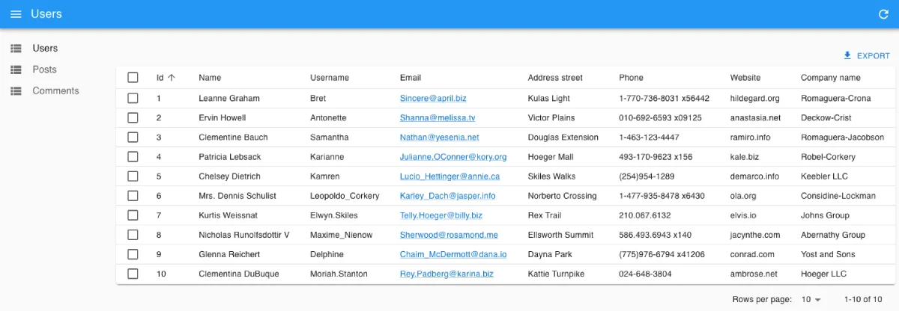

# Vite Integration

[Vite](https://vitejs.dev/) is a JavaScript bundler which improves speed of dev server and production build compared to Webpack.

## Setting Up React App with Vite

Create a new Vite project with React template using the command line:

```sh
yarn create vite my-admin --template react
```

We recommend using the TypeScript template:

```sh
yarn create vite my-admin --template react-ts
```

## Setting Up React-Admin

Add the `react-admin` package, as well as a data provider package. In this example, we'll use `ra-data-json-server` to connect to a test API provided by [JSONPlaceholder](https://jsonplaceholder.typicode.com).

```sh
cd my-admin
yarn add react-admin ra-data-json-server
```

Next, create the admin app component in `src/admin/index.tsx`:

```jsx
// in src/admin/index.tsx
import { Admin, Resource, ListGuesser } from "react-admin";
import jsonServerProvider from "ra-data-json-server";

const dataProvider = jsonServerProvider("https://jsonplaceholder.typicode.com");

const App = () => (
  <Admin dataProvider={dataProvider}>
    <Resource name="posts" list={ListGuesser} />
    <Resource name="comments" list={ListGuesser} />
  </Admin>
);

export default App;
```

This is a minimal admin for 2 resources. React-admin should be able to render a list of posts and a list of comments, guessing the data structure from the API response. 

Next, replace the `App.tsx` component with the following:

```jsx
import MyAdmin from "./admin";

const App = () => <MyAdmin />;

export default App;
```

Then, change the `index.css` file to look like this:

```css
/* in src/index.css */
body {
    margin: 0;
}
```

Next, add the `Roboto` font to your `index.html` file:

```diff
// in ./index.html
<!DOCTYPE html>
<html lang="en">
  <head>
    <meta charset="UTF-8" />
    <meta name="viewport" content="width=device-width, initial-scale=1.0" />
    <title>React Admin</title>
+   <link
+     rel="stylesheet"
+     href="https://fonts.googleapis.com/css?family=Roboto:300,400,500,700&display=swap"
+   />
  </head>
  <body>
    <div id="root"></div>
    <script type="module" src="/src/index.tsx"></script>
  </body>
</html>
```

**Tip:** You can also install the `Roboto` font locally by following the instructions from the [Material UI starter guide](https://mui.com/material-ui/getting-started/installation/#roboto-font).

Now, start the server with `yarn dev`, browse to `http://localhost:5173/`, and you should see the working admin:



Your app is now up and running, you can start tweaking it. 

## Ensuring Users Have The Latest Version

If your users might keep the application open for a long time, it's a good idea to add the [`<CheckForApplicationUpdate>`](./CheckForApplicationUpdate.md) component. It will check whether a more recent version of your application is available and prompt users to reload their browser tab.

To determine whether your application has been updated, it fetches the current page at a regular interval, builds an hash of the response content (usually the HTML) and compares it with the previous hash.

To enable it, start by creating a custom layout:

```tsx
// in src/admin/MyLayout.tsx
import { CheckForApplicationUpdate, Layout, LayoutProps } from 'react-admin';

export const MyLayout = ({ children, ...props }: LayoutProps) => (
    <Layout {...props}>
        {children}
        <CheckForApplicationUpdate />
    </Layout>
);
```

Then use this layout in your app:

```diff
import { Admin, Resource, ListGuesser } from "react-admin";
import jsonServerProvider from "ra-data-json-server";
+import { MyLayout } from './MyLayout';

const dataProvider = jsonServerProvider("https://jsonplaceholder.typicode.com");

const App = () => (
-  <Admin dataProvider={dataProvider}>
+  <Admin dataProvider={dataProvider} layout={MyLayout}>
    <Resource name="posts" list={ListGuesser} />
    <Resource name="comments" list={ListGuesser} />
  </Admin>
);

export default App;
```

## Troubleshooting

### Error about `global` Being `undefined`

This usually means some dependency is not [configured correctly for browser usage](https://docs.npmjs.com/cli/v9/configuring-npm/package-json#browser). You should try to contact the maintainer so that they update their build process.

You can fix this error by adding the following line to the `index.html` file:

```diff
// in ./index.html
<!DOCTYPE html>
<html lang="en">
  <head>
    <meta charset="UTF-8" />
    <meta name="viewport" content="width=device-width, initial-scale=1.0" />
    <title>React Admin</title>
    <link
      rel="stylesheet"
      href="https://fonts.googleapis.com/css?family=Roboto:300,400,500,700&display=swap"
    />
  </head>
  <body>
    <div id="root"></div>
+   <script>window.global = window</script>
    <script type="module" src="/src/index.tsx"></script>
  </body>
</html>
```
