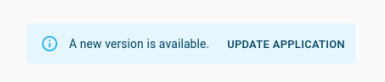

# `useCheckForApplicationUpdate`

This hook regularly checks whether the application source code has changed and calls the provided function when an update is available. To detect updates, it fetches the current URL at regular intervals and compares a hash of the response content.



## Usage

Include this component in a custom layout:

```tsx
// in src/MyLayout.tsx
import { useCheckForApplicationUpdate, Layout, LayoutProps } from 'react-admin';

export const MyLayout = (props: LayoutProps) => {
    useCheckForApplicationUpdate({
        onNewVersionAvailable: () => {
            alert('A new version of the application is available! Please reload the page');
        }
    });

    return (
        <Layout {...props} />
    );
}

// in src/App.tsx
import { Admin, ListGuesser, Resource } from 'react-admin';
import { MyLayout } from './MyLayout';

export const App = () => (
    <Admin layout={MyLayout}>
        <Resource name="posts" list={ListGuesser} />
    </Admin>
);
```

## Options

`useCheckForApplicationUpdate` accepts the following options:

| Prop            | Required | Type     | Default            | Description                                                         |
| ------------------------ | -------- | -------- | ------------------ | ---------------------------------------------------------- |
| `checkInterval`          | Optional | number   | `3600000` (1 hour) | The interval in milliseconds between two checks            |
| `disabled`               | Optional | boolean  | `true`             | Whether the automatic check is enabled                     |
| `onNewVersionAvailable`  | Required | Function |                    | A function to call when an update is available             |
| `url`                    | Optional | string   | current URL        | The URL to download to check for code update               |

## `checkInterval`

You can customize the interval of time between each application update check by providing the `checkInterval` option. It accepts a number of milliseconds and is set to `3600000` (1 hour) by default.

```tsx
// in src/MyLayout.tsx
import { useCheckForApplicationUpdate, Layout, LayoutProps } from 'react-admin';

const HALF_HOUR = 1800000;

export const MyLayout = (props: LayoutProps) => {
    useCheckForApplicationUpdate({
        checkInterval: HALF_HOUR,
        onNewVersionAvailable: () => {
            alert('A new version of the application is available! Please reload the page');
        },
    });

    return (
        <Layout {...props} />
    );
}
```

## `disabled`

You can dynamically disable the automatic application update detection by providing the `disabled` prop.

```tsx
// in src/MyLayout.tsx
import { useCheckForApplicationUpdate, Layout, LayoutProps } from 'react-admin';

export const MyLayout = (props: LayoutProps) => {
    useCheckForApplicationUpdate({
        disabled: process.env.NODE_ENV !== 'production',
        onNewVersionAvailable: () => {
            alert('A new version of the application is available! Please reload the page');
        },
    });

    return (
        <Layout {...props} />
    );
}
```

## `url`

You can customize the URL fetched to detect updates by providing the `url` prop.

```tsx
// in src/MyLayout.tsx
import { useCheckForApplicationUpdate, Layout, LayoutProps } from 'react-admin';

const MY_APP_ROOT_URL = 'http://admin.mycompany.com';

export const MyLayout = (props: LayoutProps) => {
    useCheckForApplicationUpdate({
        onNewVersionAvailable: () => {
            alert('A new version of the application is available! Please reload the page');
        },
        url: MY_APP_ROOT_URL,
    });

    return (
        <Layout {...props} />
    );
}
```
