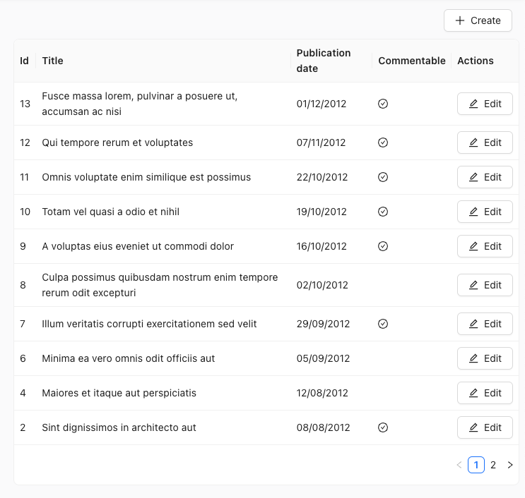

# `useListController`

`useListController` contains the headless logic of the [`<List>`](./List.md) component. It's useful to create a custom List view. It's also the base hook when building a custom view with another UI kit than Material UI. 



`useListController` reads the list parameters from the URL, calls `dataProvider.getList()`, prepares callbacks for modifying the pagination, filters, sort and selection, and returns them together with the data. Its return value matches the [`ListContext`](./useListContext.md) shape. 

`useListController` is used internally by [`<List>`](./List.md) and [`<ListBase>`](./ListBase.md). If your list view uses react-admin components like [`<Datagrid>`](./Datagrid.md), prefer [`<ListBase>`](./ListBase.md) to `useListController` as it takes care of creating a `<ListContext>`.

## Usage

`useListController` expects a parameters object defining the list sorting, pagination, and filters. It returns an object with the fetched data, and callbacks to modify the list parameters.

Here the code for the post list view above, built with [Ant Design](https://ant.design/):


```jsx
import { useListController } from 'react-admin'; 
import { Card, Table, Button } from 'antd';
import {
  CheckCircleOutlined,
  PlusOutlined,
  EditOutlined,
} from '@ant-design/icons';
import { Link } from 'react-router-dom';

const PostList = () => {
  const { data, page, total, setPage, isPending } = useListController({
    sort: { field: 'published_at', order: 'DESC' },
    perPage: 10,
  });
  const handleTableChange = (pagination) => {
    setPage(pagination.current);
  };
  return (
    <>
      <div style={{ margin: 10, textAlign: 'right' }}>
        <Link to="/posts/create">
          <Button icon={<PlusOutlined />}>Create</Button>
        </Link>
      </div>
      <Card bodyStyle={{ padding: '0' }} loading={isPending}>
        <Table
          size="small"
          dataSource={data}
          columns={columns}
          pagination={{ current: page, pageSize: 10, total }}
          onChange={handleTableChange}
        />
      </Card>
    </>
  );
};

const columns = [
  { title: 'Id', dataIndex: 'id', key: 'id' },
  { title: 'Title', dataIndex: 'title', key: 'title' },
  {
    title: 'Publication date',
    dataIndex: 'published_at',
    key: 'pub_at',
    render: (value) => new Date(value).toLocaleDateString(),
  },
  {
    title: 'Commentable',
    dataIndex: 'commentable',
    key: 'commentable',
    render: (value) => (value ? <CheckCircleOutlined /> : null),
  },
  {
    title: 'Actions',
    render: (_, record) => (
      <Link to={`/posts/${record.id}`}>
        <Button icon={<EditOutlined />}>Edit</Button>
      </Link>
    ),
  },
];

export default PostList;
```


When using react-admin components, it's common to call `useListController()` without parameters, and to put the result in a `ListContext` to make it available to the rest of the component tree.

```jsx
import { 
    useListController,
    ListContextProvider
} from 'react-admin';

const MyList = () => {
    const listContext = useListController();
    return (
        <ListContextProvider value={listContext}>
            {children}
        </ListContextProvider>
    );
};
```

## Parameters

`useListController` expects an object as parameter. All keys are optional.

* [`debounce`](./List.md#debounce): Debounce time in ms for the setFilters callbacks
* [`disableAuthentication`](./List.md#disableauthentication): Set to true to allow anonymous access to the list
* [`disableSyncWithLocation`](./List.md#disablesyncwithlocation): Set to true to have more than one list per page
* [`exporter`](./List.md#exporter): Exporter function
* [`filter`](./List.md#filter-permanent-filter): Permanent filter, forced over the user filter
* [`filterDefaultValues`](./List.md#filterdefaultvalues): Default values for the filter form
* [`perPage`](./List.md#perpage): Number of results per page
* [`queryOptions`](./List.md#queryoptions): React-query options for the useQuery call
* [`resource`](./List.md#resource): Resource name, e.g. 'posts' ; defaults to the current resource context
* [`sort`](./List.md#sort): Current sort value, e.g. `{ field: 'published_at', order: 'DESC' }`
* [`storeKey`](#storekey): Key used to differentiate the list from another sharing the same resource, in store managed states

Here are their default values:

```jsx
import {  
    useListController,
    defaultExporter,
    ListContextProvider
} from 'react-admin';

const MyList = ({
    debounce = 500,
    disableAuthentication = false,
    disableSyncWithLocation = false,
    exporter = defaultExporter,
    filter = undefined,
    filterDefaultValues = undefined,
    perPage = 10,
    queryOptions = undefined,
    resource = '',
    sort = { field: 'id', order: 'DESC' },
    storeKey = undefined,
}) => {
    const listContext = useListController({
        debounce,
        disableAuthentication,
        disableSyncWithLocation,
        exporter,
        filter,
        filterDefaultValues,
        perPage,
        queryOptions,
        resource,
        sort,
        storeKey,
    });
    return (
        <ListContextProvider value={listContext}>
            {children}
        </ListContextProvider>
    );
};
```

## `storeKey`

To display multiple lists of the same resource and keep distinct store states for each of them (filters, sorting and pagination), specify unique keys with the `storeKey` property.

In case no `storeKey` is provided, the states will be stored with the following key: `${resource}.listParams`.

**Note:** Please note that selection state will remain linked to a resource-based key as described [here](./List.md#disablesyncwithlocation).

If you want to disable the storage of list parameters altogether for a given list, you can use [the `disableSyncWithLocation` prop](./List.md#disablesyncwithlocation).

In the example below, both lists `TopPosts` and `FlopPosts` use the same resource ('posts'), but their controller states are stored separately (under the store keys `'top'` and `'flop'` respectively).


```jsx
import { useListController } from 'react-admin';

const OrderedPostList = ({
    storeKey,
    sort,
}) => {
    const params = useListController({
        resource: 'posts',
        sort,
        storeKey,
    });
    return (
        <div>
            <ul style={styles.ul}>
                {!params.isPending &&
                    params.data.map(post => (
                        <li key={`post_${post.id}`}>
                            {post.title} - {post.votes} votes
                        </li>
                    ))}
            </ul>
        </div>
    );
};

const TopPosts = (
    <OrderedPostList storeKey="top" sort={{ field: 'votes', order: 'DESC' }} />
);
const FlopPosts = (
    <OrderedPostList storeKey="flop" sort={{ field: 'votes', order: 'ASC' }} />
);
```


You can disable this feature by setting the `storeKey` prop to `false`. When disabled, parameters will not be persisted in the store.


## Return Value

`useListController` returns an object with the following keys: 

```jsx
const {
    // Data
    data, // Array of the list records, e.g. [{ id: 123, title: 'hello world' }, { ... }
    total, // Total number of results for the current filters, excluding pagination. Useful to build the pagination controls, e.g. 23      
    isPending, // Boolean, true until the data is available
    isFetching, // Boolean, true while the data is being fetched, false once the data is fetched
    isLoading, // Boolean, true until the data is fetched for the first time
    // Pagination
    page, // Current page. Starts at 1
    perPage, // Number of results per page. Defaults to 25
    setPage, // Callback to change the page, e.g. setPage(3)
    setPerPage, // Callback to change the number of results per page, e.g. setPerPage(25)
    hasPreviousPage, // Boolean, true if the current page is not the first one
    hasNextPage, // Boolean, true if the current page is not the last one
    // Sorting
    sort, // Sort object { field, order }, e.g. { field: 'date', order: 'DESC' }
    setSort, // Callback to change the sort, e.g. setSort({ field: 'name', order: 'ASC' })
    // Filtering
    filterValues, // Dictionary of filter values, e.g. { title: 'lorem', nationality: 'fr' }
    displayedFilters, // Dictionary of displayed filters, e.g. { title: true, nationality: true }
    setFilters, // Callback to update the filters, e.g. setFilters(filters, displayedFilters)
    showFilter, // Callback to show one of the filters, e.g. showFilter('title', defaultValue)
    hideFilter, // Callback to hide one of the filters, e.g. hideFilter('title')
    // Record selection
    selectedIds, // Array listing the ids of the selected records, e.g. [123, 456]
    onSelect, // Callback to change the list of selected records, e.g. onSelect([456, 789])
    onToggleItem, // Callback to toggle the record selection for a given id, e.g. onToggleItem(456)
    onUnselectItems, // Callback to clear the record selection, e.g. onUnselectItems();
    // Misc
    defaultTitle, // Translated title based on the resource, e.g. 'Posts'
    resource, // Resource name, deduced from the location. e.g. 'posts'
    refetch, // Callback for fetching the list data again
} = useListController();
```

## Using `setFilters` to Update Filters

The `setFilters` method is used to update the filters. It takes three arguments:

- `filters`: an object containing the new filter values
- `displayedFilters`: an object containing the new displayed filters
- `debounced`: set to true to debounce the call to setFilters (false by default)

You can use it to update the list filters:

```jsx
import { useState } from 'react';
import { useListController } from 'react-admin';

const OfficeList = () => {
    const { filterValues, setFilters, data, isPending } = useListController({ resource: 'offices' });
    const [formValues, setFormValues] = useState(filterValues);

    const handleChange = (event) => {
        setFormValues(formValues => ({
            ...formValues,
            [event.target.name]: event.target.value
        }));
    };

    const handleSubmit = (event) => {
        event.preventDefault();
        setFilters(filterFormValues);
    };

    if (isPending) return <div>Loading...</div>;

    return (
        <>
            <form onSubmit={handleSubmit}>
                <input name="country" value={formValues.country} onChange={handleChange} />
                <input name="city" value={formValues.city} onChange={handleChange} />
                <input name="zipcode" value={formValues.zipcode} onChange={handleChange} />
                <input type="submit">Filter</input>
            </form>
            <ul>
                {data.map(record => (
                    <li key={record.id}>{record.name}</li>
                ))}
            </ul>
        </>
    );
};
```

## Security

`useListController` requires authentication and will redirect anonymous users to the login page. If you want to allow anonymous access, use the [`disableAuthentication`](./List.md#disableauthentication) prop.

If your `authProvider` implements [Access Control](./Permissions.md#access-control), `useListController` will only render if the user has the "list" access to the related resource.

For instance, for the `<PostList>` page below:

```tsx
import { useListController, SimpleList } from 'react-admin';

const PostList = () => {
  const { isPending, error, data, total } = useListController({ resource: 'posts'})
  if (error) return <div>Error!</div>;
  return (
      <SimpleList
        data={data}
        total={total}
        isPending={isPending}
        primaryText="%{title}"
      />
  );
}
```

`useListController` will call `authProvider.canAccess()` using the following parameters:

```jsx
{ action: "list", resource: "posts" }
```

Users without access will be redirected to the [Access Denied page](./Admin.md#accessdenied).

**Note**: Access control is disabled when you use [the `disableAuthentication` prop](./List.md#disableauthentication).
