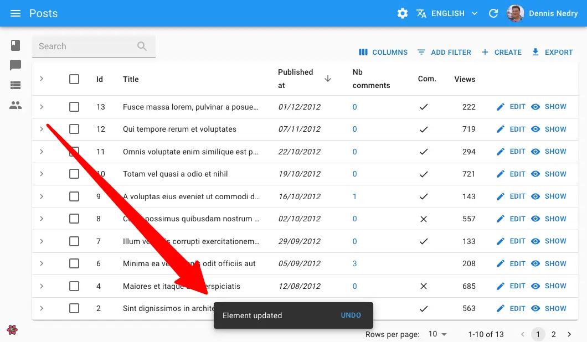

# `useNotify`

This hook returns a function that displays a notification at the bottom of the page.



## Usage

```jsx
import { useNotify } from 'react-admin';

const NotifyButton = () => {
    const notify = useNotify();
    const handleClick = () => {
        notify(`Comment approved`, { type: 'success' });
    }
    return <button onClick={handleClick}>Notify</button>;
};
```

The hook takes no argument and returns a callback. The callback takes 2 arguments:

- The message to display (a string, or a React node)
- an `options` object with the following keys:
    - `type`: The notification type (`info`, `success`, `error` or `warning` - the default is `info`)
    - `messageArgs`: options to pass to the `translate` function (because notification messages are translated if your admin has an `i18nProvider`). It is useful for inserting variables into the translation.
    - `undoable`: Set it to `true` if the notification should contain an "undo" button
    - `autoHideDuration`: Duration (in milliseconds) after which the notification hides. Set it to `null` if the notification should not be dismissible.
    - `multiLine`: Set it to `true` if the notification message should be shown in more than one line.
    - `anchorOrigin`: The position of the notification. The default is `{ vertical: 'top', horizontal: 'right' }`. See [the Material UI documentation](https://mui.com/material-ui/react-snackbar/) for more details.

Here are more examples of `notify` calls: 

```js
// notify an error
notify(`This is an error`, { type: 'error' });
// notify a warning
notify(`This is a warning`, { type: 'warning' });
// pass translation arguments
notify('item.created', { type: 'info', messageArgs: { resource: 'post' } });
// send an undoable notification
notify('Element updated', { type: 'info', undoable: true });
```

## `anchorOrigin`

You can change the default position of the notification by passing an `anchorOrigin` option. The value is passed to [the Material UI `<Snackbar anchorOrigin>`](https://mui.com/material-ui/react-snackbar/) prop.

```jsx
notify(
    'Form submitted successfully',
    { anchorOrigin: { vertical: 'top', horizontal: 'right' }
});
```

## `autoHideDuration`

You can define a custom delay for hiding a given notification.

```jsx
import { useNotify } from 'react-admin';

const LogoutButton = () => {
    const notify = useNotify();
    const logout = useLogout();

    const handleClick = () => {
        logout().then(() => {
            notify('Form submitted successfully', { autoHideDuration: 5000 });
        });
    };

    return <button onClick={handleClick}>Logout</button>;
};
```

To change the default delay for all notifications, check [the `<Admin notification>` documentation](./Admin.md#notification).

## `messageArgs`

`useNotify` calls [the `translate` function](./useTranslate.md) to translate the notification message. You often need to pass variables to the `translate` function. The `messageArgs` option allows you to do that.

For instance, if you want to display a notification message like "Post 123 created", you need to pass the post id to the translation function. 

```jsx
notify('post.created', { messageArgs: { id: 123 } });
```

Then, in your translation files, you can use the `id` variable:

```jsx
{
    "post": {
        "created": "Post %{id} created"
    }
}
```

`messageArgs` also let you define a default translation using the `_` key:

```jsx
notify('post.created', { messageArgs: { _: 'Post created' } });
```

Finally, `messageArgs` lets you define a `smart_count` variable, which is useful for [pluralization](./useTranslate.md#using-pluralization-and-interpolation):

```jsx
notify('post.created', { messageArgs: { smart_count: 2 } });
```

`translate` uses the `smart_count` value to choose the right translation in the `post.created` key:

```jsx
{
    "post": {
        "created": "One post created |||| %{smart_count} posts created"
    }
}
```

## `multiLine`

You can display a notification message on multiple lines.

```jsx
notify(
    'This is a very long message that will be displayed on multiple lines',
    { multiLine: true }
);
```

## `type`

This option lets you choose the notification type. It can be `info`, `success`, `warning` or `error`. The default is `info`.

```jsx
notify('This is an info', { type: 'info' });
notify('This is a success', { type: 'success' });
notify('This is a warning', { type: 'warning' });
notify('This is an error', { type: 'error' });
```

## `undoable`

When using `useNotify` as a side effect for an `undoable` mutation, you MUST set the `undoable` option to `true`, otherwise the "undo" button will not appear, and the actual update will never occur.


```jsx
import * as React from 'react';
import { useNotify, Edit, SimpleForm } from 'react-admin';

const PostEdit = () => {
    const notify = useNotify();

    const onSuccess = () => {
        notify('Changes saved`', { undoable: true });
    };

    return (
        <Edit mutationMode="undoable" mutationOptions={{ onSuccess }}>
            <SimpleForm>
                ...
            </SimpleForm>
        </Edit>
    );
}
```


## Custom Notification Content

You may want a notification message that contains HTML or other React components. To do so, you can pass a React node as the first argument of the `notify` function.

This allows e.g. using [Material UI's `<Alert>` component](https://mui.com/material-ui/react-snackbar/#customization) to display a notification with a custom icon, color, or action.


```jsx
import { useSubscribe } from "@react-admin/ra-realtime";
import { useNotify, useDataProvider } from "react-admin";
import { Alert } from "@mui/material";

export const ConnectionWatcher = () => {
  const notify = useNotify();
  const dataProvider = useDataProvider();
  useSubscribe("connectedUsers", (event) => {
    if (event.type === "connected") {
      dataProvider
        .getOne("agents", { id: event.payload.agentId })
        .then(({ data }) => {
          notify(
            <Alert severity="info">
                Agent ${data.firstName} ${data.lastName} just logged in
            </Alert>
            );
        });
    }
    if (event.type === "disconnected") {
      dataProvider
        .getOne("agents", { id: event.payload.agentId })
        .then(({ data }) => {
          notify(
            <Alert severity="info">
                Agent ${data.firstName} ${data.lastName} just logged out
            </Alert>
          );
        });
    }
  });
  return null;
};
```

Note that if you use this ability to pass a React node, the message will not be translated - you'll have to translate it yourself using [`useTranslate`](./useTranslate.md).