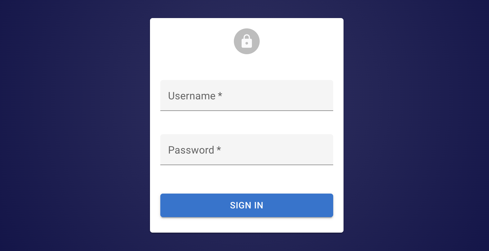
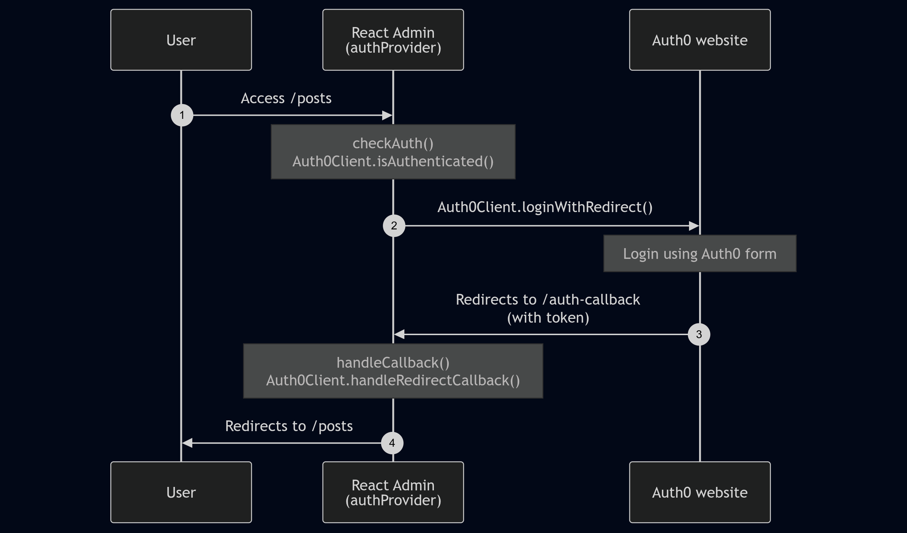

Ra-core can use any authentication backend, but you have to write an adapter for it. This adapter is called an `authProvider`. The `authProvider` is a simple object with methods that ra-core calls to handle authentication and authorization.

## Auth Provider Methods

Ra-core expect an `authProvider` to implement the following methods:

```tsx
const authProvider = {
    // REQUIRED
    // send username and password to the auth server and get back credentials
    // (for login / password flow)
    async login(params) {/* ... */},
    // when the dataProvider returns an error, check if this is an authentication error
    async checkError(error) {/* ... */},
    // when the user navigates, make sure that their credentials are still valid
    async checkAuth(params) {/* ... */},
    // remove local credentials and notify the auth server that the user logged out
    async logout() {/* ... */},

    // OPTIONAL
    // get the user's profile (id, fullName, avatar)
    async getIdentity() {/* ... */},
    // process authentication callback from third-party providers
    // (for third-party authentication flow)
    async handleCallback() {/* ... */},
    // check authorization for an action over a resource
    // (for access-control style authorization)
    async canAccess(params) {/* ... */},
    // get the user's permissions
    // (for permission style authorization)
    async getPermissions() {/* ... */},
};
```

**Tip**: If you're a TypeScript user, you can check that your `authProvider` is correct at compile-time using the `AuthProvider` type.

```tsx
import type { AuthProvider } from 'ra-core';

const authProvider: AuthProvider = {
    // ...
};
```

## Simple Example

Here is a fictive but working implementation of an auth provider. It only accepts user "john" with password "123".

```tsx
const authProvider = {
    async login({ username, password }) {
        if (username !== 'john' || password !== '123') {
            throw new Error('Login failed');
        }
        localStorage.setItem('username', username);
    },
    async checkError(error) {
        const status = error.status;
        if (status === 401 || status === 403) {
            localStorage.removeItem('username');
            throw new Error('Session expired');
        }
        // other error codes (404, 500, etc): no need to log out
    },
    async checkAuth() {
        if (!localStorage.getItem('username')) {
            throw new Error('Not authenticated');
        }
    },
    async logout() {
        localStorage.removeItem('username');
    },
    async getIdentity() {
        const username = localStorage.getItem('username');
        return { id: username, fullName: username };
    },
};
```

## `login`

|                     |                                                                        |
| ------------------- | ---------------------------------------------------------------------- |
| **Purpose**         | Send username and password to the auth server and get back credentials |
| **Required**        | Yes                                                                    |
| **When to use**     | For login / password flows                                             |
| **On resolve**      | Redirects to previous page or admin index (customizable)               |
| **On reject**       | Displays error message in a notification                               |
| **Request format**  | `Object` with values from the login form                               |
| **Response format** | `void \| { redirectTo?: string \| boolean }`                           |
| **Error format**    | `string \| { message?: string }`                                       |

Once an admin has an `authProvider`, ra-core enables a new page on the `/login` route, which displays a login form.



Upon submission, the login page calls the `authProvider.login()` method with the login data as parameter. Ra-core expects this async method to return if the login data is correct, and to throw an error if it's not.

**Tip:** The `login` method will never be called if you rely solely on [third-party authentication](./Authentication.md#using-external-authentication-providers) flows (e.g. Auth0, Cognito, or any other OAuth-based service). In this case, you can provide a dummy implementation that always resolves.

Below is an example showing how to configure the `authProvider` to query an authentication route via HTTPS and store the user credentials (a token) in local storage:

```tsx
// in src/authProvider.js
const authProvider = {
    async login({ username, password })  {
        const request = new Request('https://mydomain.com/authenticate', {
            method: 'POST',
            body: JSON.stringify({ username, password }),
            headers: new Headers({ 'Content-Type': 'application/json' }),
        });
        let response;
        try {
            response = await fetch(request);
        } catch (_error) {
            throw new Error('Network error');
        }
        if (response.status < 200 || response.status >= 300) {
            throw new Error(response.statusText);
        }
        const auth = await response.json();
        localStorage.setItem('auth', JSON.stringify(auth));
    },
    // ...
};
```

Once the `login()` method returns, the login form redirects to the previous page, or to the admin index if the user just arrived.

If the `login()` method throws an Error, ra-core displays the error message to the user in a notification.

**Tip**: Storing credentials in `localStorage`, as in this example, avoids asking the user to log in again after a page refresh, or after a browser tab change. But this makes your application [open to XSS attacks](https://www.redotheweb.com/2015/11/09/api-security.html), so you'd better double down on security, and add an `httpOnly` cookie on the server side, too.

If the `login()` method returns an object with a `redirectTo` path, ra-core will redirect the user to that path after login. You can use this feature to redirect the user to a specific page, or to disable redirection by returning `false`.

```tsx
// in src/authProvider.js
const authProvider = {
    async login({ username, password })  {
        // ...
        return { redirectTo: false };
    },
    // ...
};
```

## `checkError`

|                     |                                                                                         |
| ------------------- | --------------------------------------------------------------------------------------- |
| **Purpose**         | Check if a dataProvider error is an authentication error                                |
| **Required**        | Yes                                                                                     |
| **When to use**     | Always                                                                                  |
| **On resolve**      | -                                                                                       |
| **On reject**       | Logs the user out and redirects to the login page (customizable)                        |
| **Request format**  | `{ message: string, status: number, body: Object }` (error from the dataProvider)       |
| **Response format** | `void`                                                                                  |
| **Error format**    | `{ message?: string \| boolean, redirectTo?: string \| boolean, logoutUser?: boolean }` |

When the user credentials are missing or become invalid, a secure API usually responds with an HTTP error code 401 or 403.

Fortunately, each time the `dataProvider` returns an error, ra-core calls `authProvider.checkError()` to check if the error is an authentication error. If this method throws an error itself, ra-core calls the `authProvider.logout()` method immediately, and redirects the user to the login page.

So it's up to you to decide which HTTP status codes should let the user continue (by returning a resolved promise) or log them out (by returning a rejected promise).

For instance, to log the user out for both 401 and 403 codes:

```tsx
const authProvider = {
    async checkError(error) {
        const status = error.status;
        if (status === 401 || status === 403) {
            localStorage.removeItem('auth');
            throw new Error();
        }
        // other error code (404, 500, etc): no need to log out
    },
    // ...
};
```

When `checkError()` throws an error, ra-core redirects to the `/login` page, or to the `error.redirectTo` url. That means you can override the default redirection as follows:

```tsx
const authProvider = {
    async checkError(error) {
        const status = error.status;
        if (status === 401 || status === 403) {
            localStorage.removeItem('auth');
            const error = new Error();
            error.redirectTo = '/credentials-required';
            throw error;
        }
    },
    // ...
};
```

It's possible to not log the user out, and to instead redirect them. You can do this by passing `error.logoutUser = false` along with an `error.redirectTo` url.

```tsx
const authProvider = {
    async checkError(error) {
        const status = error.status;
        if (status === 401 || status === 403) {
            localStorage.removeItem('auth');
            const error = new Error();
            error.redirectTo = '/credentials-required';
            error.logoutUser = false;
            throw error;
        }
    },
    // ...
};
```

When `checkError()` throws an error, ra-core displays a notification to the end user, unless the `error.message` is `false`. That means you can disable or customize the notification on error as follows:

```tsx
const authProvider = {
    async checkError(error) {
        const status = error.status;
        if (status === 401 || status === 403) {
            localStorage.removeItem('auth');
            const error = new Error();
            error.message = false;
            throw error;
        }
    },
    // ...
};
```

## `checkAuth`

|                     |                                                                                |
| ------------------- | ------------------------------------------------------------------------------ |
| **Purpose**         | Check if the user is authenticated (when navigating to an authenticated route) |
| **Required**        | Yes                                                                            |
| **When to use**     | Always                                                                         |
| **On resolve**      | -                                                                              |
| **On reject**       | Logs the user out and redirects to the login page (customizable)               |
| **Request format**  | Params passed to `useCheckAuth()` -- empty for react-admin default routes      |
| **Response format** | `void`                                                                         |
| **Error format**    | `{ message?: string \| boolean, redirectTo?: string \| boolean }`              |

Redirecting to the login page whenever a REST response uses a 401 status code is usually not enough. Ra-core keeps data on the client side, and could briefly display stale data while contacting the server - even after the credentials are no longer valid.

Fortunately, each time the user navigates to a list, edit, create or show page, ra-core calls the `authProvider.checkAuth()` method. If this method throws an error, ra-core calls `authProvider.logout()` and redirects the user to the login page. So it's the ideal place to make sure the credentials are still valid.

For instance, to check for the existence of the authentication data in local storage:

```tsx
const authProvider = {
    async checkAuth() {
        if (!localStorage.getItem('auth')) {
            throw new Error();
        }
    },
    // ...
};
```

When `checkAuth()` throws an error, ra-core redirects to the `/login` page by default. You can override this path by throwing an error with a `redirectTo` property:

```tsx
const authProvider = {
    async checkAuth() {
        if (!localStorage.getItem('auth')) {
            const error = new Error();
            error.redirectTo = '/no-access';
            throw error;
        }
    },
    // ...
}
```

**Tip**: If both `authProvider.checkAuth()` and `authProvider.logout()` return a redirect URL, the one from `authProvider.checkAuth()` takes precedence.

When `checkAuth()` throws an error, ra-core displays a notification to the end user. You can customize this message by throwing an error with a particular message:

```tsx
const authProvider = {
    async checkAuth() {
        if (!localStorage.getItem('auth')) {
            throw new Error('login.required'); // ra-core passes the error message to the translation layer
        }
    },
    // ...
};
```

You can also disable this notification completely by rejecting an error with a `false` `message`.

```tsx
const authProvider = {
    async checkAuth() {
        if (!localStorage.getItem('auth')) {
            const error = new Error();
            error.message = false;
            throw error;
        }
    },
    // ...
};
```

**Tip:** `checkAuth` won't be called for routes [allowing anonymous access](./Authentication.md#allowing-anonymous-access).

## `logout`

|                     |                                                                                   |
| ------------------- | --------------------------------------------------------------------------------- |
| **Purpose**         | Log out the user from the backend and clean up authentication data                |
| **Required**        | Yes                                                                               |
| **When to use**     | Always                                                                            |
| **On resolve**      | Redirects to login page (customizable)                                            |
| **On reject**       | -                                                                                 |
| **Request format**  | -                                                                                 |
| **Response format** | `string \| false \| void` route to redirect to after logout, defaults to `/login` |
| **Error format**    | -                                                                                 |

If you enable authentication, ra-core adds a logout button in the user menu in the top bar (or in the sliding menu on mobile). When the user clicks on the logout button, this calls the `authProvider.logout()` method, and removes potentially sensitive data stored in [the ra-core Store](./Store.md). Then the user gets redirected to the login page. The two previous sections also illustrated that ra-core can call `authProvider.logout()` itself, when the API returns a 403 error or when the local credentials expire.

<video controls autoplay playsinline muted loop>
  <source src="../img/logout.mp4" type="video/mp4"/>
  Your browser does not support the video tag.
</video>

It's the responsibility of the `authProvider.logout()` method to clean up the current authentication data. For instance, if the authentication was a token stored in local storage, here is the code to remove it:

```tsx
const authProvider = {
    async logout() {
        localStorage.removeItem('auth');
    },
    // ...
};
```

The `authProvider.logout()` method is also a good place to notify the authentication backend that the user credentials are no longer valid after logout.

After logout, ra-core redirects the user to the string returned by `authProvider.logout()` - or to the `/login` url if the method returns nothing. You can customize the redirection url by returning a route string, or `false` to disable redirection after logout.

```tsx
const authProvider = {
    async logout() {
        localStorage.removeItem('auth');
        return '/my-custom-login';
    },
    // ...
};
```

**Tip**: If both `authProvider.checkAuth()` and `authProvider.logout()` return a redirect URL, the one from `authProvider.checkAuth()` takes precedence.

## `getIdentity`

|                     |                                                                |
| ------------------- | -------------------------------------------------------------- |
| **Purpose**         | Get the current user identity                                  |
| **Required**        | No                                                             |
| **When to use**     | Always                                                         |
| **Request format**  | -                                                              |
| **Response format** | `{ id: string \| number, fullName?: string, avatar?: string }` |
| **Error format**    | `Error`                                                        |

Admin components often adapt their behavior based on the current user identity. For instance, a [lock system](./RealtimeFeatures.md#locks) may allow edition only if the lock owner is the current user. It is also common to display the current user name and avatar in the app main menu.

Ra-core delegates the storage of the connected user identity to the `authProvider`. If it exposes a `getIdentity()` method, ra-core will call it to read the user details. 

`getIdentity`should return an object with at least an `id` field. You can also return a `fullName` and an `avatar` field, or any other field you need in your app:

```tsx
const authProvider = {
    async getIdentity() {
        const authCredentials = JSON.parse(localStorage.getItem('auth'));
        const { id, fullName, avatar } = authCredentials;
        return { id, fullName, avatar };
    },
    // ...
};
```

Ra-core uses the `fullName` and the `avatar` (an image source, or a data-uri) in the App Bar:


**Tip**: You can use the `id` field to identify the current user in your code, by calling the [`useGetIdentity`](./useGetIdentity.md) hook:

```jsx
import { useGetIdentity, useGetOne } from 'ra-core';

const PostDetail = ({ id }) => {
    const { data: post, isPending: postLoading } = useGetOne('posts', { id });
    const { identity, isPending: identityLoading } = useGetIdentity();
    if (postLoading || identityLoading) return <>Loading...</>;
    if (!post.lockedBy || post.lockedBy === identity.id) {
        // post isn't locked, or is locked by me
        return <PostEdit post={post} />
    } else {
        // post is locked by someone else and cannot be edited
        return <PostShow post={post} />
    }
}
```

## `handleCallback`

|                     |                                                                                  |
| ------------------- | -------------------------------------------------------------------------------- |
| **Purpose**         | Process authentication callback from third-party providers (Auth0, Cognito, ...) |
| **Required**        | No                                                                               |
| **When to use**     | For third-party authentication flows                                             |
| **On resolve**      | Redirects to previous page or admin index (customizable)                         |
| **On reject**       | -                                                                                |
| **Request format**  | -                                                                                |
| **Response format** | `void \| { redirectTo?: string \| boolean }`                                     |
| **Error format**    | `Error`                                                                          |

This method is used when integrating a third-party authentication provider such as [Auth0](https://auth0.com/). Ra-core provides a route at the `/auth-callback` path, to be used as the callback URL in the authentication service. After logging in using the authentication service, users will be redirected to this route. The `/auth-callback` route calls the `authProvider.handleCallback` method on mount. 

So `handleCallback` lets you process query parameters passed by the third-party authentication service, e.g. to retrieve an authentication token.

Here's an example using Auth0:

```tsx
import { PreviousLocationStorageKey } from 'ra-core';
import { Auth0Client } from './Auth0Client';

const authProvider = {
    async login() { /* Nothing to do here, this function will never be called */ },
    async checkAuth() {
        const isAuthenticated = await client.isAuthenticated();
        if (isAuthenticated) {
            return;
        }
        // not authenticated: save the location that the user tried to access
        localStorage.setItem(PreviousLocationStorageKey, window.location.href);
        // then redirect the user to the Auth0 service
        client.loginWithRedirect({
            authorizationParams: {
                // after login, Auth0 will redirect users back to this page
                redirect_uri: `${window.location.origin}/auth-callback`,
            },
        });
    },
    // A user logged in successfully on the Auth0 service
    // and was redirected back to the /auth-callback route on the app
    async handleCallback() {
        const query = window.location.search;
        if (!query.includes('code=') && !query.includes('state=')) {
            throw new Error('Failed to handle login callback.');
        }
        // If we did receive the Auth0 parameters,
        // get an access token based on the query paramaters
        await Auth0Client.handleRedirectCallback();
    },
    ...
}
```



Once `handleCallback` returns, ra-core redirects the user to the home page, or to the location found in `localStorage.getItem(PreviousLocationStorageKey)`. In the above example, `authProvider.checkAuth()` sets this location to the page the user was trying to access. 

You can override this behavior by returning an object with a `redirectTo` property, as follows:

```tsx
const authProvider = {
    async handleCallback() {
        if (!query.includes('code=') && !query.includes('state=')) {
            throw new Error('Failed to handle login callback.');
        }
        // If we did receive the Auth0 parameters,
        // get an access token based on the query paramaters
        await Auth0Client.handleRedirectCallback();
        return { redirectTo: '/posts' };
    },
    // ...
};
```

**Tip:** If you rely solely on third-party authentication flows, the `authProvider.login()` method will never be called. In this case you can simply provide a dummy implementation that always resolves.

## `canAccess`

|                     |                                                                           |
| ------------------- | ------------------------------------------------------------------------- |
| **Purpose**         | Check authorization for an action over a resource                         |
| **Required**        | No                                                                        |
| **When to use**     | For [Access Control](./Permissions.md#access-control) style Authorization |
| **Request format**  | `{ action: string, resource: string, record: object }`                    |
| **Response format** | `boolean`                                                                 |
| **Error format**    | `Error`                                                                   |

Ra-core has built-in [Access Control](./Permissions.md#access-control) features that you can enable by implementing the `authProvider.canAccess()` method. It receives a permissions object with the following properties:

- `action`: The action to perform on the resource (e.g. `list`, `create`, `update`, `delete`, `show`)
- `resource`: The resource name
- `record` (optional): The record to perform the action on.

`canAccess()` should return a boolean indicating whether users can perform the provided action on the provided resource:

If any errors is thrown by the `canAccess` method, it will be passed to the [`authProvider.checkError`](#checkerror) method.

The simplest implementation is to return `true` for all resources and actions:

```tsx
const authProvider = {
    async canAccess() {
        return true;
    },
    // ...
};
```

More realistically, you would store the user's permissions at login, and check the requested action and resource against these permissions:

```tsx
const authProvider = {
    async canAccess({ action, resource }) {
        // authorizedResources is like ['posts', 'comments', 'users'];
        const { authorizedResources } = JSON.parse(localStorage.getItem('auth'));
        if (!authorizedResources.includes(resource)) {
            return false;
        }
        return true;
    },
    // ...
};
```

Check the [Access Control documentation](./Permissions.md#access-control) for more information on how to use the `canAccess` method.

## `getPermissions`

|                     |                                                                                                        |
| ------------------- | ------------------------------------------------------------------------------------------------------ |
| **Purpose**         | Returns a boolean indicating whether the user can perform the provided action on the provided resource |
| **Required**        | No                                                                                                     |
| **When to use**     | For [Permissions](./Permissions.md#permissions) style Authorization                                    |
| **Request format**  | params passed to `usePermissions()` -- empty for react-admin default routes                            |
| **Response format** | `any`                                                                                                  |
| **Error format**    | `Error`                                                                                                |

As an alternative to `canAccess()`, `getPermissions()` lets you return an arbitrary permissions object. This object can be used by React components to enable or disable UI elements based on the user's role.

The permissions can be in any format: a simple string (e.g. `'editor'`), an array of strings (e.g. `['editor', 'admin']`), or a complex object (e.g. `{ posts: 'editor', comments: 'moderator', users: 'admin' }`).

```tsx
const authProvider = {
    async getPermissions({ action, resource }) {
        const { permissions } = JSON.parse(localStorage.getItem('auth'));
        return permissions;
    },
    // ...
};
```

Ra-core doesn't use permissions by default, but it provides [the `usePermissions` hook](./usePermissions.md) to retrieve the permissions of the current user. This lets you add the permissions logic that fits your need in your components.

Check the [Access Control documentation](./Permissions.md#permissions) for more information on how to use the `getPermissions` method.

**Tip:** How to choose between `canAccess` and `getPermissions`? We recommend Access Control (i.e. `canAccess`) because it allows you to put the authorization logic in the `authProvider` rather than in the React code.

## Using External Authentication Providers

Instead of the built-in Login page, you can use an external authentication provider, like Auth0, Cognito, or any other OAuth-based service. See [Using External Authentication Providers](./Authentication.md#using-external-authentication-providers) for an example.

## Query Cancellation

Ra-core supports [Query Cancellation](https://tanstack.com/query/latest/docs/framework/react/guides/query-cancellation), which means that when a component is unmounted, any pending query that it initiated is cancelled. This is useful to avoid out-of-date side effects and to prevent unnecessary network requests.

To enable this feature, your auth provider must have a `supportAbortSignal` property set to `true`.

```tsx
const authProvider = { /* ... */ };
authProvider.supportAbortSignal = true;
```

Now, every call to the auth provider will receive an additional `signal` parameter (an [AbortSignal](https://developer.mozilla.org/en-US/docs/Web/API/AbortSignal) instance). You must pass this signal down to the fetch call:

```tsx
const authProvider = {
    async canAccess({ resource, action, record, signal }) {
        const url = `${API_URL}/can_access?resource=${resource}&action=${action}`;
        const res = await fetch(url, { signal });
        if (!res.ok) {
            throw new HttpError(res.statusText);
        }
        return res.json();
    },
}
```

Some auth providers may already support query cancellation. Check their documentation for details.

**Note**: In development, if your app is using [`<React.StrictMode>`](https://react.dev/reference/react/StrictMode), enabling query cancellation will duplicate the API queries. This is only a development issue and won't happen in production.
