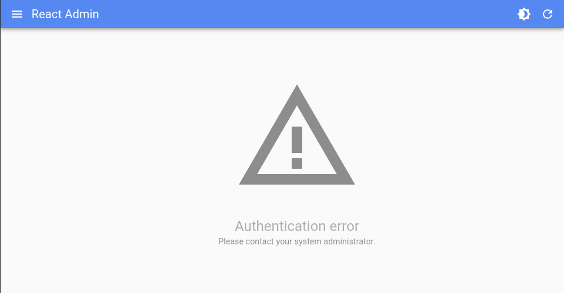
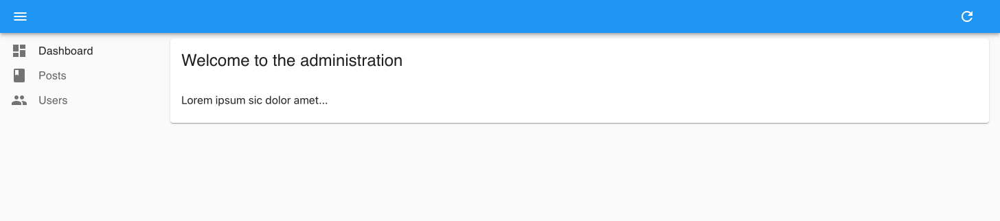
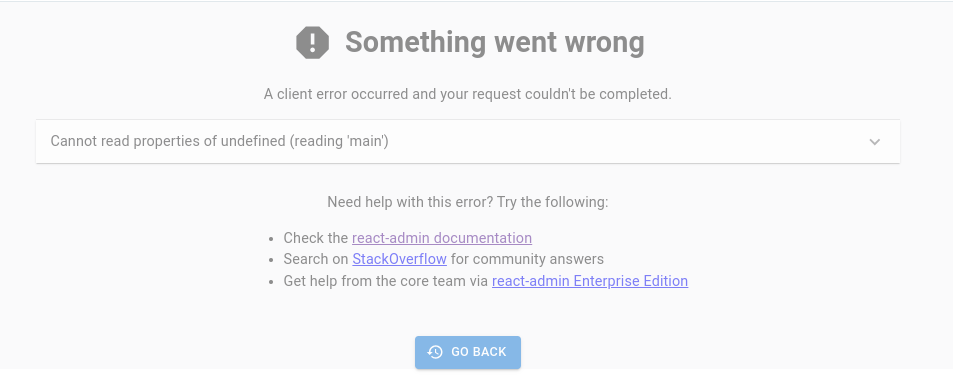

The `<CoreAdmin>` component is the root component of a ra-core app. It allows to configure the application adapters, routes, and core functionalities.

`<CoreAdmin>` creates a series of context providers to allow its children to access the app configuration. It renders the main routes and delegates the rendering of the content area to its `<Resource>` children.

## Usage

`<CoreAdmin>` requires only a `dataProvider` prop, and at least one child `<Resource>` to work. Here is the most basic example:

```tsx
// in src/App.js
import { CoreAdmin, Resource } from 'ra-core';
import simpleRestProvider from 'ra-data-simple-rest';

import { PostList } from './posts';

const App = () => (
    <CoreAdmin dataProvider={simpleRestProvider('http://path.to.my.api')}>
        <Resource name="posts" list={PostList} />
    </CoreAdmin>
);

export default App;
```

`<CoreAdmin>` children can be [`<Resource>`](./Resource.md) and [`<CustomRoutes>`](./CustomRoutes.md) elements.

In most apps, you need to pass more props to `<CoreAdmin>`. Here is a more complete example:

```tsx
// in src/App.js
import { CoreAdmin, Resource, CustomRoutes } from 'ra-core';
import { Route } from "react-router-dom";

import { dataProvider, authProvider, i18nProvider } from './providers';
import { Layout } from './layout';
import { Dashboard } from './dashboard';
import { Login } from './login';
import { CustomerList, CustomerEdit } from './customers';
import { OrderList, OrderEdit } from './orders';
import { InvoiceList, InvoiceEdit } from './invoices';
import { ProductList, ProductEdit, ProductCreate } from './products';
import { CategoryList, CategoryEdit, CategoryCreate } from './categories';
import { ReviewList } from './reviews';
import { Segments } from './segments';

const App = () => (
    <CoreAdmin
        dataProvider={dataProvider}
        authProvider={authProvider}
        i18nProvider={i18nProvider}
        layout={Layout}
        dashboard={Dashboard}
        loginPage={Login}
    >
        <Resource name="customers" list={CustomerList} edit={CustomerEdit} />
        <Resource name="orders" list={OrderList} edit={OrderEdit} options={{ label: 'Orders' }} />
        <Resource name="invoices" list={InvoiceList} edit={InvoiceEdit} />
        <Resource name="products" list={ProductList} edit={ProductEdit} create={ProductCreate} />
        <Resource name="categories" list={CategoryList} edit={CategoryEdit} create={CategoryCreate} />
        <Resource name="reviews" list={ReviewList} />
        <CustomRoutes>
            <Route path="/segments" element={<Segments />} />
        </CustomRoutes>
    </CoreAdmin>
);
```

To make the main app component more concise, a good practice is to move the resources props to separate files. For instance, the previous example can be rewritten as:

```tsx
// in src/App.js
import { CoreAdmin, Resource, CustomRoutes } from 'ra-core';
import { Route } from "react-router-dom";

import { dataProvider, authProvider, i18nProvider } from './providers';
import { Layout } from './layout';
import { Dashboard } from './dashboard';
import { Login } from './login';
import customers from './customers';
import orders from './orders';
import invoices from './invoices';
import products from './products';
import categories from './categories';
import reviews from './reviews';
import { Segments } from './segments';

const App = () => (
    <CoreAdmin 
        dataProvider={dataProvider}
        authProvider={authProvider}
        i18nProvider={i18nProvider}
        dashboard={Dashboard}
        loginPage={Login}
        layout={Layout}
    >
        <Resource {...customers} />
        <Resource {...orders} />
        <Resource {...invoices} />
        <Resource {...products} />
        <Resource {...categories} />
        <Resource {...reviews} />
        <CustomRoutes>
            <Route path="/segments" element={<Segments />} />
        </CustomRoutes>
    </CoreAdmin>
);
```

## Props

Three main props lets you configure the core features of the `<CoreAdmin>` component:

- [`dataProvider`](#dataprovider) for data fetching
- [`authProvider`](#authprovider) for security and permissions
- [`i18nProvider`](#i18nprovider) for translations and internationalization

Here are all the props accepted by the component:

| Prop                  | Required | Type           | Default        | Description                                                     |
| --------------------- | -------- | -------------- | -------------- | --------------------------------------------------------------- |
| `dataProvider`        | Required | `DataProvider` | -              | The data provider for fetching resources                        |
| `children`            | Required | `ReactNode`    | -              | The routes to render                                            |
| `accessDenied`        | Optional | `Component`    | -              | The component displayed when users are denied access to a page  |
| `authCallbackPage`    | Optional | `Component`    | `AuthCallback` | The content of the authentication callback page                 |
| `authenticationError` | Optional | `Component`    | -              | The component when an authentication error occurs               |
| `authProvider`        | Optional | `AuthProvider` | -              | The authentication provider for security and permissions        |
| `basename`            | Optional | `string`       | -              | The base path for all URLs                                      |
| `catchAll`            | Optional | `Component`    | `NotFound`     | The fallback component for unknown routes                       |
| `dashboard`           | Optional | `Component`    | -              | The content of the dashboard page                               |
| `disableTelemetry`    | Optional | `boolean`      | `false`        | Set to `true` to disable telemetry collection                   |
| `error`               | Optional | `Component`    | -              | A React component rendered in the content area in case of error |
| `i18nProvider`        | Optional | `I18NProvider` | -              | The internationalization provider for translations              |
| `layout`              | Optional | `Component`    | -              | The content of the layout                                       |
| `loginPage`           | Optional | `Component`    | -              | The content of the login page                                   |
| `queryClient`         | Optional | `QueryClient`  | -              | The react-query client                                          |
| `ready`               | Optional | `Component`    | `Ready`        | The content of the ready page                                   |
| `requireAuth`         | Optional | `boolean`      | `false`        | Flag to require authentication for all routes                   |
| `routerProvider`      | Optional | `RouterProvider`| `reactRouterProvider`| The router provider for navigation                         |
| `store`               | Optional | `Store`        | -              | The Store for managing user preferences                         |
| `title`               | Optional | `string`       | -              | The error page title                                            |

## `dataProvider`

`dataProvider` is the only required prop. It must be an object allowing to communicate with the API. Ra-core uses the data provider everywhere it needs to fetch or save data.

In many cases, you won't have to write a data provider, as one of the [50+ existing data providers](./DataProviderList.md) will probably fit your needs. For instance, if your API is REST-based, you can use the [Simple REST Data Provider](https://github.com/marmelab/react-admin/tree/master/packages/ra-data-simple-rest) as follows:

```tsx
// in src/App.js
import simpleRestProvider from 'ra-data-simple-rest';
import { CoreAdmin, Resource } from 'ra-core';

import { PostList } from './posts';

const dataProvider = simpleRestProvider('http://path.to.my.api/');

const App = () => (
    <CoreAdmin dataProvider={dataProvider}>
        <Resource name="posts" list={PostList} />
    </CoreAdmin>
);
```

If you need to write your own, the data provider must have the following methods, all returning a promise:

```tsx
const dataProvider = {
    getList:    (resource, params) => Promise.resolve(),
    getOne:     (resource, params) => Promise.resolve(),
    getMany:    (resource, params) => Promise.resolve(),
    getManyReference: (resource, params) => Promise.resolve(),
    create:     (resource, params) => Promise.resolve(),
    update:     (resource, params) => Promise.resolve(),
    updateMany: (resource, params) => Promise.resolve(),
    delete:     (resource, params) => Promise.resolve(),
    deleteMany: (resource, params) => Promise.resolve(),
}
```

Check the [Writing a Data Provider](./DataProviderWriting.md) chapter for detailed instructions on how to write a data provider for your API.

The `dataProvider` is also the ideal place to add custom HTTP headers, handle file uploads, map resource names to API endpoints, pass credentials to the API, put business logic, reformat API errors, etc. Check [the Data Provider documentation](./DataProviders.md) for more details.

## `children`

The `<CoreAdmin>` component expects to receive [`<Resource>`](./Resource.md) and [`<CustomRoutes>`](./CustomRoutes.md) elements as children. They define the routes of the application.

For instance:

```tsx
const App = () => (
    <CoreAdmin dataProvider={dataProvider} dashboard={Dashboard}>
        <Resource name="customers" list={CustomerList} edit={CustomerEdit} />
        <Resource name="orders" list={OrderList} edit={OrderEdit} options={{ label: 'Orders' }} />
        <Resource name="invoices" list={InvoiceList} />
        <Resource name="products" list={ProductList} edit={ProductEdit} create={ProductCreate} />
        <Resource name="categories" list={CategoryList} edit={CategoryEdit} create={CategoryCreate} />
        <Resource name="reviews" list={ReviewList} />
        <CustomRoutes>
            <Route path="/segments" element={<Segments />} />
        </CustomRoutes>
    </CoreAdmin>
);
```

With these children, the `<CoreAdmin>` component will generate the following routes:

- `/`: the dashboard
- `/customers`: the customer list
- `/customers/:id`: the customer edit page
- `/orders`: the order list
- `/orders/:id`: the order edit page
- `/invoices`: the invoice list
- `/products`: the product list
- `/products/create`: the product creation page
- `/products/:id`: the product edit page
- `/categories`: the category list
- `/categories/create`: the category creation page
- `/categories/:id`: the category edit page
- `/reviews`: the review list
- `/segments`: the segments page

## `accessDenied`

When using [Access Control](./Permissions.md#access-control), ra-core checks whether users can access a resource page and display the `accessDenied` component when they can't.

You can replace this default page by passing a custom component as the `accessDenied` prop:

```tsx
import * as React from 'react';
import { CoreAdmin } from 'ra-core';

const AccessDenied = () => (
    <div>
        <h1>Authorization error</h1>
        <p>You don't have access to this page.</p>
    </div>
)

const App = () => (
    <CoreAdmin accessDenied={AccessDenied}>
        ...
    </CoreAdmin>
);
```

## `authCallbackPage`

Ra-core apps contain a special route called `/auth-callback` to let external authentication providers (like Auth0, Cognito, OIDC servers) redirect users after login. This route renders the `AuthCallback` component by default, which in turn calls `authProvider.handleCallback()`. 

If you need a different behavior for this route, you can render a custom component by passing it as the `authCallbackPage` prop.

```tsx
import { CoreAdmin } from 'ra-core';
import { dataProvider } from './dataProvider';
import { authProvider } from './authProvider';
import MyAuthCallbackPage from './MyAuthCallbackPage';

const App = () => (
    <CoreAdmin
        authCallbackPage={MyAuthCallbackPage}
        authProvider={authProvider}
        dataProvider={dataProvider}
    >
        ...
    </CoreAdmin>
);
```

**Note**: You should seldom use this option, even when using an external authentication provider. Since you can already define the `/auth-callback` route controller via `authProvider.handleCallback()`, the `authCallbackPage` prop is only useful when you need the user's feedback after they logged in.

You can also disable the `/auth-callback` route altogether by passing `authCallbackPage={false}`.

See The [Authentication documentation](./Authentication.md#using-external-authentication-providers) for more details.

## `authenticationError`

When using [Access Control](./Permissions.md#access-control), if the `authProvider.canAccess()` method throws an error, ra-core redirects the user to the `/authentication-error` page.



You can customize this page by providing your own component as the `authenticationError` prop:

```tsx
import * as React from 'react';
import { CoreAdmin } from 'ra-core';

const AuthenticationError = () => (
    <div>
        <h1>Authentication error</h1>
        <p>You don't have access to this page.</p>
    </div>
)

const App = () => (
    <CoreAdmin authenticationError={AuthenticationError}>
        ...
    </CoreAdmin>
);
```

## `authProvider`

The `authProvider` is responsible for managing authentication and permissions, usually based on an authentication backend. Ra-core uses it to check for authentication status, redirect to the login page when the user is not authenticated, check for permissions, display the user identity, and more.

If you use a standard authentication strategy, you can use one of the [existing auth providers](./AuthProviderList.md). For instance, to use [Auth0](https://auth0.com/), you can use [`ra-auth-auth0`](https://github.com/marmelab/ra-auth-auth0):

```tsx
// in src/App.tsx
import React, { useEffect, useRef, useState } from 'react';
import { CoreAdmin, Resource } from 'ra-core';
import { Auth0AuthProvider } from 'ra-auth-auth0';
import { Auth0Client } from '@auth0/auth0-spa-js';
import dataProvider from './dataProvider';
import posts from './posts';

const auth0 = new Auth0Client({
    domain: import.meta.env.VITE_AUTH0_DOMAIN,
    clientId: import.meta.env.VITE_AUTH0_CLIENT_ID,
    cacheLocation: 'localstorage',
    authorizationParams: {
        audience: import.meta.env.VITE_AUTH0_AUDIENCE,
    },
});

const authProvider = Auth0AuthProvider(auth0, {
    loginRedirectUri: import.meta.env.VITE_LOGIN_REDIRECT_URL,
    logoutRedirectUri: import.meta.env.VITE_LOGOUT_REDIRECT_URL,
});

const App = () => {
    return (
        <CoreAdmin
            authProvider={authProvider}
            dataProvider={dataProvider}
        >
            <Resource name="posts" {...posts} />
        </CoreAdmin>
    );
};
export default App;
```

If your authentication backend isn't supported, you'll have to [write your own `authProvider`](./AuthProviderWriting.md). It's an object with 6 methods, each returning a Promise:

```tsx
const authProvider = {
    login: params => Promise.resolve(),
    logout: params => Promise.resolve(),
    checkAuth: params => Promise.resolve(),
    checkError: error => Promise.resolve(),
    getIdentity: params => Promise.resolve(),
    getPermissions: params => Promise.resolve(),
};

const App = () => (
    <CoreAdmin authProvider={authProvider} dataProvider={simpleRestProvider('http://path.to.my.api')}>
        ...
    </CoreAdmin>
);
```

The Auth Provider also lets you configure redirections after login/logout, anonymous access, refresh tokens, roles and user groups. The [Auth Provider documentation](./Authentication.md) explains how to implement these functions in detail.

## `basename`

Use this prop to make all routes and links in your Admin relative to a "base" portion of the URL pathname that they all share. This is required when using the [`BrowserRouter`](https://reactrouter.com/en/main/router-components/browser-router) to serve the application under a sub-path of your domain (for example https://marmelab.com/ra-enterprise-demo), or when embedding ra-core inside a single-page app with its own routing.

```tsx
import { BrowserRouter, Routes, Route } from 'react-router-dom';
import { StoreFront } from './StoreFront';
import { StoreAdmin } from './StoreAdmin';

export const App = () => (
    <BrowserRouter>
        <Routes>
            <Route path="/" element={<StoreFront />} />
            <Route path="/admin/*" element={<StoreAdmin />} />
        </Routes>
    </BrowserRouter>
);
```

Ra-core will have to prefix all the internal links with `/admin`. Use the `<CoreAdmin basename>` prop for that:

```jsx
// in src/StoreAdmin.js
import { CoreAdmin, Resource } from 'ra-core';

export const StoreAdmin = () => (
    <CoreAdmin basename="/admin" dataProvider={...}>
        <Resource name="posts" {...posts} />
    </CoreAdmin>
);
```

See [Using React-Admin In A Sub Path](#using-react-admin-in-a-sub-path) for more usage examples.

## `catchAll`

When users type URLs that don't match any of the children `<Resource>` components, they see a default "Not Found" page.


You can customize this page to use the component of your choice by passing it as the `catchAll` prop. In a headless setup, you can create your own not found component:

```tsx
// in src/NotFound.js
import * as React from "react";

export default () => (
    <div>
        <h1>404: Page not found</h1>
    </div>
);
```

```tsx
// in src/App.js
import * as React from "react";
import { CoreAdmin } from 'ra-core';
import simpleRestProvider from 'ra-data-simple-rest';

import NotFound from './NotFound';

const App = () => (
    <CoreAdmin catchAll={NotFound} dataProvider={simpleRestProvider('http://path.to.my.api')}>
        // ...
    </CoreAdmin>
);
```

**Tip**: If your custom `catchAll` component contains react-router `<Route>` components, this allows you to register new routes displayed within the ra-core layout easily. Note that these routes will match *after* all the ra-core resource routes have been tested. To add custom routes *before* the ra-core ones, and therefore override the default resource routes, see the [`custom pages`](./CustomRoutes.md) section instead.

## `dashboard`

By default, the homepage of an admin app is the `list` of the first child `<Resource>`. But you can also specify a custom component instead.

```tsx
// in src/Dashboard.js
import * as React from "react";

export const Dashboard = () => (
    <div>
        Lorem ipsum sic dolor amet...
    </div>
);
```

```tsx
// in src/App.js
import * as React from "react";
import { CoreAdmin } from 'ra-core';
import simpleRestProvider from 'ra-data-simple-rest';

import { Dashboard } from './Dashboard';

const App = () => (
    <CoreAdmin dashboard={Dashboard} dataProvider={simpleRestProvider('http://path.to.my.api')}>
        // ...
    </CoreAdmin>
);
```



The `dashboard` page requires users to be authenticated and will redirect anonymous users to the login page. If you want to allow anonymous access to the dashboard, edit your `authProvider` to add an exception to the `checkAuth` method, as follows:

```diff
const authProvider = {
    // ...
    checkAuth: (params) => {
+       if (params?.route === 'dashboard') return Promise.resolve();
        // ...
    },
}
```

**Tip**: If your authProvider implements [the `canAccess` method](./AuthProviderWriting.md#canaccess) and you don't provide a dashboard, React-Admin will use the first resource for which users have access to the list page as the home page for your admin. Make sure you order them to suit your needs.

**Tip**: The detection of the first resource implies checking users are authenticated. Should your first resource be accessible without authentication, you must provide a `dashboard` component that redirects to it:

```tsx
// in src/Dashboard.js
import * as React from "react";
import { Navigate } from 'react-router';

export const Dashboard = () => (
    <Navigate to="/unprotected" />
);
```

```tsx
// in src/App.js
import * as React from "react";
import { CoreAdmin, Resource } from 'ra-core';
import simpleRestProvider from 'ra-data-simple-rest';
import { authProvider } from './authProvider';

import { Dashboard } from './Dashboard';

const App = () => (
    <CoreAdmin
        dashboard={Dashboard}
        authProvider={authProvider}
        dataProvider={simpleRestProvider('http://path.to.my.api')}
    >
        <Resource name="unprotected" list={<UnprotectedList disableAuthentication />} />
        <Resource name="protected" {/* ... */ } />
    </CoreAdmin>
);
```

## `disableTelemetry`

In production, ra-core applications send an anonymous request on mount to a telemetry server operated by marmelab. You can see this request by looking at the Network tab of your browser DevTools:

`https://react-admin-telemetry.marmelab.com/react-admin-telemetry`

The only data sent to the telemetry server is the admin domain (e.g. "example.com") - no personal data is ever sent, and no cookie is included in the response. The ra-core team uses these domains to track the usage of the framework.

You can opt out of telemetry by simply adding `disableTelemetry` to the `<CoreAdmin>` component:

```tsx
// in src/App.js
import { CoreAdmin } from 'ra-core';
import { dataProvider } from './dataProvider';

const App = () => (
    <CoreAdmin disableTelemetry dataProvider={dataProvider}>
        // ...
    </CoreAdmin>
);
```


## `error`

Ra-core uses [React's Error Boundaries](https://react.dev/reference/react/Component#catching-rendering-errors-with-an-error-boundary) to render a user-friendly error page in case of client-side JavaScript error, using an internal component called `<Error>`. In production mode, it only displays a generic error message. In development mode, this error page contains the error message and stack trace. 



If you want to customize this error page (e.g. to log the error in a monitoring service), create your own error component, set it as the `<CoreAdmin error>` prop, as follows:

```jsx
// in src/App.js
import { CoreAdmin } from 'ra-core';
import { MyError } from './MyError';

export const MyLayout = ({ children }) => (
    <CoreAdmin error={MyError}>
        {children}
    </CoreAdmin>
);
```

Ra-core relies on [the `react-error-boundary` package](https://github.com/bvaughn/react-error-boundary) for handling error boundaries. So your custom error component will receive the error, the error info, and a `resetErrorBoundary` function as props. You should call `resetErrorBoundary` upon navigation to remove the error screen.

Here is an example of a custom error component:

```jsx
// in src/MyError.js
import { useResetErrorBoundaryOnLocationChange } from 'ra-core';

export const MyError = ({
    error,
    resetErrorBoundary,
    errorInfo,
}) => {
    useResetErrorBoundaryOnLocationChange(errorBoundary);

    return (
        <div>
            <h1>Something Went Wrong </h1>
            <div>A client error occurred and your request couldn't be completed.</div>
            {process.env.NODE_ENV !== 'production' && (
                <details>
                    <h2>{error.message}</h2>
                    {errorInfo.componentStack}
                </details>
            )}
            <div>
                <button onClick={() => history.go(-1)}>
                    Back
                </button>
            </div>
        </div>
    );
};
```

**Tip:** It's a good practice to also set a component to use as error boundary in the [`layout`](#layout). That way, when an error occurs in one of the CRUD pages, the layout can still render the navigation menu, giving more possibilities to the user to navigate away after an error.

## `i18nProvider`

The `i18nProvider` props let you translate the GUI. For instance, to switch the UI to French instead of the default English:

```tsx
// in src/i18nProvider.js
import polyglotI18nProvider from 'ra-i18n-polyglot';
import fr from 'ra-language-french';

export const i18nProvider = polyglotI18nProvider(() => fr, 'fr');

// in src/App.js
import { i18nProvider } from './i18nProvider';

const App = () => (
    <CoreAdmin 
        dataProvider={dataProvider}
        i18nProvider={i18nProvider}
    >
        {/* ... */}
    </CoreAdmin>
);
```

The [Translation Documentation](./Translation.md) details this process.

## `layout`

If you want to add components for the app header, the menu, or the notifications, the best way is to provide a custom layout component.

Unlike the full ra-core package, `<CoreAdmin>` doesn't come with any built-in layout components, giving you complete freedom to design your own.

You can create a custom layout component that wraps your pages:

```tsx
import { CoreAdmin } from 'ra-core';

const MyLayout = ({ children }) => (
    <div>
        <header>My App Header</header>
        <main>
            {children}
        </main>
    </div>
);

export const App = () => (
    <CoreAdmin dataProvider={dataProvider} layout={MyLayout}>
        // ...
    </CoreAdmin>
);
```


Then, pass it to the `<CoreAdmin>` component as the `layout` prop:

```tsx
// in src/App.js
import { CoreAdmin } from 'ra-core';
import { MyLayout } from './MyLayout';

const App = () => (
    <CoreAdmin dataProvider={dataProvider} layout={MyLayout}>
        // ...
    </CoreAdmin>
);
```

Your layout component will receive the page content as `children` and can wrap it with any structure you need.

## `loginPage`

If you want to customize the Login page, or switch to another authentication strategy than a username/password form, pass a component of your own as the `loginPage` prop. Ra-core will display this component whenever the `/login` route is called.

```tsx
import { CoreAdmin } from 'ra-core';
import { dataProvider } from './dataProvider';
import { authProvider } from './authProvider';
import MyLoginPage from './MyLoginPage';

const App = () => (
    <CoreAdmin
        loginPage={MyLoginPage}
        authProvider={authProvider}
        dataProvider={dataProvider}
    >
        ...
    </CoreAdmin>
);
```

See The [Authentication documentation](./Authentication.md#customizing-the-login-component) for more details.

You can also disable the `/login` route completely by passing `false` to this prop. In this case, it's the `authProvider`'s responsibility to redirect unauthenticated users to a custom login page, by returning a `redirectTo` field in response to `checkAuth` (see [`authProvider.checkAuth()`](./AuthProviderWriting.md#checkauth) for details). If you fail to customize the redirection, the app will end up in an infinite loop.

```tsx
const authProvider = {
    // ...
    async checkAuth() {
        // ...
        if (!authenticated) {
            throw { redirectTo: '/no-access' };
        }
    },
};

const App = () => (
    <CoreAdmin authProvider={authProvider} loginPage={false}>
        ...
    </CoreAdmin>
);
```

## `queryClient`

Ra-core uses [React Query](https://tanstack.com/query/v5/) to fetch, cache and update data. Internally, the `<CoreAdmin>` component creates a react-query [`QueryClient`](https://tanstack.com/query/v5/docs/react/reference/QueryClient) on mount, using [react-query's "aggressive but sane" defaults](https://tanstack.com/query/v5/docs/react/guides/important-defaults):

* Queries consider cached data as stale
* Stale queries are refetched automatically in the background when:
  * New instances of the query mount
  * The window is refocused
  * The network is reconnected
  * The query is optionally configured with a refetch interval
* Query results that are no longer used in the current page are labeled as "inactive" and remain in the cache in case they are used again at a later time.
* By default, "inactive" queries are garbage collected after 5 minutes.
* Queries that fail are silently retried 3 times, with exponential backoff delay before capturing and displaying an error notification to the UI.
* Query results by default are structurally shared to detect if data have actually changed and if not, the data reference remains unchanged to better help with value stabilization in regard to `useMemo` and `useCallback`. 

If you want to override the react-query default query and mutation default options, or use a specific client or mutation cache, you can create your own `QueryClient` instance and pass it to the `<CoreAdmin queryClient>` prop:

```tsx
import { CoreAdmin } from 'ra-core';
import { QueryClient } from '@tanstack/react-query';
import { dataProvider } from './dataProvider';

const queryClient = new QueryClient({
    defaultOptions: {
        queries: {
            retry: false,
            structuralSharing: false,
        },
        mutations: {
            retryDelay: 10000,
        },
    },
});

const App = () => (
    <CoreAdmin queryClient={queryClient} dataProvider={dataProvider}>
        ...
    </CoreAdmin>
);
```

To know which options you can pass to the `QueryClient` constructor, check the [react-query documentation](https://tanstack.com/query/v5/docs/react/reference/QueryClient) and the [query options](https://tanstack.com/query/v5/docs/react/reference/useQuery) and [mutation options](https://tanstack.com/query/v5/docs/react/reference/useMutation) sections.

The common settings that ra-core developers often overwrite are:

```tsx
import { QueryClient } from '@tanstack/react-query';

const queryClient = new QueryClient({
    defaultOptions: {
        queries: {
            /**
             * The time in milliseconds after data is considered stale.
             * If set to `Infinity`, the data will never be considered stale.
             */
            staleTime: 10000,
            /**
             * If `false`, failed queries will not retry by default.
             * If `true`, failed queries will retry infinitely., failureCount: num
             * If set to an integer number, e.g. 3, failed queries will retry until the failed query count meets that number.
             * If set to a function `(failureCount, error) => boolean` failed queries will retry until the function returns false.
             */
            retry: false,
            /**
             * If set to `true`, the query will refetch on window focus if the data is stale.
             * If set to `false`, the query will not refetch on window focus.
             * If set to `'always'`, the query will always refetch on window focus.
             * If set to a function, the function will be executed with the latest data and query to compute the value.
             * Defaults to `true`.
             */
            refetchOnWindowFocus: false,
        },
    },
});
```

## `ready`

When you run an `<CoreAdmin>` with no child `<Resource>` nor `<CustomRoutes>`, ra-core displays a "ready" screen:


You can replace that "ready" screen by passing a custom component as the `ready` prop:

```tsx
import * as React from 'react';
import { CoreAdmin } from 'ra-core';

const Ready = () => (
    <div>
        <h1>Admin ready</h1>
        <p>You can now add resources</p>
    </div>
)

const App = () => (
    <CoreAdmin ready={Ready}>
        ...
    </CoreAdmin>
);
```

## `requireAuth`

Some custom pages in ra-core apps may allow anonymous access. For this reason, ra-core starts rendering the page layout before knowing if the user is logged in. So anonymous users may see UI elements (menu, sidebar, etc.) before being redirected to the login page. This may reveal information about the app structure that you may want to keep private.

If you know your app will never accept anonymous access, you can force the app to wait for the `authProvider.checkAuth()` to resolve before rendering the page layout, by setting the `requireAuth` prop.

For example, the following app will require authentication to access all pages, including the `/settings` and `/profile` pages:

```tsx
import { CoreAdmin } from 'ra-core';
import { dataProvider } from './dataProvider';
import { authProvider } from './authProvider';

const App = () => (
    <CoreAdmin
        requireAuth
        authProvider={authProvider}
        dataProvider={dataProvider}
    >
        <Resource name="posts" {...posts} />
        <Resource name="comments" {...comments} />
        <CustomRoutes>
            <Route path="/settings" element={<Settings />} />
            <Route path="/profile" element={<Profile />} />
        </CustomRoutes>
    </CoreAdmin>
);
```

`requireAuth` also hides the UI until the authentication check is complete, ensuring that no information (menu, resource names, etc.) is revealed to anonymous users.

`requireAuth` doesn't prevent users from accessing `<CustomRoutes noLayout>`, as these routes are often used for public pages like the registration page or the password reset page.

```jsx
const App = () => (
    <CoreAdmin
        dataProvider={dataProvider}
        authProvider={authProvider}
        requireAuth
    >
        <CustomRoutes noLayout>
            {/* These routes are public */}
            <Route path="/register" element={<Register />} />
        </CustomRoutes>
        <CustomRoutes>
            {/* These routes are private */}
            <Route path="/settings" element={<Settings />} />
            <Route path="/profile" element={<Profile />} />
        </CustomRoutes>
    </CoreAdmin>
);
```

## `routerProvider`

Ra-core uses a router abstraction layer that allows you to choose between different routing libraries. By default, it uses [react-router](https://reactrouter.com/), but you can also use [TanStack Router](./TanStackRouter.md).

To use TanStack Router, pass the `tanStackRouterProvider` to the `routerProvider` prop:

```tsx
import { CoreAdmin, Resource, tanStackRouterProvider } from 'ra-core';
import { dataProvider } from './dataProvider';

const App = () => (
    <CoreAdmin dataProvider={dataProvider} routerProvider={tanStackRouterProvider}>
        <Resource name="posts" list={PostList} />
    </CoreAdmin>
);
```

See the [TanStack Router documentation](./TanStackRouter.md) for more details on using TanStack Router with ra-core.

**Tip**: When using `tanStackRouterProvider`, navigation blocking (used by `warnWhenUnsavedChanges`) works out of the box, without requiring a Data Router setup.

## `store`

The `<CoreAdmin>` component initializes a [Store](./Store.md) for user preferences using `localStorage` as the storage engine. You can override this by passing a custom `store` prop.

Built-in stores are:

- `memoryStore`: stores data in memory
- `localStorageStore`: stores data in `localStorage`

For instance, you can store the user preferences in memory, e.g. for tests, or for apps that should not persist user data between sessions:

```tsx
import { CoreAdmin, Resource, memoryStore } from 'ra-core';

const App = () => (
    <CoreAdmin dataProvider={dataProvider} store={memoryStore()}>
        <Resource name="posts" />
    </CoreAdmin>
);
```

Check the [Preferences documentation](./Store.md) for more details.

## `title`

On error pages, the header of an admin app uses 'React Admin' as the main app title. Use the `title` to customize it.

```tsx
const App = () => (
    <CoreAdmin title="My Custom Admin" dataProvider={simpleRestProvider('http://path.to.my.api')}>
        // ...
    </CoreAdmin>
);
```

If you need to display this application title somewhere in your app, use the `useDefaultTitle` hook:

```tsx
import { useDefaultTitle } from 'ra-core';

const MyTitle = () => {
    const defaultTitle = useDefaultTitle();
    return <span>{defaultTitle}</span>; // My Custom Admin
};
```

## Adding A Notification Component

`<CoreAdmin>` does not include a notification UI component out of the box. In a headless setup, you need to provide your own notification implementation.

The best place to add a notification component is in your [`layout`](#layout) component. Here's an example of how to integrate a notification system:

```tsx
// in src/MyLayout.js
import { MyNotificationProvider, MyNotificationDisplay } from './notifications';

export const MyLayout = ({ children }) => (
    <MyNotificationProvider>
        <div>
            <header>
                {/* Your header content */}
            </header>
            <main>{children}</main>
            <MyNotificationDisplay />
        </div>
    </MyNotificationProvider>
);
```

```tsx
// in src/App.js
import { CoreAdmin } from 'ra-core';
import { MyLayout } from './MyLayout';
import dataProvider from './dataProvider';

const App = () => (
    <CoreAdmin layout={MyLayout} dataProvider={dataProvider}>
        // ...
    </CoreAdmin>
);
```

You can use any notification library you prefer (such as react-toastify, notistack, sonner, or your own custom implementation) and integrate it with ra-core's notification hooks like `useNotify()`.

### Example Implementation Using Sonner

Here is an example implementation using [sonner](https://sonner.emilkowal.ski/) (taken from the [Shadcn Admin Kit](https://github.com/marmelab/shadcn-admin-kit)):

```tsx
import * as React from "react";
import { useCallback, useEffect } from "react";
import { Toaster, type ToasterProps, toast } from "sonner";
import { useTheme } from "@/components/admin/theme-provider";
import {
  CloseNotificationContext,
  useNotificationContext,
  useTakeUndoableMutation,
  useTranslate,
} from "ra-core";

export const Notification = (props: ToasterProps) => {
  const translate = useTranslate();
  const { notifications, takeNotification } = useNotificationContext();
  const takeMutation = useTakeUndoableMutation();
  const { theme } = useTheme();

  useEffect(() => {
    if (notifications.length) {
      const notification = takeNotification();
      if (notification) {
        const { message, type = "info", notificationOptions } = notification;
        const { messageArgs, undoable } = notificationOptions || {};

        const beforeunload = (e: BeforeUnloadEvent) => {
          e.preventDefault();
          const confirmationMessage = "";
          e.returnValue = confirmationMessage;
          return confirmationMessage;
        };

        if (undoable) {
          window.addEventListener("beforeunload", beforeunload);
        }

        const handleExited = () => {
          if (undoable) {
            const mutation = takeMutation();
            if (mutation) {
              mutation({ isUndo: false });
            }
            window.removeEventListener("beforeunload", beforeunload);
          }
        };

        const handleUndo = () => {
          const mutation = takeMutation();
          if (mutation) {
            mutation({ isUndo: true });
          }
          window.removeEventListener("beforeunload", beforeunload);
        };

        const finalMessage = message
          ? typeof message === "string"
            ? translate(message, messageArgs)
            : React.isValidElement(message)
            ? message
            : undefined
          : undefined;

        toast[type](finalMessage, {
          action: undoable
            ? {
                label: translate("ra.action.undo"),
                onClick: handleUndo,
              }
            : undefined,
          onDismiss: handleExited,
          onAutoClose: handleExited,
        });
      }
    }
  }, [notifications, takeMutation, takeNotification, translate]);

  const handleRequestClose = useCallback(() => {
    // Dismiss all toasts
    toast.dismiss();
  }, []);

  return (
    <CloseNotificationContext.Provider value={handleRequestClose}>
      <Toaster
        richColors
        theme={theme}
        closeButton
        position="bottom-center"
        {...props}
      />
    </CloseNotificationContext.Provider>
  );
};
```

## Adding Custom Pages

The [`children`](#children) prop of the `<CoreAdmin>` component define the routes of the application.

In addition to [`<Resource> elements`](./Resource.md) for CRUD pages, you can use [the `<CustomRoutes>` component](./CustomRoutes.md) to do add custom routes.

```tsx
// in src/App.js
import * as React from "react";
import { Route } from 'react-router-dom';
import { CoreAdmin, Resource, CustomRoutes } from 'ra-core';
import posts from './posts';
import comments from './comments';
import Settings from './Settings';
import Profile from './Profile';

const App = () => (
    <CoreAdmin dataProvider={simpleRestProvider('http://path.to.my.api')}>
        <Resource name="posts" {...posts} />
        <Resource name="comments" {...comments} />
        <CustomRoutes>
            <Route path="/settings" element={<Settings />} />
            <Route path="/profile" element={<Profile />} />
        </CustomRoutes>
    </CoreAdmin>
);

export default App;
```

## Using A Different Router Library

Ra-core supports multiple routing libraries through its [router abstraction](./Routing.md). By default, it uses react-router, but you can also use [TanStack Router](./TanStackRouter.md) via the [`routerProvider`](#routerprovider) prop.

## Using A Custom react-router Configuration

By default, ra-core uses react-router with a [HashRouter](https://reactrouter.com/en/6/router-components/hash-router#hashrouter). This means that the hash portion of the URL (i.e. `#/posts/123` in the example) contains the main application route. This strategy has the benefit of working without a server, and with legacy web browsers.

But you may want to use another routing strategy, e.g. to allow server-side rendering of individual pages. React-router offers various Router components to implement such routing strategies. If you want to use a different router, simply put your app in a create router function. Ra-core will detect that it's already inside a router, and skip its own router.

```tsx
import { RouterProvider, createBrowserRouter } from 'react-router-dom';
import { CoreAdmin, Resource } from 'ra-core';
import { dataProvider } from './dataProvider';

const App = () => {
    const router = createBrowserRouter([
        {
            path: "*",
            element: (
                <CoreAdmin dataProvider={dataProvider}>
                    <Resource name="posts" />
                </CoreAdmin>
            ),
        },
    ]);
    return <RouterProvider router={router} />;
};
```

## Using Ra-Core In A Sub Path

Ra-core links are absolute (e.g. `/posts/123/show`). If you serve your admin from a sub path (e.g. `/admin`), ra-core works seamlessly as it only appends a hash (URLs will look like `/admin#/posts/123/show`).

However, if you serve your admin from a sub path AND use another Router (like [`createBrowserRouter`](https://reactrouter.com/en/main/routers/create-browser-router) for instance), you need to set the [`opts.basename`](https://reactrouter.com/en/main/routers/create-browser-router#optsbasename) of `createBrowserRouter` function, so that ra-core routes include the basename in all links (e.g. `/admin/posts/123/show`).

```tsx
import { CoreAdmin, Resource } from 'ra-core';
import { RouterProvider, createBrowserRouter } from 'react-router-dom';
import { dataProvider } from './dataProvider';

const App = () => {
    const router = createBrowserRouter(
        [
            {
                path: "*",
                element: (
                    <CoreAdmin dataProvider={dataProvider}>
                        <Resource name="posts" />
                    </CoreAdmin>
                ),
            },
        ],
        { basename: "/admin" },
    );
    return <RouterProvider router={router} />;
};
```

This makes all links be prefixed with `/admin`.

Note that it is your responsibility to serve the admin from the sub path, e.g. by setting the `base` field in `vite.config.ts` if you use [Vite.js](https://vitejs.dev/config/shared-options.html#base), or the `homepage` field in `package.json` if you use [Create React App](https://create-react-app.dev/docs/deployment/#building-for-relative-paths).

If you want to use ra-core as a sub path of a larger React application, check the next section for instructions. 

## Using React-Admin Inside a Route

You can include a ra-core app inside another app, using a react-router `<Route>`:

```tsx
import { RouterProvider, Routes, Route, createBrowserRouter } from 'react-router-dom';
import { StoreFront } from './StoreFront';
import { StoreAdmin } from './StoreAdmin';

export const App = () => {
    const router = createBrowserRouter(
        [
            {
                path: "*",
                element: (
                    <Routes>
                        <Route path="/" element={<StoreFront />} />
                        <Route path="/admin/*" element={<StoreAdmin />} />
                    </Routes>
                ),
            },
        ],
    );
    return <RouterProvider router={router} />;
};
```

Ra-core will have to prefix all the internal links with `/admin`. Use the `<CoreAdmin basename>` prop for that:

```tsx
// in src/StoreAdmin.js
import { CoreAdmin, Resource } from 'ra-core';
import { dataProvider } from './dataProvider';
import posts from './posts';

export const StoreAdmin = () => (
    <CoreAdmin basename="/admin" dataProvider={dataProvider}>
        <Resource name="posts" {...posts} />
    </CoreAdmin>
);
```

This will let ra-core build absolute URLs including the sub path.

## Declaring resources at runtime

You might want to dynamically define the resources when the app starts. To do so, you have two options: using a function as `<CoreAdmin>` child, or unplugging it to use a combination of `<CoreAdminContext>` and `<CoreAdminUI>` instead.

### Using a Function As `<CoreAdmin>` Child

The `<CoreAdmin>` component accepts a function as one of its children and this function can return a Promise. If you also defined an `authProvider`, the child function will receive the result of a call to `authProvider.getPermissions()` (you can read more about this in the [Auth Provider](./Permissions.md#authprovidergetpermissions) chapter).

For instance, getting the resource from an API might look like:

```tsx
import * as React from "react";
import { CoreAdmin, Resource } from 'ra-core';
import simpleRestProvider from 'ra-data-simple-rest';

import { PostList } from './posts';
import { CommentList } from './comments';

const knownResources = [
    <Resource name="posts" list={PostList} />,
    <Resource name="comments" list={CommentList} />,
];

const fetchResources = (permissions: any) =>
    fetch('https://myapi/resources', {
        method: 'POST',
        headers: {
            'Content-Type': 'application/json'
        },
        body: JSON.stringify(permissions),
    })
    .then(response => response.json())
    .then(json => knownResources.filter(resource => json.resources.includes(resource.props.name)));

const App = () => (
    <CoreAdmin dataProvider={simpleRestProvider('http://path.to.my.api')}>
        {fetchResources}
    </CoreAdmin>
);
```

### Unplugging the `<CoreAdmin>` using `<CoreAdminContext>` and `<CoreAdminUI>`

Setting Resources dynamically using the children-as-function syntax may not be enough in all cases, because this function can't execute hooks.

So it's impossible, for instance, to have a dynamic list of resources based on a call to the `dataProvider` (since the `dataProvider` is only defined after the `<CoreAdmin>` component renders).

To overcome this limitation, you can build your own `<CoreAdmin>` component using two lower-level components: `<CoreAdminContext>` (responsible for putting the providers in contexts) and `<CoreAdminUI>` (responsible for displaying the UI). Through this approach you'll have to bring your own i18n provider and store. Luckily ra-core provides easy to use defaults for you. Here is an example:

```tsx
import * as React from "react";
import { useEffect, useState } from "react";
import {
    CoreAdminContext,
    CoreAdminUI,
    DataProvider,
    defaultI18nProvider,
    localStorageStore,
    Resource,
    useDataProvider,
} from "ra-core";
import myDataProvider from "./myDataProvider";
import ListGuesser from "./ListGuesser";
import Loading from "./Loading";

const store = localStorageStore();

function App() {
    return (
        <CoreAdminContext
            dataProvider={myDataProvider}
            i18nProvider={defaultI18nProvider}
            store={store}
        >
            <AsyncResources />
        </CoreAdminContext>
    );
}

interface MyDataProvider extends DataProvider {
    getResources: () => Promise<{ name: string }[]>;
}

function AsyncResources() {
    const [resources, setResources] = useState<Array<{ name: string }>>(
        [] as Array<{ name: string }>
    );
    const dataProvider = useDataProvider<MyDataProvider>();

    useEffect(() => {
        // Note that the `getResources` is not provided by ra-core. You have to implement your own custom verb.
        dataProvider.getResources().then((r) => setResources(r));
    }, []);

    return (
        <CoreAdminUI ready={Loading}>
            {resources.map((resource) => (
                <Resource name={resource.name} key={resource.name} list={ListGuesser} />
            ))}
        </CoreAdminUI>
    );
}
```

In this example, we override the `<CoreAdminUI ready>` component to prevent the admin from displaying [the ready screen](#ready) in development while the list of resources is empty.
