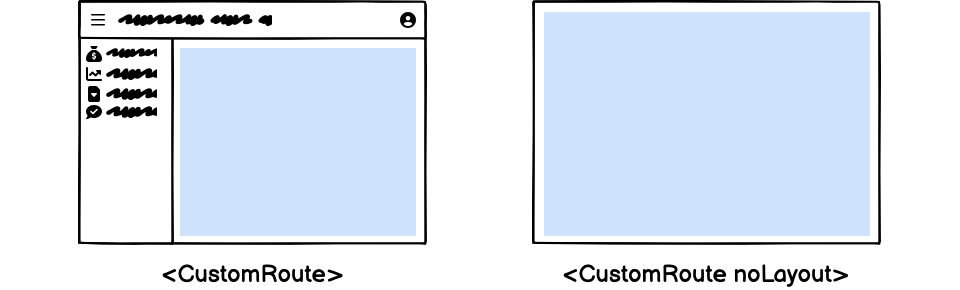

Lets you define custom pages in your ra-core application, using [react-router-dom](https://reactrouter.com/en/6/start/concepts#defining-routes) `<Routes>` elements.

<iframe src="https://www.youtube-nocookie.com/embed/aanhV-3SLtI" title="YouTube video player" frameborder="0" allow="accelerometer; autoplay; clipboard-write; encrypted-media; gyroscope; picture-in-picture; web-share" allowfullscreen style="aspect-ratio: 16 / 9;width:100%;margin-bottom:1em;" referrerpolicy="strict-origin-when-cross-origin"></iframe>

## Usage

To register your own routes, pass one or several `<CustomRoutes>` elements as children of `<CoreAdmin>`. Declare as many [react-router-dom](https://reactrouter.com/en/6/start/concepts#defining-routes) `<Route>` as you want inside them.
Alternatively, you can add your custom routes to resources. They will be available under the resource prefix.

```jsx
// in src/App.js
import { CoreAdmin, Resource, CustomRoutes } from 'ra-core';
import { Route } from "react-router-dom";

import { dataProvider } from './dataProvider';
import posts from './posts';
import comments from './comments';
import { Settings } from './Settings';
import { Profile } from './Profile';

const App = () => (
    <CoreAdmin dataProvider={dataProvider}>
        <Resource name="posts" {...posts} />
        <Resource name="comments" {...comments} />
        <CustomRoutes>
            <Route path="/settings" element={<Settings />} />
            <Route path="/profile" element={<Profile />} />
        </CustomRoutes>
    </CoreAdmin>
);

export default App;
```

Now, when a user browses to `/settings` or `/profile`, the components you defined will appear in the main part of the screen.

## `children`

`children` of the `<CustomRoutes>` component must be `<Route>` elements from [react-router-dom](https://reactrouter.com/en/6/start/concepts#defining-routes), mapping a `path` with a custom `element`.

```jsx
// in src/App.js
import { CoreAdmin, Resource, CustomRoutes } from 'ra-core';
import { Route } from "react-router-dom";

import { dataProvider } from './dataProvider';
import { Settings } from './Settings';
import { Profile } from './Profile';

const App = () => (
    <CoreAdmin dataProvider={dataProvider}>
        <CustomRoutes>
            <Route path="/settings" element={<Settings />} />
            <Route path="/profile" element={<Profile />} />
        </CustomRoutes>
    </CoreAdmin>
);

export default App;
```

You can learn more about the `<Route>` element in the [react-router-dom documentation](https://reactrouter.com/en/6/start/concepts#defining-routes).

## `noLayout`

By default, custom routes render within the application layout. If you want a custom route to render without the layout, e.g. for registration screens, then provide the `noLayout` prop on the `<CustomRoutes>` element.



Here is an example of application configuration mixing custom routes with and without layout:

```jsx
// in src/App.js
import { CoreAdmin, CustomRoutes } from 'ra-core';
import { Route } from "react-router-dom";

import { dataProvider } from './dataProvider';
import { Register } from './Register';
import { Settings } from './Settings';
import { Profile } from './Profile';

const App = () => (
    <CoreAdmin dataProvider={dataProvider}>
        <CustomRoutes noLayout>
            <Route path="/register" element={<Register />} />
        </CustomRoutes>
        <CustomRoutes>
            <Route path="/settings" element={<Settings />} />
            <Route path="/profile" element={<Profile />} />
        </CustomRoutes>
    </CoreAdmin>
);
```

As illustrated above, there can be more than one `<CustomRoutes>` element inside a `<CoreAdmin>` component.

## Securing Custom Routes

By default, custom routes can be accessed even by anomymous users. If you want to restrict access to authenticated users, use the [`<Authenticated>`](./Authenticated.md) component when defining the route.

```jsx
// in src/App.js
import { CoreAdmin, CustomRoutes, Authenticated } from 'ra-core';
import { Route } from "react-router-dom";

import { dataProvider } from './dataProvider';
import { Settings } from './Settings';

const App = () => (
    <CoreAdmin dataProvider={dataProvider}>
        <CustomRoutes>
            <Route path="/settings" element={<Authenticated><Settings /></Authenticated>} />
        </CustomRoutes>
    </CoreAdmin>
);
```


## Linking To Custom Routes

You can link to your pages using [react-router's Link component](https://reactrouter.com/en/main/components/link). Make sure to use the same value in the `<Link to>` prop as in the `<Route path>` prop.

```jsx
import { Link } from 'react-router-dom';

const SettingsButton = () => (
    <Link to="/settings">
        Settings
    </Link>
);
```

Since you're using a headless setup, you have complete control over the styling of your links.

## Sub-Routes

Sometimes you want to add more routes to a resource path. For instance, you may want to add a custom page to the `/posts` resource, such as `/posts/analytics`.

To do so, add the `<Route>` elements as [children of the `<Resource>` element](./Resource.md#children):

```jsx
import { CoreAdmin, Resource } from 'ra-core';
import { Route } from "react-router-dom";

import { dataProvider } from './dataProvider';
import posts from './posts';

const App = () => (
    <CoreAdmin dataProvider={dataProvider}>
        <Resource name="posts" {...posts}>
            <Route path="analytics" element={<PostAnalytics/>} />
        </Resource>
    </CoreAdmin>
);

// is equivalent to
const App = () => (
    <CoreAdmin dataProvider={dataProvider}>
        <Resource name="posts" {...posts} />
        <CustomRoutes>
            <Route path="/posts/analytics" element={<PostAnalytics />} />
        </CustomRoutes>
    </CoreAdmin>
);
```

This is usually useful for nested resources, such as books on authors:

```jsx
// in src/App.js
import { CoreAdmin, Resource } from 'ra-core';
import { Route } from "react-router-dom";
import { AuthorList } from './AuthorList';
import { AuthorEdit } from './AuthorEdit';

const App = () => (
    <CoreAdmin dataProvider={dataProvider}>
        <Resource name="authors" list={AuthorList} edit={AuthorEdit}>
            <Route path=":authorId/books" element={<BookList />} />
        </Resource>
    </CoreAdmin>
);

// in src/BookList.js
import { useParams } from 'react-router-dom';
import { ListBase, RecordsIterator } from 'ra-core';

const BookList = () => {
    const { authorId } = useParams();
    return (
        <ListBase resource="books" filter={{ authorId }}>
            <div>
                <h1>Books</h1>
                <ul>
                    <RecordsIterator
                        render={book => (
                            <li key={book.id}>
                                {book.title} ({book.year})
                            </li>
                        )}
                    />
                </ul>
            </div>
        </ListBase>
    );
};
```

**Tip**: In the above example, the `resource="books"` prop is required in `<ListBase>` because the `ResourceContext` defaults to `authors` inside the `<Resource name="authors">`.

Check [the `<Resource>` element documentation](./Resource.md#children) for more information.
