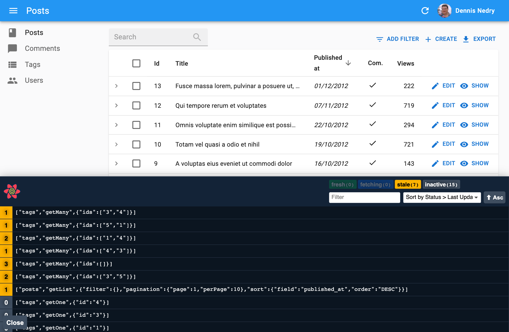

The Data Provider is the interface between ra-core and your API. It's where you write the API calls to fetch and save data.

## `<CoreAdmin dataProvider>`

The first step to using a Data Provider is to pass it to [the `<CoreAdmin>` component](./CoreAdmin.md) via the `dataProvider` prop.

For example, let's use [the Simple REST data provider](https://github.com/marmelab/react-admin/tree/master/packages/ra-data-simple-rest). This provider is suitable for REST APIs using simple GET parameters for filters and sorting.

First, install the `ra-data-simple-rest` package:

```sh
yarn add ra-data-simple-rest
```

Then, initialize the provider with the REST backend URL, and pass it as the `<CoreAdmin dataProvider>`:

```jsx
// in src/App.js
import * as React from "react";
import { CoreAdmin, Resource } from 'ra-core';
import simpleRestProvider from 'ra-data-simple-rest';

import { PostList } from './posts';

const dataProvider = simpleRestProvider('http://path.to.my.api/');

const App = () => (
    <CoreAdmin dataProvider={dataProvider}>
        <Resource name="posts" list={PostList} />
    </CoreAdmin>
);

export default App;
```

That's all it takes to make all ra-core components work with your API. They will call the data provider methods, which will in turn call the API. Here's how the Simple REST data provider maps ra-core calls to API calls:

| Method name        | API call                                                                                |
| ------------------ | --------------------------------------------------------------------------------------- |
| `getList`          | `GET http://my.api.url/posts?sort=["title","ASC"]&range=[0, 24]&filter={"title":"bar"}` |
| `getOne`           | `GET http://my.api.url/posts/123`                                                       |
| `getMany`          | `GET http://my.api.url/posts?filter={"ids":[123,456,789]}`                              |
| `getManyReference` | `GET http://my.api.url/posts?filter={"author_id":345}`                                  |
| `create`           | `POST http://my.api.url/posts`                                                          |
| `update`           | `PUT http://my.api.url/posts/123`                                                       |
| `updateMany`       | Multiple calls to `PUT http://my.api.url/posts/123`                                     |
| `delete`           | `DELETE http://my.api.url/posts/123`                                                    |
| `deleteMany`       | Multiple calls to `DELETE http://my.api.url/posts/123`                                  |

For your own API, look for a compatible data provider in the list of [supported API backends](./DataProviderList.md) or [write your own](./DataProviderWriting.md).

## React-Query Options

Ra-core uses [React Query](https://tanstack.com/query/v5/) to fetch, cache, and update data. Internally, the `<CoreAdmin>` component creates a react-query [`QueryClient`](https://tanstack.com/query/v5/docs/react/reference/QueryClient) on mount, using [react-query's "aggressive but sane" defaults](https://tanstack.com/query/v5/docs/react/guides/important-defaults):

* Queries consider cached data as stale
* Stale queries are refetched automatically in the background when:
  * New instances of the query mount
  * The window is refocused
  * The network is reconnected
  * The query is optionally configured with a refetch interval
* Query results that are no longer used in the current page are labeled as "inactive" and remain in the cache in case they are used again later.
* By default, "inactive" queries are garbage collected after 5 minutes.
* Queries that fail are silently retried 3 times, with exponential backoff delay before capturing and displaying an error notification to the UI.
* Query results by default are structurally shared to detect if data has actually changed, and if not, the data reference remains unchanged to better help with value stabilization in regard to `useMemo` and `useCallback`.

If you want to override the react-query default query and mutation options, or use a specific client or mutation cache, you can create your own `QueryClient` instance and pass it to the `<CoreAdmin queryClient>` prop:

```jsx
import { CoreAdmin } from 'ra-core';
import { QueryClient } from '@tanstack/react-query';

const queryClient = new QueryClient({
    defaultOptions: {
        queries: {
            retry: false,
            structuralSharing: false,
        },
        mutations: {
            retryDelay: 10000,
        },
    },
});

const App = () => (
    <CoreAdmin queryClient={queryClient} dataProvider={...}>
        ...
    </CoreAdmin>
);
```

To know which options you can pass to the `QueryClient` constructor, check the [react-query documentation](https://tanstack.com/query/v5/docs/react/reference/QueryClient) and the [query options](https://tanstack.com/query/v5/docs/react/reference/useQuery) and [mutation options](https://tanstack.com/query/v5/docs/react/reference/useMutation) sections.

The settings that ra-core developers often overwrite are:

```jsx
import { QueryClient } from '@tanstack/react-query';

const queryClient = new QueryClient({
    defaultOptions: {
        queries: {
            /**
             * The time in milliseconds after data is considered stale.
             * If set to `Infinity`, the data will never be considered stale.
             */
            staleTime: 10000,
            /**
             * If `false`, failed queries will not retry by default.
             * If `true`, failed queries will retry infinitely., failureCount: num
             * If set to an integer number, e.g., 3, failed queries will retry until the failed query count meets that number.
             * If set to a function `(failureCount, error) => boolean`, failed queries will retry until the function returns false.
             */
            retry: false,
            /**
             * If set to `true`, the query will refetch on window focus if the data is stale.
             * If set to `false`, the query will not refetch on window focus.
             * If set to `'always'`, the query will always refetch on window focus.
             * If set to a function, the function will be executed with the latest data and query to compute the value.
             * Defaults to `true`.
             */
            refetchOnWindowFocus: false,
        },
    },
});
```

You can also set custom options on a per-query basis. All data provider hooks accept a react-query options parameter. For instance, to disable retries for a specific update mutation:

```jsx
const [update] = useUpdate(
    'posts',
    { id: 123, is_published: true },
    { retry: false }
);
```

Refer to the documentation of each data provider hook for more details on the options you can pass.

Ra-core components using the data provider also accept a `queryOptions` prop to pass options to the underlying react-query hooks. For instance, specify a custom `staleTime` for a `<ListBase>` component:

```jsx
import { ListBase } from 'ra-core';

const PostList = () => (
    <ListBase queryOptions={{ staleTime: 60000 }}>
        ...
    </ListBase>
);
```

Look for the `queryOptions` and `mutationOptions` props in the documentation of each ra-core component to know which options you can pass.

## Enabling Query Logs

Ra-core uses `react-query` to call the Data Provider. You can view all `react-query` calls in the browser using the [react-query devtools](https://tanstack.com/query/v5/docs/react/devtools).



To enable these devtools, install `@tanstack/react-query-devtools` and add the `<ReactQueryDevtools>` component to a custom layout:

```jsx
import { ReactQueryDevtools } from '@tanstack/react-query-devtools'

export const MyLayout = ({ children }) => (
    <div>
        {children}
        <ReactQueryDevtools initialIsOpen={false} />
    </div>
);
```

Then use this layout in `<CoreAdmin>`:

```jsx
import { CoreAdmin, Resource } from 'ra-core';

import { dataProvider } from './dataProvider';
import { MyLayout } from './MyLayout';

export const App = () => (
    <CoreAdmin dataProvider={dataProvider} layout={MyLayout}>
        <Resource name="posts" list={PostList} />
    </CoreAdmin>
);
```

**Tip**: By default, React Query Devtools are only included in development bundles (`process.env.NODE_ENV === 'development'`), so they won't be part of production builds.

**Tip**: Some Data Providers have their own logging system. For example, [the `ra-data-fakerest` package](https://github.com/marmelab/react-admin/tree/master/packages/ra-data-fakerest) logs all REST API calls to the browser console when `true` is passed as a second argument:

```jsx
// in src/App.js
import * as React from "react";
import { CoreAdmin, Resource } from 'ra-core';
import fakeDataProvider from 'ra-data-fakerest';

const dataProvider = fakeDataProvider({ /* data here */ }, true);

const App = () => (
    <CoreAdmin dataProvider={dataProvider}>
        // ...
    </CoreAdmin>
);
```

## Handling Authentication

Ra-core uses the `dataProvider` to fetch data and the [`authProvider`](./Authentication.md) to handle authentication. The `authProvider` typically stores an authentication token, shares it with the `dataProvider` (often via `localStorage`), which then adds it to HTTP headers for API requests.

For example, here's how to use a token returned during the login process to authenticate all requests to the API via a Bearer token, using the Simple REST data provider:

```js
// in authProvider.js
const authProvider = {
    async login({ username, password })  {
        const request = new Request('https://mydomain.com/authenticate', {
            method: 'POST',
            body: JSON.stringify({ username, password }),
            headers: new Headers({ 'Content-Type': 'application/json' }),
        });
        let response;
        try {
            response = await fetch(request);
        } catch (_error) {
            throw new Error('Network error');
        }
        if (response.status < 200 || response.status >= 300) {
            throw new Error(response.statusText);
        }
        const { token } = await response.json();
        localStorage.setItem('token', token);
    },
    // ...
};

// in dataProvider.js
import { fetchUtils } from 'ra-core';
import simpleRestProvider from 'ra-data-simple-rest';

const fetchJson = (url, options = {}) => {
    options.user = {
        authenticated: true,
        // use the token from local storage
        token: localStorage.getItem('token')
    };
    return fetchUtils.fetchJson(url, options);
};
const dataProvider = simpleRestProvider('http://path.to.my.api/', fetchJson);
```

Now all requests to the REST API will include following header:

```
Authorization: Bearer YOUR_TOKEN_HERE
```

In this example, the `simpleRestProvider` accepts a second parameter to set authentication. Each Data Provider has its own way of accepting credentials. Refer to the documentation of your Data Provider for details.

## Adding Custom Headers

The `dataProvider` doesn't "speak" HTTP, so it doesn't have the concept of HTTP headers. If you need to pass custom headers to the API, the syntax depends on the Data Provider you use.

For instance, the `simpleRestProvider` function accepts an HTTP client function as its second argument. By default, it uses ra-core's [`fetchUtils.fetchJson()`](./fetchJson.md) function as the HTTP client. It's similar to the HTML5 `fetch()`, except it handles JSON decoding and HTTP error codes automatically.

To add custom headers to your requests, you can *wrap* the `fetchJson()` call inside your own function:

```jsx
import { fetchUtils, CoreAdmin, Resource } from 'ra-core';
import simpleRestProvider from 'ra-data-simple-rest';

const fetchJson = (url, options = {}) => {
    if (!options.headers) {
        options.headers = new Headers({ Accept: 'application/json' });
    }
    // add your own headers here
    options.headers.set('X-Custom-Header', 'foobar');
    return fetchUtils.fetchJson(url, options);
}
const dataProvider = simpleRestProvider('http://path.to.my.api/', fetchJson);

const App = () => (
    <CoreAdmin dataProvider={dataProvider}>
        <Resource name="posts" list={PostList} />
    </CoreAdmin>
);
```

**Tip**: For TypeScript users, here is a typed version of the `fetchJson` function:

```ts
import { fetchUtils } from "ra-core";

const fetchJson = (url: string, options: fetchUtils.Options = {}) => {
    const customHeaders = (options.headers ||
        new Headers({
            Accept: 'application/json',
        })) as Headers;
    // add your own headers here
    customHeaders.set('X-Custom-Header', 'foobar');
    options.headers = customHeaders;
    return fetchUtils.fetchJson(url, options);
}
```

Now all the requests to the REST API will contain the `X-Custom-Header: foobar` header.

**Tip:** Have a look at the [`fetchJson` documentation](./fetchJson.md) to learn more about its features.

**Warning**: If your API is on a different domain than your JS code, you'll need to expose this header using the `Access-Control-Expose-Headers` [CORS](https://developer.mozilla.org/en-US/docs/Web/HTTP/Access_control_CORS) header:

```
Access-Control-Expose-Headers: X-Custom-Header
```

This must be done on the server side.

## Embedding Relationships

Some API backends with knowledge of the relationships between resources can embed related records in the response.

For instance, JSON Server can return a post and its author in a single response:

```txt
GET /posts/123?embed=author
```

```json
{
    "id": 123,
    "title": "Hello, world",
    "author_id": 456,
    "author": {
        "id": 456,
        "name": "John Doe"
    }
}
```

Data providers implementing this feature often use the `meta` key in the query parameters to pass the embed parameter to the API.

```jsx
const { data } = useGetOne('posts', { id: 123, meta: { embed: ['author'] } });
```

Leveraging embeds can reduce the number of requests made by ra-core to the API, and thus improve the app's performance.

For example, this allows you to display data from a related resource without making an additional request (and without using a `<ReferenceFieldBase>`).

```diff
const PostList = () => (
-   <ListBase>
+   <ListBase queryOptions={{ meta: { embed: ["author"] } }}>
        <DataTable>
            <DataTable.Col source="title" />
-           <DataTable.Col source="author_id">
-               <ReferenceFieldBase source="author_id" reference="authors>
-                   <TextField source="name" />
-               </ReferenceFieldBase>
-           </DataTable.Col>
+           <DataTable.Col source="author.name" />
        </DataTable>
    </ListBase>
);
```

Refer to your data provider's documentation to verify if it supports this feature. If you're writing your own data provider, check the [Writing a Data Provider](./DataProviderWriting.md#embedded-data) documentation for more details.

**Note**: Embeds are a double-edged sword. They can make the response larger and break the sharing of data between pages. Measure the performance of your app before and after using embeds to ensure they are beneficial.

## Prefetching Relationships

Some API backends can return related records in the same response as the main record. For instance, an API may return a post and its author in a single response:

```jsx
const { data, meta } = useGetOne('posts', { id: 123, meta: { prefetch: ['author']} });
```

```json
{
    "data": {
        "id": 123,
        "title": "Hello, world",
        "author_id": 456,
    },
    "meta": {
        "prefetched": {
            "authors": [{ "id": 456, "name": "John Doe" }]
        }
    }
}
```

This is called *prefetching* or *preloading*.

Ra-core can use this feature to populate its cache with related records, and avoid subsequent requests to the API. The prefetched records must be returned in the `meta.prefetched` key of the data provider response.

For example, you can use prefetching to display the author's name in a post list without making an additional request:

```jsx
const PostList = () => (
    <ListBase queryOptions={{ meta: { prefetch: ['author'] }}}>
        <DataTable>
            <DataTable.Col source="title" />
            <DataTable.Col source="author_id">
                {/** renders without an additional request */}
                <ReferenceFieldBase source="author_id" reference="authors">
                    <TextField source="name" />
                </ReferenceFieldBase>
            </DataTable.Col>
        </DataTable>
    </ListBase>
);
```

The way to *ask* for embedded resources isn't normalized and depends on the API. The above example uses the `meta.prefetch` query parameter. Some APIs may use [the `embed` query parameter](#embedding-relationships) to indicate prefetching.

 Refer to your data provider's documentation to verify if it supports prefetching. If you're writing your own data provider, check the [Writing a Data Provider](./DataProviderWriting.md#embedded-data) documentation for more details.

## Query Cancellation

Ra-core supports [Query Cancellation](https://tanstack.com/query/latest/docs/framework/react/guides/query-cancellation). When a component unmounts, any pending query is canceled, preventing outdated side effects and unnecessary network requests.

To enable this feature, set the `supportAbortSignal` property to `true` on your data provider:

```tsx
const dataProvider = simpleRestProvider('https://myapi.com');
dataProvider.supportAbortSignal = true;
```

Each data provider call will receive an additional `signal` parameter, an [AbortSignal](https://developer.mozilla.org/en-US/docs/Web/API/AbortSignal). Pass this signal to your fetch calls:

```tsx
const dataProvider = {
    getOne: async (resource, params) => {
        const url = `${API_URL}/${resource}/${params.id}`;
        const options = { signal: params.signal };
        const res = await fetch(url, options);
        if (!res.ok) {
            throw new HttpError(res.statusText);
        }
        return res.json();
    },
};
```

Some data providers, like `ra-data-simple-rest`, already support query cancellation. Check their documentation for details.

**Note**: If your app uses [`<React.StrictMode>`](https://react.dev/reference/react/StrictMode), query cancellation may duplicate API queries in development, but this won't happen in production.

## Adding Lifecycle Callbacks

<iframe src="https://www.youtube-nocookie.com/embed/o8U-wjfUwGk" title="YouTube video player" frameborder="0" allow="accelerometer; autoplay; clipboard-write; encrypted-media; gyroscope; picture-in-picture; web-share" allowfullscreen style="aspect-ratio: 16 / 9;width:100%;margin-bottom:1em;" referrerpolicy="strict-origin-when-cross-origin"></iframe>

It often happens that you need specific data logic to be executed before or after a dataProvider call. For instance, you may want to delete the comments related to a post before deleting the post itself. The general advice is to **put that code on the server-side**. If you can't, the next best place to put this logic is the `dataProvider`.

You can, of course, use `if` statements in the `dataProvider` methods to execute the logic only for the resources that need it, like so:

```jsx
const dataProvider = {
    // ...
    delete: async (resource, params) => {
        if (resource === 'posts') {
            // delete all comments related to the post
            // first, fetch the comments
            const { data: comments } = await httpClient(`${apiUrl}/comments?post_id=${params.id}`);
            // then, delete them
            await Promise.all(comments.map(comment => httpClient(`${apiUrl}/comments/${comment.id}`, {
                method: 'DELETE',
            })));
        }
        // fallback to the default implementation
        const { data } = await httpClient(`${apiUrl}/${resource}/${params.id}`, {
            method: 'DELETE',
        });

        return { data };
    },
    // ...
}
```

But the `dataProvider` code quickly becomes hard to read and maintain. Ra-core provides a helper function to make it easier to add lifecycle callbacks to the dataProvider: `withLifecycleCallbacks`:

```jsx
import { withLifecycleCallbacks } from 'ra-core';

const dataProvider = withLifecycleCallbacks(baseDataProvider, [
    {
        resource: 'posts',
        beforeDelete: async (params, dataProvider) => {
            // delete all comments related to the post
            // first, fetch the comments
            const { data: comments } = await dataProvider.getList('comments', {
                filter: { post_id: params.id },
                pagination: { page: 1, perPage: 1000 },
                sort: { field: 'id', order: 'DESC' },
            });
            // then, delete them
            await dataProvider.deleteMany('comments', { ids: comments.map(comment => comment.id) });

            return params;
        },
    },
]);
```

Check the [withLifecycleCallbacks](./withLifecycleCallbacks.md) documentation for more details.

## Combining Data Providers

If you need to build an app relying on more than one API, you may face a problem: the `<CoreAdmin>` component accepts only one `dataProvider` prop. You can combine multiple data providers into one using the `combineDataProviders` helper. It expects a function as a parameter accepting a resource name and returning a data provider for that resource.

<iframe src="https://www.youtube-nocookie.com/embed/x9EZk0i6VHw" title="YouTube video player" frameborder="0" allow="accelerometer; autoplay; clipboard-write; encrypted-media; gyroscope; picture-in-picture; web-share" allowfullscreen style="aspect-ratio: 16 / 9;width:100%;margin-bottom:1em;" referrerpolicy="strict-origin-when-cross-origin"></iframe>

For instance, the following app uses `ra-data-simple-rest` for the `posts` and `comments` resources, and `ra-data-local-storage` for the `user` resource:

```jsx
import buildRestProvider from 'ra-data-simple-rest';
import buildStorageProvider from 'ra-data-local-storage';
import { CoreAdmin, Resource, combineDataProviders } from 'ra-core';

const dataProvider1 = buildRestProvider('http://path.to.my.api/');
const dataProvider2 = buildStorageProvider();

const dataProvider = combineDataProviders((resource) => {
    switch (resource) {
        case 'posts':
        case 'comments':
            return dataProvider1;
        case 'users':
            return dataProvider2;
        default:
            throw new Error(`Unknown resource: ${resource}`);
    }
});

export const App = () => (
    <CoreAdmin dataProvider={dataProvider}>
        <Resource name="posts" list={PostList} />
        <Resource name="comments" list={CommentList} />
        <Resource name="users" list={UserList} />
    </CoreAdmin>
);
```

If the choice of dataProvider doesn't only rely on the resource name, or if you want to manipulate the resource name, combine Data Providers manually using a JavaScript `Proxy` object.

For instance, you can prefix your resource names to facilitate the API selection:

```jsx
import buildRestProvider from 'ra-data-simple-rest';
import buildStorageProvider from 'ra-data-local-storage';
import { CoreAdmin, Resource, defaultDataProvider } from 'ra-core';

const dataProvider1 = buildRestProvider('http://path.to.my.api/');
const dataProvider2 = buildStorageProvider();

const dataProvider = new Proxy(defaultDataProvider, {
    get: (target, name) => {
        return (resource, params) => {
            if (typeof name === 'symbol' || name === 'then') {
                return;
            }
            if (resource.startsWith('api1/')) {
                return dataProvider1[name](resource.substring(5), params);
            }
            if (resource.startsWith('api2/')) {
                return dataProvider2[name](resource.substring(5), params);
            }
        }
    },
});

export const App = () => (
    <CoreAdmin dataProvider={dataProvider}>
        <Resource name="api1/posts" list={PostList} />
        <Resource name="api1/comments" list={CommentList} />
        <Resource name="api2/users" list={UserList} />
    </CoreAdmin>
);
```

## Handling File Uploads

When a user submits a form with a file input, the `dataProvider` method (`create` or `update`) receives a [File object](https://developer.mozilla.org/en-US/docs/Web/API/File). You can handle this file in various ways depending on your server:

* [Send files as Base64 strings](#sending-files-in-base64) using the [`FileReader`](https://developer.mozilla.org/en-US/docs/Web/API/FileReader) API.
* [Send files using `multipart/form-data`](#sending-files-in-multipartform-data) to include the record data and files in one query.
* [Upload files to a third-party service](#sending-files-to-a-third-party-service) like a CDN.

### Sending Files in Base64

This `dataProvider` extends an existing provider to convert images passed to `dataProvider.update('posts')` into Base64 strings. It uses [`withLifecycleCallbacks`](#adding-lifecycle-callbacks) to modify the `dataProvider.update()` method for the `posts` resource only.

```tsx
import { withLifecycleCallbacks, DataProvider } from 'ra-core';
import simpleRestProvider from 'ra-data-simple-rest';

const dataProvider = withLifecycleCallbacks(simpleRestProvider('http://path.to.my.api/'), [
    {
        /**
         * For posts update only, convert uploaded images to base 64 and attach them to
         * the `picture` sent property, with `src` and `title` attributes.
         */
        resource: 'posts',
        beforeUpdate: async (params: any, dataProvider: DataProvider) => {
            // Freshly dropped pictures are File objects and must be converted to base64 strings
            const newPictures = params.data.pictures.filter(
                p => p.rawFile instanceof File
            );
            const formerPictures = params.data.pictures.filter(
                p => !(p.rawFile instanceof File)
            );

            const base64Pictures = await Promise.all(
                newPictures.map(convertFileToBase64)
            )
            
            const pictures = [
                ...base64Pictures.map((dataUrl, index) => ({
                    src: dataUrl,
                    title: newPictures[index].title,
                })),
                ...formerPictures,
            ];

            return {
                ...params,
                data: {
                    ...params.data,
                    pictures,
                }
            };
        }
    }
]);

/**
 * Convert a `File` object returned by the upload input into a base 64 string.
 * That's not the most optimized way to store images in production, but it's
 * enough to illustrate the idea of dataprovider decoration.
 */
const convertFileToBase64 = file =>
    new Promise((resolve, reject) => {
        const reader = new FileReader();
        reader.onload = () => resolve(reader.result);
        reader.onerror = reject;
        reader.readAsDataURL(file.rawFile);
    });

export default myDataProvider;
```

**Tip**: Use `beforeSave` instead of `beforeUpdate` to apply the same logic for both create and update calls.

### Sending Files in `multipart/form-data`

Another alternative is to upload files using the [FormData](https://developer.mozilla.org/en-US/docs/Web/API/FormData) API. This format is similar to how HTML forms handle file uploads.

The `dataProvider` example below extends an existing provider and tweaks the `create` and `update` methods for the `posts` resource only:

* Checks if the resource is `posts`.
* Creates a new `FormData` object with the `post` data and the file.
* Sends this `FormData` to the API using [`fetchUtils.fetchJson()`](./fetchJson.md).

```tsx
import simpleRestDataProvider from "ra-data-simple-rest";
import {
  CreateParams,
  UpdateParams,
  DataProvider,
  fetchUtils,
} from "ra-core";

const endpoint = "http://path.to.my.api";
const baseDataProvider = simpleRestDataProvider(endpoint);

type PostParams = {
  id: string;
  title: string;
  content: string;
  picture: {
    rawFile: File;
    src?: string;
    title?: string;
  };
};

const createPostFormData = (
  params: CreateParams<PostParams> | UpdateParams<PostParams>
) => {
  const formData = new FormData();
  params.data.picture?.rawFile && formData.append("file", params.data.picture.rawFile);
  params.data.title && formData.append("title", params.data.title);
  params.data.content && formData.append("content", params.data.content);

  return formData;
};

export const dataProvider: DataProvider = {
  ...baseDataProvider,
  create: (resource, params) => {
    if (resource === "posts") {
      const formData = createPostFormData(params);
      return fetchUtils
        .fetchJson(`${endpoint}/${resource}`, {
          method: "POST",
          body: formData,
        })
        .then(({ json }) => ({ data: json }));
    }
    return baseDataProvider.create(resource, params);
  },
  update: (resource, params) => {
    if (resource === "posts") {
      const formData = createPostFormData(params);
      formData.append("id", params.id);
      return fetchUtils
        .fetchJson(`${endpoint}/${resource}`, {
          method: "PUT",
          body: formData,
        })
        .then(({ json }) => ({ data: json }));
    }
    return baseDataProvider.update(resource, params);
  },
};
```

### Sending Files to a Third-Party Service

A common approach for handling file uploads in SPAs is to upload the file to a CDN (e.g., [Cloudinary](https://cloudinary.com/), [CloudImage](https://www.cloudimage.io/en/home)), then use the file URL in the record.

Here is an example of uploading files to Cloudinary by adapting the `dataProvider` to use their [authenticated requests](https://cloudinary.com/documentation/upload_images#authenticated_requests).

The signature required by Cloudinary can be generated using the [`cloudinary` package](https://cloudinary.com/documentation/node_integration#installation_and_setup). Below is a simplified Remix loader that provides this signature:

```ts
import { LoaderFunctionArgs, json } from "@remix-run/node";
import cloudinary from "cloudinary";

export const loader = ({ request }: LoaderFunctionArgs) => {
  cloudinary.v2.config({
    api_key: process.env.CLOUDINARY_API_KEY,
    api_secret: process.env.CLOUDINARY_API_SECRET,
    cloud_name: process.env.CLOUDINARY_CLOUD_NAME,
    secure: false,
  });

  const timestamp = Math.round(new Date().getTime() / 1000);
  const signature = cloudinary.v2.utils.api_sign_request(
    { timestamp },
    process.env.CLOUDINARY_API_SECRET as string
  );

  return json({
    timestamp,
    signature,
    cloud_name: process.env.CLOUDINARY_CLOUD_NAME,
    api_key: process.env.CLOUDINARY_API_KEY,
  });
};
```

The `dataProvider` example below modifies the `create` and `update` methods for the `posts` resource:

* Retrieves a Cloudinary signature.
* Creates a `FormData` object with the file.
* Sends the file to Cloudinary.
* Updates `params.picture` with the Cloudinary URL.

```ts
// dataProvider.ts
import { DataProvider, withLifecycleCallbacks } from "ra-core";
import simpleRestProvider from "ra-data-simple-rest";

type CloudinaryFile = {
  asset_id: string;
  secure_url: string;
};

type SignData = {
  api_key: string;
  timestamp: string;
  signature: string;
  cloud_name: string;
};

const endpoint = "http://path.to.my.api";

const dataProvider = withLifecycleCallbacks(
  simpleRestProvider(endpoint),
  [
    {
      resource: "posts",
      beforeSave: async (params: any, dataProvider: DataProvider) => {
        const response = await fetch(
          `${endpoint}/get-cloudinary-signature`,
          { method: "GET" }
          // should send headers with correct authentications
        );

        const signData: SignData = await response.json();

        const url = `https://api.cloudinary.com/v1_1/${signData.cloud_name}/auto/upload`;

        const formData = new FormData();
        formData.append("file", params.picture.rawFile);
        formData.append("api_key", signData.api_key);
        formData.append("timestamp", signData.timestamp);
        formData.append("signature", signData.signature);

        const imageResponse = await fetch(url, {
          method: "POST",
          body: formData,
        });

        const image: CloudinaryFile = await imageResponse.json();

        return {
          ...params,
          picture: {
            src: image.secure_url,
            title: image.asset_id,
          },
        };
      },
    },
  ]
);
```

Refer to the [Cloudinary Get Started doc](https://cloudinary.com/documentation/programmable_media_overview) for more details.

## Async Initialization

Some Data Providers need an asynchronous initialization phase (e.g., to connect to the API). To use such Data Providers, initialize them *before* rendering ra-core resources, leveraging React's `useState` and `useEffect`.

For instance, the `ra-data-hasura` data provider needs to be initialized:

```jsx
import React, { useState, useEffect } from 'react';
import buildHasuraProvider from 'ra-data-hasura';
import { CoreAdmin, Resource } from 'ra-core';

import { PostCreate, PostEdit, PostList } from './posts';

const App = () => {
    // start with an empty data provider
    const [dataProvider, setDataProvider] = useState(null);

    // initialize on mount
    useEffect(() => {
        buildHasuraProvider({
            clientOptions: { uri: 'http://localhost:8080/v1/graphql' }
        }).then(provider => setDataProvider(() => provider));
    }, []);

    // hide the admin until the data provider is ready
    if (!dataProvider) return <p>Loading...</p>;

    return (
        <CoreAdmin dataProvider={dataProvider}>
            <Resource name="Post" list={PostList} edit={PostEdit} create={PostCreate} />
        </CoreAdmin>
    );
};

export default App;
```

**Tip**: This example uses the function version of `setState` (`setDataProvider(() => dataProvider)`) instead of the more classic version (`setDataProvider(dataProvider)`). This is because some legacy Data Providers are actually functions, and `setState` would call them immediately on mount.

## Offline Support

React-admin supports offline/local-first applications. To enable this feature, install the following react-query packages:

```sh
yarn add @tanstack/react-query-persist-client @tanstack/query-async-storage-persister
```

Then, register default functions for react-admin mutations on the `QueryClient` to enable resumable mutations (mutations triggered while offline). React-admin provides the `addOfflineSupportToQueryClient` function for this:

```ts
// in src/queryClient.ts
import { addOfflineSupportToQueryClient } from 'ra-core';
import { QueryClient } from '@tanstack/react-query';
import { dataProvider } from './dataProvider';

const baseQueryClient = new QueryClient();

export const queryClient = addOfflineSupportToQueryClient({
    queryClient: baseQueryClient,
    dataProvider,
    resources: ['posts', 'comments'],
});
```

Finally, wrap your `<Admin>` inside a [`<PersistQueryClientProvider>`](https://tanstack.com/query/latest/docs/framework/react/plugins/persistQueryClient#persistqueryclientprovider):


```tsx
// in src/App.tsx
import { CoreAdmin, Resource } from 'ra-core';
import { PersistQueryClientProvider } from '@tanstack/react-query-persist-client';
import { createAsyncStoragePersister } from '@tanstack/query-async-storage-persister';
import { queryClient } from './queryClient';
import { dataProvider } from './dataProvider';
import { posts } from './posts';
import { comments } from './comments';

const localStoragePersister = createAsyncStoragePersister({
    storage: window.localStorage,
});

export const App = () => (
    <PersistQueryClientProvider
        client={queryClient}
        persistOptions={{ persister: localStoragePersister }}
        onSuccess={() => {
            // resume mutations after initial restore from localStorage is successful
            queryClient.resumePausedMutations();
        }}
    >
        <CoreAdmin queryClient={queryClient} dataProvider={dataProvider}>
            <Resource name="posts" {...posts} />
            <Resource name="comments" {...comments} />
        </CoreAdmin>
    </PersistQueryClientProvider>
)
```


This is enough to make all the standard react-admin features support offline scenarios.

## Adding Offline Support To Custom Mutations

If you have [custom mutations](./Actions.md#calling-custom-methods) on your dataProvider, you can enable offline support for them too. For instance, if your `dataProvider` exposes a `banUser()` method:

```ts
const dataProvider = {
    getList: /* ... */,
    getOne: /* ... */,
    getMany: /* ... */,
    getManyReference: /* ... */,
    create: /* ... */,
    update: /* ... */,
    updateMany: /* ... */,
    delete: /* ... */,
    deleteMany: /* ... */,
    banUser: (userId: string) => {
        return fetch(`/api/user/${userId}/ban`, { method: 'POST' })
            .then(response => response.json());
    },
}

export type MyDataProvider = DataProvider & {
    banUser: (userId: string) => Promise<{ data: RaRecord }>
}
```

First, you must set a `mutationKey` for this mutation:


```tsx
const BanUserButton = ({ userId }: { userId: string }) => {
    const dataProvider = useDataProvider();
    const { mutate, isPending } = useMutation({
        mutationKey: ['banUser'],
        mutationFn: (userId) => dataProvider.banUser(userId)
    });
    return <button onClick={() => mutate(userId)} disabled={isPending}>Ban</button>;
};
```


**Tip**: Note that unlike the [_Calling Custom Methods_ example](./Actions.md#calling-custom-methods), we passed `userId` to the `mutate` function. This is necessary so that React Query passes it too to the default function when resuming the mutation.

Then, register a default function for it:

```ts
// in src/queryClient.ts
import { addOfflineSupportToQueryClient } from 'ra-core';
import { QueryClient } from '@tanstack/react-query';
import { PersistQueryClientProvider } from '@tanstack/react-query-persist-client';
import { createSyncStoragePersister } from '@tanstack/query-sync-storage-persister';
import { dataProvider } from './dataProvider';

const baseQueryClient = new QueryClient();

export const queryClient = addOfflineSupportToQueryClient({
    queryClient: baseQueryClient,
    dataProvider,
    resources: ['posts', 'comments'],
});

queryClient.setMutationDefaults('banUser', {
    mutationFn: async (userId) => {
        return dataProvider.banUser(userId);
    },
});
```
