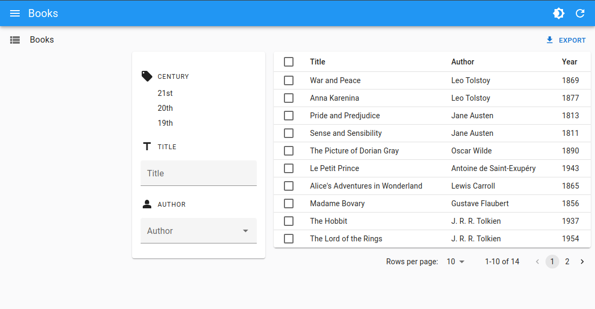

This component offers a convenient way to create a form that automatically updates the filters when the user changes its child input values.

It fits nicely alongside a filter list component, but you can also use it at other places to create your own filter UI.

<video controls autoplay playsinline muted loop>
  <source src="../img/FilterLiveForm.mp4" type="video/mp4"/>
  Your browser does not support the video tag.
</video>

## Usage

Use `<FilterLiveForm>` inside a component that provides a [`ListContext`](./useListContext.md), such as [`<ListBase>`](./ListBase.md). Use any React Admin input component (i.e. leveraging [`useInput`](./useInput.md)) as its children.

Here is an example showing how you can use `<FilterLiveForm>` with input components:

```tsx
import * as React from 'react';
import {
    FilterLiveForm,
    ListBase,
    ReferenceFieldBase,
    ReferenceInputBase,
    useListContext,
} from 'ra-core';
import { TextInput } from './TextInput';
import { AutocompleteInput } from './AutocompleteInput';

const BookListAside = () => (
    <div style={{ marginRight: '1rem', marginTop: '3rem', width: '250px' }}>
        <div>
            <div>
                <h4>Title</h4>
                <FilterLiveForm>
                    <TextInput source="title" />
                </FilterLiveForm>
            </div>
            <div>
                <h4>Author</h4>
                <FilterLiveForm>
                    <ReferenceInputBase source="authorId" reference="authors">
                        <AutocompleteInput />
                    </ReferenceInputBase>
                </FilterLiveForm>
            </div>
        </div>
    </div>
);

const BookTable = () => {
    const { data } = useListContext();
    
    return (
        <table>
            <thead>
                <tr>
                    <th>Title</th>
                    <th>Author</th>
                    <th>Year</th>
                </tr>
            </thead>
            <tbody>
                {data.map(record => (
                    <tr key={record.id}>
                        <td>{record.title}</td>
                        <td>
                            <ReferenceFieldBase 
                                source="authorId" 
                                reference="authors"
                                render={({ record: author }) => author?.name || record.authorId}
                            />
                        </td>
                        <td>{record.year}</td>
                    </tr>
                ))}
            </tbody>
        </table>
    );
};

export const BookList = () => (
    <ListBase>
        <div style={{ display: 'flex' }}>
            <BookListAside />
            <BookTable />
        </div>
    </ListBase>
);
```



**Tip:** `<FilterLiveForm>` accepts multiple children, but you can also use several `<FilterLiveForm>` components in the same filter UI, just like we did above.

## Props

Here are all the props you can set on the `<FilterLiveForm>` component:

| Prop            | Required | Type                | Default              | Description                                                              |
| --------------- | -------- | ------------------- | -------------------- | ------------------------------------------------------------------------ |
| `children`      | Required | `ReactNode`         | -                    | The children of the filter form (usually inputs)                         |
| `formComponent` | Optional | React Component     | Native HTML `<form>` | A React Component used to render the form                                |
| `debounce`      | Optional | `number` or `false` | 500                  | The debounce delay to set the filters (pass `false` to disable debounce) |
| `validate`      | Optional | `function`          | -                    | A function to validate the form values                                   |

Additional props are passed to `react-hook-form`'s [`useForm` hook](https://react-hook-form.com/docs/useform).

## `children`

`<FilterLiveForm>` accepts any children. It simply provides the required contexts for the inputs to work as filters.

```tsx
import { FilterLiveForm } from 'ra-core';
import { TextInput } from './TextInput';

<FilterLiveForm>
    <TextInput source="title" />
    <TextInput source="author" />
</FilterLiveForm>
```

**Tip:** Input components must be ra-core inputs, i.e. inputs that leverage the [`useInput`](./useInput.md) hook.

## `debounce`

You can use the `debounce` prop to customize the delay before the filters are applied. The default value is `500` milliseconds.

```tsx
import { FilterLiveForm } from 'ra-core';
import { TextInput } from './TextInput';

<FilterLiveForm debounce={1000}>
    <TextInput source="title" />
    <TextInput source="author" />
</FilterLiveForm>
```

You can also disable the debounce by setting the `debounce` prop to `false`.

```tsx
import { FilterLiveForm } from 'ra-core';
import { TextInput } from './TextInput';

<FilterLiveForm debounce={false}>
    <TextInput source="title" />
    <TextInput source="author" />
</FilterLiveForm>
```

## `validate`

Just like for [`<Form>`](./Form.md), you can provide a `validate` function to validate the form values.

```tsx
import { FilterLiveForm } from 'ra-core';
import { TextInput } from './TextInput';

const validateFilters = values => {
    const errors: any = {};
    if (!values.author) {
        errors.author = 'The author is required';
    }
    return errors;
};

const GlobalValidation = () => (
    <FilterLiveForm validate={validateFilters}>
        <TextInput source="title" />
        <TextInput source="author" />
    </FilterLiveForm>
);
```
