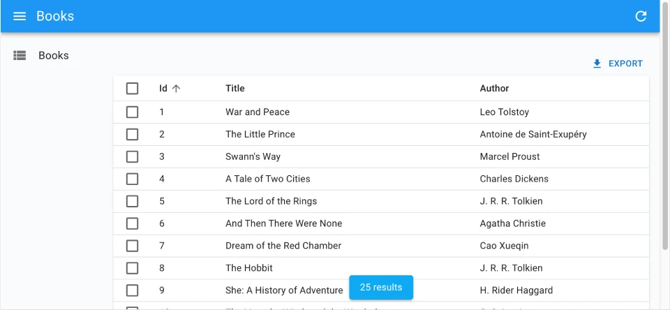

The `<InfiniteListBase>` component is a headless version of the infinite list functionality. It fetches records from the data provider and provides infinite scrolling capabilities through a [`ListContext`](./useListContext.md), but doesn't render any UI by itself. This allows you to create fully custom list layouts with infinite loading.

<video controls autoplay playsinline muted loop width="100%">
  <source src="../img/infinite-book-list.webm" poster="../img/infinite-book-list.webp" type="video/webm">
  Your browser does not support the video tag.
</video>

`<InfiniteListBase>` fetches the list of records from the data provider using the `useInfiniteListController` hook and provides the data through a context. You have complete control over how to render the list of records.

## Usage

Here is the minimal code necessary to display a list of books with infinite scroll:

```jsx
// in src/books.js
import { InfiniteListBase, useListContext, useInfinitePaginationContext } from 'ra-core';

const BookTable = () => {
    const { data, isPending } = useListContext();
    
    if (isPending) {
        return <div>Loading...</div>;
    }
    
    return (
        <table>
            <thead>
                <tr>
                    <th>ID</th>
                    <th>Title</th>
                    <th>Author</th>
                </tr>
            </thead>
            <tbody>
                {data.map(book => (
                    <tr key={book.id}>
                        <td>{book.id}</td>
                        <td>{book.title}</td>
                        <td>{book.author}</td>
                    </tr>
                ))}
            </tbody>
        </table>
    );
};

const InfinitePagination = () => {
    const { hasNextPage, fetchNextPage, isFetchingNextPage } = useInfinitePaginationContext();
    
    if (!hasNextPage) {
        return null;
    }
    
    return (
        <div style={{ textAlign: 'center', margin: '1rem' }}>
            <button 
                disabled={isFetchingNextPage}
                onClick={() => fetchNextPage()}
            >
                {isFetchingNextPage ? 'Loading...' : 'Load more'}
            </button>
        </div>
    );
};

export const BookList = () => (
    <InfiniteListBase>
        <div>
            <h1>Books</h1>
            <BookTable />
            <InfinitePagination />
        </div>
    </InfiniteListBase>
);

// in src/App.js
import { CoreAdmin, Resource } from 'ra-core';
import jsonServerProvider from 'ra-data-json-server';

import { BookList } from './books';

const App = () => (
    <CoreAdmin dataProvider={jsonServerProvider('https://jsonplaceholder.typicode.com')}>
        <Resource name="books" list={BookList} />
    </CoreAdmin>
);

export default App;
```

That's enough to display a basic list with infinite scroll functionality. When users click the "Load more" button, additional records are fetched and appended to the list.

## Props

`<InfiniteListBase>` accepts the same props as [`<ListBase>`](./ListBase.md), but configured for infinite loading:

| Prop                       | Required                | Type        | Default | Description                                                                                  |
| -------------------------- | ----------------------- | ----------- | ------- | -------------------------------------------------------------------------------------------- |
| `children`                 | Required if no render   | `ReactNode` | -       | The component to use to render the list of records.                                          |
| `render`                   | Required if no children | `ReactNode` | -       | A function that render the list of records, receives the list context as argument.           |
| `debounce`                 | Optional                | `number`    | `500`   | The debounce delay in milliseconds to apply when users change the sort or filter parameters. |
| `disable Authentication`   | Optional                | `boolean`   | `false` | Set to `true` to disable the authentication check.                                           |
| `disable SyncWithLocation` | Optional                | `boolean`   | `false` | Set to `true` to disable the synchronization of the list parameters with the URL.            |
| `exporter`                 | Optional                | `function`  | -       | The function to call to export the list.                                                     |
| `filter`                   | Optional                | `object`    | -       | The permanent filter values.                                                                 |
| `filter DefaultValues`     | Optional                | `object`    | -       | The default filter values.                                                                   |
| `perPage`                  | Optional                | `number`    | `10`    | The number of records to fetch per page.                                                     |
| `queryOptions`             | Optional                | `object`    | -       | The options to pass to the `useQuery` hook.                                                  |
| `resource`                 | Optional                | `string`    | -       | The resource name, e.g. `posts`.                                                             |
| `sort`                     | Optional                | `object`    | -       | The initial sort parameters.                                                                 |
| `storeKey`                 | Optional                | `string`    | -       | The key to use to store the current filter & sort.                                           |

Check the [`<ListBase>` component](./ListBase.md) for details about each prop.

## Pagination

Since `<InfiniteListBase>` is headless, you need to implement your own pagination component. You can use the `useInfinitePaginationContext` hook to get the pagination state and callbacks.


For example, here is a custom infinite pagination component displaying a "Load More" button at the bottom of the list:

```jsx
import { InfiniteListBase, useInfinitePaginationContext, useListContext } from 'ra-core';

const LoadMore = () => {
    const {
        hasNextPage,
        fetchNextPage,
        isFetchingNextPage,
    } = useInfinitePaginationContext();
    
    return hasNextPage ? (
        <div style={{ marginTop: '1rem', textAlign: "center" }}>
            <button
                disabled={isFetchingNextPage}
                onClick={() => fetchNextPage()}
            >
                Load more
            </button>
        </div>
    ) : null;
};

const BookTable = () => {
    const { data } = useListContext();
    
    return (
        <table>
            <thead>
                <tr>
                    <th>ID</th>
                    <th>Title</th>
                    <th>Author</th>
                </tr>
            </thead>
            <tbody>
                {data.map(book => (
                    <tr key={book.id}>
                        <td>{book.id}</td>
                        <td>{book.title}</td>
                        <td>{book.author}</td>
                    </tr>
                ))}
            </tbody>
        </table>
    );
};

export const BookList = () => (
    <InfiniteListBase>
        <div>
            <BookTable />
            <LoadMore />
        </div>
    </InfiniteListBase>
);
```

## Showing The Record Count

You can use `useListContext` to access the `total` property of the list, and render the total number of results in a sticky footer:



```jsx
import { useListContext, useInfinitePaginationContext, InfiniteListBase } from 'ra-core';

const CustomPagination = () => {
    const { total } = useListContext();
    const { hasNextPage, fetchNextPage, isFetchingNextPage } = useInfinitePaginationContext();
    
    return (
        <div>
            {hasNextPage && (
                <div style={{ textAlign: 'center', margin: '1rem' }}>
                    <button
                        disabled={isFetchingNextPage}
                        onClick={() => fetchNextPage()}
                    >
                        {isFetchingNextPage ? 'Loading...' : 'Load more'}
                    </button>
                </div>
            )}
            {total > 0 && (
                <div style={{ 
                    position: "sticky", 
                    bottom: 0, 
                    textAlign: "center",
                    backgroundColor: 'white',
                    border: '1px solid #ccc',
                    padding: '0.5rem',
                    margin: '0.5rem',
                    borderRadius: '4px'
                }}>
                    <span>{total} results</span>
                </div>
            )}
        </div>
    );
};

export const BookList = () => (
    <InfiniteListBase>
        <div>
            {/* Your list content here */}
            <CustomPagination />
        </div>
    </InfiniteListBase>
);
```

## Controlled Mode

`<InfiniteListBase>` deduces the resource and the list parameters from the URL. This is fine for a page showing a single list of records, but if you need to display more than one list in a page, you probably want to define the list parameters yourself.

In that case, use the [`resource`](./ListBase.md#resource), [`sort`](./ListBase.md#sort), and [`filter`](./ListBase.md#filter-permanent-filter) props to set the list parameters.

```jsx
import { InfiniteListBase, useListContext, useInfinitePaginationContext } from 'ra-core';

const SimpleList = ({ primaryText, secondaryText, tertiaryText }) => {
    const { data } = useListContext();
    
    return (
        <div>
            {data.map(item => (
                <div key={item.id} style={{ 
                    padding: '1rem', 
                    borderBottom: '1px solid #eee' 
                }}>
                    <div style={{ fontWeight: 'bold' }}>
                        {primaryText(item)}
                    </div>
                    {secondaryText && (
                        <div style={{ color: '#666' }}>
                            {secondaryText(item)}
                        </div>
                    )}
                    {tertiaryText && (
                        <div style={{ fontSize: '0.875rem', color: '#999' }}>
                            {tertiaryText(item)}
                        </div>
                    )}
                </div>
            ))}
        </div>
    );
};

const InfinitePagination = () => {
    const { hasNextPage, fetchNextPage, isFetchingNextPage } = useInfinitePaginationContext();
    
    return hasNextPage ? (
        <div style={{ textAlign: 'center', margin: '1rem' }}>
            <button
                disabled={isFetchingNextPage}
                onClick={() => fetchNextPage()}
            >
                {isFetchingNextPage ? 'Loading...' : 'Load more'}
            </button>
        </div>
    ) : null;
};

const Dashboard = () => (
    <div style={{ padding: '2rem' }}>
        <h2>Latest posts</h2>
        <InfiniteListBase 
            resource="posts"
            sort={{ field: 'published_at', order: 'DESC' }}
            filter={{ is_published: true }}
            disableSyncWithLocation
        >
            <SimpleList
                primaryText={record => record.title}
                secondaryText={record => `${record.views} views`}
            />
            <InfinitePagination />
        </InfiniteListBase>
        
        <h2>Latest comments</h2>
        <InfiniteListBase
            resource="comments"
            sort={{ field: 'published_at', order: 'DESC' }}
            perPage={10}
            disableSyncWithLocation
        >
            <SimpleList
                primaryText={record => record.author.name}
                secondaryText={record => record.body}
                tertiaryText={record => new Date(record.published_at).toLocaleDateString()}
            />
            <InfinitePagination />
        </InfiniteListBase>
    </div>
)
```

## Using the Hook Directly

If you don't need the `ListContext`, you can use the `useInfiniteListController` hook directly, which does the same data fetching as `<InfiniteListBase>` but lets you render the content however you want.

```jsx
import { useInfiniteListController } from 'ra-core';

const ProductList = () => {
    const { isPending, data, hasNextPage, fetchNextPage, isFetchingNextPage } = useInfiniteListController({
        resource: 'products'
    });
    
    return (
        <div style={{ padding: '2rem' }}>
            <h1>All products</h1>
            {!isPending && (
                <div style={{ display: 'flex', flexDirection: 'column', gap: '1rem' }}>
                    {data.map(product => (
                        <div key={product.id} style={{ 
                            border: '1px solid #ccc', 
                            padding: '1rem',
                            borderRadius: '4px'
                        }}>
                            <h3>{product.name}</h3>
                        </div>
                    ))}
                </div>
            )}
            {hasNextPage && (
                <div style={{ textAlign: 'center', marginTop: '2rem' }}>
                    <button
                        disabled={isFetchingNextPage}
                        onClick={() => fetchNextPage()}
                    >
                        {isFetchingNextPage ? 'Loading...' : 'Load more'}
                    </button>
                </div>
            )}
        </div>
    );
};
```

`useInfiniteListController` returns callbacks to sort, filter, and paginate the list, so you can build a complete infinite list page.

## Security

The `<InfiniteListBase>` component requires authentication and will redirect anonymous users to the login page. If you want to allow anonymous access, use the [`disableAuthentication`](./ListBase.md#disableauthentication) prop.

If your `authProvider` implements [Access Control](./Permissions.md#access-control), `<InfiniteListBase>` will only render if the user has the "list" access to the related resource.

For instance, for the `<PostList>` page below:

```tsx
import { InfiniteListBase, useListContext } from 'ra-core';

const PostTable = () => {
    const { data } = useListContext();
    
    return (
        <table>
            <thead>
                <tr>
                    <th>Title</th>
                    <th>Author</th>
                    <th>Published At</th>
                </tr>
            </thead>
            <tbody>
                {data.map(post => (
                    <tr key={post.id}>
                        <td>{post.title}</td>
                        <td>{post.author}</td>
                        <td>{post.published_at}</td>
                    </tr>
                ))}
            </tbody>
        </table>
    );
};

// Resource name is "posts"
const PostList = () => (
    <InfiniteListBase>
        <PostTable />
    </InfiniteListBase>
);
```

`<InfiniteListBase>` will call `authProvider.canAccess()` using the following parameters:

```js
{ action: "list", resource: "posts" }
```

Users without access will be redirected to the [Access Denied page](./Admin.md#accessdenied).

**Note**: Access control is disabled when you use [the `disableAuthentication` prop](./ListBase.md#disableauthentication).
