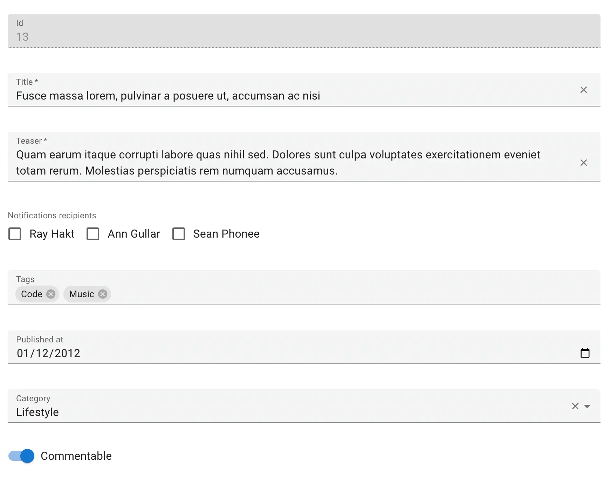

An `Input` component displays an input, or a dropdown list, a list of radio buttons, etc. Such components allow to update a record field and are common in the Edit and Create views, and in the List Filters.



Input components are usually wrappers around your UI kit form components, bound to the current react-hook-form context.

## Using Inputs In React Admin

Input components must be used inside a Form element (e.g. [`<Form>`](./Form.md)). These components create a [`react-hook-form`](https://react-hook-form.com/) form and context. 

Input components require a `source` prop. 

```tsx
import { EditBase, Form, required, useInput } from 'ra-core';
import { TextInput } from './TextInput';

export const PostEdit = () => (
    <EditBase>
        <Form>
            <TextInput source="title" label="Post title" validate={[required()]} />
        </Form>
    </EditBase>
);
```

## Writing Your Own Input Component

### Using `useController`

For instance, let's write a component to edit the latitude and longitude of the current record:

```tsx
// in LatLongInput.js
import { useController } from 'react-hook-form';

const LatLngInput = () => {
    const input1 = useController({ name: 'lat', defaultValue: '' });
    const input2 = useController({ name: 'lng', defaultValue: '' });

    return (
        <span>
            <input {...input1.field} type="number" placeholder="latitude" />
            &nbsp;
            <input {...input2.field} type="number" placeholder="longitude" />
        </span>
    );
};
export default LatLngInput;

// in ItemEdit.js
const ItemEdit = () => (
    <EditBase>
        <Form>
            <LatLngInput />
        </Form>
    </EditBase>
);
```

`LatLngInput` takes no props, because the `useController` component can access the current record via the form context. The `name` prop serves as a selector for the record property to edit. Executing this component will render roughly the following code:

```html
<span>
    <input name="lat" type="number" placeholder="latitude" value={record.lat} />
    <input name="lng" type="number" placeholder="longitude" value={record.lng} />
</span>
```

**Tip**: Notice that we have added `defaultValue: ''` as one of the `useController` params. This is a good practice to avoid getting console warnings about controlled/uncontrolled components, that may arise if the value of `record.lat` or `record.lng` is `undefined` or `null`.

**Tip**: React-hook-form's `useController` component supports dot notation in the `name` prop, to allow binding to nested values:

```tsx
import { useController } from 'react-hook-form';

const LatLngInput = () => {
    const input1 = useController({ name: 'position.lat', defaultValue: '' });
    const input2 = useController({ name: 'position.lng', defaultValue: '' });
    
    return (
        <span>
            <input {...input1.field} type="number" placeholder="latitude" />
            &nbsp;
            <input {...input2.field} type="number" placeholder="longitude" />
        </span>
    );
};
export default LatLngInput;
```

### The `useInput()` Hook

React-admin adds functionality to react-hook-form:

- handling of custom event emitters like `onChange`,
- support for an array of validators,
- detection of required fields to add an asterisk to the field label,
- parse and format to translate record values to form values and vice-versa.

So internally, react-admin components use another hook, which wraps react-hook-form's `useController()` hook. It's called `useInput()`; use it instead of `useController()` to create form inputs that have the exact same API as react-admin Input components:

```tsx
// in LatLongInput.js
import { useInput, required } from 'ra-core';

const BoundedInput = (props) => {
    const { onChange, onBlur, label, helperText, ...rest } = props;
    const {
        field,
        fieldState: { invalid, error },
        isRequired
    } = useInput({
        // Pass the event handlers to the hook but not the component as the field property already has them.
        // useInput will call the provided onChange and onBlur in addition to the default needed by react-hook-form.
        onChange,
        onBlur,
        ...rest,
    });

    return (
        <div>
            <label htmlFor={field.name}>
                {label}
                {isRequired && <span aria-hidden="true"> *</span>}
            </label>
            <input
                id={field.name}
                {...field}
                aria-invalid={invalid}
                aria-errormessage={`${field.name}-error`}
                {...rest}
            />
            {invalid && error?.message ? (
                <span id={`${field.name}-error`} role="alert">
                    {error.message}
                </span>
            ) : helperText !== false ? (
                <span className="helper-text">
                    {helperText}
                </span>
            ) : null}
        </div>
    );
};

const LatLngInput = (props) => {
    const { source, ...rest } = props;

    return (
        <span>
            <BoundedInput
                source="lat"
                label="Latitude"
                validate={required()}
                {...rest}
            />
            &nbsp;
            <BoundedInput
                source="lng"
                label="Longitude"
                validate={required()}
                {...rest}
            />
        </span>
    );
};
```

Here is another example, this time using a `select` component:

```jsx
// in SexInput.js
import { useInput } from 'ra-core';

const SexInput = props => {
    const { field, isRequired } = useInput(props);

    return (
        <div>
            <label htmlFor={field.name}>
                Sex
                {isRequired && <span aria-hidden="true"> *</span>}
            </label>
            <select
                id={field.name}
                {...field}
                aria-required={isRequired}
            >
                <option value="M">Male</option>
                <option value="F">Female</option>
            </select>
        </div>
    );
};
export default SexInput;
```

**Tip**: `useInput` accepts all arguments that you can pass to `useController`. Besides, components using `useInput` accept props like `format` and `parse`, to convert values from the form to the input, and vice-versa:

```jsx
const parse = value => {/* ... */};
const format = value => {/* ... */};

const PersonEdit = () => (
    <EditBase>
        <Form>
            <SexInput
                source="sex"
                format={formValue => formValue === 0 ? 'M' : 'F'}
                parse={inputValue => inputValue === 'M' ? 0 : 1}
            />
        </Form>
    </EditBase>
);
```

**Reminder:** [react-hook-form's `formState` is wrapped with a Proxy](https://react-hook-form.com/docs/useformstate/#rules) to improve render performance and skip extra computation if specific state is not subscribed. So, make sure you deconstruct or read the `formState` before render in order to enable the subscription.

```ts
const { isDirty } = useFormState(); // ✅
const formState = useFormState(); // ❌ should deconstruct the formState      
```

Refer to the [`useInput`](./useInput.md) documentation for more details.


## Linking Two Inputs

Edition forms often contain linked inputs, e.g. country and city (the choices of the latter depending on the value of the former).

React-admin relies on [react-hook-form](https://react-hook-form.com/) for form handling. You can grab the current form values using react-hook-form's [useWatch](https://react-hook-form.com/docs/usewatch) hook.

```tsx
import * as React from "react";
import { EditBase, Form } from "ra-core";
import { useWatch } from "react-hook-form";
import { SelectInput } from "./SelectInput";

const countries = ["USA", "UK", "France"];
const cities: Record<string, string[]> = {
    USA: ["New York", "Los Angeles", "Chicago", "Houston", "Phoenix"],
    UK: ["London", "Birmingham", "Glasgow", "Liverpool", "Bristol"],
    France: ["Paris", "Marseille", "Lyon", "Toulouse", "Nice"],
};
const toChoices = (items: string[]) => items.map((item) => ({ id: item, name: item }));

const CityInput = () => {
    const country = useWatch<{ country: string }>({ name: "country" });

    return (
        <SelectInput
            choices={country ? toChoices(cities[country]) : []}
            source="cities"
        />
    );
};

const OrderEdit = () => (
    <EditBase>
        <Form>
            <SelectInput source="country" choices={toChoices(countries)} />
            <CityInput />
        </Form>
    </EditBase>
);

export default OrderEdit;
```

Alternatively, you can use the react-admin `<FormDataConsumer>` component, which grabs the form values, and passes them to a child function. As `<FormDataConsumer>` uses the render props pattern, you can avoid creating an intermediate component like the `<CityInput>` component above:

```tsx
import * as React from "react";
import { EditBase, Form, FormDataConsumer } from "ra-core";
import { SelectInput } from "./SelectInput";

const countries = ["USA", "UK", "France"];
const cities: Record<string, string[]> = {
    USA: ["New York", "Los Angeles", "Chicago", "Houston", "Phoenix"],
    UK: ["London", "Birmingham", "Glasgow", "Liverpool", "Bristol"],
    France: ["Paris", "Marseille", "Lyon", "Toulouse", "Nice"],
};
const toChoices = (items: string[]) =>
    items.map((item) => ({ id: item, name: item }));

const OrderEdit = () => (
    <EditBase>
        <Form>
            <SelectInput source="country" choices={toChoices(countries)} />
            <FormDataConsumer<{ country: string }>>
                {({ formData, ...rest }) => (
                    <SelectInput
                        source="cities"
                        choices={
                            formData.country ? toChoices(cities[formData.country]) : []
                        }
                        {...rest}
                    />
                )}
            </FormDataConsumer>
        </Form>
    </EditBase>
);
```

## Hiding Inputs Based On Other Inputs

You may want to display or hide inputs based on the value of another input - for instance, show an `email` input only if the `hasEmail` boolean input has been ticked to `true`.

For such cases, you can use the approach described above, using the `<FormDataConsumer>` component.

```tsx
import { FormDataConsumer } from 'ra-core';
import { BooleanInput } from './BooleanInput';
import { TextInput } from './TextInput';

 const PostEdit = () => (
     <EditBase>
         <Form shouldUnregister>
             <BooleanInput source="hasEmail" />
             <FormDataConsumer<{ hasEmail: boolean }>>
                 {({ formData, ...rest }) => formData.hasEmail &&
                      <TextInput source="email" {...rest} />
                 }
             </FormDataConsumer>
         </Form>
     </EditBase>
 );
```

**Note**: By default, `react-hook-form` submits values of unmounted input components. In the above example, the `shouldUnregister` prop of the `<Form>` component prevents that from happening. That way, when end users hide an input, its value isn't included in the submitted data.
