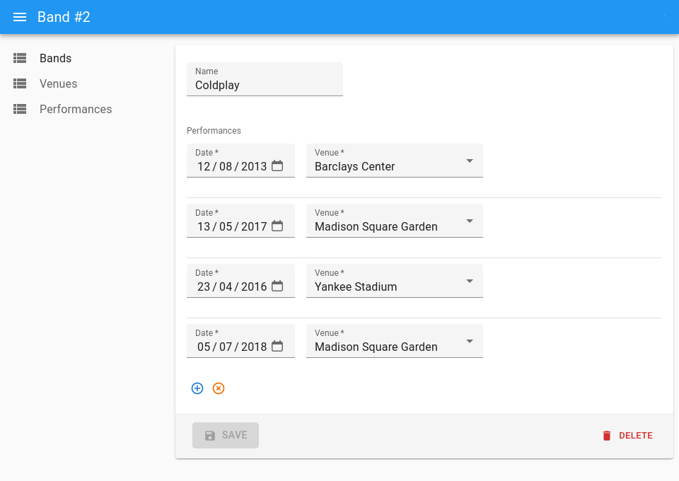

This component allows adding or removing relationships between two resources sharing an associative table. The changes in the associative table are sent to the dataProvider _when the user submits the form_ so that they can cancel the changes before submission.

**Note**: The `<ReferenceManyToManyInputBase>` cannot currently display multiple records with the same id from the end reference resource even though they might have different properties in the associative table.

This feature requires a valid is an [Enterprise Edition](https://marmelab.com/ra-enterprise/) subscription.

## Usage

Let's imagine that you're writing an app managing concerts for artists. The data model features a many-to-many relationship between the `bands` and `venues` tables through a `performances` associative table.

```txt
┌─────────┐       ┌──────────────┐      ┌───────────────┐
│ bands   │       │ performances │      │ venues        │
│---------│       │--------------│      │---------------│
│ id      │───┐   │ id           │   ┌──│ id            │
│ name    │   └──╼│ band_id      │   │  │ name          │
│         │       │ venue_id     │╾──┘  │ location      │
│         │       │ date         │      │               │
└─────────┘       └──────────────┘      └───────────────┘
```

In this example, `bands.id` matches `performances.band_id`, and `performances.venue_id` matches `venues.id`.

To let users edit the `venues` for given `band` in an `<AutocompleteArrayInput>`, wrap that input in a `<ReferenceManyToManyInputBase>` where you define the relationship via the `reference`, `through` and `using` props:

```tsx
import { EditBase, Form } from 'ra-core';
import { AutocompleteArrayInput, TextInput } from 'my-react-admin-ui-library';
import { ReferenceManyToManyInputBase } from '@react-admin/ra-core-ee';

export const BandEdit = () => (
    <EditBase mutationMode="optimistic">
        <Form>
            <TextInput source="name" />
            <ReferenceManyToManyInputBase
                reference="venues"
                through="performances"
                using="band_id,venue_id"
            >
                <AutocompleteArrayInput
                    label="Performances"
                    optionText="name"
                />
            </ReferenceManyToManyInputBase>
        </Form>
    </EditBase>
);
```

`<ReferenceManyToManyInputBase>` expects a child that is an input allowing to select multiple values as child - like `<AutocompleteArrayInput>` in the example above.

Note that although all possible child components support a `defaultValue` prop, it will only be applied on create views.

**Tip**: We don't recommend using `<ReferenceManyToManyInputBase>` in an edition view that has its `mutationMode` set to `undoable`. Indeed, even if users cancel the main mutation, the changes in the associative table will still be applied.

**Tip**: If you need to edit the fields of the associative table (e.g. the `date` in `performances`), you can use a [`<ReferenceManyInputBase>`](#referencemanyinputbase) instead of `<ReferenceManyToManyInputBase>`.



You will need to let users select the related record (`venue` in the example above) via a `<ReferenceInputBase>`:

```tsx
import { EditBase, Form, ReferenceInputBase, required } from 'ra-core';
import {
    AutocompleteArrayInput,
    DateInput,
    SelectInput,
    SimpleFormIterator,
    TextInput,
} from 'my-react-admin-ui-library';
import { ReferenceManyInputBase } from '@react-admin/ra-core-ee';

const BandEdit = () => (
    <Edit mutationMode="optimistic">
        <Form>
            <TextInput source="name" />
            <ReferenceManyInputBase reference="performances" target="band_id">
                <SimpleFormIterator inline disableReordering>
                    <DateInput source="date" />
                    <ReferenceInputBase reference="venues" source="venue_id">
                        <SelectInput optionText="name" />
                    </ReferenceInputBase>
                </SimpleFormIterator>
            </ReferenceManyInputBase>
        </Form>
    </Edit>
);
```

**Limitation**: `<ReferenceManyToManyInputBase>` cannot be used to filter a list.

## Props

| Prop              | Required | Type                                        | Default                            | Description                                                                                                                                                                                                       |
| ----------------- | -------- | ------------------------------------------- | ---------------------------------- | ----------------------------------------------------------------------------------------------------------------------------------------------------------------------------------------------------------------- |
| `children`        | Required | `element`                                   | -                                  | A select array input element (e.g. `<SelectArrayInput>`).                                                                                                                                                         |
| `reference`       | Required | `string`                                    | -                                  | Name of the reference resource, e.g. 'venues'                                                                                                                                                                     |
| `through`         | Required | `string`                                    | -                                  | Name of the resource for the associative table, e.g. 'book_authors'                                                                                                                                               |
| `filter`          | Optional | `object`                                    | `{}`                               | Filter for the associative table (passed to the `getManyReference()` call)                                                                                                                                        |
| `filter Choices`  | Optional | `object`                                    | `{}`                               | Filter for the possible choices fetched from the reference table (passed to the `getList()` call)                                                                                                                 |
| `mutationOptions` | Optional | `{ meta, onError }`                         | -                                  | Mutation options for the `create` and `deleteMany` calls. Only `meta` and `onError` are supported.                                                                                                                |
| `perPage`         | Optional | `number`                                    | 25                                 | Limit for the number of results fetched from the associative table                                                                                                                                                |
| `perPage Choices` | Optional | `number`                                    | 25                                 | Limit for the number of possible choices fetched from the reference table                                                                                                                                         |
| `queryOptions`    | Optional | `UseQueryOptions`                           | -                                  | Query options for the `getList`, `getMany` and `getManyReference` calls                                                                                                                                           |
| `sort`            | Optional | `{ field: string, order: 'ASC' or 'DESC' }` | `{ field: 'id', order: 'DESC' }`   | Sort for the associative table (passed to the `getManyReference()` call)                                                                                                                                          |
| `sort Choices`    | Optional | `{ field: string, order: 'ASC' or 'DESC' }` | `{ field: 'id', order: 'DESC' }`   | Sort for the possible choices fetched from the reference table (passed to the `getList()` call)                                                                                                                   |
| `source`          | Optional | `string`                                    | `'id'`                             | Name of the field containing the identity of the main resource. Used determine the value to look for in the associative table.                                                                                    |
| `using`           | Optional | `string`                                    | `'([resource]_id,[reference]_id)'` | Tuple (comma separated) of the two field names used as foreign keys, e.g 'book_id,author_id'. The tuple should start with the field pointing to the resource, and finish with the field pointing to the reference |

## `children`

`<ReferenceManyToManyInputBase>` expects an _select_ component as child, i.e. a component working inside a `ChoiceContext`. 

```tsx
import { EditBase, Form, ReferenceInputBase, required } from 'ra-core';
import {
    SelectArrayInput,
    DateInput,
    SelectInput,
    SimpleFormIterator,
    TextInput,
} from 'my-react-admin-ui-library';
import { ReferenceManyToManyInputBase } from '@react-admin/ra-core-ee';

const BandEdit = () => (
    <Edit mutationMode="optimistic">
        <Form>
            <TextInput source="name" />
            <ReferenceManyToManyInputBase
                reference="venues"
                through="performances"
                using="band_id,venue_id"
                filter={{ date: '2018-08-31' }}
            >
                <SelectArrayInput />
            </ReferenceManyToManyInputBase>
        </Form>
    </Edit>
);
```

## `filter`

You can filter the records of the associative table (e.g. `performances`) using the `filter` prop. This `filter` is passed to the `getManyReference()` call.

```tsx
<ReferenceManyToManyInputBase
    reference="venues"
    through="performances"
    using="band_id,venue_id"
    filter={{ date: '2018-08-31' }}
>
    {/* ... */}
</ReferenceManyToManyInputBase>
```

## `filterChoices`

`<ReferenceManyToManyInputBase>` displays a list of possible values from the reference table (e.g. `venues`) as suggestions in the input. It uses the `getList()` dataProvider call to fetch these possible values.

You can filter the possible values of the reference table using the `filterChoices` prop. This `filterChoices` is passed to the `getList()` call.

```tsx
<ReferenceManyToManyInputBase
    reference="venues"
    through="performances"
    using="band_id,venue_id"
    filterChoice={{ location: 'New York' }}
>
    {/* ... */}
</ReferenceManyToManyInputBase>
```

## `mutationOptions`

Use the `mutationOptions` prop to customize the `create` and `deleteMany` mutations.

You can for instance use it to pass [a custom meta](https://marmelab.com/ra-core/actions#meta-parameter) to the dataProvider.

```tsx
<ReferenceManyToManyInputBase
    reference="venues"
    through="performances"
    using="band_id,venue_id"
    mutationOptions={{ meta: { myParameter: 'value' } }}
>
    {/* ... */}
</ReferenceManyToManyInputBase>
```

You can also use it to pass an `onError` function as follows:

```tsx
<ReferenceManyToManyInputBase
    reference="venues"
    through="performances"
    using="band_id,venue_id"
    mutationOptions={{ 
        onError: (error, step, data) => console.warn({ error, step, data })
    }}
>
    {/* ... */}
</ReferenceManyToManyInputBase>
```

## `perPage`

By default, `<ReferenceManyToManyInputBase>` displays at most 25 entries from the associative table (e.g. 25 `performances`). You can change the limit by setting the `perPage` prop:

```tsx
<ReferenceManyToManyInputBase
    reference="venues"
    through="performances"
    using="band_id,venue_id"
    perPage={10}
>
    {/* ... */}
</ReferenceManyToManyInputBase>
```

## `perPageChoices`

`<ReferenceManyToManyInputBase>` displays a list of possible values from the reference table (e.g. `venues`) as suggestions in the input. It uses the `getList()` dataProvider call to fetch these possible values.

By default, react-admin displays at most 25 possible values from the reference table (e.g. 25 `venues`). You can change the limit by setting the `perPageChoices` prop:

```tsx
<ReferenceManyToManyInputBase
    reference="venues"
    through="performances"
    using="band_id,venue_id"
    perPageChoices={10}
>
    {/* ... */}
</ReferenceManyToManyInputBase>
```

## `queryOptions`

Use the `queryOptions` prop to customize the queries for `getList`, `getMany` and `getManyReference`.

You can for instance use it to pass [a custom meta](https://marmelab.com/ra-core/actions#meta-parameter) to the dataProvider.

```tsx
<ReferenceManyToManyInputBase
    reference="venues"
    through="performances"
    using="band_id,venue_id"
    queryOptions={{ meta: { myParameter: 'value' } }}
>
    {/* ... */}
</ReferenceManyToManyInputBase>
```

## `reference`

The name of the target resource to fetch.

For instance, if you want to display the venues of a given bands, through performances, the reference name should be venues:

```tsx
<ReferenceManyToManyInputBase
    source="id"
    reference="venues"
    resource="bands"
    through="performances"
>
    {/* ... */}
</ReferenceManyToManyInputBase>
```

## `sort`

By default, `<ReferenceManyToManyInputBase>` orders the possible values by `id` desc for the associative table (e.g. `performances`). You can change this order by setting the `sort` prop (an object with `field` and `order` properties) to be applied to the associative resource.

```tsx
<ReferenceManyToManyInputBase
    reference="venues"
    through="performances"
    using="band_id,venue_id"
    sort={{ field: 'id', order: 'DESC' }}
>
    {/* ... */}
</ReferenceManyToManyInputBase>
```

## `sortChoices`

By default, `<ReferenceManyToManyInputBase>` orders the possible values by `id` desc for the reference table (e.g. `venues`). You can change this order by setting the `sortChoices` prop (an object with `field` and `order` properties).

```tsx
<ReferenceManyToManyInputBase
    reference="venues"
    through="performances"
    using="band_id,venue_id"
    sortChoices={{ field: 'id', order: 'DESC' }}
>
    {/* ... */}
</ReferenceManyToManyInputBase>
```

## `source`

By default, `<ReferenceManyToManyInputBase>` uses the `id` field as target for the reference. If the foreign key points to another field of your record, you can select it with the `source` prop:

```tsx
<ReferenceManyToManyInputBase
    source="_id"
    reference="venues"
    resource="bands"
    through="performances"
>
    {/* ... */}
</ReferenceManyToManyInputBase>
```

## `through`

You must specify the associative table name using the `through` prop.

```tsx
<ReferenceManyToManyInputBase reference="venues" through="performances">
    {/* ... */}
</ReferenceManyToManyInputBase>
```

## `using`

You can specify the columns to use in the associative using the `using` prop.

```tsx
<ReferenceManyToManyInputBase
    reference="venues"
    through="performances"
    using="band_id,venue_id"
>
    {/* ... */}
</ReferenceManyToManyInputBase>
```

## Limitations

-   `<ReferenceManyToManyInputBase>` cannot be used inside an `<ArrayInputBase>`, a `<ReferenceOneInputBase>` or a `<ReferenceManyInputBase>`.
-   `<ReferenceManyToManyInputBase>` does not support server side validation.

## `dataProvider` Calls

When rendered, `<ReferenceManyToManyInputBase>` fetches the `dataProvider` three times in a row:

-   once to get the records of the associative resource (`performances` in this case), using a `getManyReference()` call
-   once to get the records of the reference resource (`venues` in this case), using a `getMany()` call.
-   once to get the possible values of the reference resource (`venues` in this case) to show as suggestions in the input, using a `getList()` call

For instance, if the user edits the band of id `123`, `<ReferenceManyToManyInputBase>` first issues the following query to the `dataProvider`:

```js
dataProvider.getManyReference('venues', {
    target: 'band_id',
    id: 123,
});
```

Let's say that the `dataProvider` returns the following response:

```json
{
    "data": [
        { "id": 667, "band_id": 123, "venue_id": 732 },
        { "id": 895, "band_id": 123, "venue_id": 874 }
        { "id": 901, "band_id": 123, "venue_id": 756 }
    ],
    "total": 3
}
```

Then, `<ReferenceManyToManyInputBase>` issues a second query to the `dataProvider`:

```js
dataProvider.getMany('venues', {
    ids: [732, 874, 756],
});
```

Which returns the following:

```json
{
    "data": [
        { "id": 732, "name": "Madison Square Garden" },
        { "id": 874, "name": "Yankee Stadium" }
        { "id": 874, "name": "Barclays Center" }
    ]
}
```

That's enough to display the current value in the input. But to display venues suggestions, the component makes a final call:

```js
dataProvider.getList('venues', {
    sort: { field: 'id', order: 'DESC' },
    pagination: { page: 1, perPage: 25 },
    filter: {},
});
```

```json
{
    "data": [
        { "id": 732, "name": "Madison Square Garden" },
        { "id": 874, "name": "Yankee Stadium" }
        { "id": 874, "name": "Barclays Center" }
        ...
    ],
    "total": 32
}
```

And that's it for the display phase.

When the user submits the form, the `save` function compares the value of the `<ReferenceManyToManyInputBase>` (the list of relationships edited by the user) with the value previously returned by the `dataProvider`. Using a diffing algorithm, it deduces a list of **insertions** and **deletions** in the associative table, that are executed all at once.

For instance, let's say that after displaying the venues 732 and 874 where bands 123 performs, the user removes venue 732, and adds venues 2 and 3. Upon submission, the `dataProvider` will detect removals and additions, and send the following queries:

```js
dataProvider.delete('performances', {
    id: 667,
    previousData: { id: 667, band_id: 123, venue_id: 732 },
});
dataProvider.create('performances', {
    data: { band_id: 123, venue_id: 2 },
});
dataProvider.create('performances', {
    data: { band_id: 123, venue_id: 3 },
});
```

## I18N

This component uses specific translations for displaying notifications. As for all translations in react-admin, it's possible to customize the messages.

To create your own translations, you can use the TypeScript types to see the structure and see which keys are overridable.

Here is an example of how to customize translations in your app:

```tsx
import polyglotI18nProvider from 'ra-i18n-polyglot';
import englishMessages from 'ra-language-english';
import frenchMessages from 'ra-language-french';
import {
    raRelationshipsLanguageEnglish,
    raRelationshipsLanguageFrench,
    type RaRelationshipsTranslationMessages,
} from '@react-admin/ra-core-ee';
import { CoreAdmin, mergeTranslations, type TranslationMessages as BaseTranslationMessages } from 'ra-core';

/* TranslationMessages extends the default translation
 * Type from ra-core (BaseTranslationMessages)
 * and the ra-Relationships translation Type (RaRelationshipsTranslationMessages)
 */
interface TranslationMessages
    extends RaRelationshipsTranslationMessages,
        BaseTranslationMessages {}

const customEnglishMessages: TranslationMessages = mergeTranslations(
    englishMessages,
    raRelationshipsLanguageEnglish, 
    {
        'ra-relationships': {
            referenceManyToManyInput: {
                saveError: 'Server error: your changes were not completely saved',
            },
        },
    }
);

const i18nCustomProvider = polyglotI18nProvider(locale => {
    if (locale === 'fr') {
        return mergeTranslations(frenchMessages, raRealTimeLanguageFrench);
    }
    return customEnglishMessages;
}, 'en');

export const MyApp = () => (
    <CoreAdmin i18nProvider={i18nCustomProvider}>
        ...
    </CoreAdmin>
);
```
