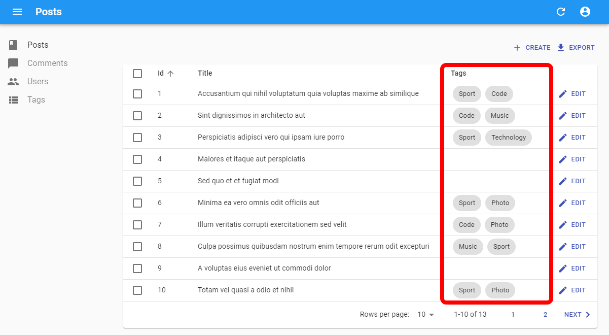
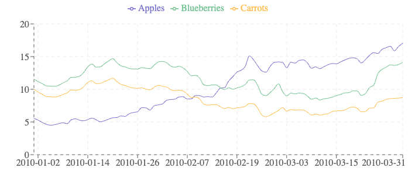

`<WithListContext>` executes its `render` function using the current `ListContext` as parameter. It's the render prop version of [the `useListContext` hook](./useListContext.md).

Use it to render a list of records already fetched.

## Usage

The most common use case for `<WithListContext>` is to build a custom list view on-the-fly, without creating a new component, in a place where records are available inside a `ListContext`. 

For instance, a list of book tags fetched via [`<ReferenceArrayFieldBase>`](./ReferenceArrayFieldBase.md): 

```jsx
import { ListBase, WithListContext, ReferenceArrayFieldBase } from 'ra-core';
import { DataTable } from './components';

const BookList = () => (
    <ListBase>
        <DataTable>
            <DataTable.Col source="id" />
            <DataTable.Col source="title" />
            <DataTable.Col source="tag_ids" label="Tags">
                <ReferenceArrayFieldBase reference="tags" source="tag_ids">
                    <WithListContext
                        loading={<p>Loading tags...</p>}
                        errorElement={<p>Error while loading tags</p>}
                        empty={<p>No associated tags</p>}
                        render={({ data }) => (
                            <div className="stack">
                                {data.map(tag => (
                                    <span key={tag.id} className="chip">
                                        {tag.name}
                                    </span>
                                ))}
                            </div>
                        )}
                    />
                </ReferenceArrayFieldBase>
            </DataTable.Col>
        </DataTable>
    </ListBase>
);
```



The equivalent with `useListContext` would require an intermediate component, manually handling the loading, error, and empty states:

```jsx
import { ListBase, useListContext, ReferenceArrayFieldBase } from 'ra-core';
import { DataTable } from './components';

const BookList = () => (
    <ListBase>
        <DataTable>
            <DataTable.Col source="id" />
            <DataTable.Col source="title" />
            <DataTable.Col label="Tags" source="tag_ids">
                <ReferenceArrayFieldBase reference="tags" source="tag_ids">
                    <TagList />
                </ReferenceArrayFieldBase>
            </DataTable.Col>
        </DataTable>
    </ListBase>
);

const TagList = () => {
    const { isPending, error, data, total } = useListContext();

    if (isPending) {
        return <p>Loading tags...</p>;
    }

    if (error) {
        return <p>Error while loading tags</p>;
    }

    if (data == null || data.length === 0 || total === 0) {
        return <p>No associated tags</p>;
    }
    
    return (
        <div className="stack">
            {data.map(tag => (
                <span key={tag.id} className="chip">
                    {tag.name}
                </span>
            ))}
        </div>
    );
};
```

Whether you use `<WithListContext>` or `useListContext` is a matter of coding style.

## Standalone usage

You can also use `<WithListContext>` outside of a `ListContext` by filling `data`, `total`, `error`, and `isPending` properties manually.

```jsx
import { WithListContext } from 'react-admin';

const TagList = ({data, isPending}) => (
    <WithListContext
        data={data}
        isPending={isPending}
        loading={<p>Loading tags...</p>}
        empty={<p>No associated tags</p>}
        render={({ data }) => (
            <div className="stack">
                {data.map(tag => (
                    <span key={tag.id} className="chip">
                        {tag.name}
                    </span>
                ))}
            </div>
        )}
    />
);
```

## Props

`<WithListContext>` accepts a single `render` prop, which should be a function.

| Prop           | Required | Type           | Default | Description                                                                               |
|----------------|----------|----------------|---------|-------------------------------------------------------------------------------------------|
| `children`     | Optional | `ReactNode`    |         | The components rendered in the list context.                                              |
| `data`         | Optional | `RecordType[]` |         | The list data in standalone usage.                                                        |
| `empty`        | Optional | `ReactNode`    |         | The component to display when the data is empty.                                          |
| `error`        | Optional | `Error`        |         | The error in standalone usage.                                                            |
| `errorElement` | Optional | `ReactNode`    |         | The component to display in case of error.                                                |
| `isPending`    | Optional | `boolean`      |         | Determine if the list is loading in standalone usage.                                     |
| `loading`      | Optional | `ReactNode`    |         | The component to display while checking authorizations.                                   |
| `offline`      | Optional | `ReactNode`    |         | The component to display when there is no connectivity to load data and no data in cache. |
| `render`       | Required | `function`     |         | The function to render the data                                                           |
| `total`        | Optional | `number`       |         | The total number of data in the list in standalone usage.                                 |

## `empty`

Use `empty` to display a message when the list is empty.

If `empty` is not provided, the render function will be called with empty data.

```jsx
<WithListContext
    empty={<p>no books</p>}
    render={({ data }) => (
        <ul>
            {data.map(book => (
                <li key={book.id}>
                    <i>{book.title}</i>, published on
                    {book.published_at}
                </li>
            ))}
        </ul>
    )}
    loading={<p>Loading...</p>}
/>
```

## `errorElement`

Use `errorElement` to display a message when an error is thrown.

If `errorElement` is not provided, the render function will be called with the error.

```jsx
<WithListContext
    errorElement={<p>Error while loading books...</p>}
    render={({ data }) => (
        <ul>
            {data.map(book => (
                <li key={book.id}>
                    <i>{book.title}</i>, published on
                    {book.published_at}
                </li>
            ))}
        </ul>
    )}
    loading={<p>Loading...</p>}
/>
```

## `loading`

Use `loading` to display a loader while data is loading.

If `loading` is not provided, the render function will be called with `isPending` as true and no data.

```jsx
<WithListContext
    loading={<p>loading...</p>}
    render={({ data }) => (
        <ul>
            {data.map(book => (
                <li key={book.id}>
                    <i>{book.title}</i>, published on
                    {book.published_at}
                </li>
            ))}
        </ul>
    )}
/>
```

## `offline`

Use `offline` to display a component when there is no connectivity to load data and no data in cache.

If `offline` is not provided, the render function will be called with `isPaused` as true and no data.

```jsx
<WithListContext
    offline={<p>Offline</p>}
    render={({ data }) => (
        <ul>
            {data.map(book => (
                <li key={book.id}>
                    <i>{book.title}</i>, published on
                    {book.published_at}
                </li>
            ))}
        </ul>
    )}
/>
```

## `render`

A function which will be called with the current [`ListContext`](./useListContext.md) as argument. It should return a React element.

The [`ListContext`](./useListContext.md) contains the fetched array of records under the `data` key. You can use it to render a list of records:

```jsx
<WithListContext render={({ data }) => (
    <ul>
        {data.map(record => (
            <li key={record.id}>{record.title}</li>
        ))}
    </ul>
)}>
```

As a reminder, the [`ListContext`](./useListContext.md) is an object with the following properties:

```jsx
<WithListContext render={({
    // fetched data
    data, // an array of the list records, e.g. [{ id: 123, title: 'hello world' }, { ... }]
    total, // the total number of results for the current filters, excluding pagination. Useful to build the pagination controls, e.g. 23
    meta, // Additional information about the list, like facets & statistics
    isPending, // boolean that is true until the data is available for the first time
    isLoading, // boolean that is true until the data is fetched for the first time
    isFetching, // boolean that is true while the data is being fetched, and false once the data is fetched
    // pagination
    page, // the current page. Starts at 1
    perPage, // the number of results per page. Defaults to 25
    setPage, // a callback to change the page, e.g. setPage(3)
    setPerPage, // a callback to change the number of results per page, e.g. setPerPage(25)
    hasPreviousPage, // boolean, true if the current page is not the first one
    hasNextPage, // boolean, true if the current page is not the last one
    // sorting
    sort, // a sort object { field, order }, e.g. { field: 'date', order: 'DESC' }
    setSort, // a callback to change the sort, e.g. setSort({ field: 'name', order: 'ASC' })
    // filtering
    filterValues, // a dictionary of filter values, e.g. { title: 'lorem', nationality: 'fr' }
    displayedFilters, // a dictionary of the displayed filters, e.g. { title: true, nationality: true }
    setFilters, // a callback to update the filters, e.g. setFilters(filters, displayedFilters)
    showFilter, // a callback to show one of the filters, e.g. showFilter('title', defaultValue)
    hideFilter, // a callback to hide one of the filters, e.g. hideFilter('title')
    // record selection
    selectedIds, // an array listing the ids of the selected rows, e.g. [123, 456]
    onSelect, // callback to change the list of selected rows, e.g. onSelect([456, 789])
    onToggleItem, // callback to toggle the selection of a given record based on its id, e.g. onToggleItem(456)
    onUnselectItems, // callback to clear the selection, e.g. onUnselectItems();
    // misc
    defaultTitle, // the translated title based on the resource, e.g. 'Posts'
    resource, // the resource name, deduced from the location. e.g. 'posts'
    refetch, // callback for fetching the list data again
}) => ( ... )}>
```

## Availability

Whenever you use a ra-core component to fetch a list of records, ra-core stores the data in a [`ListContext`](./useListContext.md). Consequently, `<WithListContext>` works in any component that is a descendant of:

- the [`<ListBase>`](./ListBase.md) component
- the [`<ReferenceArrayFieldBase>`](./ReferenceArrayFieldBase.md) component

## Building a Chart

A common use case is to build a chart based on the list data. For instance, the following component fetches a list of fruit prices (using `<ListBase>`), and draws a line chart with the data using [Echarts](https://echarts.apache.org/en/index.html):



```jsx
import { ListBase, WithListContext } from 'ra-core';
import * as echarts from 'echarts';

const FruitChart = () => (
    <ListBase resource="fruits" disableSyncWithLocation perPage={100}>
        <WithListContext<Fruit>
            render={({ data }) => <LineChart data={data} />}
        />
    </ListBase>
);

const LineChart = ({ data }) => {
    const chartRef = React.useRef(null);
    React.useEffect(() => {
        if (!data) return;
        const chartInstance = echarts.init(chartRef.current);

        const option = {
            tooltip: {
                trigger: 'axis',
            },
            legend: {
                data: ['Apples', 'Blueberries', 'Carrots'],
            },
            xAxis: {
                type: 'category',
                data: data.map(fruit => fruit.date),
            },
            yAxis: {
                type: 'value',
            },
            series: [
                {
                    name: 'Apples',
                    type: 'line',
                    data: data.map(fruit => fruit.apples),
                },
                {
                    name: 'Blueberries',
                    type: 'line',
                    data: data.map(fruit => fruit.blueberries),
                },
                {
                    name: 'Carrots',
                    type: 'line',
                    data: data.map(fruit => fruit.carrots),
                },
            ],
        };

        chartInstance.setOption(option);

        return () => {
            chartInstance.dispose();
        };
    }, [data]);

    return <div ref={chartRef} style={{ height: 300, width: 700 }} />;
};
```

## Building a Refresh Button

Another use case is to create a button that refreshes the current list. As the [`ListContext`](./useListContext.md) exposes the `refetch` function, it's as simple as:

```jsx
import { WithListContext } from 'ra-core'; 

const RefreshListButton = () => (
    <WithListContext render={({ refetch }) => (
        <button onClick={refetch}>Refresh</button>
    )} />
);
```
