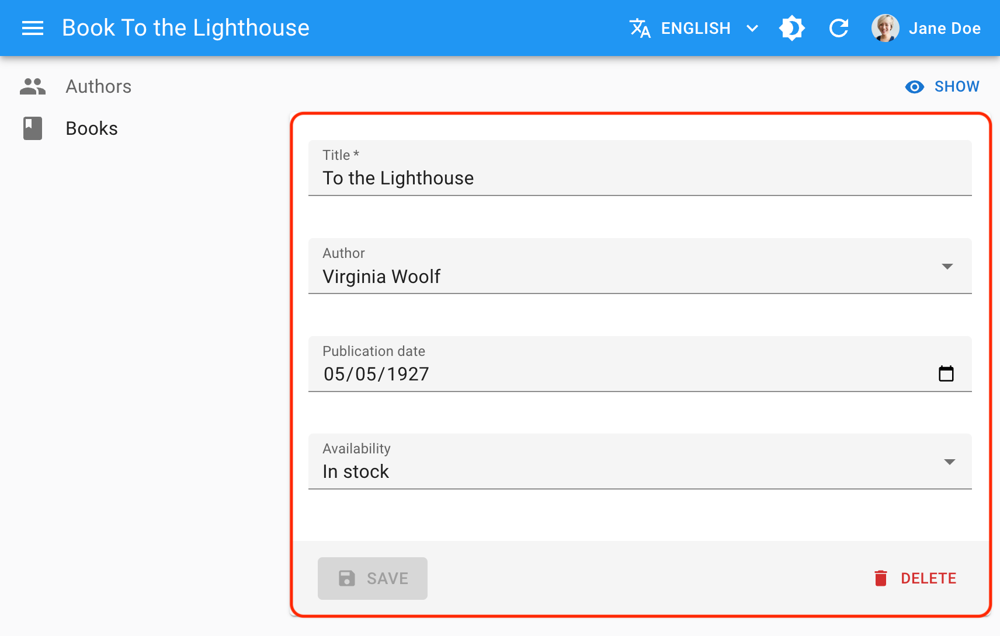

Ra-core offers a set of hooks and components to help you build fully-featured forms with minimal code. Ra-core forms are powered by a powerful third-party form library, [`react-hook-form`](https://react-hook-form.com/).



## Usage

The following example shows a simple book edition page with a few input fields. The central form component is `<Form>`:

```jsx
import { 
    EditBase, 
    minLength,
    ReferenceInputBase, 
    required,
    Form, 
} from "ra-core";
import { 
    DateInput, 
    SelectInput,
    TextInput, 
} from "./MyComponents";

export const BookEdit = () => (
  <EditBase>
    <Form>
      <TextInput source="title" validate={[required(), minLength(10)]}/>
      <ReferenceInputBase source="author_id" reference="authors">
        <SelectInput optionText="name" />
      </ReferenceInputBase>
      <DateInput source="publication_date" />
      <SelectInput source="availability" choices={[
        { id: "in_stock", name: "In stock" },
        { id: "out_of_stock", name: "Out of stock" },
        { id: "out_of_print", name: "Out of print" },
      ]} />
      <button type="submit">Save</button>
    </Form>
  </EditBase>
);
```

This may look surprisingly simple because `<Form>` doesn't define a submit handler or default values. How does it work?

- `<EditBase>` is the **page controller component**. It calls `dataProvider.getOne()` to fetch the book record from the API, and stores it in a `<RecordContext>`. It also creates a submit handler that calls `dataProvider.update()` when executed, and stores it in a `<SaveContext>`.
- `<Form>` is the main **form component**. It manages the form state and validation. It reads the default form values from the `<RecordContext>`. It wraps its children in a `<FormContext>` so that input components can read and update the form values. It also sets the form's submit action to trigger the submit handler found in the `<SaveContext>`. This means you can use any submit button inside the form, and it will automatically call the submit handler when clicked.
- `<TextInput>`, `<DateInput>`, and `<SelectInput>` are **input components**, created using the [`useInput`](../inputs/useInput.md) hook. They read the form values from the `<FormContext>` and update them when the user interacts with them. They can also define validation rules using the `validate` prop.

As you can see, form components aren't responsible for fetching data or saving it. They only manage the form state and validation. It's the `<EditBase>` component's responsibility to call the `dataProvider` methods.

This separation of concerns allows changing the form layout without affecting the data fetching logic or reusing the same form on different pages (e.g. on a creation page and an edition page).

## Validation


You can add validation rules to your form inputs in several ways:

* [Input validators](../create-edit/Validation.md#per-input-validation-built-in-field-validators)

    ```jsx
    <TextInput source="title" validate={[required(), minLength(10)]}/>
    ```

* [Global Form validation](../create-edit/Validation.md#global-validation)

    ```jsx
    <Form validate={validateBookCreation}>
        ...
    </Form>
    ```

* [Validation schema powered by yup or zod](../create-edit/Validation.md#schema-validation)

    ```jsx
    const schema = yup
        .object()
        .shape({
            name: yup.string().required(),
            age: yup.number().required(),
        })
        .required();

    const CustomerCreate = () => (
        <CreateBase>
            <Form resolver={yupResolver(schema)}>
                ...
            </Form>
        </CreateBase>
    );
    ```

* [Server-side validation](../create-edit/Validation.md#server-side-validation) by returning an error response from the `dataProvider`

    ```js
    {
        "body": {
            "errors": {
                // Global validation error message (optional)
                "root": { "serverError": "Some of the provided values are not valid. Please fix them and retry." },
                // Field validation error messages
                "title": "An article with this title already exists. The title must be unique.",
                "date": "The date is required",
                "tags": { "message": "The tag 'agrriculture' doesn't exist" },
            }
        }
    }
    ```

Form validation deserves a section of its own; check [the Validation chapter](../create-edit/Validation.md) for more details.

## Empty Values

React-admin Form components initialize the form based on the current [`RecordContext`](../common/useRecordContext.md) values. If the `RecordContext` is empty, the form will be empty.
If a record property is not `undefined`, it is not considered empty:

- An empty string is a valid value
- `0` is a valid value
- `null` is a valid value
- An empty array is a valid value

In all those cases, the value will not be considered empty and [default values](#default-values) won't be applied.

## Default Values

Ra-core Form components initialize the form based on the current [`RecordContext`](../common/useRecordContext.md) values. If the `RecordContext` is empty, the form will be empty.

You can define default values in two ways:

 - [`<Form defaultValues>`](../create-edit/Form.md#defaultvalues) to set default values for the whole form. The expected value is an object, or a function returning an object. For instance:
 
    ```jsx
    const postDefaultValue = () => ({ id: uuid(), created_at: new Date(), nb_views: 0 });

    export const PostCreate = () => (
        <CreateBase>
            <Form defaultValues={postDefaultValue}>
                <TextInput source="title" />
                <TextInput source="body" />
                <NumberInput source="nb_views" />
                <button type="submit">Save</button>
            </Form>
        </CreateBase>
    );
    ```

    **Tip**: You can include properties in the form `defaultValues` that are not listed as input components, like the `created_at` property in the previous example.

 - [`<Input defaultValue>`](../inputs/useInput.md#defaultvalue) to set default values for individual inputs.

    ```jsx
    export const PostCreate = () => (
        <CreateBase>
            <Form>
                <TextInput source="title" />
                <TextInput source="body" />
                <NumberInput source="nb_views" defaultValue={0} />
                <button type="submit">Save</button>
            </Form>
        </CreateBase>
    );
    ```
    Ra-core will ignore these default values if the Form already defines a global `defaultValues` (form > input).

    **Tip**: Per-input default values cannot be functions. For default values computed at render time, set the `defaultValues` at the form level, as explained in the previous section. 

## Hooks

Ra-core relies on another library, `react-hook-form`, to handle forms. Its API is made of hooks that you can use to build custom forms.

| Hook Name                                                           | Usage                                                                                                                                                                                                  |
| ------------------------------------------------------------------- | ------------------------------------------------------------------------------------------------------------------------------------------------------------------------------------------------------ |
| [`useForm`](https://react-hook-form.com/docs/useform)               | Create a form. It returns the props to pass to an HTML `<form>` element, as well as the form context. Ra-core's `<Form>` component uses this hook internally. You will seldom need to use it directly. |
| [`useController`](https://react-hook-form.com/docs/usecontroller)   | Create controlled input components. You can use it to create custom input components that integrate with ra-core forms.                                                                                |
| [`useWatch`](https://react-hook-form.com/docs/usewatch)             | Subscribe to input changes. It's useful to create dependencies between inputs.                                                                                                                         |
| [`useFormContext`](https://react-hook-form.com/docs/useformcontext) | Access the form context (e.g. to alter the form values programmatically).                                                                                                                              |
| [`useFormState`](https://react-hook-form.com/docs/useformstate)     | Access the form state (e.g. to determine if a form is dirty or invalid).                                                                                                                               |

Ra-core Form components all create a [`<FormProvider>`](https://react-hook-form.com/docs/formprovider), so you can use the `useController`, `useWatch`, `useFormContext`, and `useFormState` hooks in your custom form components.

**Note:** [react-hook-form's `formState` is wrapped with a Proxy](https://react-hook-form.com/docs/useformstate/#rules) to improve render performance and skip extra computation if a specific state is not subscribed. So, make sure you deconstruct or read the `formState` before rendering in order to enable the subscription.

```js
const { isDirty } = useFormState(); // ✅
const formState = useFormState(); // ❌ should deconstruct the formState      
```

Check the [react-hook-form documentation](https://react-hook-form.com/docs) for more details.

## Linking Two Inputs

<iframe src="https://www.youtube-nocookie.com/embed/YkqjydtmfcU" title="YouTube video player" frameborder="0" allow="accelerometer; autoplay; clipboard-write; encrypted-media; gyroscope; picture-in-picture; web-share" allowfullscreen style="aspect-ratio: 16 / 9;width:100%;margin-bottom:1em;"></iframe>

Forms often contain linked inputs, e.g. country and city (the choices of the latter depending on the value of the former).

You read and subscribe to the current form values using react-hook-form's [useWatch](https://react-hook-form.com/docs/usewatch) hook.

```tsx
import * as React from "react";
import { EditBase, Form } from "ra-core";
import { useWatch } from "react-hook-form";
import { SelectInput } from "./SelectInput";

const countries = ["USA", "UK", "France"];
const cities: Record<string, string[]> = {
    USA: ["New York", "Los Angeles", "Chicago", "Houston", "Phoenix"],
    UK: ["London", "Birmingham", "Glasgow", "Liverpool", "Bristol"],
    France: ["Paris", "Marseille", "Lyon", "Toulouse", "Nice"],
};
const toChoices = (items: string[]) => items.map((item) => ({ id: item, name: item }));

const CityInput = () => {
    const country = useWatch<{ country: string }>({ name: "country" });

    return (
        <SelectInput
            source="cities"
            choices={country ? toChoices(cities[country]) : []}
        />
    );
};

const OrderEdit = () => (
    <EditBase>
        <Form>
            <div style={{ display: 'flex', flexDirection: 'column', gap: '1rem', padding: '1rem' }}>
                <SelectInput source="country" choices={toChoices(countries)} />
                <CityInput />
                <button type="submit">Save</button>
            </div>
        </Form>
    </EditBase>
);

export default OrderEdit;
```

Alternatively, you can use ra-core's `<FormDataConsumer>` component, which grabs the form values and passes them to a child function. As `<FormDataConsumer>` uses the render props pattern, you can avoid creating an intermediate component like the `<CityInput>` component above:

```tsx
import * as React from "react";
import { EditBase, Form, FormDataConsumer } from "ra-core";
import { SelectInput } from "./SelectInput";

const countries = ["USA", "UK", "France"];
const cities: Record<string, string[]> = {
    USA: ["New York", "Los Angeles", "Chicago", "Houston", "Phoenix"],
    UK: ["London", "Birmingham", "Glasgow", "Liverpool", "Bristol"],
    France: ["Paris", "Marseille", "Lyon", "Toulouse", "Nice"],
};
const toChoices = (items: string[]) =>
    items.map((item) => ({ id: item, name: item }));

const OrderEdit = () => (
    <EditBase>
        <Form>
            <SelectInput source="country" choices={toChoices(countries)} />
            <FormDataConsumer<{ country: string }>>
                {({ formData, ...rest }) => (
                    <SelectInput
                        source="cities"
                        choices={
                            formData.country ? toChoices(cities[formData.country]) : []
                        }
                        {...rest}
                    />
                )}
            </FormDataConsumer>
        </Form>
    </EditBase>
);
```

## Hiding Inputs Based On Other Inputs

You may want to display or hide inputs based on the value of another input - for instance, show an `email` input only if the `hasEmail` boolean input has been ticked to `true`.

For such cases, you can use the approach described above, using the `<FormDataConsumer>` component.

```tsx
import { EditBase, Form, FormDataConsumer } from 'ra-core';
import { BooleanInput } from './BooleanInput';
import { TextInput } from './TextInput';

 const PostEdit = () => (
     <EditBase>
         <Form shouldUnregister>
             <BooleanInput source="hasEmail" />
             <FormDataConsumer<{ hasEmail: boolean }>>
                 {({ formData, ...rest }) => formData.hasEmail
                      ? <TextInput source="email" {...rest} />
                      : null
                 }
             </FormDataConsumer>
         </Form>
     </EditBase>
 );
```

**Note**: By default, `react-hook-form` submits values of unmounted input components. In the above example, the `shouldUnregister` prop of the `<Form>` component prevents that from happening. That way, when end users hide an input, its value isn't included in the submitted data.

**Note**: `shouldUnregister` should be avoided when using dynamic arrays of inputs as the unregister function gets called after input unmount/remount and reorder. This limitation is mentioned in the react-hook-form [documentation](https://react-hook-form.com/docs/usecontroller#props). If you are in such a situation, you can use the [`transform`](../create-edit/EditBase.md#transform) prop to manually clean the submitted values.

## Transforming Form Values Before Submitting

Sometimes, you may want to alter the form values before sending them to the `dataProvider`. For those cases, use the `transform` prop either on the view component (`<CreateBase>` or `<EditBase>`).

In the following example, a create view for a Post displays a form with two submit buttons. Both buttons create a new record, but the 'save and notify' button should trigger an email to other admins on the server side. The `POST /posts` API route only sends the email when the request contains a special HTTP header.

So the save button with 'save and notify' will *transform* the record before ra-core calls the `dataProvider.create()` method, adding a `notify` field:

```jsx
import { CreateBase, Form, useSaveContext } from 'ra-core';
import { useFormContext } from 'react-hook-form';
import { useCallback } from 'react';

const SaveButton = (props) => {
    const { label = "Save", transform, type } = props;
    const form = useFormContext();
    const saveContext = useSaveContext();

    const handleSubmit = useCallback(
        values => {
            saveContext.save(values, {
                transform,
            });
        },
        [saveContext, transform]
    );

    const handleClick = useCallback(
        async event => {
            if (type === 'button') {
                event.stopPropagation();
                await form.handleSubmit(handleSubmit)(event);
            }
        },
        [type, form, handleSubmit]
    );

    return (
        <button type={type} onClick={handleClick}>
            {label}
        </button>
    )
}

const PostCreate = () => (
    <CreateBase>
        <Form>
            // ...
            <div class="toolbar">
                <SaveButton />
                <SaveButton
                    label="Save and Notify"
                    transform={data => ({ ...data, notify: true })}
                    type="button"
                />
            </div>
        </Form>
    </CreateBase>
);
```

Then, in the `dataProvider.create()` code, detect the presence of the `notify` field in the data, and add the HTTP header if necessary. Something like:

```js
const dataProvider = {
    // ...
    create: (resource, params) => {
        const { notify, ...record } = params.data;
        const headers = new Headers({
            'Content-Type': 'application/json',
        });
        if (notify) {
            headers.set('X-Notify', 'true');
        }
        return httpClient(`${apiUrl}/${resource}`, {
            method: 'POST',
            body: JSON.stringify(record),
            headers,
        }).then(({ json }) => ({
            data: { ...record, id: json.id },
        }));
    },
}
```

**Tip**: `<EditBase>`'s transform prop function also gets the `previousData` in its second argument:

```jsx
const PostEdit = () => (
    <EditBase>
        <Form>
            // ...
            <div class="toolbar">
                <SaveButton />
                <SaveButton
                    label="Save and Notify"
                    transform={(data, { previousData }) => ({
                        ...data,
                        avoidChangeField: previousData.avoidChangeField
                    })}
                    type="button"
                />
            </div>
        </Form>
    </EditBase>
);
```

## Warning About Unsaved Changes

Ra-core keeps track of the form state, so it can detect when the user leaves an `EditBase` or `CreateBase` page with unsaved changes. To avoid data loss, you can use this ability to ask the user to confirm before leaving a page with unsaved changes.


Warning about unsaved changes is an opt-in feature: you must set the `warnWhenUnsavedChanges` prop in the form component to enable it:

```jsx
export const TagEdit = () => (
    <EditBase>
        <Form warnWhenUnsavedChanges>
            ...
        </Form>
    </EditBase>
);
```

And that's all. `warnWhenUnsavedChanges` works with the `<Form>` component. In fact, this feature is provided by a custom hook called `useWarnWhenUnsavedChanges()`, which you can use in your react-hook-form forms.

```jsx
import { useForm } from 'react-hook-form';
import { useWarnWhenUnsavedChanges } from 'ra-core';
import { TextInput } from './TextInput';

const MyForm = ({ onSubmit }) => {
    const form = useForm();
    return (
        <Form onSubmit={form.handleSubmit(onSubmit)} />
    );
}

const Form = ({ onSubmit }) => {
    // enable the warn when unsaved changes feature
    useWarnWhenUnsavedChanges(true);
    return (
        <form onSubmit={onSubmit}>
            <TextInput source="firstName" />
            <button type="submit">Submit</button>
        </form>
    );
};
```

**Tip**: You can customize the message displayed in the confirm dialog by setting the `ra.message.unsaved_changes` message in your i18nProvider.

**Note**: Due to limitations in react-router, this feature only works if you use the default router provided by react-admin, or if you use a [Data Router](https://reactrouter.com/en/6.22.3/routers/picking-a-router).

## Submit On Enter

By default, pressing `ENTER` in any of the form inputs submits the form - this is the expected behavior in most cases. To disable the automated form submission on enter, set the `type` of your submit button to `button`.

```jsx
const SaveButton = (props) => {
    const { type } = props;
    const form = useFormContext();
    const saveContext = useSaveContext();

    const handleClick = useCallback(
        async event => {
            if (type === 'button') {
                event.stopPropagation();
                await form.handleSubmit(saveContext.save)(event);
            }
        },
        [type, form, saveContext]
    );

    return (
        <button type={type} onClick={handleClick}>
            Save
        </button>
    )
}

const PostEdit = () => (
    <EditBase>
        <Form>
            ...
            <SaveButton type="button" />
        </Form>
    </EditBase>
);
```

However, some of your custom input components (e.g. Google Maps widget) may have special handlers for the `ENTER` key. In that case, you should prevent the default handling of the event on those inputs. This would allow other inputs to still submit the form on Enter:

```jsx
export const PostEdit = () => (
    <EditBase>
        <Form>
            <div style={{ display: 'flex', flexDirection: 'column', gap: '1rem', padding: '1rem' }}>
                <TextInput
                    source="name"
                    onKeyUp={event => {
                        if (event.key === 'Enter') {
                            event.stopPropagation();
                        }
                    }}
                />
                <button type="submit">Save</button>
            </div>
        </Form>
    </EditBase>
);
```

## Grouping Inputs

Sometimes, you may want to group inputs in order to make a form more approachable, for instance to build a tabbed form or an accordion form. In this case, you might need to know the state of a group of inputs: whether it's valid or if the user has changed them (dirty/touched state).

For this, you can use the `<FormGroupContextProvider>`, which accepts a group name. All inputs rendered inside this context will register to it (thanks to the `useInput` hook). You may then call the `useFormGroup` hook to retrieve the status of the group. For example:

```jsx
import { 
    EditBase, 
    Form, 
    FormGroupContextProvider, 
    useFormGroup, 
    minLength 
} from 'ra-core';
import { Accordion, AccordionDetails, AccordionSummary } from 'my-ui-kit';
import { TextInput } from './TextInput';

const PostEdit = () => (
    <EditBase>
        <Form>
            <TextInput source="title" />
            <FormGroupContextProvider name="options">
                <Accordion>
                    <AccordionSummary
                        aria-controls="options-content"
                        id="options-header"
                    >
                        <AccordionSectionTitle name="options">
                            Options
                        </AccordionSectionTitle>
                    </AccordionSummary>
                    <AccordionDetails
                        id="options-content"
                        aria-labelledby="options-header"
                    >
                        <TextInput source="teaser" validate={minLength(20)} />
                    </AccordionDetails>
                </Accordion>
            </FormGroupContextProvider>
        </Form>
    </EditBase>
);

const AccordionSectionTitle = ({ children, name }) => {
    const formGroupState = useFormGroup(name);
    return (
        <p style={{
              color: !formGroupState.isValid ? 'red' : 'inherit'
          }}
        >
            {children}
        </p>
    );
};
```

## Redirection After Submission

By default:

- Submitting the form in the `<CreateBase>` view redirects to the edit view
- Submitting the form in the `<EditBase>` view redirects to the list view

You can customize the redirection by setting the `redirect` prop on the `<CreateBase>` or `<EditBase>` components. Possible values are "edit", "show", "list", and `false` to disable redirection. You may also specify a custom path such as `/my-custom-route`. For instance, to redirect to the show view after edition:

```jsx
export const PostEdit = () => (
    <EditBase redirect="show">
        <Form>
            ...
        </Form>
    </EditBase>
);
```

You can also pass a custom route (e.g. "/home") or a function as `redirect` prop value. For example, if you want to redirect to a page related to the current object:

```jsx
// redirect to the related Author show page
const redirect = (resource, id, data) => `/author/${data.author_id}/show`;

export const PostEdit = () => (
    <EditBase redirect={redirect}>
        <Form>
            // ...
        </Form>
    </EditBase>
);
```

This affects both the submit button and the form submission when the user presses `ENTER` in one of the form fields.

**Tip**: The `redirect` prop is ignored if you've set the `onSuccess` prop in the `<EditBase>`/`<CreateBase>` component.

