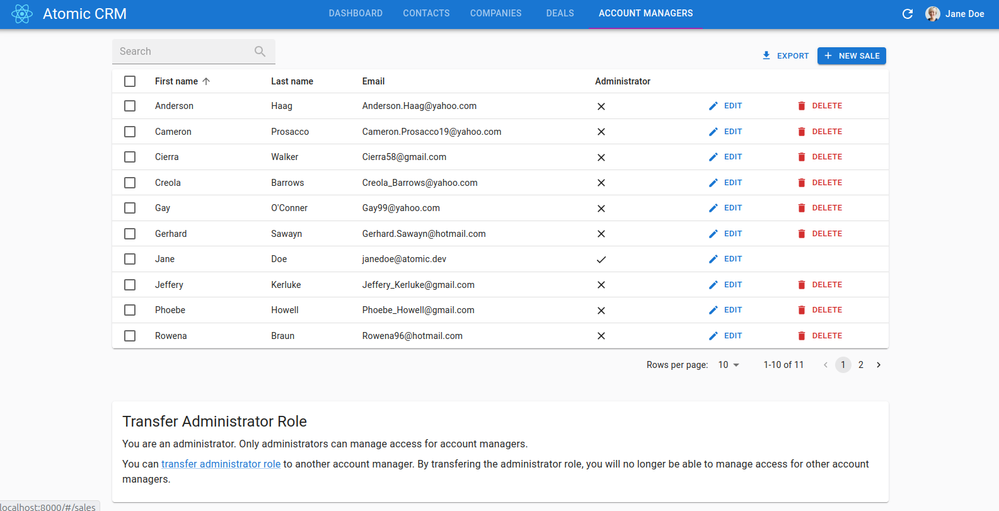

# React-admin CRM

This is a demo of the [react-admin](https://github.com/marmelab/react-admin) library for React.js. It's a CRM for a fake Web agency with a few sales. You can test it online at https://marmelab.com/react-admin-crm.

https://user-images.githubusercontent.com/99944/116970434-4a926480-acb8-11eb-8ce2-0602c680e45e.mp4

React-admin usually requires a REST/GraphQL server to provide data. In this demo, however, the API is simulated by the browser (using [FakeRest](https://github.com/marmelab/FakeRest)). The source data is generated at runtime by a package called [data-generator](https://github.com/marmelab/react-admin/tree/master/examples/data-generator).

To explore the source code, start with [src/App.tsx](https://github.com/marmelab/react-admin/blob/master/examples/crm/src/App.tsx).

**Note**: This project was bootstrapped with [Create React App](https://github.com/facebookincubator/create-react-app).

## How to run

After having cloned the react-admin repository, run the following commands at the react-admin root:

```sh
make install

make build

make run-crm
```

## Available Scripts

In the project directory, you can run:

### `npm start`

Runs the app in the development mode.<br>
Open [http://localhost:3000](http://localhost:3000) to view it in the browser.

The page will reload if you make edits.<br>
You will also see any lint errors in the console.

### `npm test`

Launches the test runner in the interactive watch mode.<br>
See the section about [running tests](#running-tests) for more information.

### `npm run build`

Builds the app for production to the `build` folder.<br>
It correctly bundles React in production mode and optimizes the build for the best performance.

The build is minified and the filenames include the hashes.<br>
Your app is ready to be deployed!

### `npm run deploy`

Deploy the build to GitHub gh-pages.

## Customizing

You can customize the title, logo, theme, and domain of the CRM app by passing custom props to the `<CRM>` component:

```tsx
// App.tsx
import React from 'react';
import CRM from './CRM';

const App = () => (
    <CRM 
        title="Custom CRM Title" 
        logo="custom-logo.png" 
    />
);

export default App;
```

## Domain & Process

In addition to the design, you can easily customize various aspects relevant to your business domain. The behavior is the same as described above. You can modify the following:

| Props          | Description                                              | Type            |
|----------------|----------------------------------------------------------|-----------------|
| contactGender  | The gender options for contacts used in the application. | ContactGender[] |
| companySectors | The list of company sectors used in the application.     | string[]        |
| darkTheme      | The theme to use when the application is in dark mode.   | RaThemeOptions  |
| dealCategories | The categories of deals used in the application.         | string[]        |
| dealStages     | The stages of deals used in the application.             | DealStage[]     |
| lightTheme     | The theme to use when the application is in light mode.  | RaThemeOptions  |
| logo           | The logo used in the CRM application.                    | string          |
| noteStatuses   | The statuses of notes used in the application.           | NoteStatus[]    |
| taskTypes      | The types of tasks used in the application.              | string[]        |
| title          | The title of the CRM application.                        | string          |

```tsx
import { CRM } from './root/CRM';
import { ThemeOptions } from '@mui/material/styles';

const lightTheme: ThemeOptions = {
    palette: {
        mode: 'light',
    },
};

const darkTheme: ThemeOptions = {
    palette: {
        mode: 'dark',
    },
};

const App = () => {
    return (
        <CRM
            contactGender={[
                { value: 'male', label: 'He' },
                { value: 'female', label: 'She' },
            ]}
            companySectors={['Technology', 'Finance']}
            darkTheme={darkTheme}
            dealCategories={['Copywriting', 'Design']}
            dealStages={[
                { value: 'opportunity', label: 'Opportunity' },
                { value: 'proposal-sent', label: 'Proposal Sent' },
            ]}
            lightTheme={lightTheme}
            logo="https://example.com/logo.png"
            noteStatuses={[
                { value: 'cold', label: 'Cold', color: '#7dbde8' },
                { value: 'warm', label: 'Warm', color: '#e8cb7d' },
                { value: 'hot', label: 'Hot', color: '#e88b7d' },
            ]}
            taskTypes={['Call', 'Email', 'Meeting']}
            title="CRM Dashboard"
        />
    );
};

export default App;
```

## Adding Sales

To add a new sale to the CRM, you need to use an administrator account. By default, the first account created has this role. If you are starting fresh, a sign-up page will prompt you to create this admin account.

When logged in as an admin, an 'Account Manager' tab will be available. From this page, you can create sales and transfer the administrator role.




## Customizing the Homepage

The first page of the application is managed by the `Dashboard.tsx` component. You can customize it by updating this file.

```jsx
// ./src/dashboard/Dashboard.tsx
import React from 'react';
import { Card, CardContent, Typography } from '@mui/material';

export const Dashboard = () => {
    return (
        <Card>
            <CardContent>
                <Typography variant="h5" component="div">
                    Welcome to the Custom Dashboard!
                </Typography>
                <Typography variant="body2" color="text.secondary">
                    This is a customized homepage for your application. You can add any components or content here to suit your needs.
                </Typography>
            </CardContent>
        </Card>
    );
};
```